# Data Pipelines: Visual Guide

## Pipeline Architectures

### ETL vs ELT Comparison

```mermaid
graph TD
    A[Data Pipeline Patterns] --> B[ETL - Extract, Transform, Load]
    A --> C[ELT - Extract, Load, Transform]

    B --> B1[Extract<br/>From Sources]
    B --> B2[Transform<br/>Clean & Process]
    B --> B3[Load<br/>To Warehouse]
    B --> B4[Traditional<br/>Batch Processing]

    C --> C1[Extract<br/>From Sources]
    C --> C2[Load<br/>To Data Lake]
    C --> C3[Transform<br/>In Warehouse]
    C --> C4[Modern<br/>Cloud-Native]

    D[ETL Advantages] --> D1[Data Quality<br/>Early Validation]
    D --> D2[Performance<br/>Optimized Loading]
    D --> D3[Security<br/>Controlled Access]
    D --> D4[Compliance<br/>Data Governance]

    E[ELT Advantages] --> E1[Flexibility<br/>Schema-on-Read]
    E --> E2[Scalability<br/>Raw Data Storage]
    E --> E3[Speed<br/>Parallel Processing]
    E --> E4[Cost Effective<br/>Cloud Storage]

    F[When to Use ETL] --> F1[Structured Data<br/>Fixed Schema]
    F --> F2[Data Warehouses<br/>OLAP Systems]
    F --> F3[Legacy Systems<br/>Existing Infrastructure]
    F --> F4[Compliance<br/>Strict Requirements]

    G[When to Use ELT] --> G1[Semi-structured Data<br/>JSON, XML]
    G --> G2[Data Lakes<br/>Big Data Analytics]
    G --> G3[Machine Learning<br/>Exploratory Analysis]
    G --> G4[Real-time Processing<br/>Streaming Data]

    style B fill:#e8f5e8
    style C fill:#e3f2fd
    style D fill:#fff3e0
    style E fill:#fce4ec
    style F fill:#e8f5e8
    style G fill:#fff3e0
```



### Data Pipeline Patterns

```mermaid
graph TD
    A[Pipeline Patterns] --> B[Linear Pipeline]
    A --> C[Fan-out Pipeline]
    A --> D[Fan-in Pipeline]
    A --> E[Branching Pipeline]
    A --> F[Iterative Pipeline]

    B --> B1[Source → Process → Sink]
    B --> B2[Simple Flow<br/>Single Path]
    B --> B3[Example<br/>Basic ETL]
    B --> B4[Use Case<br/>Simple Migrations]

    C --> C1[Source → Multiple Processes]
    C --> C2[Parallel Processing<br/>Independent Branches]
    C --> C3[Example<br/>Multi-system Updates]
    C --> C4[Use Case<br/>Data Distribution]

    D --> D1[Multiple Sources → Single Process]
    D --> D2[Data Consolidation<br/>Merge Operations]
    D --> D3[Example<br/>Customer 360 View]
    D --> D4[Use Case<br/>Data Integration]

    E --> E1[Process A → Decision → Process B or C]
    E --> E2[Conditional Logic<br/>Business Rules]
    E --> E3[Example<br/>Quality Gates]
    E --> E4[Use Case<br/>Error Handling]

    F --> F1[Process → Validate → Retry or Skip]
    F --> F2[Self-Correcting<br/>Error Recovery]
    F --> F3[Example<br/>Data Quality Loops]
    F --> F4[Use Case<br/>Fault Tolerance]

    G[Common Components] --> G1[Extractors<br/>API, Database, Files]
    G --> G2[Transformers<br/>Clean, Enrich, Aggregate]
    G --> G3[Loaders<br/>Warehouse, Lake, Cache]
    G --> G4[Validators<br/>Quality Checks, Tests]

    style A fill:#e8f5e8
    style B fill:#e3f2fd
    style C fill:#f3e5f5
    style D fill:#fff3e0
    style E fill:#fce4ec
    style F fill:#e8f5e8
    style G fill:#fff3e0
```



## Apache Airflow Architecture

### Airflow DAG Structure

```mermaid
graph TD
    A[Airflow DAG] --> B[DAG Definition]
    A --> C[Tasks]
    A --> D[Dependencies]
    A --> E[Scheduling]

    B --> B1[default_args<br/>Task Defaults]
    B --> B2[schedule_interval<br/>Execution Frequency]
    B --> B3[catchup<br/>Backfill Behavior]
    B --> B4[tags<br/>Organization]

    C --> C1[Operators<br/>Python, Bash, SQL]
    C --> C2[Sensors<br/>File, External Task]
    C --> C3[Custom Operators<br/>Business Logic]
    C --> C4[Task Groups<br/>Logical Grouping]

    D --> D1[Upstream/Downstream<br/>Task Relationships]
    D --> D2[Trigger Rules<br/>Execution Conditions]
    D --> D3[XCom<br/>Data Passing]
    D --> D4[Branching<br/>Conditional Logic]

    E --> E1[Cron Expressions<br/>Schedule Definition]
    E --> E2[Timetables<br/>Complex Scheduling]
    E --> E3[Manual Triggers<br/>On-Demand Execution]
    E --> E4[Backfill<br/>Historical Runs]

    F[DAG Execution] --> F1[Scheduler<br/>Task Queueing]
    F --> F2[Executor<br/>Task Execution]
    F --> F3[Worker<br/>Task Processing]
    F --> F4[Metadata DB<br/>State Storage]

    style A fill:#e8f5e8
    style B fill:#e3f2fd
    style C fill:#f3e5f5
    style D fill:#fff3e0
    style E fill:#fce4ec
    style F fill:#e8f5e8
```



### Airflow Task Dependencies

```mermaid
graph TD
    A[Task Dependencies] --> B[Linear Dependencies]
    A --> C[Parallel Dependencies]
    A --> D[Complex Dependencies]
    A --> E[Conditional Dependencies]

    B --> B1[task1 >> task2 >> task3]
    B --> B2[Sequential Execution<br/>One after Another]
    B --> B3[Simple Pipeline<br/>ETL Flow]

    C --> C1[task1 >> [task2, task3] >> task4]
    C --> C2[Concurrent Execution<br/>Parallel Processing]
    C --> C3[Fan-out Pattern<br/>Multiple Branches]

    D --> D1[Cross-Dependencies<br/>Complex Graphs]
    D --> D2[Diamond Pattern<br/>Converging Paths]
    D --> D3[Task Groups<br/>Logical Organization]

    E --> E1[Trigger Rules<br/>all_success, all_done]
    E --> E2[Branching<br/>Conditional Paths]
    E --> E3[Short Circuit<br/>Early Termination]

    F[Dependency Types] --> F1[Explicit<br/>>> operator]
    F --> F2[Implicit<br/>set_upstream/downstream]
    F --> F3[Dynamic<br/>Runtime Dependencies]
    F --> F4[External<br/>Cross-DAG Dependencies]

    style A fill:#e8f5e8
    style B fill:#e3f2fd
    style C fill:#f3e5f5
    style D fill:#fff3e0
    style E fill:#fce4ec
    style F fill:#e8f5e8
```

### Airflow Operators Ecosystem

```mermaid
graph TD
    A[Airflow Operators] --> B[Core Operators]
    A --> C[Provider Operators]
    A --> D[Custom Operators]
    A --> E[Sensor Operators]

    B --> B1[PythonOperator<br/>Python Functions]
    B --> B2[BashOperator<br/>Shell Commands]
    B --> B3[DummyOperator<br/>No-op Tasks]
    B --> B4[BranchPythonOperator<br/>Conditional Logic]

    C --> C1[PostgresOperator<br/>Database Operations]
    C --> C2[S3CopyObjectOperator<br/>Cloud Storage]
    C --> C3[BigQueryOperator<br/>Google BigQuery]
    C --> C4[SparkSubmitOperator<br/>Apache Spark]

    D --> D1[Inherit BaseOperator<br/>Custom Logic]
    D --> D2[Business Logic<br/>Domain Specific]
    D --> D3[Reusable Components<br/>DRY Principle]
    D --> D4[Testing Support<br/>Unit Tests]

    E --> E1[FileSensor<br/>File Existence]
    E --> E2[ExternalTaskSensor<br/>DAG Dependencies]
    E --> E3[HttpSensor<br/>HTTP Endpoints]
    E --> E4[SqlSensor<br/>Database Conditions]

    F[Operator Features] --> F1[Retries<br/>Failure Handling]
    F --> F2[Timeouts<br/>Execution Limits]
    F --> F3[Resources<br/>CPU/Memory Limits]
    F --> F4[Templates<br/>Dynamic Configuration]

    style A fill:#e8f5e8
    style B fill:#e3f2fd
    style C fill:#f3e5f5
    style D fill:#fff3e0
    style E fill:#fce4ec
    style F fill:#e8f5e8
```



## Prefect Architecture

### Prefect Flow Structure

```mermaid
graph TD
    A[Prefect Flow] --> B[Flow Definition]
    A --> C[Tasks]
    A --> D[States]
    A --> E[Execution]

    B --> B1[@flow Decorator<br/>Function Definition]
    B --> B2[Parameters<br/>Dynamic Inputs]
    B --> B3[Configuration<br/>Execution Settings]
    B --> B4[Metadata<br/>Name, Description]

    C --> C1[@task Decorator<br/>Individual Units]
    C --> C2[Task Dependencies<br/>Automatic Tracking]
    C --> C3[Task Results<br/>Return Values]
    C --> C4[Task Caching<br/>Performance Optimization]

    D --> D1[Pending<br/>Waiting to Run]
    D --> D2[Running<br/>Currently Executing]
    D --> D3[Completed<br/>Successful Finish]
    D --> D4[Failed<br/>Error Occurred]
    D --> D5[Cancelled<br/>Manually Stopped]

    E --> E1[Local Execution<br/>Development]
    E --> E2[Remote Execution<br/>Production]
    E --> E3[Async Execution<br/>Concurrent Tasks]
    E --> E4[Retry Logic<br/>Failure Recovery]

    F[Flow Features] --> F1[Conditional Logic<br/>if/else in Flows]
    F --> F2[Loops<br/>Iterative Processing]
    F --> F3[Parallel Execution<br/>Concurrent Tasks]
    F --> F4[Error Handling<br/>try/except Blocks]

    style A fill:#e8f5e8
    style B fill:#e3f2fd
    style C fill:#f3e5f5
    style D fill:#fff3e0
    style E fill:#fce4ec
    style F fill:#e8f5e8
```

### Prefect Task Dependencies

```mermaid
graph TD
    A[Task Dependencies] --> B[Automatic Tracking]
    A --> C[Explicit Dependencies]
    A --> D[Conditional Dependencies]
    A --> E[Dynamic Dependencies]

    B --> B1[Function Calls<br/>task_b(task_a())]
    B --> B2[Return Values<br/>Data Flow]
    B --> B3[Type Hints<br/>Validation]
    B --> B4[Result Storage<br/>Automatic Persistence]

    C --> C1[Direct Assignment<br/>result = task()]
    C --> C2[Multiple Dependencies<br/>task_c(task_a(), task_b())]
    C --> C3[Complex Graphs<br/>DAG Construction]
    C --> C4[Parallel Execution<br/>Independent Tasks]

    D --> D1[Conditional Execution<br/>if condition: task()]
    D --> D2[Error Handling<br/>try/except with tasks]
    D --> D3[Early Termination<br/>return on conditions]
    D --> D4[Branching Logic<br/>Multiple paths]

    E --> E1[Runtime Dependencies<br/>Based on data]
    E --> E2[Loop Dependencies<br/>Iterative processing]
    E --> E3[Recursive Dependencies<br/>Self-referencing]
    E --> E4[External Dependencies<br/>API calls, files]

    F[Dependency Resolution] --> F1[Topological Sort<br/>Execution order]
    F --> F2[Concurrent Execution<br/>Parallel tasks]
    F --> F3[State Management<br/>Result caching]
    F --> F4[Failure Propagation<br/>Error handling]

    style A fill:#e8f5e8
    style B fill:#e3f2fd
    style C fill:#f3e5f5
    style D fill:#fff3e0
    style E fill:#fce4ec
    style F fill:#e8f5e8
```

## Dagster Architecture

### Dagster Asset Graph

```mermaid
graph TD
    A[Dagster Assets] --> B[Asset Definitions]
    A --> C[Asset Dependencies]
    A --> D[Asset Materializations]
    A --> E[Asset Lineage]

    B --> B1[@asset Decorator<br/>Data Products]
    B --> B2[Metadata<br/>Description, Groups]
    B --> B3[Partitions<br/>Time-based chunks]
    B --> B4[Freshness Policies<br/>Update frequency]

    C --> C1[Input Dependencies<br/>@asset def func(input_asset)]
    C --> C2[Automatic Tracking<br/>Code analysis]
    C --> C3[Cross-Asset Links<br/>Data flow]
    C --> C4[Dependency Resolution<br/>Execution order]

    D --> D1[Materialization Events<br/>Data updates]
    D --> D2[Metadata Storage<br/>Run information]
    D --> D3[Partition Updates<br/>Incremental processing]
    D --> D4[Quality Metrics<br/>Data validation]

    E --> E1[Upstream Assets<br/>Data sources]
    E --> E2[Downstream Assets<br/>Data consumers]
    E --> E3[Impact Analysis<br/>Change propagation]
    E --> E4[Observability<br/>Data health]

    F[Asset Features] --> F1[Incremental Updates<br/>Partitioning]
    F --> F2[Backfilling<br/>Historical data]
    F --> F3[Testing<br/>Asset validation]
    F --> F4[Monitoring<br/>Freshness checks]

    style A fill:#e8f5e8
    style B fill:#e3f2fd
    style C fill:#f3e5f5
    style D fill:#fff3e0
    style E fill:#fce4ec
    style F fill:#e8f5e8
```

### Dagster Ops and Graphs

```mermaid
graph TD
    A[Dagster Ops] --> B[Op Definitions]
    A --> C[Op Composition]
    A --> D[Job Execution]
    A --> E[Resource Management]

    B --> B1[@op Decorator<br/>Computation units]
    B --> B2[Inputs/Outputs<br/>Data interfaces]
    B --> B3[Configuration<br/>Runtime parameters]
    B --> B4[Required Resources<br/>External dependencies]

    C --> C1[Op Dependencies<br/>Input/output connections]
    C --> C2[Graph Composition<br/>@graph decorator]
    C --> C3[Reusable Components<br/>Modular design]
    C --> C4[Nested Graphs<br/>Hierarchical structure]

    D --> D1[Job Definitions<br/>@job decorator]
    D --> D2[Execution Plans<br/>Optimized runs]
    D --> D3[Run Configuration<br/>Runtime settings]
    D --> D4[Execution Context<br/>Runtime information]

    E --> E1[Resource Definitions<br/>@resource decorator]
    E --> E2[Resource Binding<br/>Job configuration]
    E --> E3[Lifecycle Management<br/>Setup/teardown]
    E --> E4[Testing Resources<br/>Mock implementations]

    F[Execution Model] --> F1[Topological Execution<br/>Dependency order]
    F --> F2[Concurrent Processing<br/>Parallel ops]
    F --> F3[Error Handling<br/>Failure recovery]
    F --> F4[Observability<br/>Execution monitoring]

    style A fill:#e8f5e8
    style B fill:#e3f2fd
    style C fill:#f3e5f5
    style D fill:#fff3e0
    style E fill:#fce4ec
    style F fill:#e8f5e8
```

## Data Quality Framework

### Data Quality Pipeline

```mermaid
graph TD
    A[Data Quality Framework] --> B[Quality Checks]
    A --> C[Validation Rules]
    A --> D[Quality Gates]
    A --> E[Reporting]

    B --> B1[Completeness<br/>Missing data]
    B --> B2[Accuracy<br/>Correct values]
    B --> B3[Consistency<br/>Cross-field validation]
    B --> B4[Timeliness<br/>Data freshness]
    B --> B5[Validity<br/>Format compliance]

    C --> C1[Schema Validation<br/>Data types, constraints]
    C --> C2[Business Rules<br/>Domain logic]
    C --> C3[Statistical Checks<br/>Outlier detection]
    C --> C4[Reference Data<br/>Lookup validation]

    D --> D1[Hard Gates<br/>Block pipeline]
    D --> D2[Soft Gates<br/>Warning only]
    D --> D3[Conditional Gates<br/>Context-dependent]
    D --> D4[Progressive Gates<br/>Increasing strictness]

    E --> E1[Quality Metrics<br/>Pass/fail rates]
    E --> E2[Data Profiles<br/>Statistical summaries]
    E --> E3[Anomaly Reports<br/>Unusual patterns]
    E --> E4[Trend Analysis<br/>Quality over time]

    F[Quality Tools] --> F1[Pandas<br/>DataFrame validation]
    F --> F2[Great Expectations<br/>Expectation suites]
    F --> F3[Pandera<br/>Schema validation]
    F --> F4[Custom Validators<br/>Business rules]

    style A fill:#e8f5e8
    style B fill:#e3f2fd
    style C fill:#f3e5f5
    style D fill:#fff3e0
    style E fill:#fce4ec
    style F fill:#e8f5e8
```



### Quality Check Categories

```mermaid
graph TD
    A[Quality Check Types] --> B[Structural Checks]
    A --> C[Content Checks]
    A --> D[Relational Checks]
    A --> E[Temporal Checks]

    B --> B1[Schema Compliance<br/>Column types, names]
    B --> B2[Format Validation<br/>Date formats, patterns]
    B --> B3[Length Constraints<br/>String lengths, precision]
    B --> B4[Required Fields<br/>Null checks]

    C --> C1[Range Validation<br/>Numeric bounds]
    C --> C2[Pattern Matching<br/>Regex validation]
    C --> C3[Reference Data<br/>Lookup tables]
    C --> C4[Business Rules<br/>Domain constraints]

    D --> D1[Cross-field Validation<br/>Field relationships]
    D --> D2[Duplicate Detection<br/>Uniqueness checks]
    D --> D3[Referential Integrity<br/>Foreign keys]
    D --> D4[Consistency Checks<br/>Data harmony]

    E --> E1[Timeliness<br/>Data age validation]
    E --> E2[Sequence Validation<br/>Order checks]
    E --> E3[Temporal Consistency<br/>Date relationships]
    E --> E4[Freshness Checks<br/>Update frequency]

    F[Check Implementation] --> F1[Pre-check<br/>Input validation]
    F --> F2[In-flight<br/>Processing validation]
    F --> F3[Post-check<br/>Output validation]
    F --> F4[Continuous<br/>Ongoing monitoring]

    style A fill:#e8f5e8
    style B fill:#e3f2fd
    style C fill:#f3e5f5
    style D fill:#fff3e0
    style E fill:#fce4ec
    style F fill:#e8f5e8
```



## Pipeline Monitoring and Alerting

### Monitoring Architecture

```mermaid
graph TD
    A[Pipeline Monitoring] --> B[Metrics Collection]
    A --> C[Health Checks]
    A --> D[Performance Monitoring]
    A --> E[Error Tracking]

    B --> B1[Pipeline Metrics<br/>Success rates, duration]
    B --> B2[Task Metrics<br/>Individual task performance]
    B --> B3[Data Metrics<br/>Volume, quality, throughput]
    B --> B4[System Metrics<br/>Resource utilization]

    C --> C1[Dependency Checks<br/>External service health]
    C --> C2[Data Freshness<br/>Timeliness validation]
    C --> C3[Pipeline Status<br/>Running, failed, completed]
    C --> C4[SLA Compliance<br/>Performance against targets]

    D --> D1[Execution Time<br/>Task duration tracking]
    D --> D2[Resource Usage<br/>CPU, memory, I/O]
    D --> D3[Throughput<br/>Records processed per time]
    D --> D4[Bottleneck Analysis<br/>Performance profiling]

    E --> E1[Error Classification<br/>Transient vs permanent]
    E --> E2[Error Patterns<br/>Common failure modes]
    E --> E3[Retry Logic<br/>Automatic recovery]
    E --> E4[Root Cause Analysis<br/>Failure investigation]

    F[Monitoring Tools] --> F1[Application Metrics<br/>Custom business metrics]
    F --> F2[Infrastructure Metrics<br/>System resources]
    F --> F3[Log Aggregation<br/>Centralized logging]
    F --> F4[Distributed Tracing<br/>Request flow tracking]

    style A fill:#e8f5e8
    style B fill:#e3f2fd
    style C fill:#f3e5f5
    style D fill:#fff3e0
    style E fill:#fce4ec
    style F fill:#e8f5e8
```



### Alert Escalation System

```mermaid
graph TD
    A[Alert System] --> B[Alert Detection]
    A --> C[Alert Classification]
    A --> D[Alert Routing]
    A --> E[Escalation Policies]

    B --> B1[Threshold Monitoring<br/>Metric-based triggers]
    B --> B2[Anomaly Detection<br/>Statistical analysis]
    B --> B3[Pattern Recognition<br/>Error pattern matching]
    B --> B4[Proactive Monitoring<br/>Predictive alerts]

    C --> C1[Severity Levels<br/>Critical, High, Medium, Low]
    C --> C2[Alert Types<br/>System, Data, Performance]
    C --> C3[Business Impact<br/>Revenue, User experience]
    C --> C4[Urgency Assessment<br/>Response time requirements]

    D --> D1[Channel Selection<br/>Email, Slack, PagerDuty]
    D --> D2[Recipient Groups<br/>DevOps, Data team, Management]
    D --> D3[Geographic Routing<br/>Time zone aware]
    D --> D4[On-call Rotation<br/>Scheduled responsibility]

    E --> E1[Immediate Escalation<br/>Critical alerts]
    E --> E2[Delayed Escalation<br/>Progressive notifications]
    E --> E3[Business Hours<br/>Different rules]
    E --> E4[Suppression Rules<br/>Maintenance windows]

    F[Alert Response] --> F1[Acknowledgment<br/>Stop escalation]
    F --> F2[Investigation<br/>Root cause analysis]
    F --> F3[Resolution<br/>Fix implementation]
    F --> F4[Post-mortem<br/>Prevention measures]

    style A fill:#e8f5e8
    style B fill:#e3f2fd
    style C fill:#f3e5f5
    style D fill:#fff3e0
    style E fill:#fce4ec
    style F fill:#e8f5e8
```



### Pipeline Observability Dashboard


## Pipeline Orchestration Patterns

### Complex Pipeline Orchestration

```mermaid
graph TD
    A[Orchestration Patterns] --> B[Sequential Orchestration]
    A --> C[Parallel Orchestration]
    A --> D[Conditional Orchestration]
    A --> E[Event-Driven Orchestration]

    B --> B1[Linear Dependencies<br/>Task A → Task B → Task C]
    B --> B2[Simple Control Flow<br/>Predictable execution]
    B --> B3[Use Case<br/>Traditional ETL]
    B --> B4[Advantages<br/>Easy to understand]

    C --> C1[Concurrent Execution<br/>Multiple tasks simultaneously]
    C --> C2[Resource Optimization<br/>Parallel processing]
    C --> C3[Use Case<br/>Independent data processing]
    C --> C4[Advantages<br/>Faster execution]

    D --> D1[Branching Logic<br/>if/else conditions]
    D --> D2[Dynamic Workflows<br/>Runtime decisions]
    D --> D3[Use Case<br/>Quality gates, error handling]
    D --> D4[Advantages<br/>Flexible processing]

    E --> E1[Event Triggers<br/>External event responses]
    E --> E2[Asynchronous Processing<br/>Event-driven execution]
    E --> E3[Use Case<br/>Real-time data processing]
    E --> E4[Advantages<br/>Reactive systems]

    F[Advanced Patterns] --> F1[Microservices Orchestration<br/>Service coordination]
    F --> F2[Saga Pattern<br/>Distributed transactions]
    F --> F3[Circuit Breaker<br/>Fault tolerance]
    F --> F4[Retry Patterns<br/>Transient failure handling]

    style A fill:#e8f5e8
    style B fill:#e3f2fd
    style C fill:#f3e5f5
    style D fill:#fff3e0
    style E fill:#fce4ec
    style F fill:#e8f5e8
```



### Pipeline Lifecycle Management

```mermaid
graph TD
    A[Pipeline Lifecycle] --> B[Development]
    A --> C[Testing]
    A --> D[Deployment]
    A --> E[Monitoring]
    A --> F[Maintenance]

    B --> B1[Code Development<br/>Pipeline logic]
    B --> B2[Configuration<br/>Parameters, schedules]
    B --> B3[Documentation<br/>README, runbooks]
    B --> B4[Version Control<br/>Git repositories]

    C --> C1[Unit Tests<br/>Individual components]
    C --> C2[Integration Tests<br/>End-to-end validation]
    C --> C3[Performance Tests<br/>Load and stress testing]
    C --> C4[Data Quality Tests<br/>Validation checks]

    D --> D1[Environment Setup<br/>Dev, staging, prod]
    D --> D2[CI/CD Pipelines<br/>Automated deployment]
    D --> D3[Configuration Management<br/>Environment variables]
    D --> D4[Access Control<br/>Security policies]

    E --> E1[Health Monitoring<br/>System status]
    E --> E2[Performance Tracking<br/>Metrics and KPIs]
    E --> E3[Alert Management<br/>Issue notification]
    E --> E4[Log Analysis<br/>Troubleshooting]

    F --> F1[Bug Fixes<br/>Issue resolution]
    F --> F2[Enhancements<br/>Feature additions]
    F --> F3[Refactoring<br/>Code improvements]
    F --> F4[Deprecation<br/>Legacy cleanup]

    G[Lifecycle Best Practices] --> G1[Infrastructure as Code<br/>Versioned infrastructure]
    G --> G2[Immutable Deployments<br/>Container-based]
    G --> G3[Blue-Green Deployments<br/>Zero-downtime updates]
    G --> G4[Rollback Strategies<br/>Quick recovery]

    style A fill:#e8f5e8
    style B fill:#e3f2fd
    style C fill:#f3e5f5
    style D fill:#fff3e0
    style E fill:#fce4ec
    style F fill:#e8f5e8
    style G fill:#fff3e0
```



This visual guide provides comprehensive diagrams covering data pipeline architectures, ETL/ELT patterns, orchestration frameworks (Airflow, Prefect, Dagster), data quality frameworks, monitoring systems, and pipeline lifecycle management. Each diagram illustrates complex concepts in an accessible way, helping developers understand pipeline design, implementation, and operational best practices.
