# Elasticsearch Architecture Guide

## Elasticsearch Architecture Overview

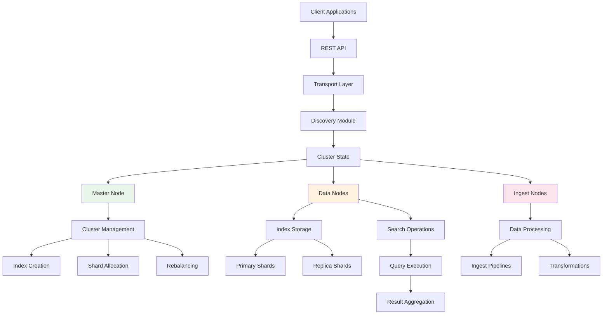

## Cluster Architecture

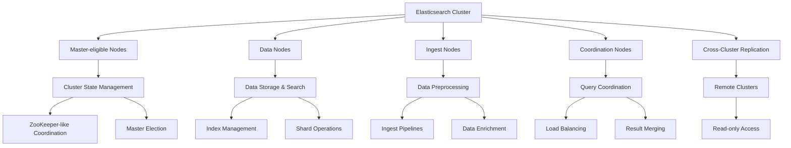

## Index and Shard Architecture

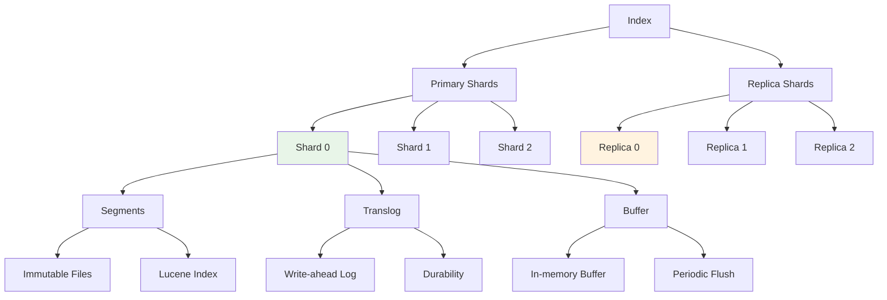

## Node Types and Responsibilities

```mermaid
graph TD
    A[Master Node] --> B[Cluster Management]
    A --> C[Index Metadata]
    A --> D[Shard Allocation]
    A --> E[Cluster State Updates]

    F[Data Node] --> G[CRUD Operations]
    F --> H[Search & Aggregation]
    F --> I[Shard Management]
    F --> J[Indexing Data]

    K[Ingest Node] --> L[Data Preprocessing]
    K --> M[Pipeline Execution]
    K --> N[Data Transformation]

    O[Coordination Node] --> P[Query Routing]
    O --> Q[Load Distribution]
    O --> R[Response Merging]

    S[Machine Learning Node] --> T[ML Jobs]
    S --> U[Model Training]
    S --> V[Inference]

    style A fill:#e8f5e8
    style F fill:#fff3e0
    style K fill:#fce4ec
    style O fill:#e3f2fd
```

## Data Flow Architecture

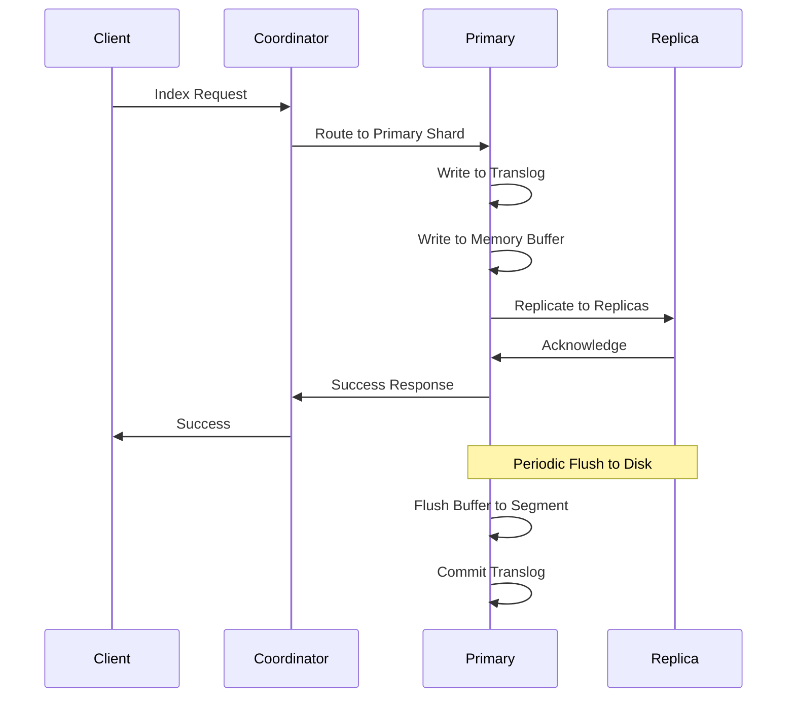

## Search Architecture

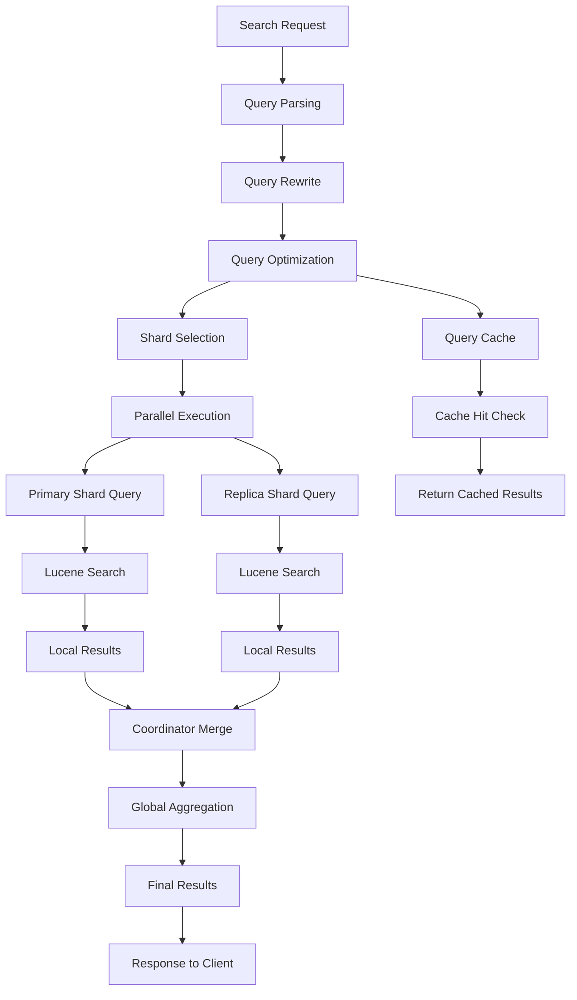

## Ingest Pipeline Architecture

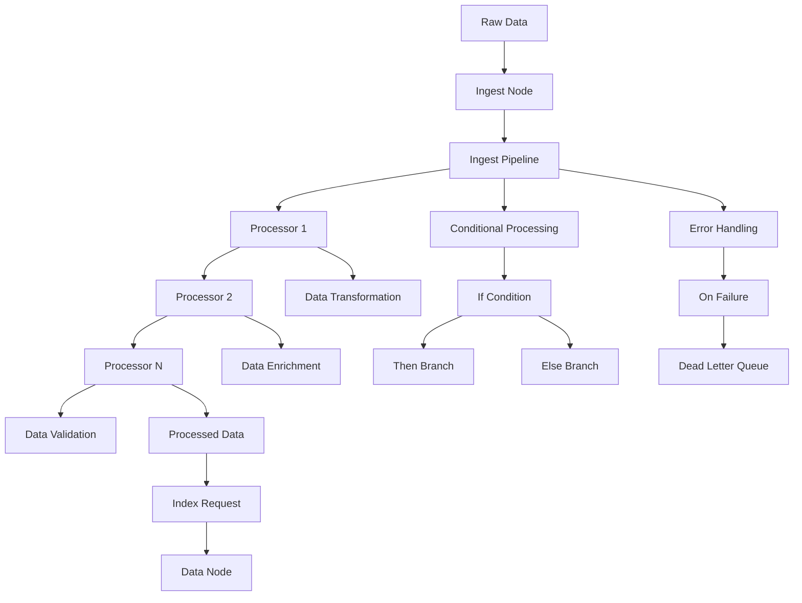

## Replication Architecture

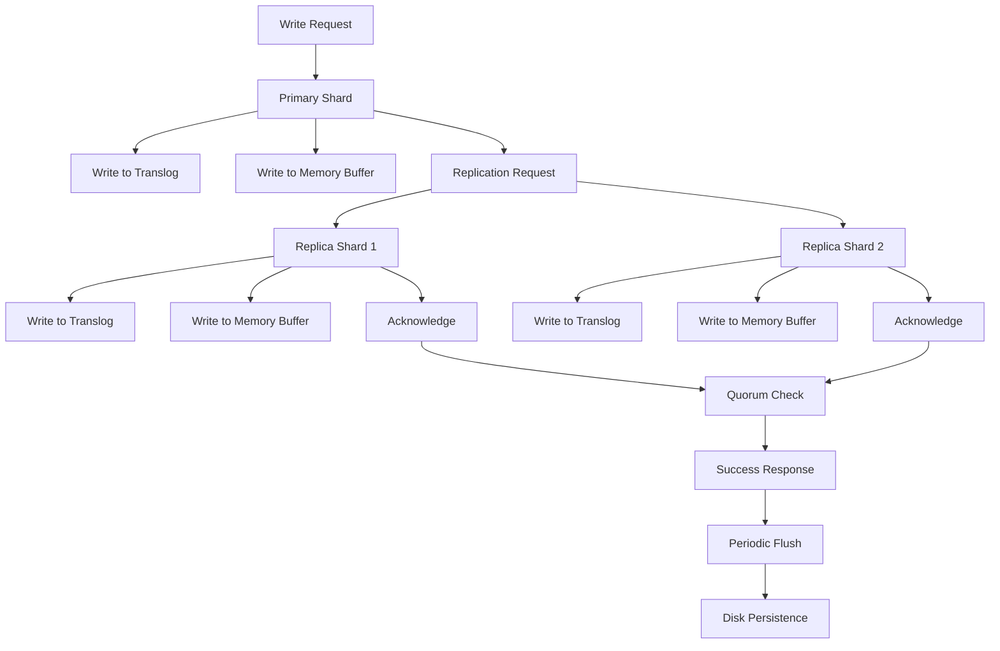

## Caching Architecture

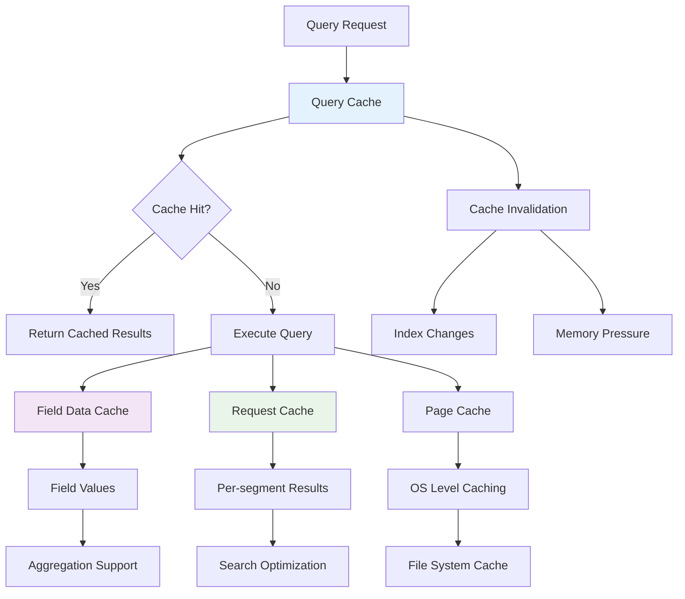

## Security Architecture

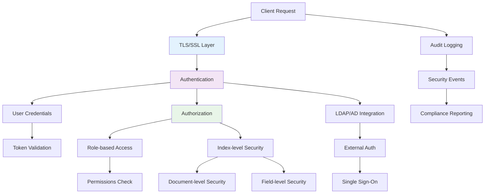

## Monitoring and Alerting

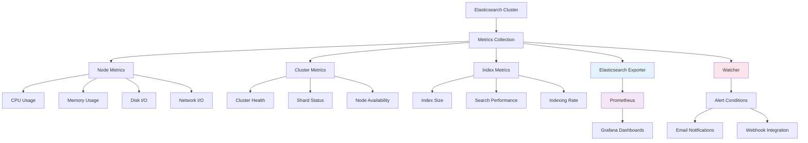

## Backup and Recovery

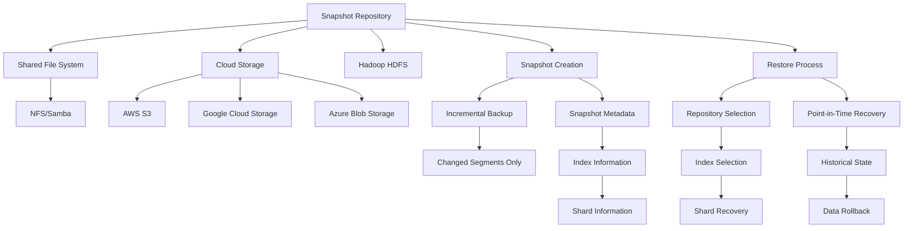

## Scaling Architecture

### Horizontal Scaling

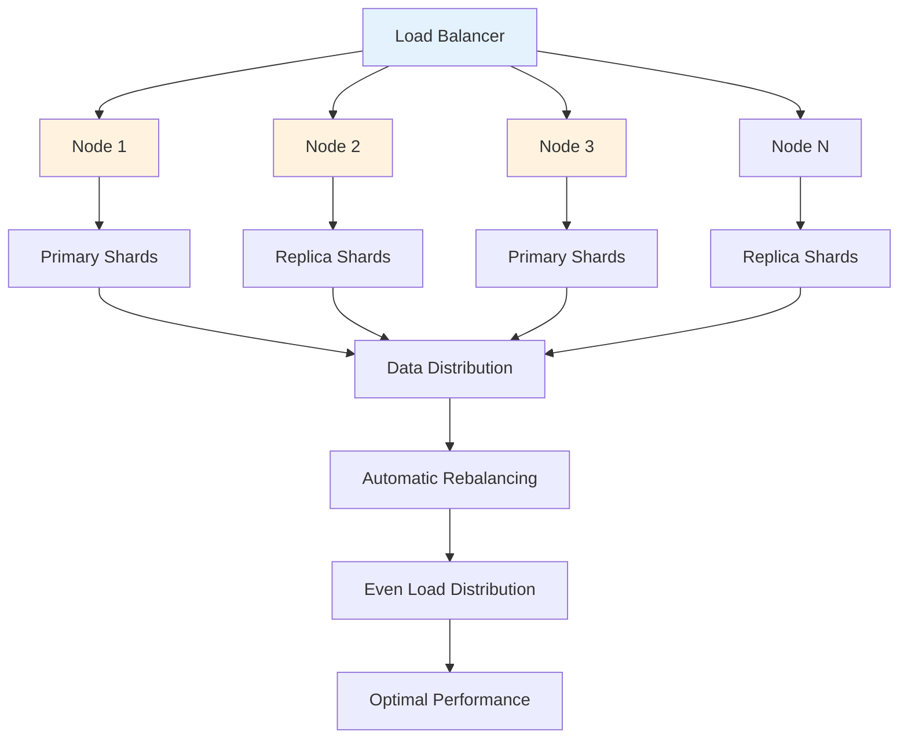

### Vertical Scaling

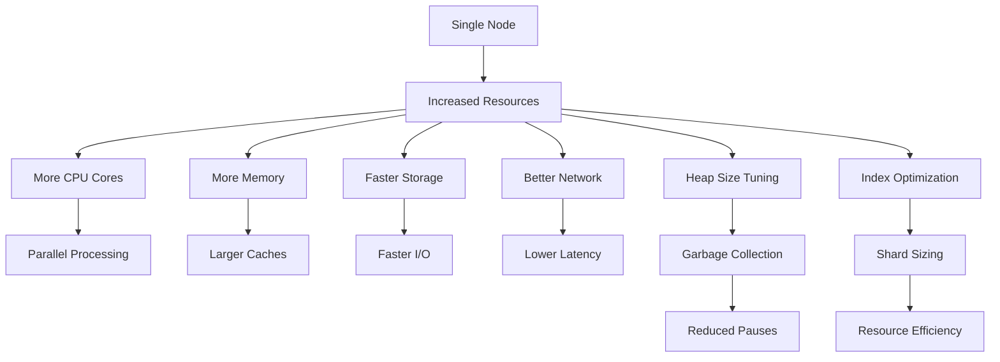

## Integration Architecture

### Logstash Integration

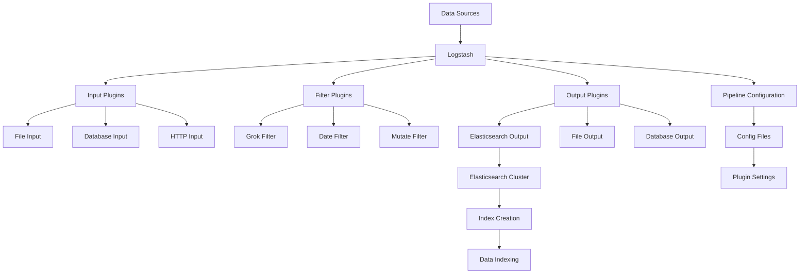

### Kibana Integration

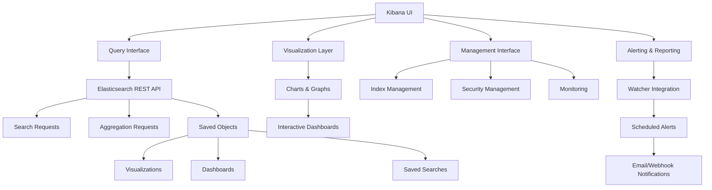

## Performance Optimization

### Query Optimization

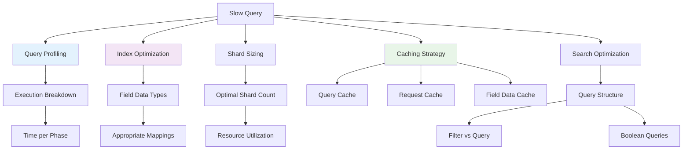

### Indexing Optimization

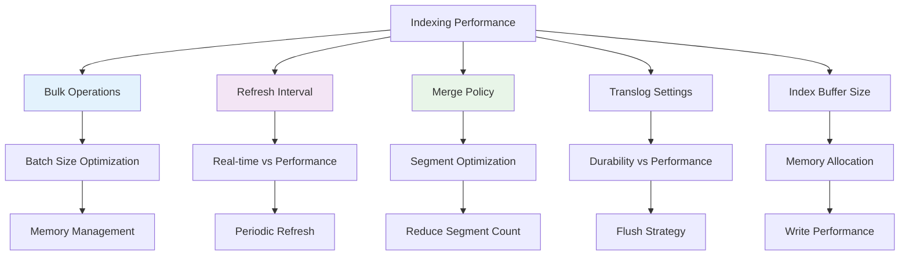

This visual guide provides comprehensive architecture diagrams for Elasticsearch, covering its cluster structure, data flow, search mechanisms, replication, security, and performance optimization patterns.
