# MongoDB Architecture Guide

## MongoDB Architecture Overview

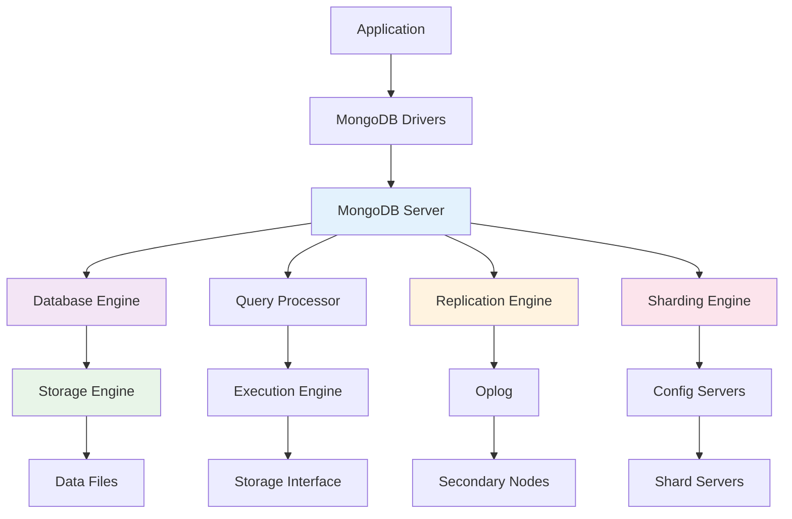

## Document Structure

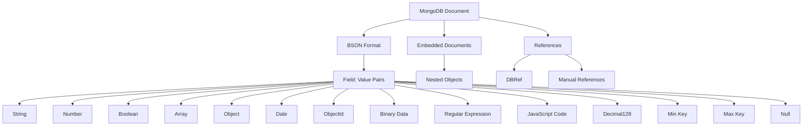

## Storage Engine Architecture

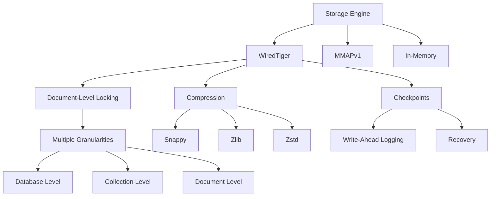

## Replication Architecture

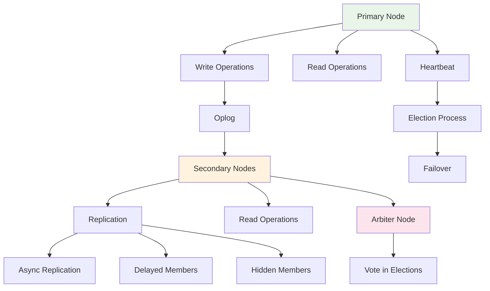

## Sharding Architecture

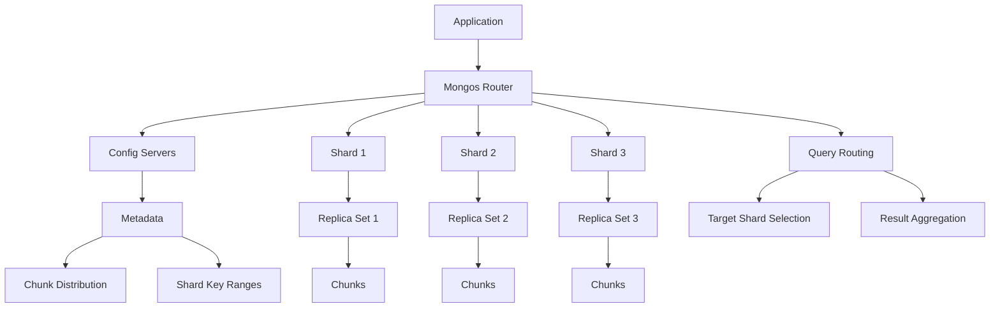

## Index Architecture

```mermaid
graph TD
    A[Index Types] --> B[B-Tree Index]
    A --> C[Text Index]
    A --> D[Geospatial Index]
    A --> E[Hashed Index]
    A --> F[Compound Index]
    A --> G[Multikey Index]
    A --> H[TTL Index]
    A --> I[Partial Index]
    A --> J[Sparse Index]
    A --> K[Unique Index]

    B --> L[Single Field]
    B --> M[Compound Fields]

    C --> N[Full-Text Search]
    C --> O[Language Support]

    D --> P[2D Index]
    D --> Q[2DSphere Index]

    E --> R[Shard Key]
    E --> S[Hash Distribution]

    F --> T[Multiple Fields]
    F --> U[Sort Optimization]

    G --> V[Array Elements]
    G --> W[Embedded Fields]

    H --> X[Automatic Expiration]
    H --> Y[Time-Based Removal]

    I --> Z[Conditional Index]
    J --> AA[Missing Fields]
    K --> BB[Uniqueness Constraint]
```

## Query Execution Pipeline

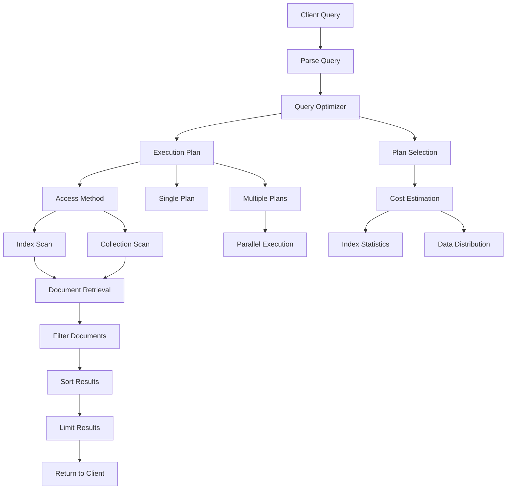

## Aggregation Pipeline

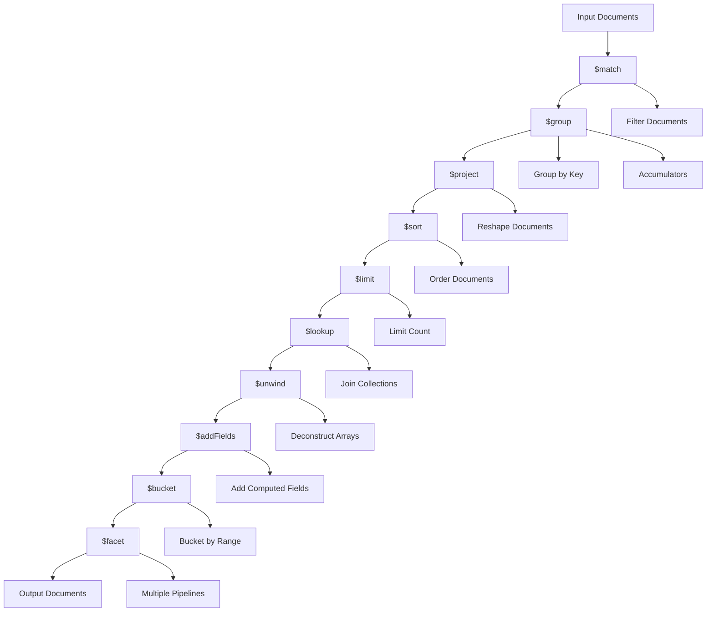

## Transaction Processing

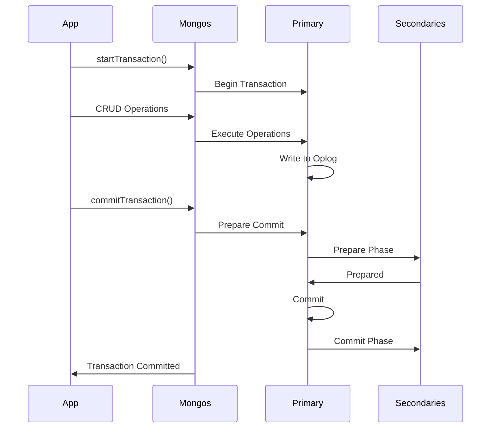

## Connection Pooling

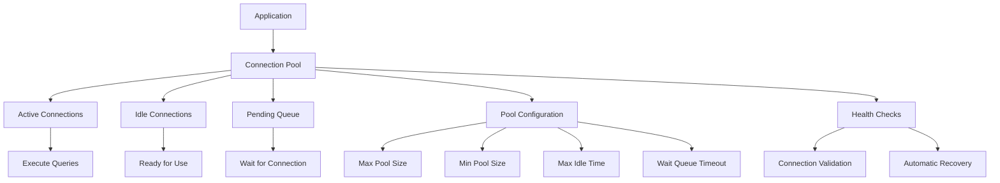

## Backup and Recovery

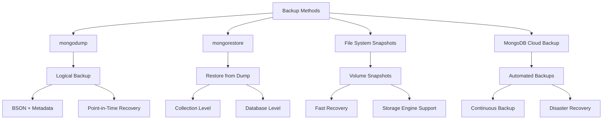

## Security Architecture

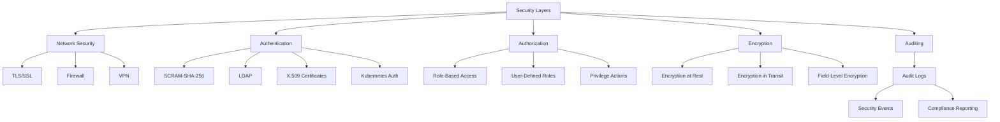

## Performance Monitoring

```mermaid
graph TD
    A[Monitoring Tools] --> B[MongoDB Profiler]
    A --> C[Database Commands]
    A --> D[MongoDB Cloud Manager]
    A --> E[Third-Party Tools]

    B --> F[Query Profiling]
    F --> G[Slow Query Analysis]
    F --> H[Execution Statistics]

    C --> I[db.serverStatus()]
    C --> J[db.stats()]
    C --> K[coll.stats()]

    D --> L[Real-time Monitoring]
    L --> M[Alerting]
    L --> N[Performance Insights]

    E --> O[Prometheus]
    E --> P[Grafana]
    E --> Q[Datadog]
```

## Deployment Patterns

### Standalone Deployment

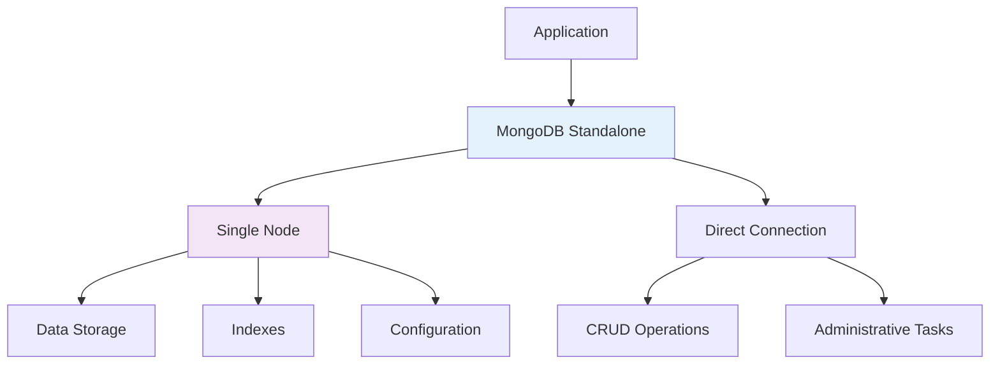

### Replica Set Deployment

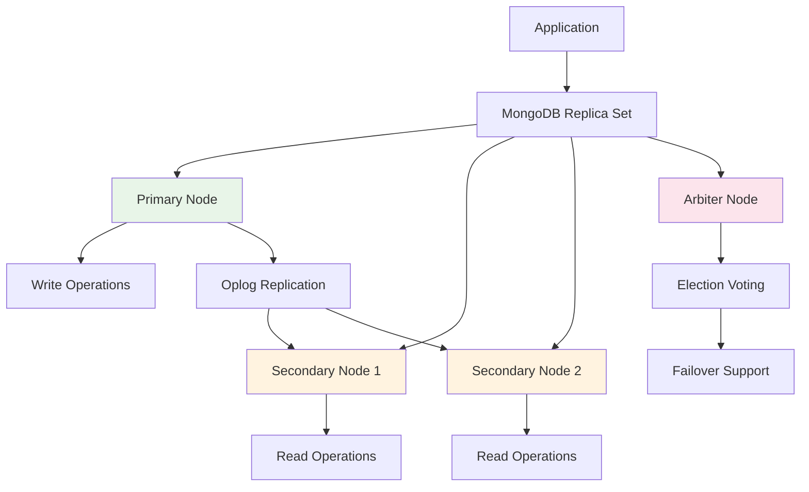

### Sharded Cluster Deployment

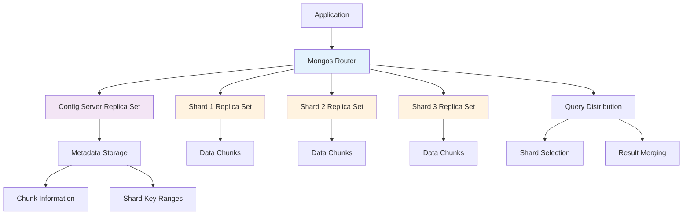

## Data Flow Patterns

### Write Path

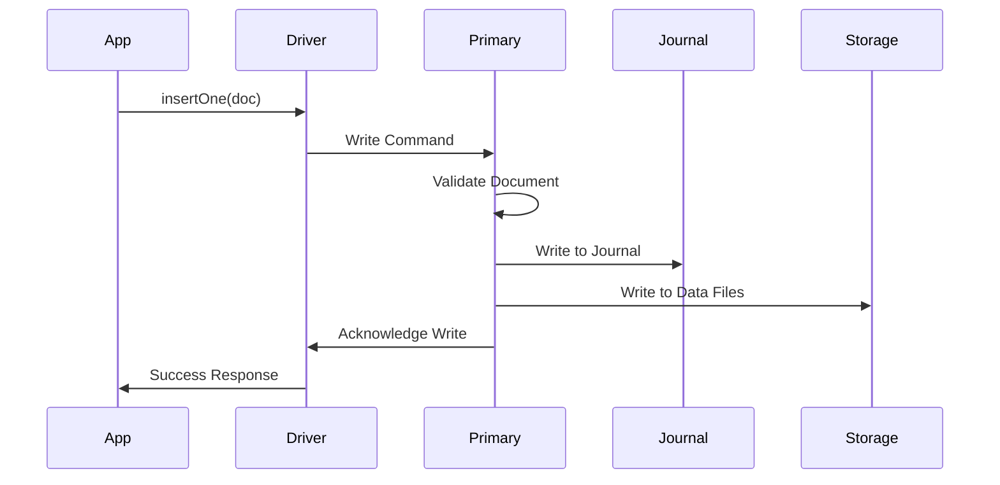

### Read Path

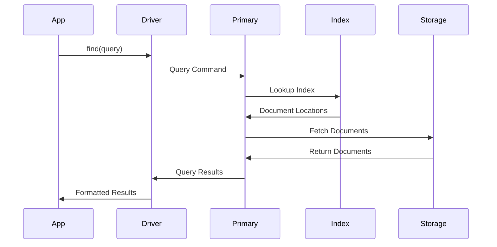

This visual guide provides comprehensive architecture diagrams for MongoDB, covering its storage engine, replication, sharding, indexing, query processing, and deployment patterns.
