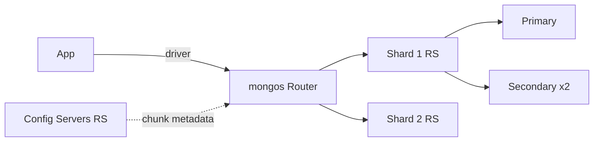

# MongoDB -- Cheatsheet

## Architecture (30-second mental model)

## When to use vs alternatives

| Need | Use | Not |
|---|---|---|
| Flexible schema, rapid iteration, embedded docs | MongoDB | PostgreSQL (rigid ALTER TABLE cycles) |
| Complex joins, strict ACID across tables | PostgreSQL | MongoDB ($lookup is slow at scale) |
| Sub-ms caching / ephemeral data | Redis | MongoDB (disk-bound for hot reads) |
| Time-series IoT ingestion at scale | MongoDB time-series collections | PostgreSQL (unless using TimescaleDB) |
| Full-text search as the core feature | Elasticsearch | MongoDB (Atlas Search works but less mature) |

## 5 things you always forget

1. **The shard key is immutable after collection creation.** Choose wrong and you get hot shards that cannot be rebalanced. Use a hashed shard key for even distribution, compound key for locality.
2. **`$lookup` (joins) does not use indexes on the foreign collection inside a sharded cluster** -- it scatters to all shards. Denormalize or embed data instead of relying on cross-collection joins at scale.
3. **Write concern `w:1` (the driver default) acknowledges after the primary writes but before replication.** A primary failover in that window loses the write silently. Use `w:"majority"` for anything you cannot afford to lose.
4. **MongoDB transactions require a replica set** -- they do not work on standalone instances. Even local dev needs `--replSet rs0` and `rs.initiate()` to test multi-document transactions.
5. **Unbounded array growth in embedded documents triggers document migrations** (docs that grow past 16MB fail). Use the Bucket Pattern to cap array size, or reference a separate collection when arrays could grow indefinitely.

## Interview killer answer

> "We modeled our e-commerce catalog in MongoDB using the Attribute Pattern for product-specific fields that varied wildly across categories, embedded reviews up to a capped 50 per product for fast reads, and used a separate `reviews` collection with `$merge` aggregation for the full history. The shard key was `{categoryId: 1, _id: 1}` so category-scoped queries hit a single shard. We set write concern to majority with `j:true` on the order service to guarantee durability, while product reads used `secondaryPreferred` to offload the primary."
