# Neo4j Visual Architecture Guide

## Neo4j Architecture Overview

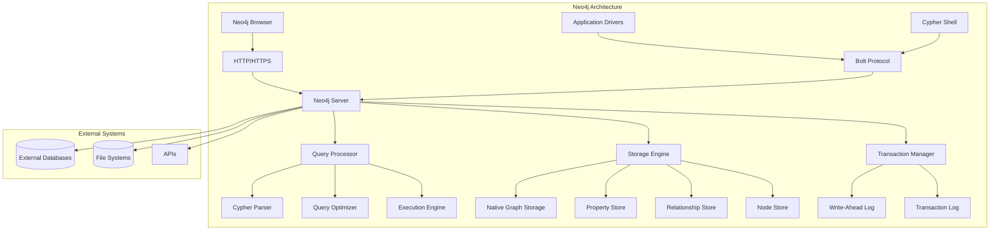

## Core Data Model

```mermaid
graph TD
    subgraph "Graph Data Model"
        A[Node 1<br/>Person<br/>name: "Alice"<br/>age: 30]
        B[Node 2<br/>Person<br/>name: "Bob"<br/>age: 25]
        C[Node 3<br/>Company<br/>name: "TechCorp"<br/>industry: "Tech"]

        A -->|FRIENDS_WITH<br/>since: 2018<br/>strength: "close"| B
        A -->|WORKS_FOR<br/>position: "Engineer"<br/>salary: 75000| C
        B -->|WORKS_FOR<br/>position: "Designer"<br/>salary: 65000| C
    end

    subgraph "Properties"
        D[name: "Alice"]
        E[age: 30]
        F[email: "alice@techcorp.com"]
    end

    subgraph "Labels"
        G[Person]
        H[Employee]
        I[Manager]
    end

    A --- D
    A --- E
    A --- F
    A --- G
    A --- H
```

## Storage Architecture

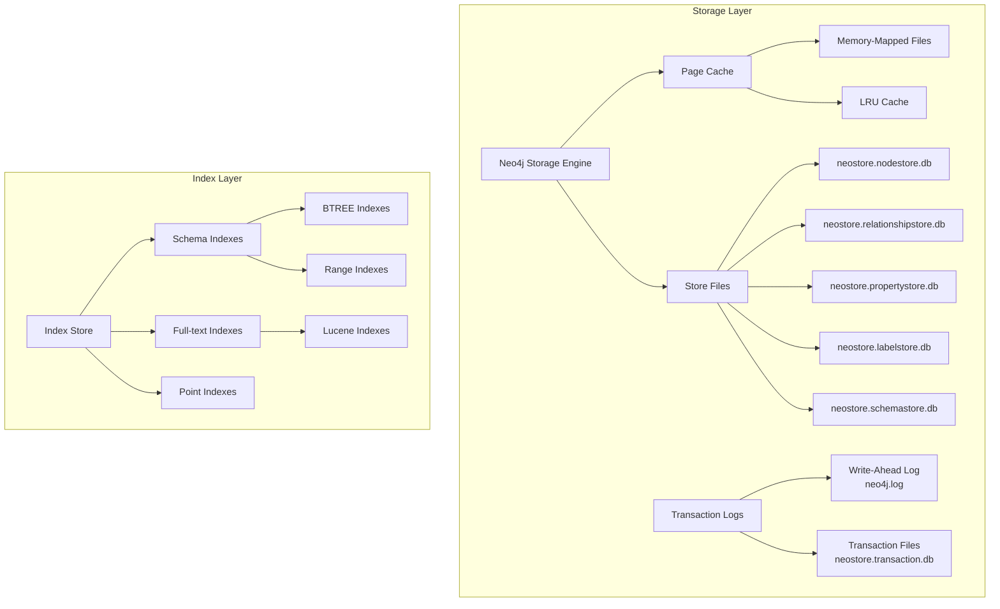

## Cluster Architecture

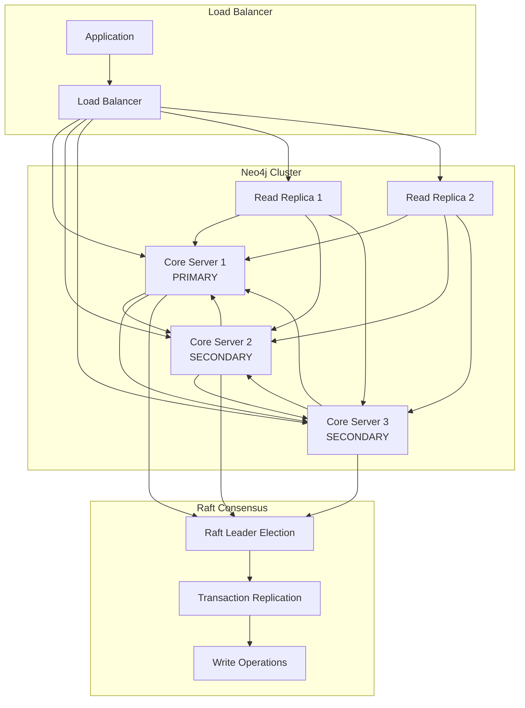

## Query Processing Pipeline

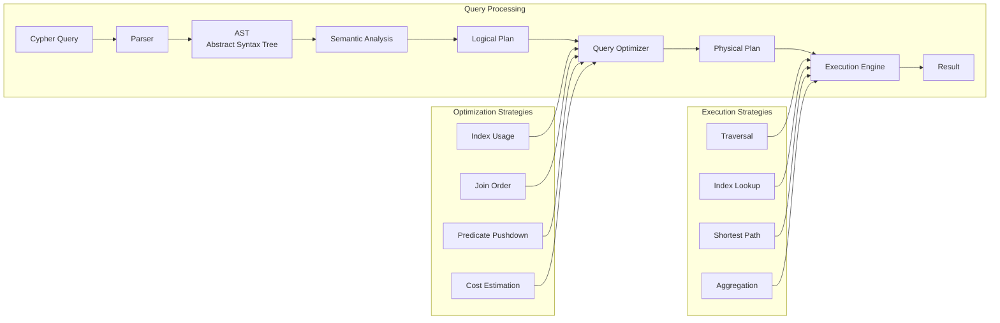

## Graph Algorithms Architecture

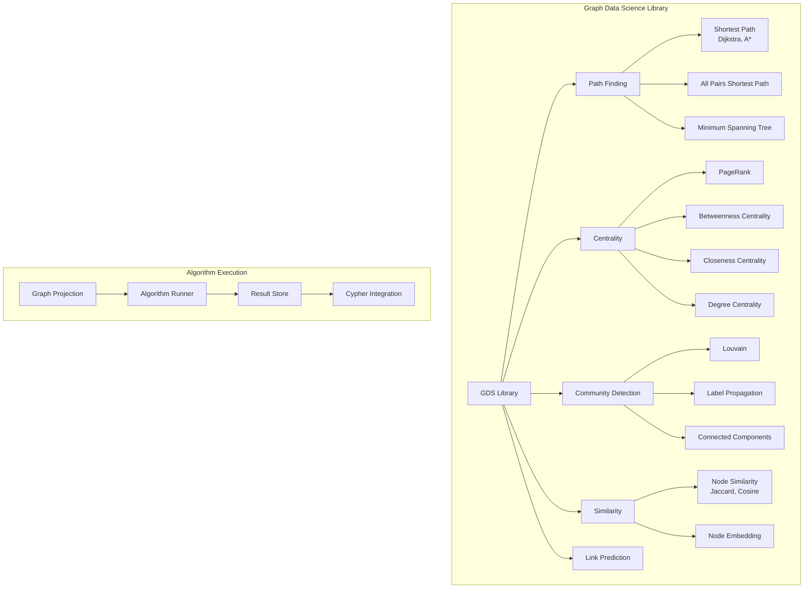

## Security Architecture

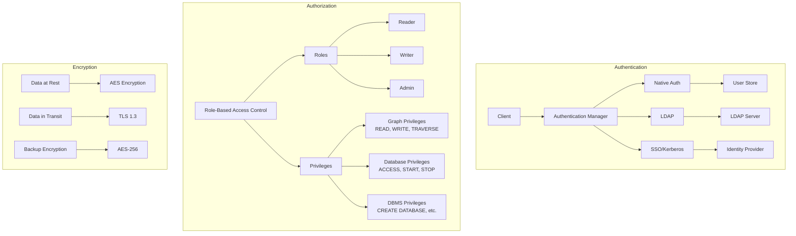

## Backup and Recovery Architecture

```mermaid
graph TB
    subgraph "Backup Process"
        A[neo4j-admin backup] --> B[Backup Coordinator]
        B --> C[Snapshot Creation]
        C --> D[Store File Copy]
        D --> E[Transaction Log Copy]
        E --> F[Compression<br/>Optional]
        F --> G[Backup Archive]
    end

    subgraph "Recovery Process"
        H[neo4j-admin restore] --> I[Restore Coordinator]
        I --> J[Database Stop]
        J --> K[File Extraction]
        K --> L[Store File Restore]
        L --> M[Transaction Replay]
        M --> N[Consistency Check]
        N --> O[Database Start]
    end

    subgraph "Incremental Backup"
        P[Last Backup Point] --> Q[Transaction Log Changes]
        Q --> R[Differential Backup]
        R --> S[Merge with Full Backup]
    end
```

## Performance Monitoring Architecture

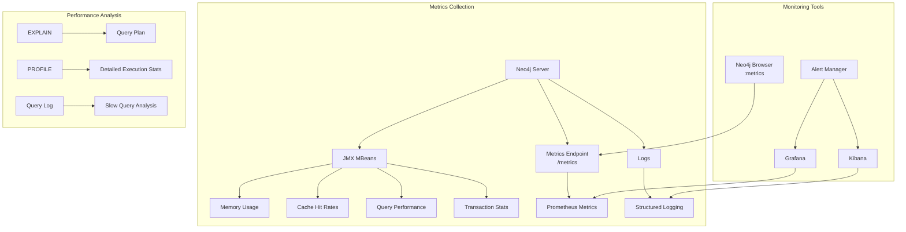

## Application Integration Patterns

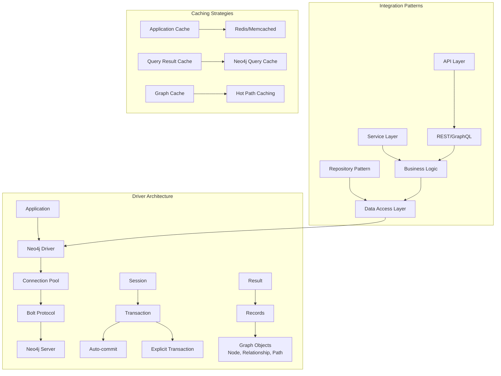

## Data Flow Architecture

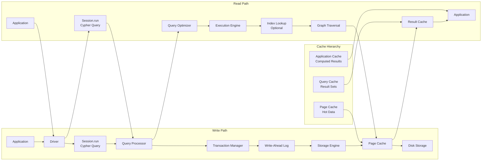

## Deployment Patterns

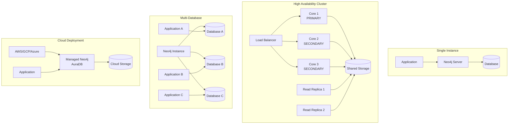

## Graph Data Modeling Patterns

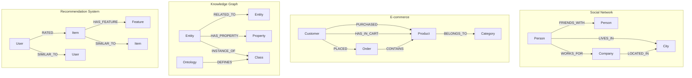

## Cypher Query Execution Flow

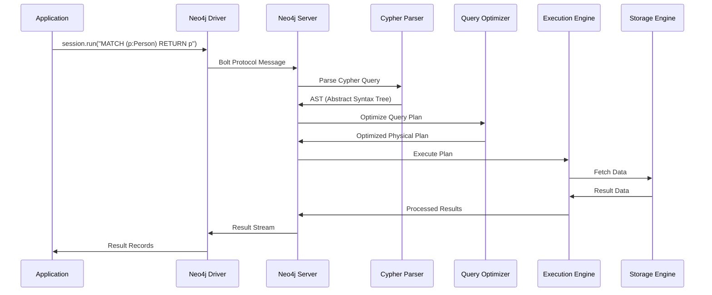

## Index and Constraint Architecture

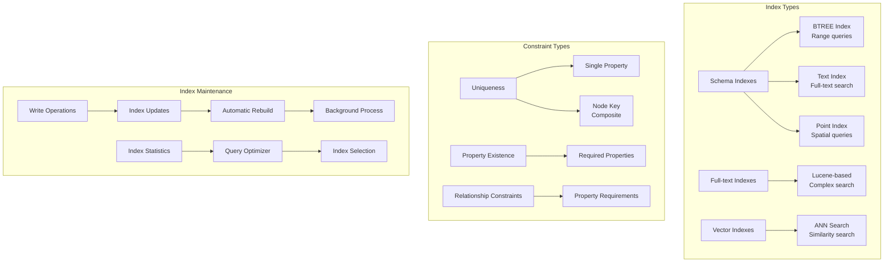

## Memory Management Architecture

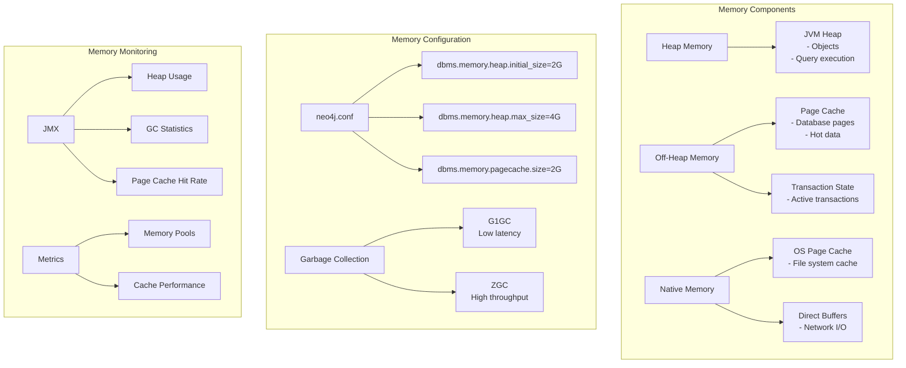

## Replication and Consistency

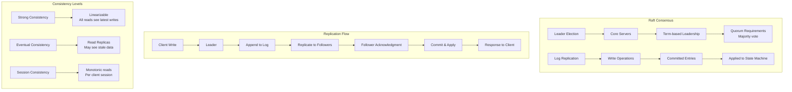

## Graph Analytics Pipeline

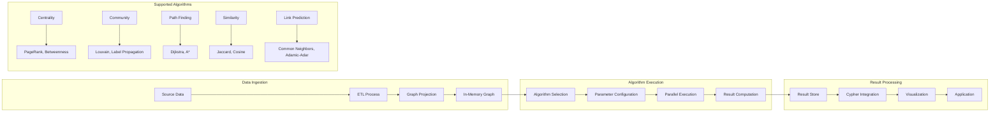

This visual guide provides comprehensive architectural diagrams covering all major aspects of Neo4j including data models, storage, clustering, query processing, security, performance monitoring, and integration patterns.
