# PostgreSQL Architecture Guide

## PostgreSQL Architecture Overview

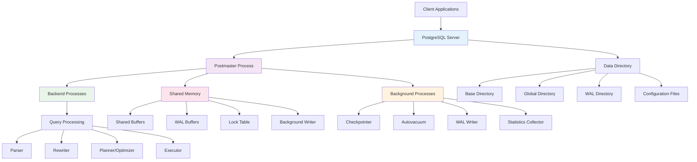

## Process Architecture

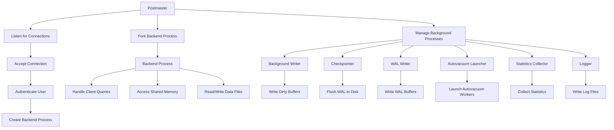

## Memory Architecture

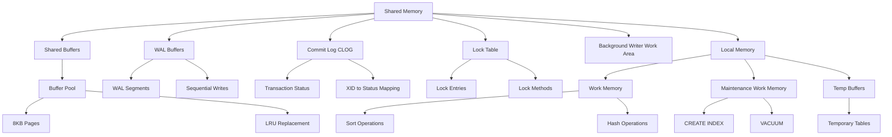

## Storage Architecture

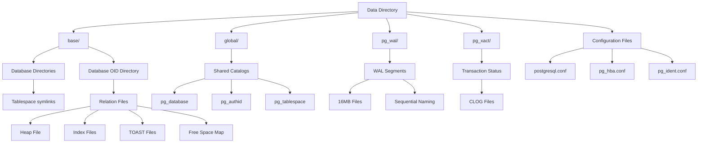

## Query Processing Pipeline

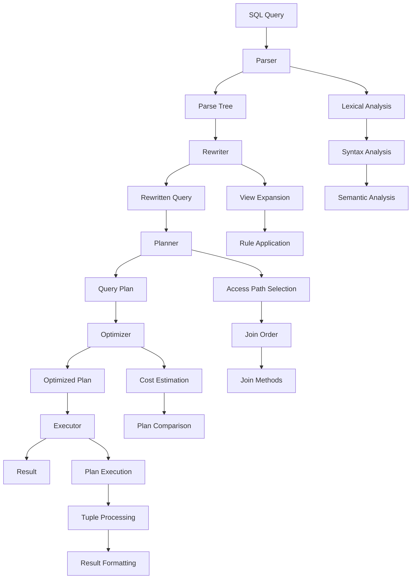

## Index Architecture

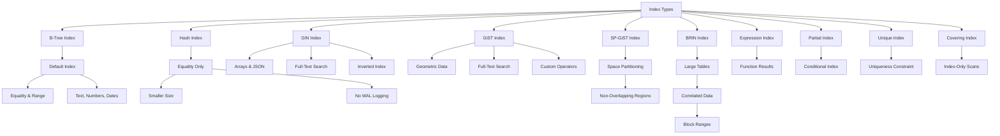

## Transaction System

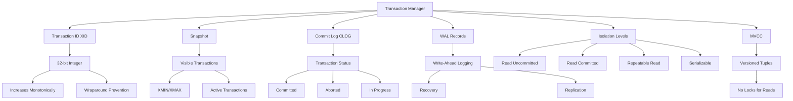

## Locking System

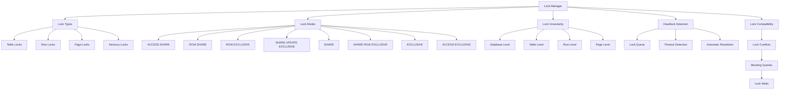

## Replication Architecture

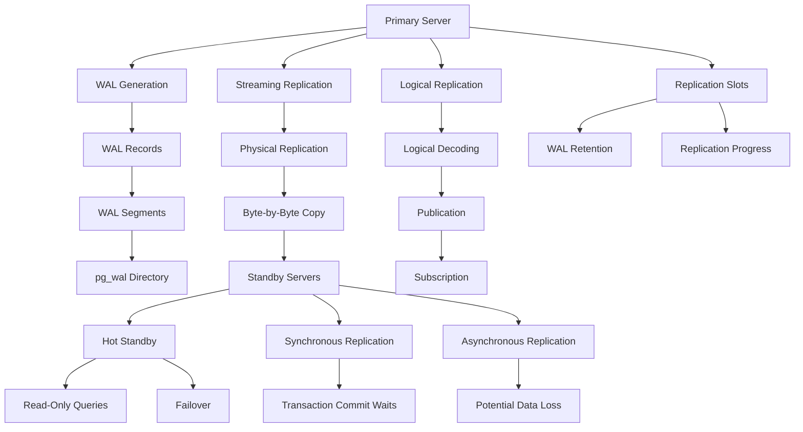

## Partitioning Architecture

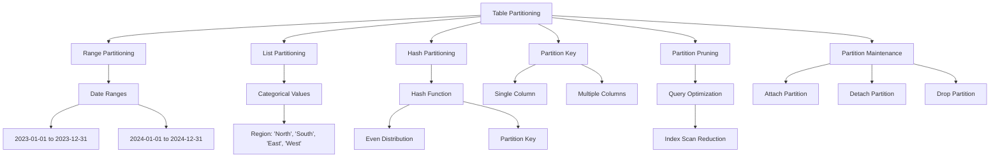

## Extension Architecture

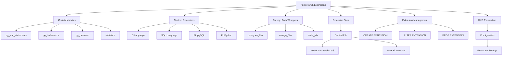

## Security Architecture

```mermaid
graph TD
    A[Security Layers] --> B[Network Security]
    A --> C[Authentication]
    A --> D[Authorization]
    A --> E[Auditing]
    A --> F[Encryption]

    B --> G[SSL/TLS]
    B --> H[Host-Based Access]
    B --> I[Connection Limits]

    C --> J[Password Authentication]
    C --> K[Certificate Authentication]
    C --> L[LDAP Authentication]
    C --> M[Kerberos Authentication]

    D --> N[Users & Roles]
    D --> O[Privileges]
    D --> P[Row-Level Security]
    D --> Q[Column-Level Security]

    E --> R[Audit Logging]
    E --> S[Session Logging]
    E --> T[Object Access Logging]

    F --> U[Data at Rest]
    F --> V[Data in Transit]
    F --> W[Password Encryption]

    A --> X[Security Best Practices]
    X --> Y[Principle of Least Privilege]
    X --> Z[Regular Updates]
    X --> AA[Monitoring & Alerting]
```

## Performance Monitoring

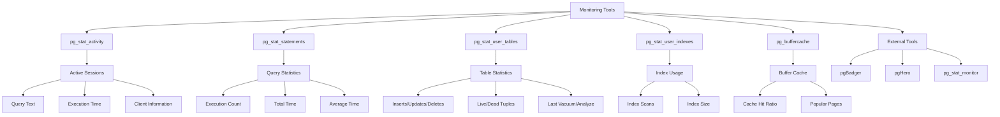

## Backup and Recovery

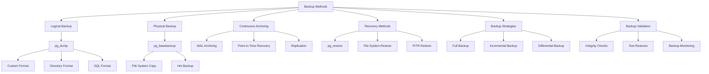

## Deployment Patterns

### Single Server Deployment

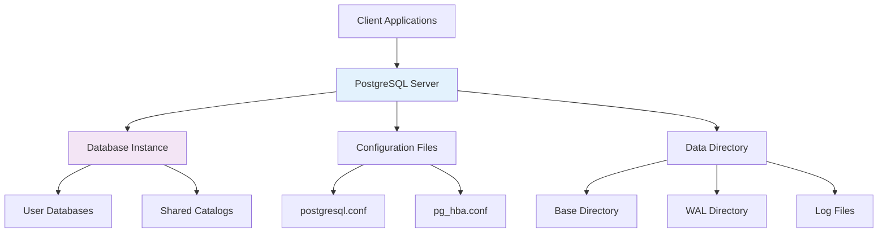

### Primary-Replica Deployment

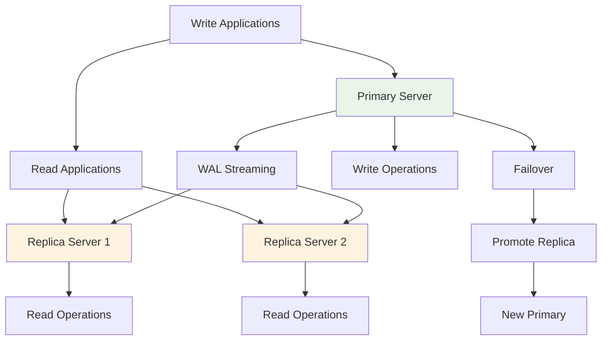

### Sharded Deployment

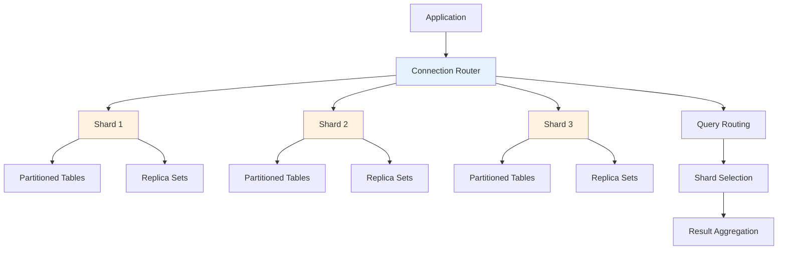

## Connection Pooling

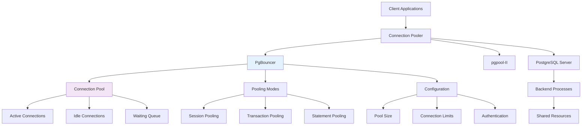

This visual guide provides comprehensive architecture diagrams for PostgreSQL, covering its process model, memory management, storage system, query processing, indexing strategies, transaction management, and deployment patterns.
