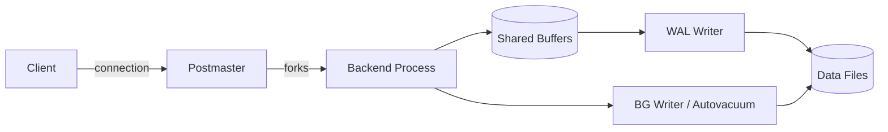

# PostgreSQL -- Cheatsheet

## Architecture (30-second mental model)

## When to use vs alternatives

| Need | Use | Not |
|---|---|---|
| Relational data with complex joins, ACID | PostgreSQL | MongoDB (no joins natively) |
| JSON-heavy with flexible schema, no joins | MongoDB | PostgreSQL (schema overhead) |
| Sub-ms key-value lookups, caching | Redis | PostgreSQL (disk-bound latency) |
| Managed serverless analytics at PB scale | BigQuery | PostgreSQL (not designed for it) |
| Full-text search as primary workload | Elasticsearch | PostgreSQL (tsvector works but limited ranking) |

## 5 things you always forget

1. **CTEs before PG 12 are optimization fences** -- the planner cannot push predicates into `WITH` blocks. Use subqueries or upgrade. PG 12+ added `MATERIALIZED`/`NOT MATERIALIZED` hints.
2. **`VACUUM` does not reclaim disk space; `VACUUM FULL` does but takes an `ACCESS EXCLUSIVE` lock.** For production tables, use `pg_repack` instead to avoid downtime.
3. **`SELECT ... FOR UPDATE` locks rows but `SERIALIZABLE` isolation can throw serialization errors you must catch and retry** -- most ORMs default to `READ COMMITTED` and silently allow lost updates.
4. **`jsonb` is almost always better than `json`** -- `json` stores raw text (re-parsed every access), `jsonb` is binary and supports GIN indexes. The only reason for `json` is preserving key order.
5. **Partial indexes (`CREATE INDEX ... WHERE active = true`) can shrink index size by 10-100x** but are invisible to queries missing the matching `WHERE` clause -- the planner just ignores them.

## Interview killer answer

> "In our analytics platform we partitioned a 2B-row events table by month using declarative partitioning, added BRIN indexes on the timestamp column since data arrived roughly in order, and used partial indexes on the status column for the hot path query. That brought our p95 query time from 12 seconds to 80ms. For the reporting layer, we pre-computed materialized views refreshed concurrently so dashboards never hit the raw tables and refreshes never blocked reads."
