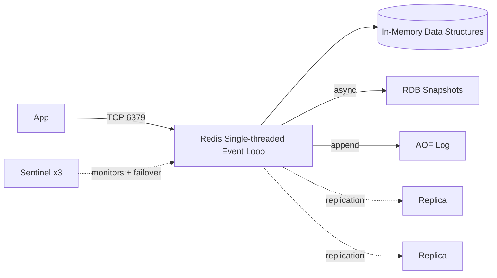

# Redis -- Cheatsheet

## Architecture (30-second mental model)

## When to use vs alternatives

| Need | Use | Not |
|---|---|---|
| Caching with sub-ms reads, TTL eviction | Redis | PostgreSQL (disk round-trip) |
| Persistent relational data, complex queries | PostgreSQL | Redis (no query language) |
| Distributed task queue with retries | Celery + Redis as broker | Raw Redis Pub/Sub (no ack/retry) |
| Session store with auto-expiry | Redis (SETEX) | Database sessions (unnecessary I/O) |
| Full-text search, faceted queries | Elasticsearch | Redis (RediSearch exists but limited) |

## 5 things you always forget

1. **Redis is single-threaded for commands** -- one slow `KEYS *` or `LRANGE 0 -1` on a million-element list blocks ALL other clients. Use `SCAN` for iteration in production.
2. **Pub/Sub has no persistence** -- if a subscriber is disconnected when a message is published, that message is lost forever. Use Redis Streams (`XADD`/`XREADGROUP`) for durable messaging.
3. **`maxmemory-policy` defaults to `noeviction`** -- once memory is full, all writes fail with OOM errors. Set `allkeys-lru` or `volatile-lru` explicitly in production configs.
4. **Pipelines batch commands to cut RTT but are NOT atomic** -- another client can interleave between pipelined commands. Use `MULTI/EXEC` or Lua scripts when you need atomicity.
5. **`EXPIRE` resets if you `SET` the key again without `EX/PX`** -- a common bug where cache entries become immortal after an update. Always pass TTL with every `SET`.

## Interview killer answer

> "We used Redis as a write-behind cache in front of PostgreSQL -- hot-path reads went to Redis sorted sets for leaderboard queries at sub-millisecond latency, while a consumer drained a Redis Stream into Postgres for durability. The critical design choice was using Redis Cluster with hash tags so all keys for a given tenant landed on the same shard, letting us use MULTI/EXEC for atomic tenant-scoped operations without cross-slot errors."
