# Databases Guide

## Table of Contents
1. [Terminology and Overview](#terminology-and-overview)
2. [History](#history)
   - [1960s, Navigational DBMS](#1960s-navigational-dbms)
   - [1970s, Relational DBMS](#1970s-relational-dbms)
   - [Late 1970s, SQL DBMS](#late-1970s-sql-dbms)
   - [1980s, On the Desktop](#1980s-on-the-desktop)
   - [1990s, Object-Oriented](#1990s-object-oriented)
   - [2000s, NoSQL and NewSQL](#2000s-nosql-and-newsql)
3. [Use Cases](#use-cases)
4. [Classification](#classification)
5. [Database Management System](#database-management-system)
6. [Application](#application)
7. [Database Languages](#database-languages)
8. [Storage](#storage)
9. [Security](#security)
10. [Transactions and Concurrency](#transactions-and-concurrency)
11. [Migration](#migration)
12. [Building, Maintaining, and Tuning](#building-maintaining-and-tuning)
13. [Backup and Restore](#backup-and-restore)
14. [Static Analysis](#static-analysis)
15. [Miscellaneous Features](#miscellaneous-features)
16. [Design and Modeling](#design-and-modeling)

## Terminology and Overview
Formally, a "database" refers to a set of related data accessed through the use of a "database management system" (DBMS), which is an integrated set of computer software that allows users to interact with one or more databases and provides access to all of the data contained in the database (although restrictions may exist that limit access to particular data). The DBMS provides various functions that allow entry, storage and retrieval of large quantities of information and provides ways to manage how that information is organized.

Outside the world of professional information technology, the term database is often used to refer to any collection of related data (such as a spreadsheet or a card index) as size and usage requirements typically necessitate use of a database management system.

Existing DBMSs provide various functions that allow management of a database and its data which can be classified into four main functional groups:

- Data definition – Creation, modification and removal of definitions that detail how the data is to be organized.
- Update – Insertion, modification, and deletion of the data itself.
- Retrieval – Selecting data according to specified criteria (e.g., a query, a position in a hierarchy, or a position in relation to other data) and providing that data either directly to the user, or making it available for further processing by the database itself or by other applications. The retrieved data may be made available in a more or less direct form without modification, as it is stored in the database, or in a new form obtained by altering it or combining it with existing data from the database.
- Administration – Registering and monitoring users, enforcing data security, monitoring performance, maintaining data integrity, dealing with concurrency control, and recovering information that has been corrupted by some event such as an unexpected system failure.

Both a database and its DBMS conform to the principles of a particular database model. "Database system" refers collectively to the database model, database management system, and database.

Physically, database servers are dedicated computers that hold the actual databases and run only the DBMS and related software. Database servers are usually multiprocessor computers, with generous memory and RAID disk arrays used for stable storage. Hardware database accelerators, connected to one or more servers via a high-speed channel, are also used in large-volume transaction processing environments. DBMSs are found at the heart of most database applications. DBMSs may be built around a custom multitasking kernel with built-in networking support, but modern DBMSs typically rely on a standard operating system to provide these functions.

Since DBMSs comprise a significant market, computer and storage vendors often take into account DBMS requirements in their own development plans.

Databases and DBMSs can be categorized according to the database model(s) that they support (such as relational or XML), the type(s) of computer they run on (from a server cluster to a mobile phone), the query language(s) used to access the database (such as SQL or XQuery), and their internal engineering, which affects performance, scalability, resilience, and security.

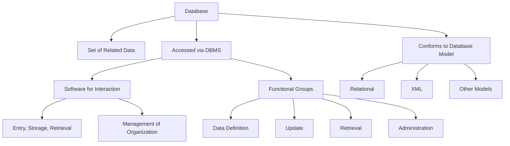

## History

### 1960s, Navigational DBMS
The introduction of the term database coincided with the availability of direct-access storage (disks and drums) from the mid-1960s onwards. The term represented a contrast with the tape-based systems of the past, allowing shared interactive use rather than daily batch processing. The Oxford English Dictionary cites a 1962 report by the System Development Corporation of California as the first to use the term "data-base" in a specific technical sense.

As computers grew in speed and capability, a number of general-purpose database systems emerged; by the mid-1960s a number of such systems had come into commercial use. Interest in a standard began to grow, and Charles Bachman, author of one such product, the Integrated Data Store (IDS), founded the Database Task Group within CODASYL, the group responsible for the creation and standardization of COBOL. In 1971, the Database Task Group delivered their standard, which generally became known as the CODASYL approach, and soon a number of commercial products based on this approach entered the market.

The CODASYL approach offered applications the ability to navigate around a linked data set which was formed into a large network. Applications could find records by one of three methods: 1. Use of a primary key (known as a CALC key, typically implemented by hashing). 2. Navigating relationships (called sets) from one record to another. 3. Scanning all the records in a sequential order.

Later systems added B-trees to provide alternate access paths. Many CODASYL databases also added a declarative query language for end users (as distinct from the navigational API). However, CODASYL databases were complex and required significant training and effort to produce useful applications.

IBM also had its own DBMS in 1966, known as Information Management System (IMS). IMS was a development of software written for the Apollo program on the System/360. IMS was generally similar in concept to CODASYL, but used a strict hierarchy for its model of data navigation instead of CODASYL's network model. Both concepts later became known as navigational databases due to the way data was accessed: the term was popularized by Bachman's 1973 Turing Award presentation The Programmer as Navigator. IMS is classified by IBM as a hierarchical database. IDMS and Cincom Systems' TOTAL databases are classified as network databases. IMS remains in use as of 2014.

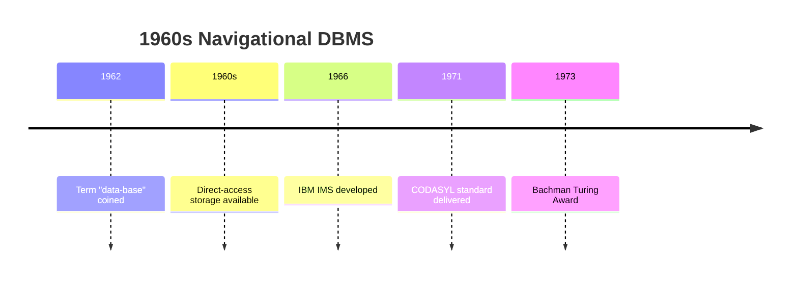

### 1970s, Relational DBMS
Edgar F. Codd worked at IBM in San Jose, California, in an office primarily involved in the development of hard disk systems. He was unhappy with the navigational model of the CODASYL approach, notably the lack of a "search" facility. In 1970, he wrote a number of papers that outlined a new approach to database construction that eventually culminated in the groundbreaking A Relational Model of Data for Large Shared Data Banks.

The paper described a new system for storing and working with large databases. Instead of records being stored in some sort of linked list of free-form records as in CODASYL, Codd's idea was to organize the data as a number of "tables", each table being used for a different type of entity. Each table would contain a fixed number of columns containing the attributes of the entity. One or more columns of each table were designated as a primary key by which the rows of the table could be uniquely identified; cross-references between tables always used these primary keys, rather than disk addresses, and queries would join tables based on these key relationships, using a set of operations based on the mathematical system of relational calculus (from which the model takes its name). Splitting the data into a set of normalized tables (or relations) aimed to ensure that each "fact" was only stored once, thus simplifying update operations. Virtual tables called views could present the data in different ways for different users, but views could not be directly updated.

As well as identifying rows/records using logical identifiers rather than disk addresses, Codd changed the way in which applications assembled data from multiple records. Rather than requiring applications to gather data one record at a time by navigating the links, they would use a declarative query language that expressed what data was required, rather than the access path by which it should be found. Finding an efficient access path to the data became the responsibility of the database management system, rather than the application programmer. This process, called query optimization, depended on the fact that queries were expressed in terms of mathematical logic.

Codd's paper inspired teams at various universities to research the subject, including one at University of California, Berkeley led by Eugene Wong and Michael Stonebraker, who started INGRES using funding that had already been allocated for a geographical database project and student programmers to produce code. Beginning in 1973, INGRES delivered its first test products which were generally ready for widespread use in 1979. INGRES was similar to System R in a number of ways, including the use of a "language" for data access, known as QUEL. Over time, INGRES moved to the emerging SQL standard.

IBM formed a team led by Codd that started working on a prototype system, System R despite opposition from others at the company. The first version was ready in 1974/5, and work then started on multi-table systems in which the data could be split so that all of the data for a record (some of which is optional) did not have to be stored in a single large "chunk". Subsequent multi-user versions were tested by customers in 1978 and 1979, by which time a standardized query language – SQL – had been added. Codd's ideas were establishing themselves as both workable and superior to CODASYL, pushing IBM to develop a true production version of System R, known as SQL/DS, and, later, Database 2 (IBM Db2).

Larry Ellison's Oracle Database (or more simply, Oracle) started from a different chain, based on IBM's papers on System R. Though Oracle V1 implementations were completed in 1978, it was not until Oracle Version 2 when Ellison beat IBM to market in 1979.

Stonebraker went on to apply the lessons from INGRES to develop a new database, Postgres, which is now known as PostgreSQL. PostgreSQL is often used for global mission-critical applications (the .org and .info domain name registries use it as their primary data store, as do many large companies and financial institutions).

In Sweden, Codd's paper was also read and Mimer SQL was developed in the mid-1970s at Uppsala University. In 1984, this project was consolidated into an independent enterprise.

Another data model, the entity–relationship model, emerged in 1976 and gained popularity for database design as it emphasized a more familiar description than the earlier relational model. Later on, entity–relationship constructs were retrofitted as a data modeling construct for the relational model, and the difference between the two has become irrelevant.

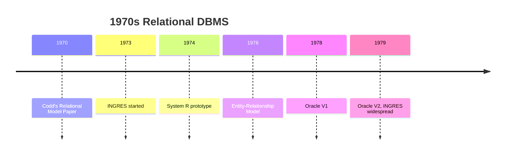

### Late 1970s, SQL DBMS
IBM formed a team led by Codd that started working on a prototype system, System R despite opposition from others at the company. The first version was ready in 1974/5, and work then started on multi-table systems in which the data could be split so that all of the data for a record (some of which is optional) did not have to be stored in a single large "chunk". Subsequent multi-user versions were tested by customers in 1978 and 1979, by which time a standardized query language – SQL – had been added. Codd's ideas were establishing themselves as both workable and superior to CODASYL, pushing IBM to develop a true production version of System R, known as SQL/DS, and, later, Database 2 (IBM Db2).

Larry Ellison's Oracle Database (or more simply, Oracle) started from a different chain, based on IBM's papers on System R. Though Oracle V1 implementations were completed in 1978, it was not until Oracle Version 2 when Ellison beat IBM to market in 1979.

Stonebraker went on to apply the lessons from INGRES to develop a new database, Postgres, which is now known as PostgreSQL. PostgreSQL is often used for global mission-critical applications (the .org and .info domain name registries use it as their primary data store, as do many large companies and financial institutions).

In Sweden, Codd's paper was also read and Mimer SQL was developed in the mid-1970s at Uppsala University. In 1984, this project was consolidated into an independent enterprise.

Another data model, the entity–relationship model, emerged in 1976 and gained popularity for database design as it emphasized a more familiar description than the earlier relational model. Later on, entity–relationship constructs were retrofitted as a data modeling construct for the relational model, and the difference between the two has become irrelevant.

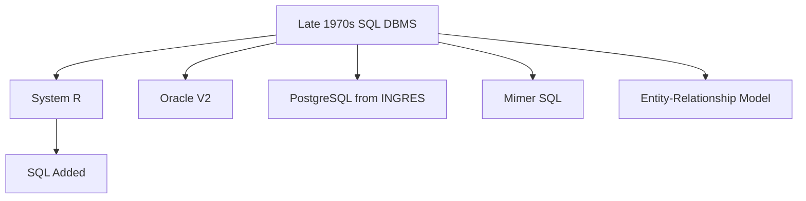

### 1980s, On the Desktop
Besides IBM and various software companies such as Sybase and Informix Corporation, most large computer hardware vendors by the 1980s had their own database systems such as DEC's VAX Rdb/VMS. The decade ushered in the age of desktop computing. The new computers empowered their users with spreadsheets like Lotus 1-2-3 and database software like dBASE. The dBASE product was lightweight and easy for any computer user to understand out of the box. C. Wayne Ratliff, the creator of dBASE, stated: "dBASE was different from programs like BASIC, C, FORTRAN, and COBOL in that a lot of the dirty work had already been done. The data manipulation is done by dBASE instead of by the user, so the user can concentrate on what he is doing, rather than having to mess with the dirty details of opening, reading, and closing files, and managing space allocation." dBASE was one of the top selling software titles in the 1980s and early 1990s.

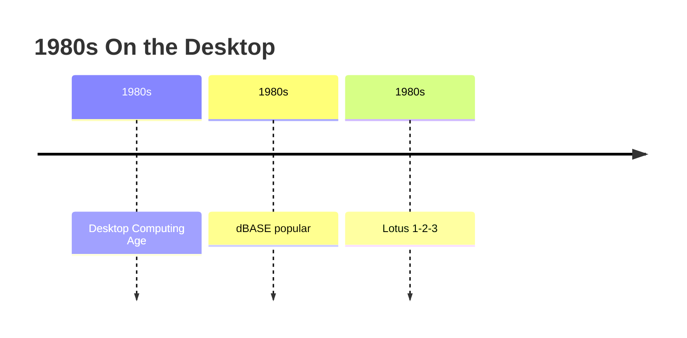

### 1990s, Object-Oriented
By the start of the decade databases had become a billion-dollar industry in about ten years. The 1990s, along with a rise in object-oriented programming, saw a growth in how data in various databases were handled. Programmers and designers began to treat the data in their databases as objects. That is to say that if a person's data were in a database, that person's attributes, such as their address, phone number, and age, were now considered to belong to that person instead of being extraneous data. This allows for relations between data to be related to objects and their attributes and not to individual fields. The term "object–relational impedance mismatch" described the inconvenience of translating between programmed objects and database tables. Object databases and object–relational databases attempt to solve this problem by providing an object-oriented language (sometimes as extensions to SQL) that programmers can use as alternative to purely relational SQL. On the programming side, libraries known as object–relational mappings (ORMs) attempt to solve the same problem.

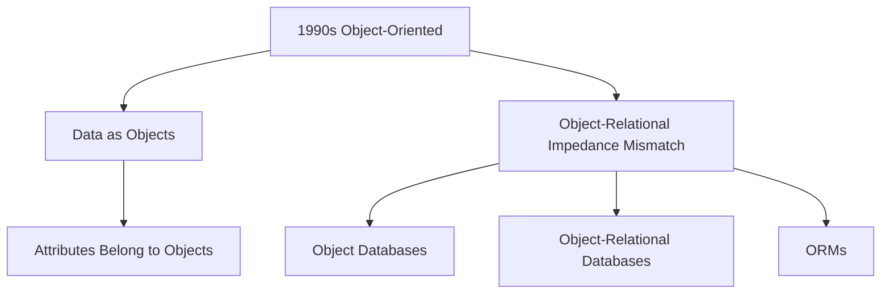

### 2000s, NoSQL and NewSQL
Database sales grew rapidly during the dotcom bubble and, after its end, the rise of ecommerce. The popularity of open source databases such as MySQL has grown since 2000, to the extent that Ken Jacobs of Oracle said in 2005 that perhaps "these guys are doing to us what we did to IBM".

XML databases are a type of structured document-oriented database that allows querying based on XML document attributes. XML databases are mostly used in applications where the data is conveniently viewed as a collection of documents, with a structure that can vary from the very flexible to the highly rigid: examples include scientific articles, patents, tax filings, and personnel records.

NoSQL databases are often very fast, do not require fixed table schemas, avoid join operations by storing denormalized data, and are designed to scale horizontally.

In recent years, there has been a strong demand for massively distributed databases with high partition tolerance, but according to the CAP theorem, it is impossible for a distributed system to simultaneously provide consistency, availability, and partition tolerance guarantees. A distributed system can satisfy any two of these guarantees at the same time, but not all three. For that reason, many NoSQL databases are using what is called eventual consistency to provide both availability and partition tolerance guarantees with a reduced level of data consistency.

NewSQL is a class of modern relational databases that aims to provide the same scalable performance of NoSQL systems for online transaction processing (read-write) workloads while still using SQL and maintaining the ACID guarantees of a traditional database system.

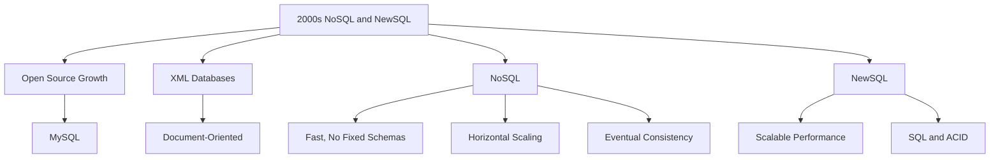

## Use Cases
Databases are used to support internal operations of organizations and to underpin online interactions with customers and suppliers (see Enterprise software).

Databases are used to hold administrative information and more specialized data, such as engineering data or economic models. Examples include computerized library systems, flight reservation systems, computerized parts inventory systems, and many content management systems that store websites as collections of webpages in a database.

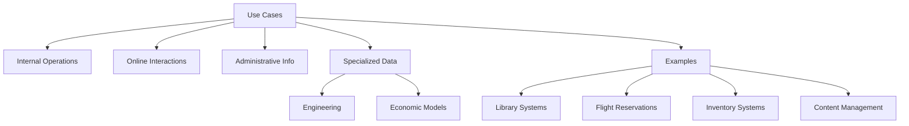

## Classification
One way to classify databases involves the type of their contents, for example: bibliographic, document-text, statistical, or multimedia objects. Another way is by their application area, for example: accounting, music compositions, movies, banking, manufacturing, or insurance. A third way is by some technical aspect, such as the database structure or interface type. This section lists a few of the adjectives used to characterize different kinds of databases.

- An in-memory database is a database that primarily resides in main memory, but is typically backed-up by non-volatile computer data storage. Main memory databases are faster than disk databases, and so are often used where response time is critical, such as in telecommunications network equipment.
- An active database includes an event-driven architecture which can respond to conditions both inside and outside the database. Possible uses include security monitoring, alerting, statistics gathering and authorization. Many databases provide active database features in the form of database triggers.
- A cloud database relies on cloud technology. Both the database and most of its DBMS reside remotely, "in the cloud", while its applications are both developed by programmers and later maintained and used by end-users through a web browser and Open APIs.
- Data warehouses archive data from operational databases and often from external sources such as market research firms. The warehouse becomes the central source of data for use by managers and other end-users who may not have access to operational data. For example, sales data might be aggregated to weekly totals and converted from internal product codes to use UPCs so that they can be compared with ACNielsen data. Some basic and essential components of data warehousing include extracting, analyzing, and mining data, transforming, loading, and managing data so as to make them available for further use.
- A deductive database combines logic programming with a relational database.
- A distributed database is one in which both the data and the DBMS span multiple computers.
- A document-oriented database is designed for storing, retrieving, and managing document-oriented, or semi structured, information. Document-oriented databases are one of the main categories of NoSQL databases.
- An embedded database system is a DBMS which is tightly integrated with an application software that requires access to stored data in such a way that the DBMS is hidden from the application's end-users and requires little or no ongoing maintenance.
- End-user databases consist of data developed by individual end-users. Examples of these are collections of documents, spreadsheets, presentations, multimedia, and other files. Several products exist to support such databases.
- A federated database system comprises several distinct databases, each with its own DBMS. It is handled as a single database by a federated database management system (FDBMS), which transparently integrates multiple autonomous DBMSs, possibly of different types (in which case it would also be a heterogeneous database system), and provides them with an integrated conceptual view.
- Sometimes the term multi-database is used as a synonym for federated database, though it may refer to a less integrated (e.g., without an FDBMS and a managed integrated schema) group of databases that cooperate in a single application. In this case, typically middleware is used for distribution, which typically includes an atomic commit protocol (ACP), e.g., the two-phase commit protocol, to allow distributed (global) transactions across the participating databases.
- A graph database is a kind of NoSQL database that uses graph structures with nodes, edges, and properties to represent and store information. General graph databases that can store any graph are distinct from specialized graph databases such as triplestores and network databases.
- An array DBMS is a kind of NoSQL DBMS that allows modeling, storage, and retrieval of (usually large) multi-dimensional arrays such as satellite images and climate simulation output.
- In a hypertext or hypermedia database, any word or a piece of text representing an object, e.g., another piece of text, an article, a picture, or a film, can be hyperlinked to that object. Hypertext databases are particularly useful for organizing large amounts of disparate information. For example, they are useful for organizing online encyclopedias, where users can conveniently jump around the text. The World Wide Web is thus a large distributed hypertext database.
- A knowledge base (abbreviated KB, kb or Δ) is a special kind of database for knowledge management, providing the means for the computerized collection, organization, and retrieval of knowledge. Also a collection of data representing problems with their solutions and related experiences.
- A mobile database can be carried on or synchronized from a mobile computing device.
- Operational databases store detailed data about the operations of an organization. They typically process relatively high volumes of updates using transactions. Examples include customer databases that record contact, credit, and demographic information about a business's customers, personnel databases that hold information such as salary, benefits, skills data about employees, enterprise resource planning systems that record details about product components, parts inventory, and financial databases that keep track of the organization's money, accounting and financial dealings.
- A parallel database seeks to improve performance through parallelization for tasks such as loading data, building indexes and evaluating queries.
- Probabilistic databases employ fuzzy logic to draw inferences from imprecise data.
- A real-time database processes transactions fast enough for the result to come back and be acted on right away.
- A spatial database can store the data with multidimensional features. The queries on such data include location-based queries, like "Where is the closest hotel in my area?".
- A temporal database has built-in time aspects, for example a temporal data model and a temporal version of SQL. More specifically the temporal aspects usually include valid-time and transaction-time.
- A terminology-oriented database builds upon an object-oriented database, often customized for a specific field.
- An unstructured data database is intended to store in a manageable and protected way diverse objects that do not fit naturally and conveniently in common databases. It may include email messages, documents, journals, multimedia objects, etc. The name may be misleading since some objects can be highly structured. However, the entire possible object collection does not fit into a predefined structured framework. Most established DBMSs now support unstructured data in various ways, and new dedicated DBMSs are emerging.

```mermaid
graph TD
    A[Classification] --> B[By Contents]
    B --> C[Bibliographic]
    B --> D[Document-Text]
    B --> E[Statistical]
    B --> F[Multimedia]
    A --> G[By Application]
    G --> H[Accounting]
    G --> I[Music]
    G --> J[Movies]
    G --> K[Banking]
    A --> L[By Technical Aspect]
    L --> M[In-Memory]
    L --> N[Active]
    L --> O[Cloud]
    L --> P[Data Warehouse]
    L --> Q[Deductive]
    L --> R[Distributed]
    L --> S[Document-Oriented]
    L --> T[Embedded]
    L --> U[End-User]
    L --> V[Federated]
    L --> W[Graph]
    L --> X[Array DBMS]
    L --> Y[Hypertext]
    L --> Z[Knowledge Base]
    L --> AA[Mobile]
    L --> BB[Operational]
    L --> CC[Parallel]
    L --> DD[Probabilistic]
    L --> EE[Real-Time]
    L --> FF[Spatial]
    L --> GG[Temporal]
    L --> HH[Terminology-Oriented]
    L --> II[Unstructured Data]
```

## Database Management System
Connolly and Begg define database management system (DBMS) as a "software system that enables users to define, create, maintain and control access to the database." Examples of DBMS's include MySQL, MariaDB, PostgreSQL, Microsoft SQL Server, Oracle Database, and Microsoft Access.

The DBMS acronym is sometimes extended to indicate the underlying database model, with RDBMS for the relational, OODBMS for the object (oriented) and ORDBMS for the object–relational model. Other extensions can indicate some other characteristics, such as DDBMS for a distributed database management systems.

The functionality provided by a DBMS can vary enormously. The core functionality is the storage, retrieval and update of data. Codd proposed the following functions and services a fully-fledged general purpose DBMS should provide:

- Data storage, retrieval and update
- User accessible catalog or data dictionary describing the metadata
- Support for transactions and concurrency
- Facilities for recovering the database should it become damaged
- Support for authorization of access and update of data
- Access support from remote locations
- Enforcing constraints to ensure data in the database abides by certain rules

It is also generally to be expected the DBMS will provide a set of utilities for such purposes as may be necessary to administer the database effectively, including import, export, monitoring, defragmentation and analysis utilities. The core part of the DBMS interacting between the database and the application interface sometimes referred to as the database engine.

Often DBMSs will have configuration parameters that can be statically and dynamically tuned, for example the maximum amount of main memory on a server the database can use. The trend is to minimize the amount of manual configuration, and for cases such as embedded databases the need to target zero-administration is paramount.

The large major enterprise DBMSs have tended to increase in size and functionality and have involved up to thousands of human years of development effort throughout their lifetime.

Early multi-user DBMS typically only allowed for the application to reside on the same computer with access via terminals or terminal emulation software. The client–server architecture was a development where the application resided on a client desktop and the database on a server allowing the processing to be distributed. This evolved into a multitier architecture incorporating application servers and web servers with the end user interface via a web browser with the database only directly connected to the adjacent tier.

A general-purpose DBMS will provide public application programming interfaces (API) and optionally a processor for database languages such as SQL to allow applications to be written to interact with and manipulate the database. A special purpose DBMS may use a private API and be specifically customized and linked to a single application. For example, an email system performs many of the functions of a general-purpose DBMS such as message insertion, message deletion, attachment handling, blocklist lookup, associating messages an email address and so forth however these functions are limited to what is required to handle email.

```mermaid
graph TD
    A[DBMS] --> B[Software System]
    B --> C[Define, Create, Maintain, Control Access]
    A --> D[Examples]
    D --> E[MySQL]
    D --> F[MariaDB]
    D --> G[PostgreSQL]
    D --> H[Microsoft SQL Server]
    D --> I[Oracle Database]
    D --> J[Microsoft Access]
    A --> K[Extensions]
    K --> L[RDBMS]
    K --> M[OODBMS]
    K --> N[ORDBMS]
    K --> O[DDBMS]
    A --> P[Core Functionality]
    P --> Q[Storage, Retrieval, Update]
    P --> R[Catalog/Data Dictionary]
    P --> S[Transactions and Concurrency]
    P --> T[Recovery]
    P --> U[Authorization]
    P --> V[Remote Access]
    P --> W[Constraints]
    A --> X[Utilities]
    X --> Y[Import/Export]
    X --> Z[Monitoring]
    X --> AA[Defragmentation]
    X --> BB[Analysis]
    A --> CC[Configuration Parameters]
    CC --> DD[Memory Limits]
    A --> EE[Architectures]
    EE --> FF[Client-Server]
    EE --> GG[Multitier]
    A --> HH[APIs]
    HH --> II[Public APIs]
    HH --> JJ[SQL Processor]
    HH --> KK[Private APIs for Special Purpose]
```

## Application
External interaction with the database will be via an application program that interfaces with the DBMS. This can range from a database tool that allows users to execute SQL queries textually or graphically, to a website that happens to use a database to store and search information.

### Application Program Interface
A programmer will code interactions to the database (sometimes referred to as a datasource) via an application program interface (API) or via a database language. The particular API or language chosen will need to be supported by DBMS, possibly indirectly via a preprocessor or a bridging API. Some API's aim to be database independent, ODBC being a commonly known example. Other common API's include JDBC and ADO.NET.

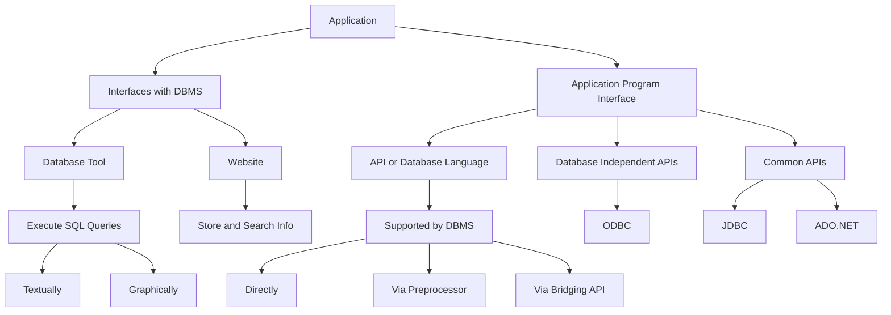

## Database Languages
Database languages are special-purpose languages, which allow one or more of the following tasks, sometimes distinguished as sublanguages:

- Data control language (DCL) – controls access to data;
- Data definition language (DDL) – defines data types such as creating, altering, or dropping tables and the relationships among them;
- Data manipulation language (DML) – performs tasks such as inserting, updating, or deleting data occurrences;
- Data query language (DQL) – allows searching for information and computing derived information.

Database languages are specific to a particular data model. Notable examples include:

- SQL combines the roles of data definition, data manipulation, and query in a single language. It was one of the first commercial languages for the relational model, although it departs in some respects from the relational model as described by Codd (for example, the rows and columns of a table can be ordered). SQL became a standard of the American National Standards Institute (ANSI) in 1986, and of the International Organization for Standardization (ISO) in 1987. The standards have been regularly enhanced since and are supported (with varying degrees of conformance) by all mainstream commercial relational DBMSs.
- OQL is an object model language standard (from the Object Data Management Group). It has influenced the design of some of the newer query languages like JDOQL and EJB QL.
- XQuery is a standard XML query language implemented by XML database systems such as MarkLogic and eXist, by relational databases with XML capability such as Oracle and Db2, and also by in-memory XML processors such as Saxon.
- SQL/XML combines XQuery with SQL.

A database language may also incorporate features like:

- DBMS-specific configuration and storage engine management
- Computations to modify query results, like counting, summing, averaging, sorting, grouping, and cross-referencing
- Constraint enforcement (e.g. in an automotive database, only allowing one engine type per car)
- Application programming interface version of the query language, for programmer convenience

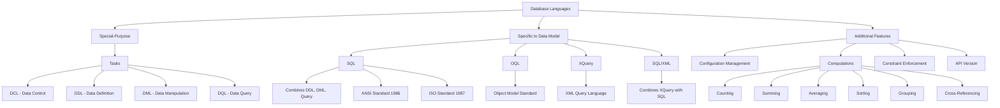

## Storage
Database storage is the container of the physical materialization of a database. It comprises the internal (physical) level in the database architecture. It also contains all the information needed (e.g., metadata, "data about the data", and internal data structures) to reconstruct the conceptual level and external level from the internal level when needed. Databases as digital objects contain three layers of information which must be stored: the data, the structure, and the semantics. Proper storage of all three layers is needed for future preservation and longevity of the database.

Various low-level database storage structures are used by the storage engine to serialize the data model so it can be written to the medium of choice. Techniques such as indexing may be used to improve performance. Conventional storage is row-oriented, but there are also column-oriented and correlation databases.

Some DBMSs support specifying which character encoding was used to store data, so multiple encodings can be used in the same database.

### Materialized Views
Often storage redundancy is employed to increase performance. A common example is storing materialized views, which consist of frequently needed external views or query results. Storing such views saves the expensive computing them each time they are needed. The downsides of materialized views are the overhead incurred when updating them to keep them synchronized with their original updated database data, and the cost of storage redundancy.

### Replication
Occasionally a database employs storage redundancy by database objects replication (with one or more copies) to increase data availability (both to improve performance of simultaneous multiple end-user accesses to the same database object, and to provide resiliency in a case of partial failure of a distributed database). Updates of a replicated object need to be synchronized across the object copies. In many cases, the entire database is replicated.

### Virtualization
With data virtualization, the data used remains in its original locations and real-time access is established to allow analytics across multiple sources. This can aid in resolving some technical difficulties such as compatibility problems when combining data from various platforms, lowering the risk of error caused by faulty data, and guaranteeing that the newest data is used. Furthermore, avoiding the creation of a new database containing personal information can make it easier to comply with privacy regulations. However, with data virtualization, the connection to all necessary data sources must be operational as there is no local copy of the data, which is one of the main drawbacks of the approach.

```mermaid
graph TD
    A[Storage] --> B[Physical Materialization]
    B --> C[Internal Level]
    B --> D[Metadata]
    B --> E[Internal Data Structures]
    A --> F[Three Layers]
    F --> G[Data]
    F --> H[Structure]
    F --> I[Semantics]
    A --> J[Storage Structures]
    J --> K[Indexing]
    J --> L[Row-Oriented]
    J --> M[Column-Oriented]
    J --> N[Correlation Databases]
    A --> O[Character Encoding]
    O --> P[Multiple Encodings Supported]
    A --> Q[Materialized Views]
    Q --> R[Storage Redundancy]
    Q --> S[Frequently Needed Views]
    Q --> T[Performance Increase]
    Q --> U[Update Overhead]
    Q --> V[Storage Cost]
    A --> W[Replication]
    W --> X[Copies for Availability]
    W --> Y[Performance Improvement]
    W --> Z[Resiliency]
    W --> AA[Synchronization Needed]
    A --> BB[Virtualization]
    BB --> CC[Data in Original Locations]
    BB --> DD[Real-Time Access]
    BB --> EE[Analytics Across Sources]
    BB --> FF[Compatibility Resolution]
    BB --> GG[Privacy Compliance]
    BB --> HH[Dependency on Connections]
```

## Security
Database security deals with all various aspects of protecting the database content, its owners, and its users. It ranges from protection from intentional unauthorized database uses to unintentional database accesses by unauthorized entities (e.g., a person or a computer program).

Database access control deals with controlling who (a person or a certain computer program) are allowed to access what information in the database. The information may comprise specific database objects (e.g., record types, specific records, data structures), certain computations over certain objects (e.g., query types, or specific queries), or using specific access paths to the former (e.g., using specific indexes or other data structures to access information). Database access controls are set by special authorized (by the database owner) personnel that uses dedicated protected security DBMS interfaces.

This may be managed directly on an individual basis, or by the assignment of individuals and privileges to groups, or (in the most elaborate models) through the assignment of individuals and groups to roles which are then granted entitlements. Data security prevents unauthorized users from viewing or updating the database. Using passwords, users are allowed access to the entire database or subsets of it called "subschemas". For example, an employee database can contain all the data about an individual employee, but one group of users may be authorized to view only payroll data, while others are allowed access to only work history and medical data. If the DBMS provides a way to interactively enter and update the database, as well as interrogate it, this capability allows for managing personal databases.

Data security in general deals with protecting specific chunks of data, both physically (i.e., from corruption, or destruction, or removal; e.g., see physical security), or the interpretation of them, or parts of them to meaningful information (e.g., by looking at the strings of bits that they comprise, concluding specific valid credit-card numbers; e.g., see data encryption).

Change and access logging records who accessed which attributes, what was changed, and when it was changed. Logging services allow for a forensic database audit later by keeping a record of access occurrences and changes. Sometimes application-level code is used to record changes rather than leaving this in the database. Monitoring can be set up to attempt to detect security breaches. Therefore, organizations must take database security seriously because of the many benefits it provides. Organizations will be safeguarded from security breaches and hacking activities like firewall intrusion, virus spread, and ransom ware. This helps in protecting the company's essential information, which cannot be shared with outsiders at any cause.

```mermaid
graph TD
    A[Security] --> B[Protect Content, Owners, Users]
    B --> C[From Unauthorized Uses]
    C --> D[Intentional]
    C --> E[Unintentional]
    A --> F[Access Control]
    F --> G[Who Accesses What]
    G --> H[Database Objects]
    G --> I[Computations]
    G --> J[Access Paths]
    F --> K[Set by Authorized Personnel]
    K --> L[Protected Interfaces]
    F --> M[Management]
    M --> N[Individual Basis]
    M --> O[Groups and Privileges]
    M --> P[Roles and Entitlements]
    A --> Q[Data Security]
    Q --> R[Prevent Unauthorized View/Update]
    Q --> S[Passwords]
    Q --> T[Subschemas]
    Q --> U[Interactive Entry/Update]
    A --> V[Physical Security]
    V --> W[From Corruption]
    V --> X[Destruction]
    V --> Y[Removal]
    A --> Z[Interpretation Security]
    Z --> AA[Data Encryption]
    A --> BB[Logging]
    BB --> CC[Change and Access Records]
    BB --> DD[Forensic Audit]
    BB --> EE[Application-Level Logging]
    A --> FF[Monitoring]
    FF --> GG[Detect Breaches]
    A --> HH[Benefits]
    HH --> II[Safeguard from Breaches]
    HH --> JJ[Firewall Intrusion]
    HH --> KK[Virus Spread]
    HH --> LL[Ransom Ware]
    HH --> MM[Protect Essential Info]
```

## Transactions and Concurrency
Database transactions can be used to introduce some level of fault tolerance and data integrity after recovery from a crash. A database transaction is a unit of work, typically encapsulating a number of operations over a database (e.g., reading a database object, writing, acquiring or releasing a lock, etc.), an abstraction supported in database and also other systems. Each transaction has well defined boundaries in terms of which program/code executions are included in that transaction (determined by the transaction's programmer via special transaction commands).

The acronym ACID describes some ideal properties of a database transaction: atomicity, consistency, isolation, and durability.

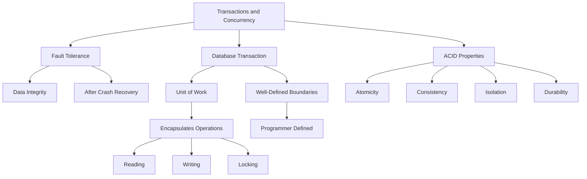

## Migration
A database built with one DBMS is not portable to another DBMS (i.e., the other DBMS cannot run it). However, in some situations, it is desirable to migrate a database from one DBMS to another. The reasons are primarily economical (different DBMSs may have different total costs of ownership or TCOs), functional, and operational (different DBMSs may have different capabilities). The migration involves the database's transformation from one DBMS type to another. The transformation should maintain (if possible) the database related application (i.e., all related application programs) intact. Thus, the database's conceptual and external architectural levels should be maintained in the transformation. It may be desired that also some aspects of the architecture internal level are maintained. A complex or large database migration may be a complicated and costly (one-time) project by itself, which should be factored into the decision to migrate. This is in spite of the fact that tools may exist to help migration between specific DBMSs. Typically, a DBMS vendor provides tools to help import databases from other popular DBMSs.

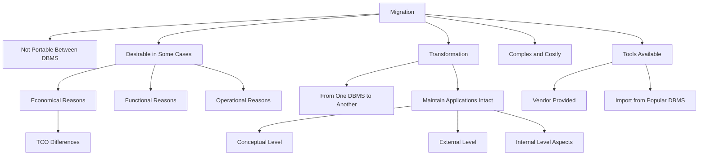

## Building, Maintaining, and Tuning
After designing a database for an application, the next stage is building the database. Typically, an appropriate general-purpose DBMS can be selected to be used for this purpose. A DBMS provides the needed user interfaces to be used by database administrators to define the needed application's data structures within the DBMS's respective data model. Other user interfaces are used to select needed DBMS parameters (like security related, storage allocation parameters, etc.).

When the database is ready (all its data structures and other needed components are defined), it is typically populated with initial application's data (database initialization, which is typically a distinct project; in many cases using specialized DBMS interfaces that support bulk insertion) before making it operational. In some cases, the database becomes operational while empty of application data, and data are accumulated during its operation.

After the database is created, initialized and populated it needs to be maintained. Various database parameters may need changing and the database may need to be tuned (tuning) for better performance; application's data structures may be changed or added, new related application programs may be written to add to the application's functionality, etc.

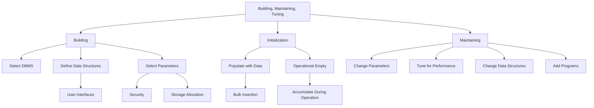

## Backup and Restore
Sometimes it is desired to bring a database back to a previous state (for many reasons, e.g., cases when the database is found corrupted due to a software error, or if it has been updated with erroneous data). To achieve this, a backup operation is done occasionally or continuously, where each desired database state (i.e., the values of its data and their embedding in database's data structures) is kept within dedicated backup files (many techniques exist to do this effectively). When it is decided by a database administrator to bring the database back to this state (e.g., by specifying this state by a desired point in time when the database was in this state), these files are used to restore that state.

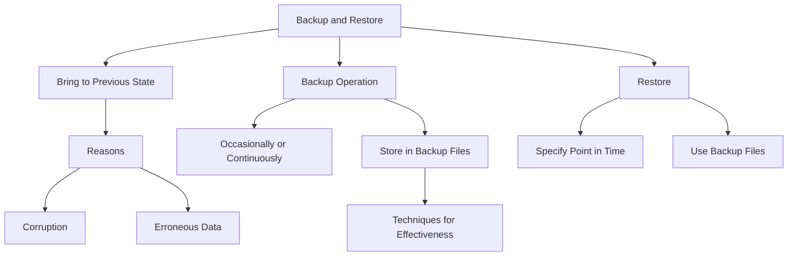

## Static Analysis
Static analysis techniques for software verification can be applied also in the scenario of query languages. In particular, the Abstract interpretation framework has been extended to the field of query languages for relational databases as a way to support sound approximation techniques. The semantics of query languages can be tuned according to suitable abstractions of the concrete domain of data. The abstraction of relational database systems has many interesting applications, in particular, for security purposes, such as fine-grained access control, watermarking, etc.

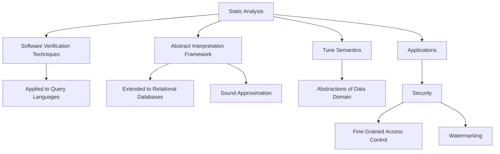

## Miscellaneous Features
Other DBMS features might include:

- Database logs – This helps in keeping a history of the executed functions.
- Graphics component for producing graphs and charts, especially in a data warehouse system.
- Query optimizer – Performs query optimization on every query to choose an efficient query plan (a partial order (tree) of operations) to be executed to compute the query result. May be specific to a particular storage engine.
- Tools or hooks for database design, application programming, application program maintenance, database performance analysis and monitoring, database configuration monitoring, DBMS hardware configuration (a DBMS and related database may span computers, networks, and storage units) and related database mapping (especially for a distributed DBMS), storage allocation and database layout monitoring, storage migration, etc.

Increasingly, there are calls for a single system that incorporates all of these core functionalities into the same build, test, and deployment framework for database management and source control. Borrowing from other developments in the software industry, some market such offerings as "DevOps for database".

```mermaid
graph TD
    A[Miscellaneous Features] --> B[Database Logs]
    B --> C[History of Executed Functions]
    A --> D[Graphics Component]
    D --> E[Graphs and Charts]
    D --> F[Data Warehouse]
    A --> G[Query Optimizer]
    G --> H[Optimize Queries]
    G --> I[Efficient Query Plan]
    G --> J[Tree of Operations]
    G --> K[Specific to Storage Engine]
    A --> L[Tools and Hooks]
    L --> M[Database Design]
    L --> N[Application Programming]
    L --> O[Maintenance]
    L --> P[Performance Analysis]
    L --> Q[Monitoring]
    L --> R[Configuration]
    L --> S[Hardware]
    L --> T[Storage Allocation]
    L --> U[Layout Monitoring]
    L --> V[Storage Migration]
    A --> W[Single System Calls]
    W --> X[Build, Test, Deploy Framework]
    W --> Y[Database Management]
    W --> Z[Source Control]
    W --> AA["DevOps for Database"]
```

## Design and Modeling
A database model is a type of data model that determines the logical structure of a database and fundamentally determines in which manner data can be stored, organized, and manipulated. The most popular example of a database model is the relational model (or more precisely, the relational model as represented by the SQL language). The process of creating a logical database design using this model uses a methodical approach known as normalization. The goal of normalization is to ensure that each elementary "fact" is only recorded in one place, so that insertions, updates, and deletions automatically maintain consistency.

The final stage of database design is to make the decisions that affect performance, scalability, recovery, security, and the like, which depend on the particular DBMS. This is often called physical database design, and the output is the physical data model. A key goal during this stage is data independence, meaning that the decisions made for performance optimization purposes should be invisible to end-users and applications. There are two types of data independence: Physical data independence and logical data independence. Physical design is driven mainly by performance requirements, and requires a good knowledge of the expected workload and access patterns, and a deep understanding of the features offered by the chosen DBMS.

Another aspect of physical database design is security. It involves both defining access control to database objects as well as defining security levels and methods for the data itself.

```mermaid
graph TD
    A[Design and Modeling] --> B[Database Model]
    B --> C[Logical Structure]
    B --> D[Manner of Storage, Organization, Manipulation]
    B --> E[Relational Model]
    E --> F[SQL Representation]
    A --> G[Normalization]
    G --> H[Logical Design]
    G --> I[Ensure Facts Recorded Once]
    G --> J[Consistency in Updates]
    A --> K[Physical Design]
    K --> L[Performance Decisions]
    K --> M[Scalability]
    K --> N[Recovery]
    K --> O[Security]
    K --> P[Depends on DBMS]
    K --> Q[Data Independence]
    Q --> R[Physical]
    Q --> S[Logical]
    K --> T[Driven by Performance]
    T --> U[Workload Knowledge]
    T --> V[Access Patterns]
    T --> W[DBMS Features Understanding]
    A --> X[Security Aspect]
    X --> Y[Access Control]
    X --> Z[Security Levels]
    X --> AA[Methods for Data]
```
