# Docker Visual Architecture Guide

## Docker Architecture Overview

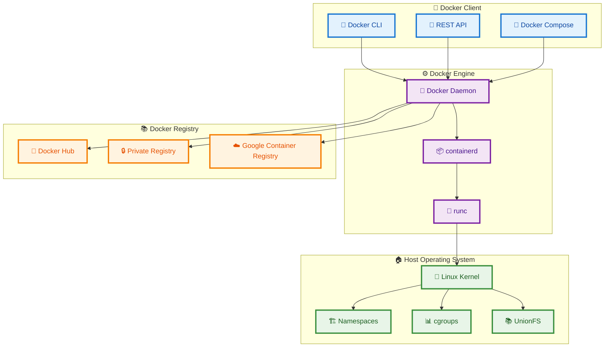

## Container Lifecycle

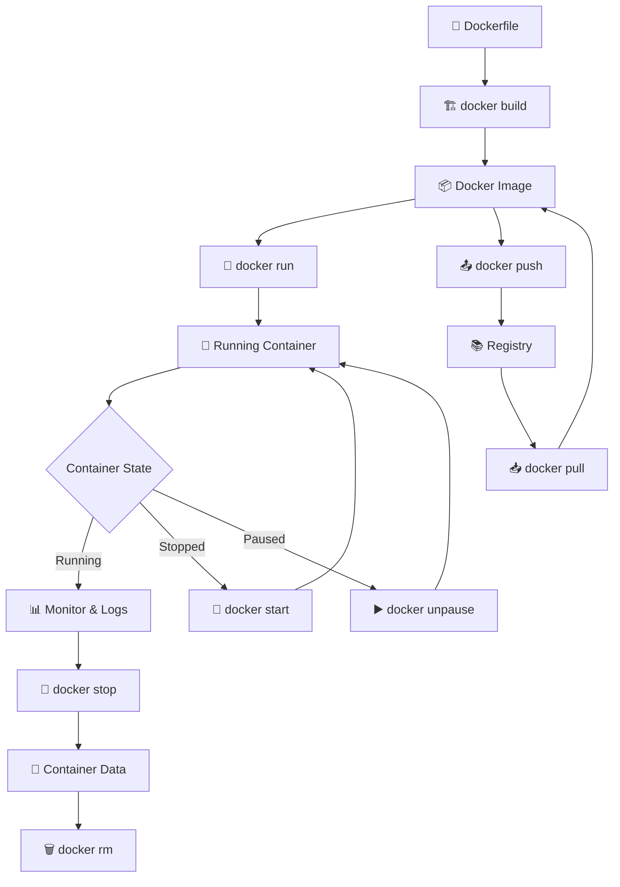

## Image Layer Architecture

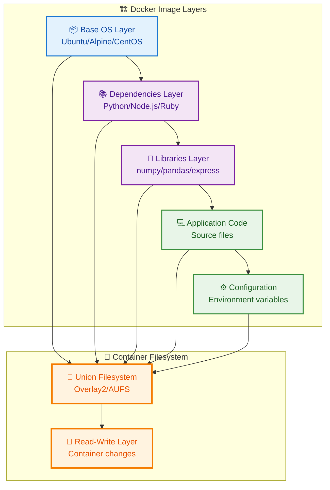

## Networking Architecture

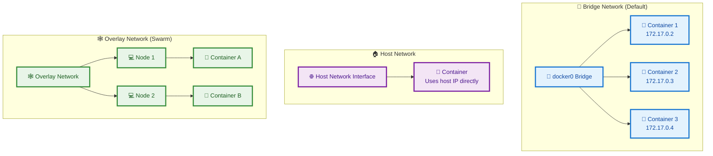

## Docker Compose Architecture

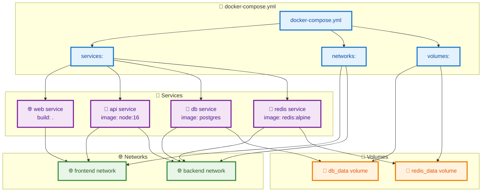

## Multi-stage Build Process

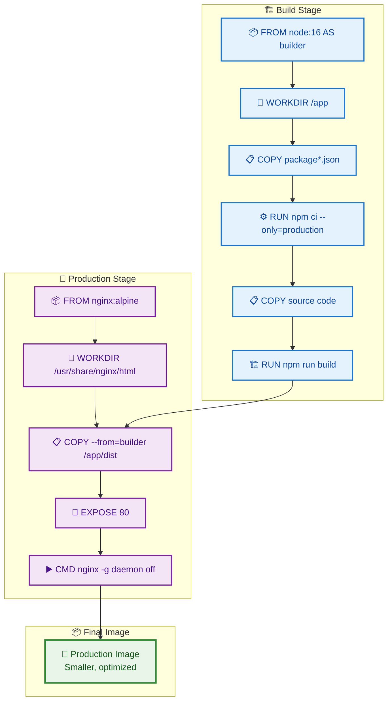

## Docker Swarm Architecture

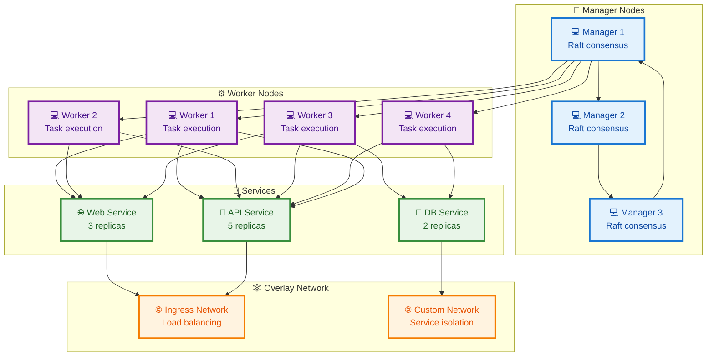

## Development Workflow

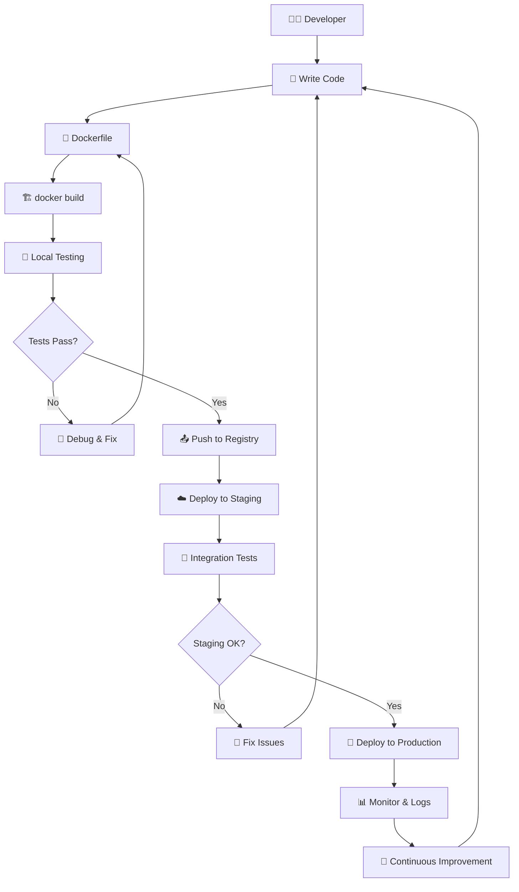

## Container Resource Management

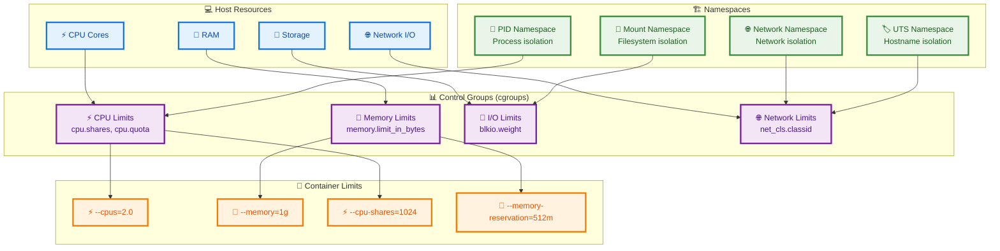

## Docker Security Model

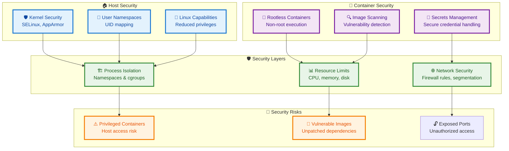

## CI/CD Integration

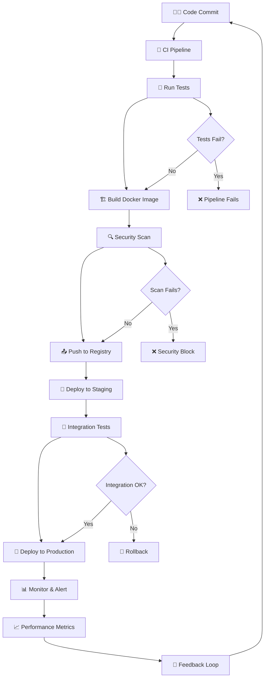

## Docker Ecosystem

```mermaid
graph TD
    %% Define styles
    classDef coreClass fill:#e3f2fd,stroke:#1976d2,stroke-width:3px,color:#0d47a1
    classDef orchestrationClass fill:#f3e5f5,stroke:#7b1fa2,stroke-width:3px,color:#4a148c
    classDef developmentClass fill:#e8f5e8,stroke:#388e3c,stroke-width:3px,color:#1b5e20
    classDef cloudClass fill:#fff3e0,stroke:#f57c00,stroke-width:3px,color:#e65100
    classDef securityClass fill:#fce4ec,stroke:#c2185b,stroke-width:3px,color:#880e4f

    subgraph "🐳 Core Docker"
        DOCKER_ENGINE[🐳 Docker Engine]
        DOCKER_CLI[🐚 Docker CLI]
        DOCKER_COMPOSE[📄 Docker Compose]
        DOCKER_SWARM[🐙 Docker Swarm]
    end

    subgraph "🎭 Orchestration"
        KUBERNETES[☸️ Kubernetes]
        DOCKER_SWARM
        NOMAD[🏠 Nomad]
        MESOS[🏛️ Mesos]
    end

    subgraph "💻 Development Tools"
        DOCKER_DESKTOP[💻 Docker Desktop]
        VS_CODE[🛠️ VS Code Extensions]
        DEV_CONTAINERS[🏗️ Dev Containers]
        DOCKER_PLAYGROUND[🎮 Play with Docker]
    end

    subgraph "☁️ Cloud Integration"
        AWS_ECS[☁️ AWS ECS/Fargate]
        GCP_CLOUD_RUN[☁️ GCP Cloud Run]
        AZURE_ACI[☁️ Azure Container Instances]
        DIGITAL_OCEAN[☁️ DigitalOcean App Platform]
    end

    subgraph "🔒 Security & Scanning"
        DOCKER_BENCH[🔍 Docker Bench]
        CLAIR[🔎 Clair Scanner]
        AQUA_SECURITY[🛡️ Aqua Security]
        SYSDIG[📊 Sysdig Secure]
    end

    DOCKER_ENGINE --> DOCKER_CLI
    DOCKER_CLI --> DOCKER_COMPOSE
    DOCKER_COMPOSE --> DOCKER_SWARM

    DOCKER_SWARM --> KUBERNETES
    DOCKER_SWARM --> NOMAD
    DOCKER_SWARM --> MESOS

    DOCKER_ENGINE --> DOCKER_DESKTOP
    DOCKER_DESKTOP --> VS_CODE
    VS_CODE --> DEV_CONTAINERS
    DEV_CONTAINERS --> DOCKER_PLAYGROUND

    DOCKER_ENGINE --> AWS_ECS
    DOCKER_ENGINE --> GCP_CLOUD_RUN
    DOCKER_ENGINE --> AZURE_ACI
    DOCKER_ENGINE --> DIGITAL_OCEAN

    DOCKER_ENGINE --> DOCKER_BENCH
    DOCKER_ENGINE --> CLAIR
    DOCKER_ENGINE --> AQUA_SECURITY
    DOCKER_ENGINE --> SYSDIG

    %% Apply styles
    class DOCKER_ENGINE,DOCKER_CLI,DOCKER_COMPOSE,DOCKER_SWARM coreClass
    class KUBERNETES,NOMAD,MESOS orchestrationClass
    class DOCKER_DESKTOP,VS_CODE,DEV_CONTAINERS,DOCKER_PLAYGROUND developmentClass
    class AWS_ECS,GCP_CLOUD_RUN,AZURE_ACI,DIGITAL_OCEAN cloudClass
    class DOCKER_BENCH,CLAIR,AQUA_SECURITY,SYSDIG securityClass
```

## Performance Comparison

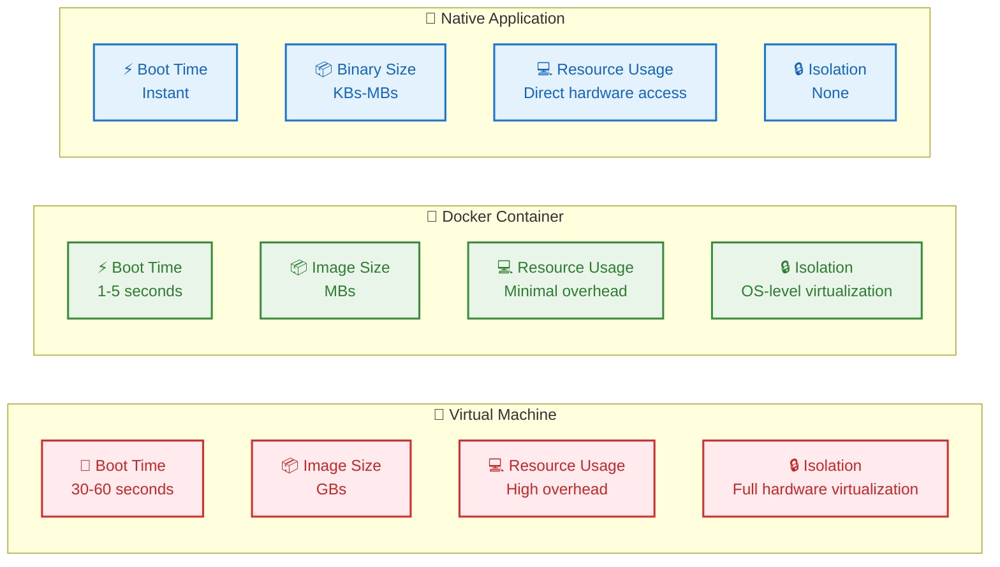

## Summary

Docker's visual architecture reveals a sophisticated yet elegant system for containerization. The layered approach ensures efficient resource utilization while maintaining strong isolation between applications. Understanding these visual relationships is crucial for effective Docker implementation and troubleshooting.

The ecosystem continues to evolve with better orchestration, security, and cloud integration, making Docker an essential tool in modern software development and deployment pipelines.
