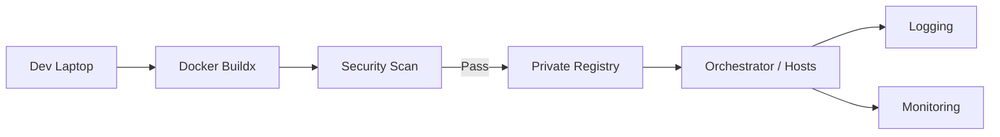

# Docker Guide – Basic → Architect

## Level 1 – Launch & Basics

### 1. Quick Setup
```bash
# Install Docker Engine (Linux)
curl -fsSL https://get.docker.com | sh
sudo usermod -aG docker $USER

# Verify
docker version
docker run hello-world
```

### 2. First Image & Container
```bash
# Build
cat > Dockerfile <<'EOF'
FROM alpine:3.19
CMD ["echo","hello docker"]
EOF
docker build -t hello-docker .

# Run
docker run --rm hello-docker
```

### 3. Core Concepts
- Images (layered, immutable), Containers (runtime), Registries (push/pull)
- Dockerfile instructions: FROM, RUN, COPY, CMD/ENTRYPOINT, ENV, EXPOSE
- Networking: bridge, host, none; Ports: `-p 8080:80`
- Volumes: `-v data:/var/lib/app`, bind mounts for local dev

## Level 2 – Production Patterns

### Multi-Stage Builds
```Dockerfile
FROM node:20-alpine AS build
WORKDIR /app
COPY package*.json .
RUN npm ci
COPY . .
RUN npm run build

FROM nginx:1.25-alpine
COPY --from=build /app/dist /usr/share/nginx/html
```

### Image Slimming & Caching
- Use alpine/distroless; remove build tooling; pin versions
- Order Dockerfile for cache reuse (deps before app code)
- `.dockerignore` to drop node_modules, tests, build artifacts

### Orchestrated Local Dev (Compose)
```yaml
version: "3.9"
services:
  api:
    build: .
    ports: ["8080:8080"]
    env_file: .env
    depends_on: [db]
  db:
    image: postgres:16-alpine
    volumes: [pgdata:/var/lib/postgresql/data]
volumes:
  pgdata:
```

## Level 3 – Architect Playbook

### Supply Chain & Security
- Scan: `docker scan` or `trivy image`
- SBOM: `syft image:tag`
- Sign: `cosign sign image:tag`
- Enforce non-root, drop capabilities, read-only FS

### Registries & Promotion
- Use private registries (ECR/GCR/ACR/GHCR)
- Immutable tags, digest pinning, signed manifests
- Promotion via tags: `dev -> stage -> prod`

### CI/CD Pattern
- Build, test, scan, push on PR/merge
- Multi-arch builds with `buildx`
- Cache: registry cache or GitHub Actions cache

## Ops Cheat Sheet

| Task | Command | Note |
| --- | --- | --- |
| List | `docker ps -a` | containers |
| Logs | `docker logs -f <c>` | tail |
| Shell | `docker exec -it <c> sh` | debug |
| Stats | `docker stats` | resources |
| Prune | `docker system prune -f` | cleanup |
| Inspect | `docker inspect <obj>` | metadata |

## Architecture Patterns



## Checklist Before Production
- [ ] Multi-stage build, slim base image, pinned versions
- [ ] Non-root user, minimal capabilities, read-only FS
- [ ] Healthcheck defined, sensible stop signal
- [ ] .dockerignore in place; build cache optimized
- [ ] Image scanned; SBOM generated; signature applied
- [ ] Tagged + pushed to private registry with immutability
- [ ] Runtime limits set (CPU/mem), logs stdout/stderr

## Learning Path Links
- Tracks: `LearningTracks/DevOps-Full/track.md`, `LearningTracks/Backend-GCP/track.md`
- Projects: `Projects/DevOps-Full/` and `Projects/GCP-Backend/`
- Mastery: `Mastery/Docker/` (quiz, scenarios, flashcards)

