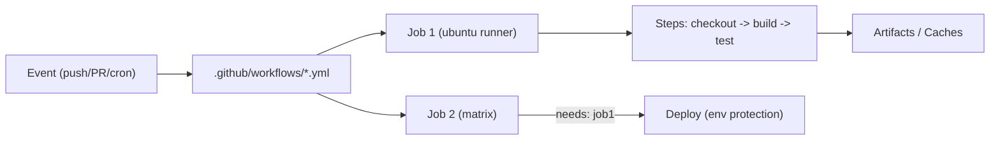

# GitHub Actions — Cheatsheet

## Architecture (30-second mental model)

Events trigger workflows. Workflows contain jobs that run on runners. Jobs contain steps (shell commands or marketplace actions). Jobs run in parallel by default; use `needs:` for sequencing.

## When to use vs alternatives

| Need | Use GitHub Actions | Not GitHub Actions |
|------|-------------------|-------------------|
| CI/CD tightly coupled to GitHub | GitHub Actions (native integration) | Jenkins (if multi-SCM) |
| Complex pipelines with DAG orchestration | GitLab CI (better DAG/rules) | GitHub Actions (limited DAG) |
| Self-hosted with full control | Jenkins/Drone (mature self-host) | GitHub Actions (runner mgmt overhead) |
| Simple open-source CI | GitHub Actions (free for public repos) | CircleCI (paid minutes add up) |
| Cloud-native deploy with OIDC | GitHub Actions (native OIDC support) | Jenkins (plugin sprawl for OIDC) |

## 5 things you always forget

1. `actions/checkout` only fetches a single commit by default -- for `git diff` or changelogs you need `fetch-depth: 0`.
2. Secrets are not available in forked PR workflows by default -- use `pull_request_target` with extreme caution (code injection risk).
3. Matrix jobs share no state -- each gets a fresh runner. Passing data between matrix legs requires artifacts, not env vars.
4. `GITHUB_TOKEN` permissions default to read-only in forked repos; set explicit `permissions:` block per job for write access.
5. Pinning actions by tag (`@v4`) is convenient but insecure -- pin by commit SHA to prevent supply-chain attacks on mutable tags.

## Interview killer answer

> "We built a reusable workflow library with `workflow_call` that standardized build/test/deploy across 40+ microservices, cutting onboarding from days to a single YAML import. The key security win was switching from long-lived cloud credentials to OIDC federation with `id-token: write` permissions, eliminating stored secrets entirely. We also pinned all third-party actions by SHA after a dependency confusion incident where a typo-squatted action name almost made it into a PR."
