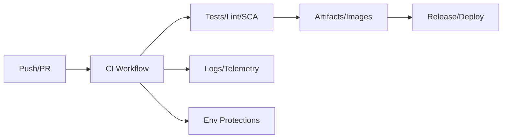

# GitHub Actions Guide – Basic → Architect

## Level 1 – Launch & Basics

### 1. First Workflow
```yaml
# .github/workflows/ci.yml
name: CI
on: [push, pull_request]
jobs:
  build:
    runs-on: ubuntu-latest
    steps:
      - uses: actions/checkout@v4
      - uses: actions/setup-node@v4
        with: { node-version: 20 }
      - run: npm ci
      - run: npm test -- --runInBand
```

### 2. Core Concepts
- Events (push, PR, schedule), jobs, steps, runners
- Marketplace actions; composite and Docker actions
- Secrets/vars; environments with protection rules

## Level 2 – Production Patterns

### Matrix & Caching
- Matrix builds for versions/os/arches
- Cache deps: `actions/cache@v4`; npm/yarn/pip/maven

### Reusable Workflows
```yaml
# .github/workflows/reusable-ci.yml
on: workflow_call:
  inputs:
    node-version: { required: true, type: string }
jobs:
  build:
    runs-on: ubuntu-latest
    steps:
      - uses: actions/checkout@v4
      - uses: actions/setup-node@v4
        with: { node-version: ${{ inputs.node-version }} }
      - run: npm ci && npm test
```

### Environments & Approvals
- Use environments for stage/prod; required reviewers
- Protected branches; required status checks

### Artifacts & Releases
- Upload artifacts: `actions/upload-artifact`
- Release pipelines: build → test → sign → publish

## Level 3 – Architect Playbook

### Security Hardening
- Least-privilege PATs; avoid GITHUB_TOKEN write where not needed
- Pin actions by commit SHA; avoid `@master`
- OIDC with cloud providers; short-lived creds
- Secret scanning and dependency review gates

### Self-Hosted Runners
- Isolate per team/app; autoscale; network controls
- Harden images; restrict repo access; ephemeral runners

### Compliance & Observability
- Required checks, branch protection, CODEOWNERS
- Audit logs; action allowlist/denylist
- Metrics: workflow duration, queue time, success rate

## Ops Cheat Sheet

| Task | Snippet | Note |
| --- | --- | --- |
| Cache npm | `uses: actions/cache@v4` with key on lockfile | speed |
| Matrix | `strategy: matrix: node: [18,20]` | coverage |
| Reuse | `workflow_call` | DRY |
| OIDC | `permissions: id-token: write` | cloud auth |
| Pin actions | `uses: org/action@<sha>` | supply chain |

## Architecture Patterns



## Checklist Before Production
- [ ] Pin all actions by SHA; no broad PATs; prefer OIDC
- [ ] Protected branches + required checks
- [ ] Secrets in repo/org; env protections for prod
- [ ] Reusable workflows; caching; matrix where needed
- [ ] Security scans: SAST/SCA/secret scan; license checks
- [ ] Self-hosted runners hardened/isolated if used

## Learning Path Links
- Track: `LearningTracks/DevOps-Full/track.md`
- Projects: `Projects/DevOps-Full/starter/04-github-actions-ci.md` and `Projects/Integrated/devops-full-capstone.md`
- Mastery: `Mastery/GitHubActions/` (quiz, scenarios, flashcards)

