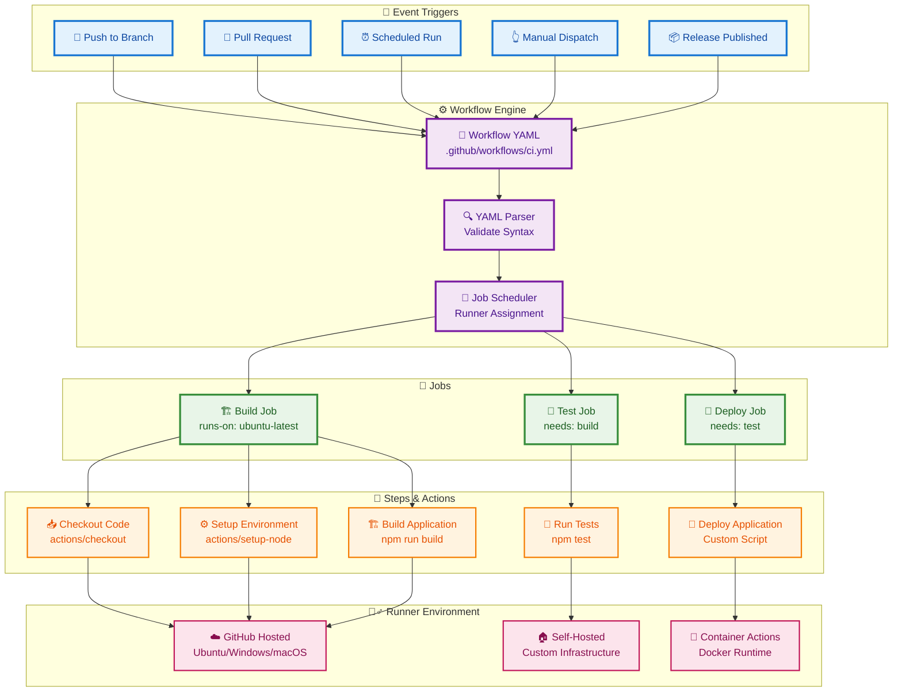
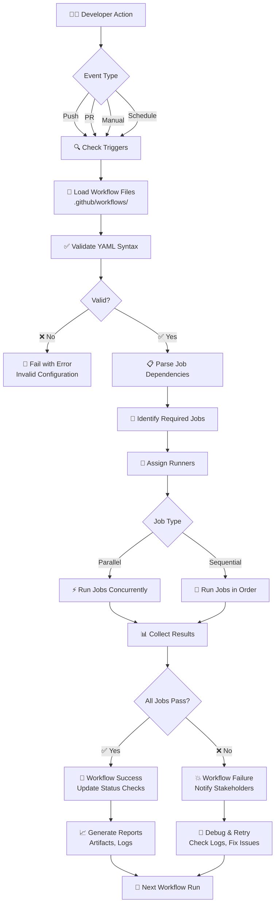
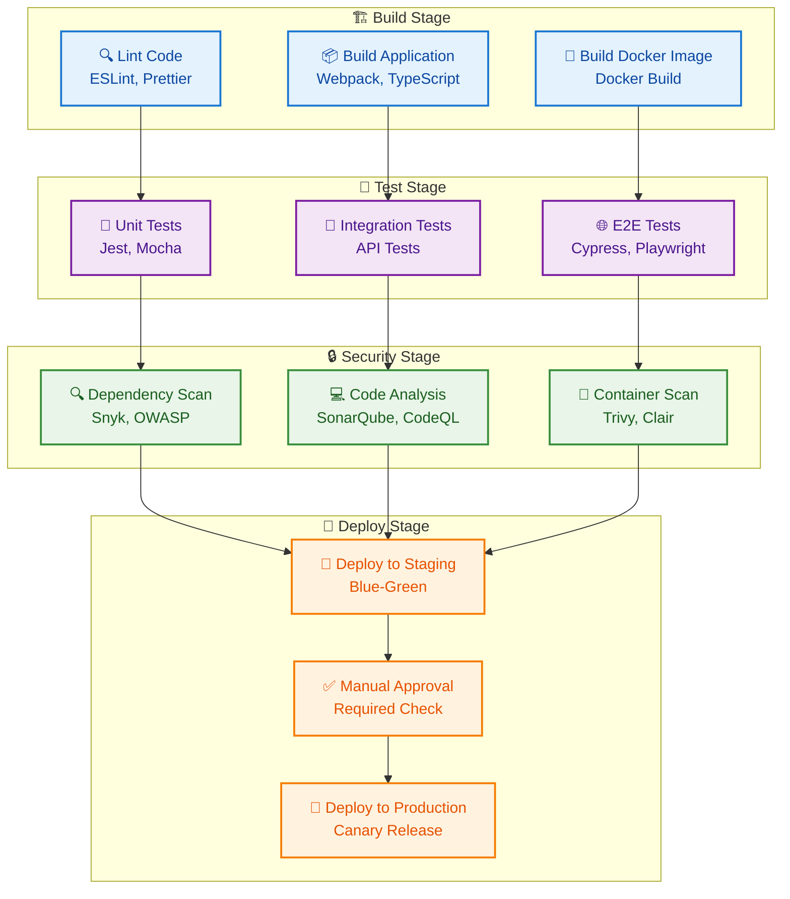
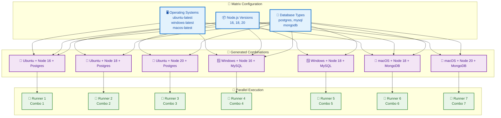
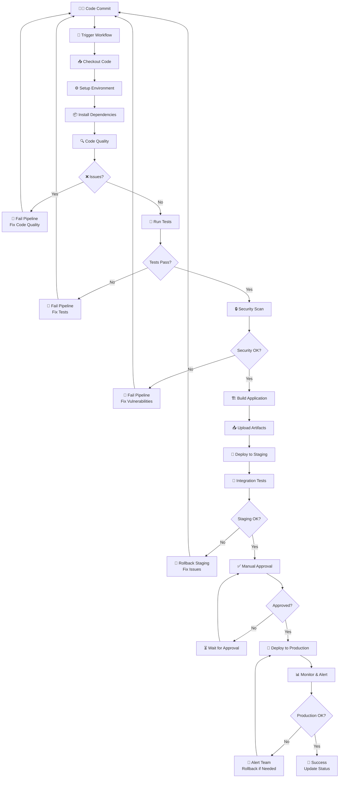
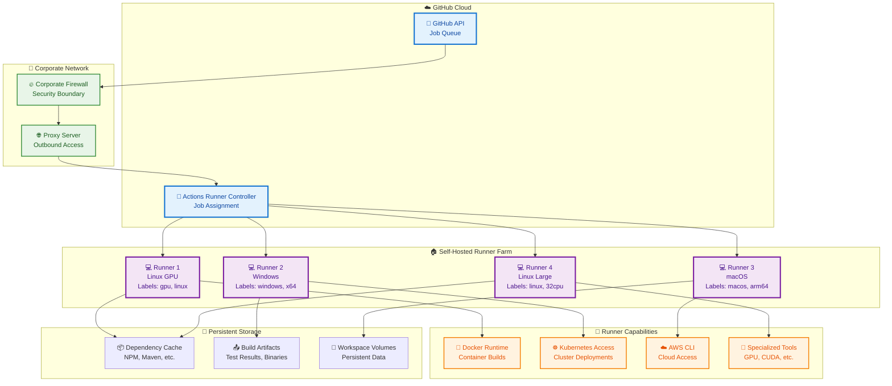
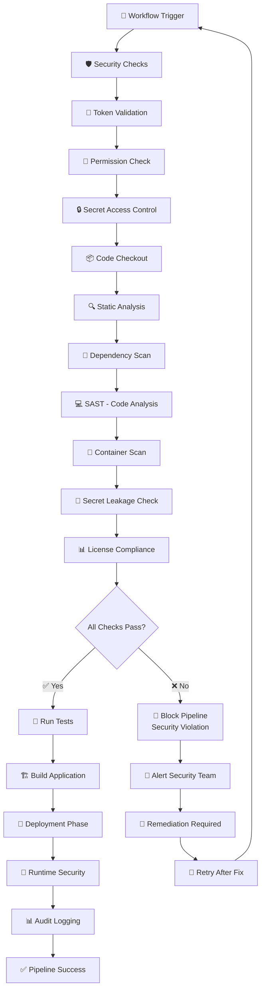
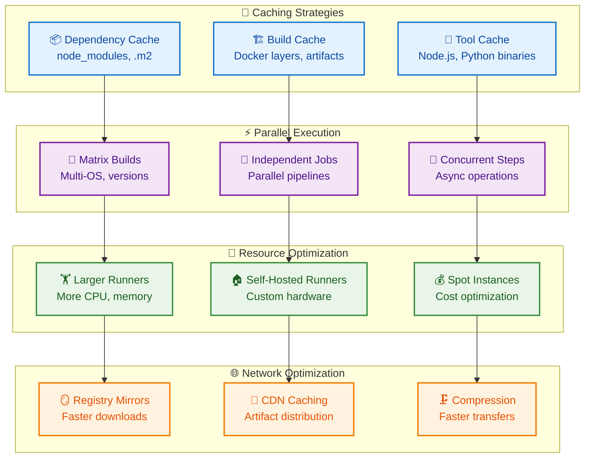
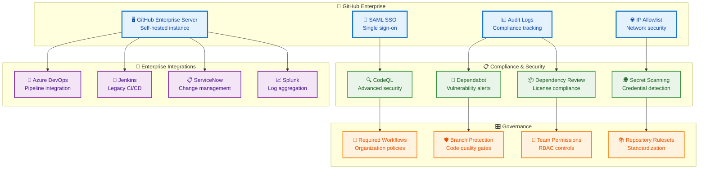

# GitHub Actions Visual Architecture Guide

## GitHub Actions Workflow Architecture



## Workflow Execution Flow



## Job Dependency Matrix



## Matrix Build Strategy



## Context and Environment Flow

```mermaid
graph TD
    %% Define styles
    classDef contextClass fill:#e3f2fd,stroke:#1976d2,stroke-width:2px,color:#0d47a1
    classDef envClass fill:#f3e5f5,stroke:#7b1fa2,stroke-width:2px,color:#4a148c
    classDef secretClass fill:#e8f5e8,stroke:#388e3c,stroke-width:2px,color:#1b5e20
    classDef varClass fill:#fff3e0,stroke:#f57c00,stroke-width:2px,color:#e65100

    subgraph "📊 GitHub Context"
        REPO[📁 github.repository<br/>owner/repo]
        BRANCH[🌿 github.ref_name<br/>main, feature/x]
        SHA[🔗 github.sha<br/>commit-hash]
        ACTOR[👤 github.actor<br/>username]
        EVENT[🎯 github.event_name<br/>push, pull_request]
    end

    subgraph "🏃 Runner Context"
        OS[🖥️ runner.os<br/>Linux, Windows, macOS]
        ARCH[⚙️ runner.arch<br/>X64, ARM64]
        TEMP[📁 runner.temp<br/>/tmp/actions]
        TOOL[🔧 runner.tool_cache<br/>~/.cache]
    end

    subgraph "🔐 Secrets"
        REPO_SECRETS[🔑 Repository Secrets<br/>API keys, passwords]
        ENV_SECRETS[🔒 Environment Secrets<br/>Scoped to env]
        ORG_SECRETS[🏢 Organization Secrets<br/>All repos]
    end

    subgraph "📝 Variables"
        REPO_VARS[🏷️ Repository Variables<br/>Config values]
        ENV_VARS[🌍 Environment Variables<br/>env: NODE_ENV]
        ORG_VARS[🏢 Organization Variables<br/>Shared config]
    end

    subgraph "🔄 Workflow Usage"
        STEP1[📝 Step 1<br/>${{ github.actor }}]
        STEP2[🔧 Step 2<br/>${{ secrets.API_KEY }}]
        STEP3[⚙️ Step 3<br/>${{ vars.CONFIG }}]
        STEP4[🌍 Step 4<br/>${{ env.NODE_ENV }}]
    end

    REPO --> STEP1
    BRANCH --> STEP1
    SHA --> STEP1
    ACTOR --> STEP1
    EVENT --> STEP1

    OS --> STEP4
    ARCH --> STEP4
    TEMP --> STEP4
    TOOL --> STEP4

    REPO_SECRETS --> STEP2
    ENV_SECRETS --> STEP2
    ORG_SECRETS --> STEP2

    REPO_VARS --> STEP3
    ENV_VARS --> STEP3
    ORG_VARS --> STEP3

    %% Apply styles
    class REPO,BRANCH,SHA,ACTOR,EVENT contextClass
    class OS,ARCH,TEMP,TOOL envClass
    class REPO_SECRETS,ENV_SECRETS,ORG_SECRETS secretClass
    class REPO_VARS,ENV_VARS,ORG_VARS varClass
```

## CI/CD Pipeline Architecture



## Self-Hosted Runner Architecture



## Action Marketplace Ecosystem

```mermaid
graph TD
    %% Define styles
    classDef officialClass fill:#e3f2fd,stroke:#1976d2,stroke-width:3px,color:#0d47a1
    classDef verifiedClass fill:#f3e5f5,stroke:#7b1fa2,stroke-width:2px,color:#4a148c
    classDef communityClass fill:#e8f5e8,stroke:#388e3c,stroke-width:2px,color:#1b5e20
    classDef customClass fill:#fff3e0,stroke:#f57c00,stroke-width:2px,color:#e65100

    subgraph "🏢 Official Actions"
        CHECKOUT[📥 actions/checkout<br/>Code Checkout]
        SETUP_NODE[📦 actions/setup-node<br/>Node.js Setup]
        UPLOAD_ARTIFACT[📤 actions/upload-artifact<br/>Artifact Upload]
        CACHE[💾 actions/cache<br/>Dependency Cache]
    end

    subgraph "✅ Verified Actions"
        CODECOV[📊 codecov/codecov-action<br/>Coverage Reports]
        DOCKER_BUILD[🐳 docker/build-push-action<br/>Docker Builds]
        AWS_CONFIGURE[☁️ aws-actions/configure-aws-credentials<br/>AWS Auth]
        GCLOUD_SETUP[☁️ google-github-actions/setup-gcloud<br/>GCP Auth]
    end

    subgraph "👥 Community Actions"
        SUPER_LINTER[🔍 github/super-linter/slim<br/>Code Linting]
        SEMANTIC_RELEASE[📦 cycjimmy/semantic-release-action<br/>Version Release]
        SLACK_NOTIFY[💬 8398a7/action-slack-notify<br/>Slack Notifications]
        DEPLOY_TO_GH_PAGES[📄 peaceiris/actions-gh-pages<br/>GitHub Pages Deploy]
    end

    subgraph "🏗️ Custom Actions"
        INTERNAL_LINTER[🏢 myorg/internal-linter<br/>Company Standards]
        DEPLOY_TO_K8S[☸️ myorg/k8s-deploy<br/>Kubernetes Deploy]
        SECURITY_SCAN[🔒 myorg/security-scan<br/>Custom Security]
        NOTIFICATION[📢 myorg/notify-teams<br/>Team Notifications]
    end

    subgraph "📚 Action Types"
        JAVASCRIPT[📜 JavaScript Actions<br/>Node.js Runtime]
        DOCKER_ACTIONS[🐳 Docker Actions<br/>Container Runtime]
        COMPOSITE[🔧 Composite Actions<br/>YAML Steps]
    end

    CHECKOUT --> JAVASCRIPT
    SETUP_NODE --> JAVASCRIPT
    UPLOAD_ARTIFACT --> JAVASCRIPT
    CACHE --> JAVASCRIPT

    CODECOV --> DOCKER_ACTIONS
    DOCKER_BUILD --> DOCKER_ACTIONS
    AWS_CONFIGURE --> JAVASCRIPT
    GCLOUD_SETUP --> JAVASCRIPT

    SUPER_LINTER --> DOCKER_ACTIONS
    SEMANTIC_RELEASE --> JAVASCRIPT
    SLACK_NOTIFY --> JAVASCRIPT
    DEPLOY_TO_GH_PAGES --> JAVASCRIPT

    INTERNAL_LINTER --> COMPOSITE
    DEPLOY_TO_K8S --> DOCKER_ACTIONS
    SECURITY_SCAN --> JAVASCRIPT
    NOTIFICATION --> JAVASCRIPT

    %% Apply styles
    class CHECKOUT,SETUP_NODE,UPLOAD_ARTIFACT,CACHE officialClass
    class CODECOV,DOCKER_BUILD,AWS_CONFIGURE,GCLOUD_SETUP verifiedClass
    class SUPER_LINTER,SEMANTIC_RELEASE,SLACK_NOTIFY,DEPLOY_TO_GH_PAGES communityClass
    class INTERNAL_LINTER,DEPLOY_TO_K8S,SECURITY_SCAN,NOTIFICATION customClass
```



## Security and Compliance Flow



## Performance Optimization



## Enterprise Integration



## Summary

GitHub Actions' visual architecture reveals a sophisticated, event-driven CI/CD platform deeply integrated with the GitHub ecosystem. The workflow-as-code approach, combined with a rich marketplace of reusable actions and flexible execution environments, enables comprehensive automation of software development lifecycles.

Key visual insights:
- **Event-driven architecture**: Triggers initiate workflow execution
- **Hierarchical structure**: Workflows → Jobs → Steps → Actions
- **Parallel processing**: Matrix strategies and job dependencies
- **Context awareness**: Rich metadata for conditional logic
- **Extensible ecosystem**: Marketplace actions and custom development
- **Security integration**: Secrets, permissions, and compliance
- **Enterprise readiness**: Governance, audit, and integration capabilities

Understanding these visual relationships is crucial for designing efficient, maintainable CI/CD pipelines that scale with development teams and organizations.
