# Jenkins Visual Architecture and Diagrams

## Overview

This document provides visual representations of Jenkins architecture, workflows, and integration patterns using Mermaid diagrams.

## Core Architecture

### Jenkins Master-Agent Architecture

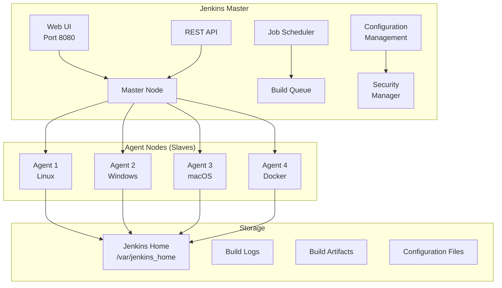

### Jenkins Pipeline Flow

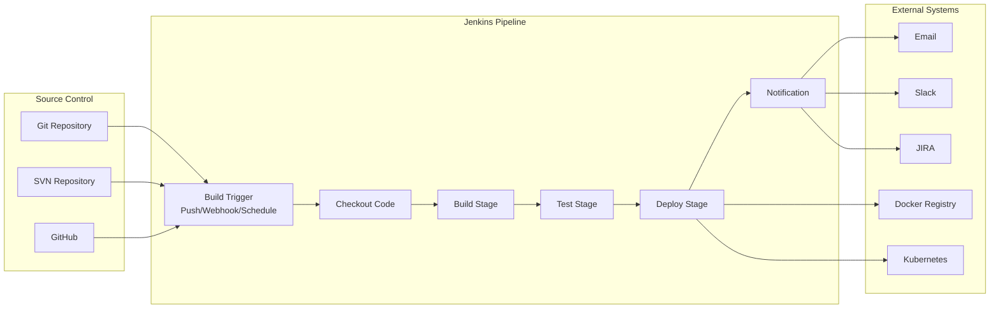

## Pipeline Types

### Declarative Pipeline Structure

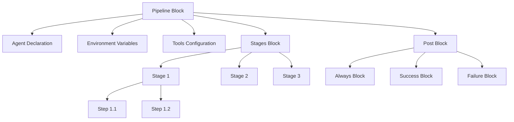

### Scripted Pipeline Flow

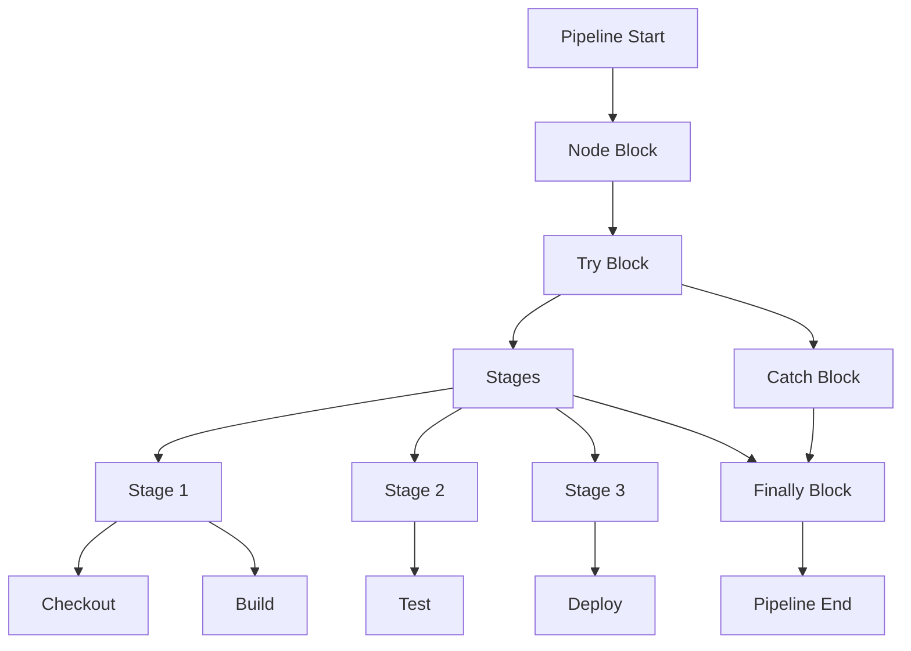

## CI/CD Workflow Patterns

### Basic CI Pipeline

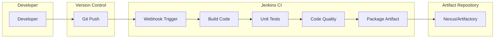

### Full CI/CD Pipeline

```mermaid
graph LR
    subgraph "Development"
        Code[Code Changes]
        Commit[Git Commit]
    end

    subgraph "Continuous Integration"
        Build[Build]
        UnitTest[Unit Tests]
        IntegrationTest[Integration Tests]
        CodeQuality[Code Quality<br/>SonarQube]
        SecurityScan[Security Scan]
    end

    subgraph "Artifact Management"
        Artifact[Build Artifact]
        Store[Store in Repository]
    end

    subgraph "Continuous Delivery"
        DeployStaging[Deploy to Staging]
        SmokeTest[Smoke Tests]
        UAT[User Acceptance<br/>Testing]
    end

    subgraph "Continuous Deployment"
        DeployProd[Deploy to Production]
        Monitor[Monitor & Alert]
        Rollback[Rollback Plan]
    end

    Code --> Commit
    Commit --> Build
    Build --> UnitTest
    UnitTest --> IntegrationTest
    IntegrationTest --> CodeQuality
    CodeQuality --> SecurityScan
    SecurityScan --> Artifact
    Artifact --> Store
    Store --> DeployStaging
    DeployStaging --> SmokeTest
    SmokeTest --> UAT
    UAT --> DeployProd
    DeployProd --> Monitor
    Monitor --> Rollback
```

## Integration Architectures

### Jenkins with Kubernetes

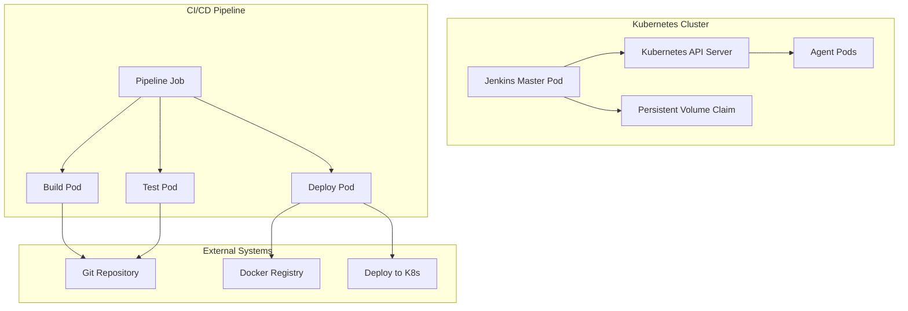

### Jenkins with Docker

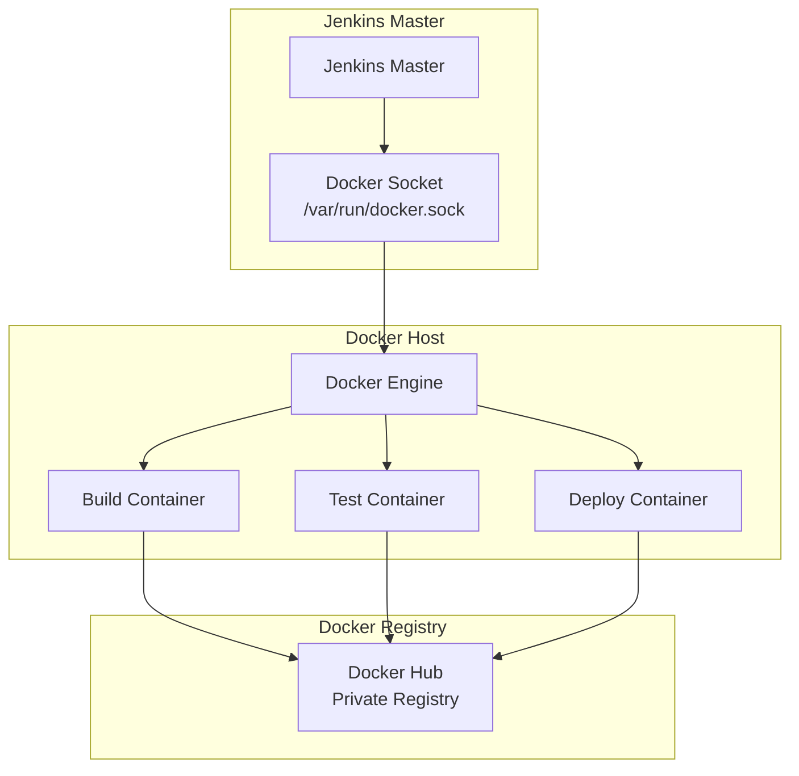

## Security Architecture

### Authentication and Authorization

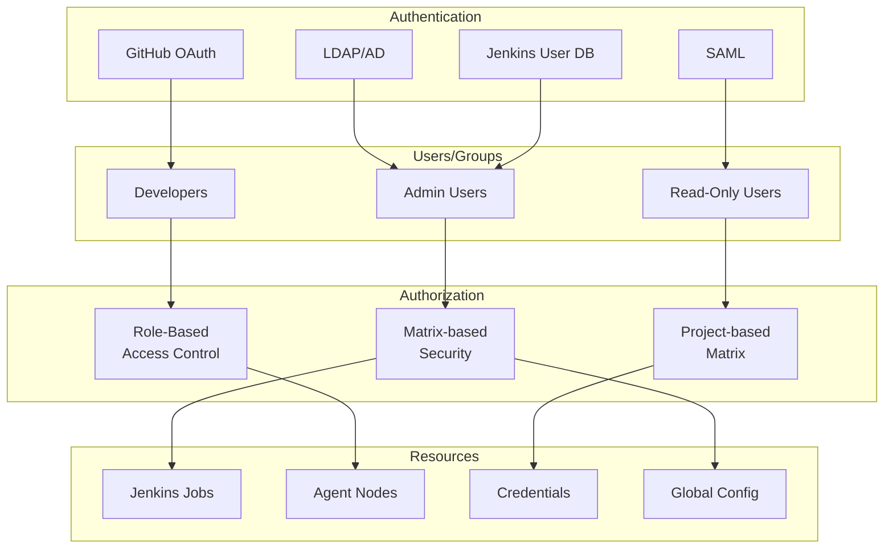

### Credential Management

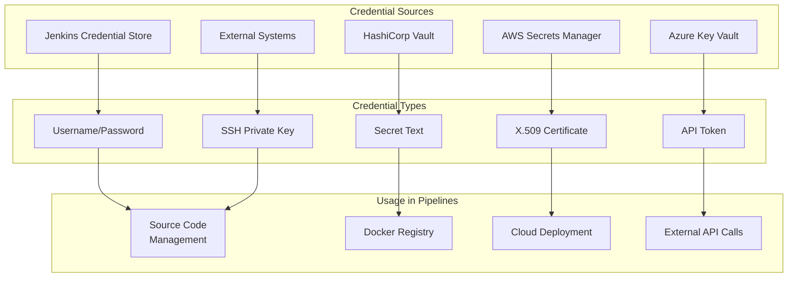

## Distributed Build Architecture

### Master-Agent Communication

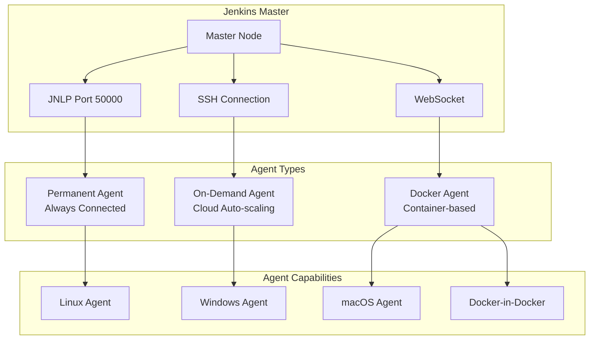

### Load Balancing and Scaling

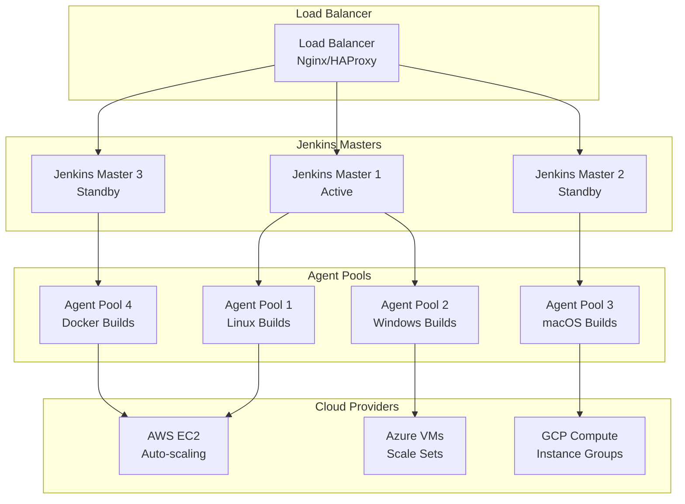

## Plugin Architecture

### Plugin Ecosystem

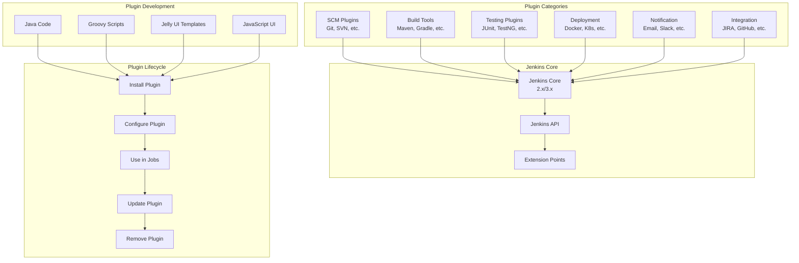

## Monitoring and Observability

### Jenkins Monitoring Dashboard

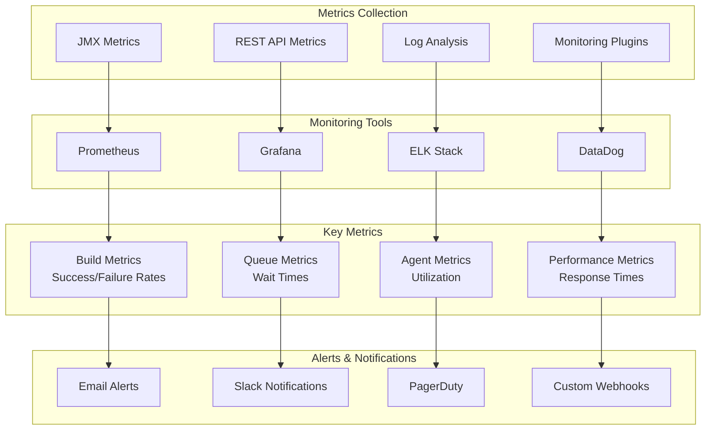

## Backup and Recovery

### Backup Strategy

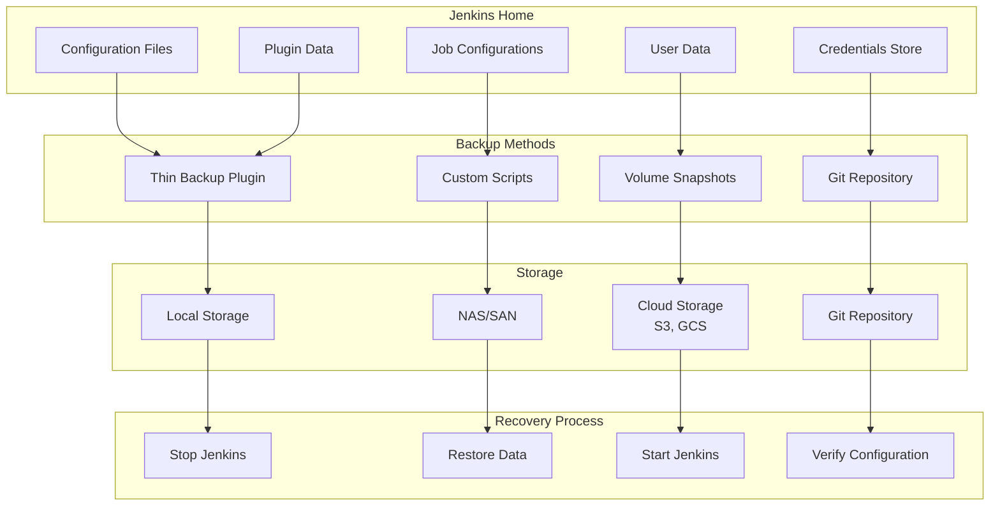

## High Availability Setup

### Active-Passive HA

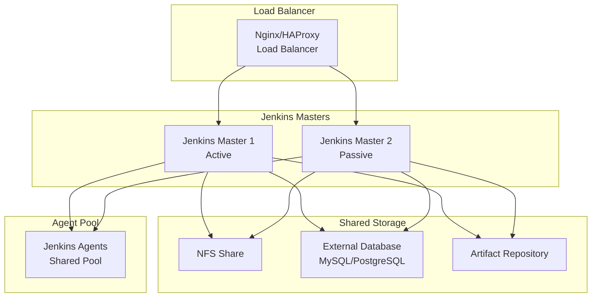

## Performance Optimization

### Caching Strategies

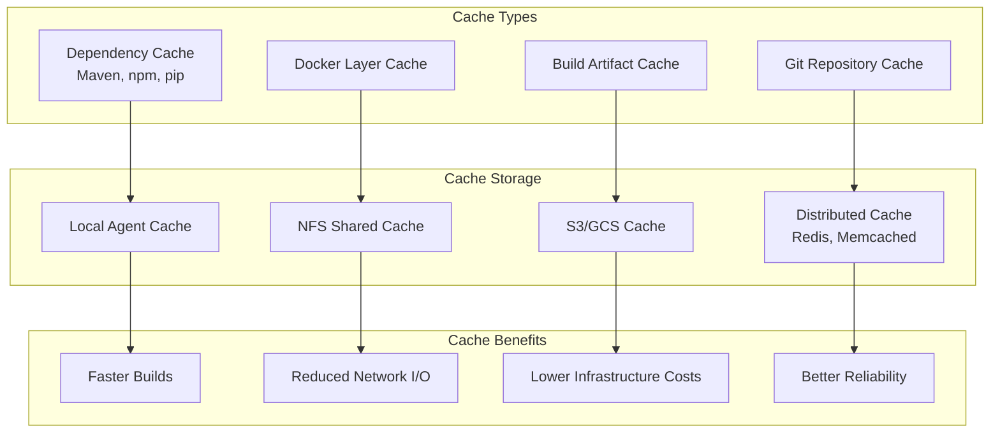

## Troubleshooting Flowcharts

### Build Failure Diagnosis

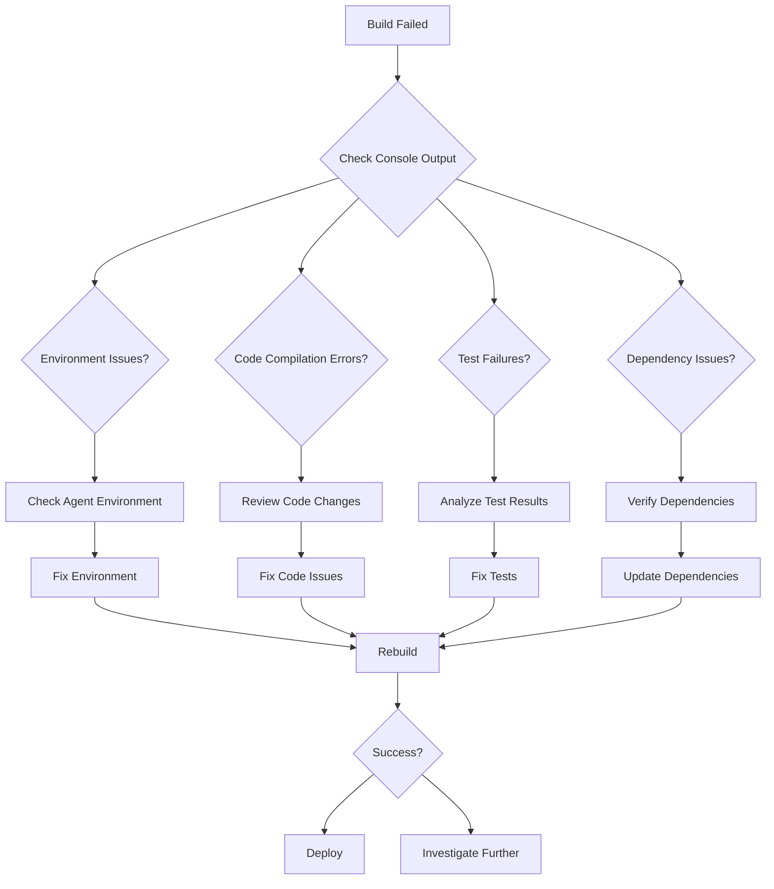

### Performance Issue Resolution

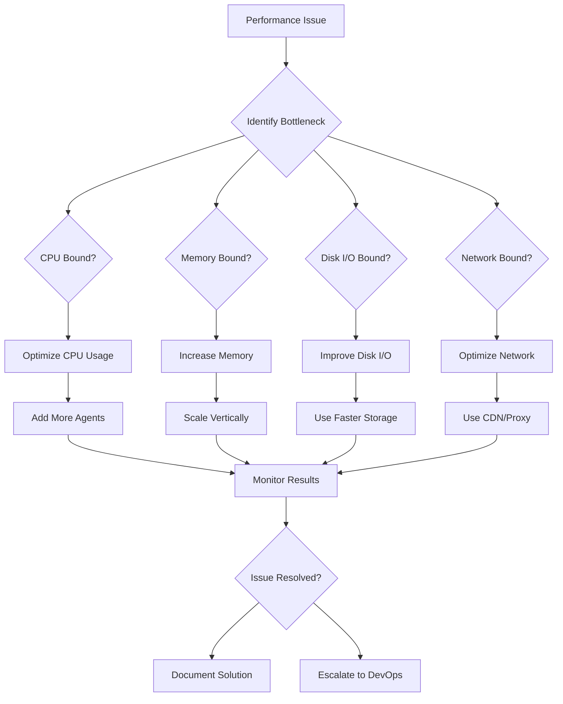

## Summary

These diagrams illustrate the key architectural patterns and workflows in Jenkins:

1. **Master-Agent Architecture**: Distributed build execution
2. **Pipeline Flows**: Declarative and scripted pipeline structures
3. **CI/CD Patterns**: Complete software delivery workflows
4. **Integration Architectures**: Connections with external systems
5. **Security Models**: Authentication, authorization, and credential management
6. **Scaling Strategies**: Load balancing and auto-scaling
7. **Monitoring**: Observability and alerting
8. **Backup/Recovery**: Data protection and disaster recovery
9. **High Availability**: Fault-tolerant deployments
10. **Performance**: Optimization and caching strategies

These visual representations help understand how Jenkins components interact and how to design robust CI/CD pipelines.
