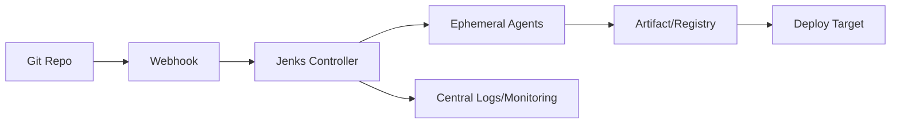

# Jenkins Guide – Basic → Architect

## Level 1 – Launch & Basics

### 1. Quick Setup
```bash
docker run -d --name jenkins -p 8080:8080 -p 50000:50000 jenkins/jenkins:lts
docker logs jenkins | grep "Please use the following password"
```

### 2. First Pipeline
```groovy
pipeline {
  agent any
  stages {
    stage('Build') { steps { sh 'echo build' } }
    stage('Test')  { steps { sh 'echo test' } }
  }
}
```

### 3. Core Concepts
- Controllers/agents, executors, workspace
- Freestyle vs Pipeline (declarative/scripted)
- Credentials store, artifacts, parameters, triggers

## Level 2 – Production Patterns

### Agents & Scaling
- Use dedicated agents (Docker, Kubernetes, static VMs)
- Labels for workload placement; ephemeral agents for isolation

### Pipelines as Code
- Declarative Jenkinsfile in repo; multibranch pipelines
- Shared libraries for reusable steps

### Credentials & Secrets
- Store in Jenkins credentials; scope per folder
- Integrate with vault/secret managers; never echo secrets

### CI/CD Hygiene
- Parallel stages; post actions (always/success/failure)
- Caching strategy; artifact retention; workspace cleanup

## Level 3 – Architect Playbook

### Security Hardening
- RBAC with folders; disable script approvals where possible
- HTTPS, reverse proxy, restrict admin; audit logs on
- Plugin minimalism; keep LTS updated; backup strategy

### High Availability & DR
- Controller backup (Jenkins home), config-as-code
- Externalize state: artifacts to object storage, logs central
- Controller warm standby or blue/green controllers

### Compliance & Quality Gates
- Enforce code scanning, test coverage, license checks
- Promotion pipelines (dev→stage→prod) with approvals

## Ops Cheat Sheet

| Task | Command/Path | Note |
| --- | --- | --- |
| Logs | `docker logs -f jenkins` | container logs |
| CLI  | `java -jar jenkins-cli.jar -s URL ...` | admin ops |
| Plugins | Manage Jenkins → Plugins | keep minimal |
| Reload | Manage Jenkins → Reload Config | from disk |
| Backup | Snapshot JENKINS_HOME | config/state |

## Architecture Patterns



## Checklist Before Production
- [ ] Jenkinsfile per repo; multibranch pipelines
- [ ] Minimal plugins; LTS version; HTTPS enabled
- [ ] RBAC + folder-level isolation; audit logs on
- [ ] Secrets in credentials store/vault; masking enabled
- [ ] Agents isolated/ephemeral; labels enforced
- [ ] Backups and restore tested; config-as-code captured
- [ ] Quality gates in pipelines; artifact retention defined

## Learning Path Links
- Track: `LearningTracks/DevOps-Full/track.md`
- Projects: `Projects/DevOps-Full/starter/05-jenkins-pipeline.md` and `Projects/Integrated/devops-full-capstone.md`
- Mastery: `Mastery/Jenkins/` (quiz, scenarios, flashcards)

