# Kubernetes Visual Architecture Guide

## Kubernetes Cluster Architecture

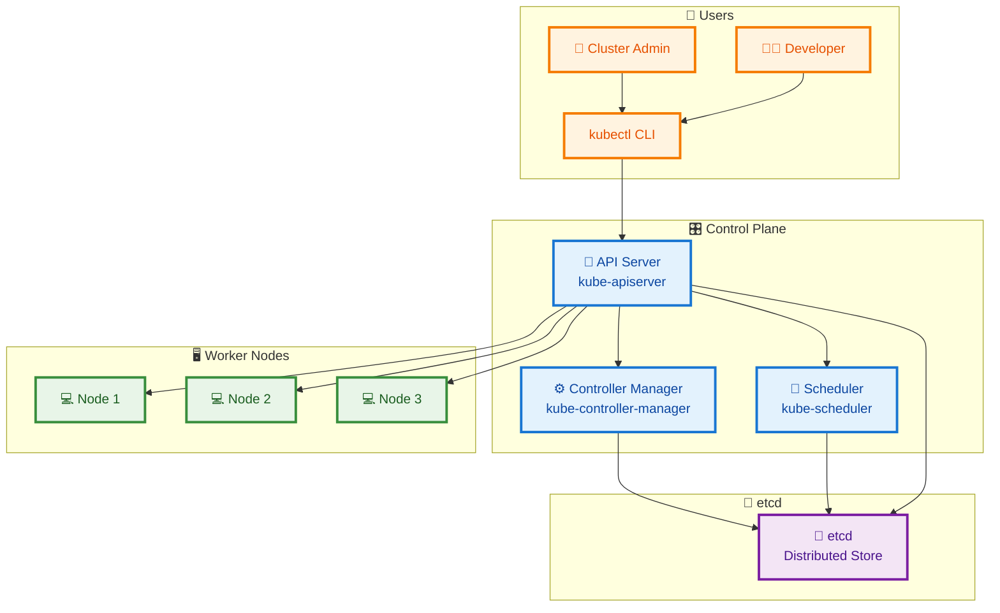

## Node Architecture

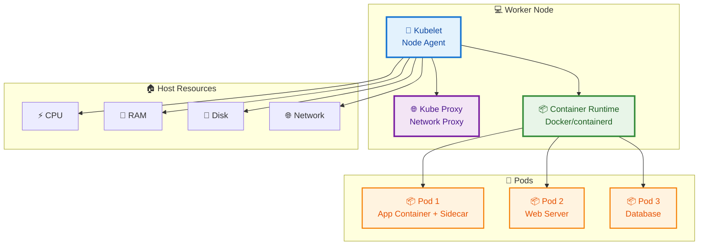

## Pod Architecture

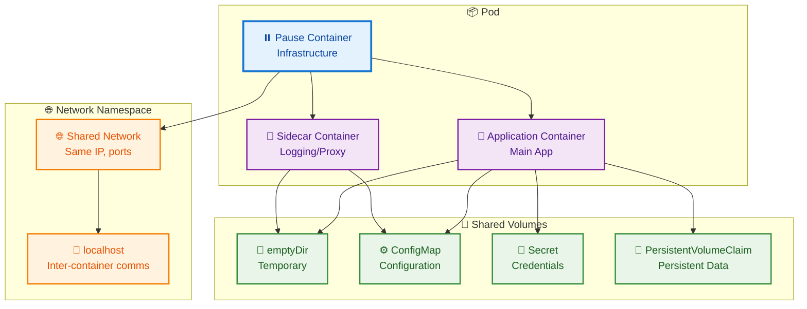

## Service Architecture

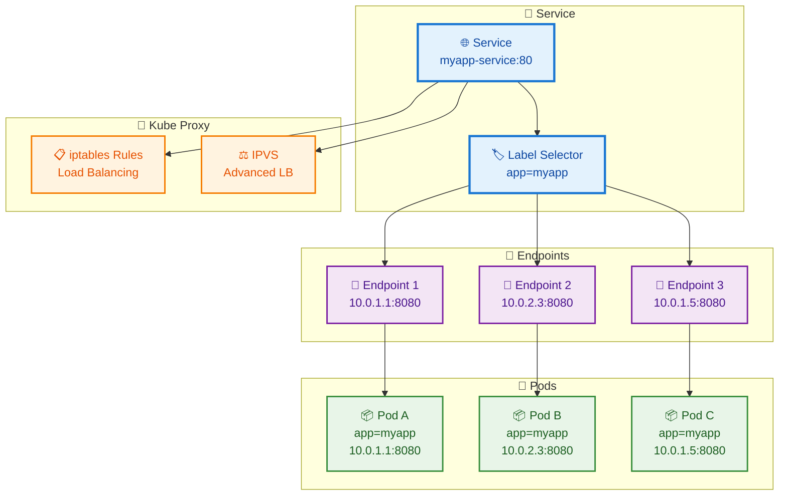

## Deployment Architecture

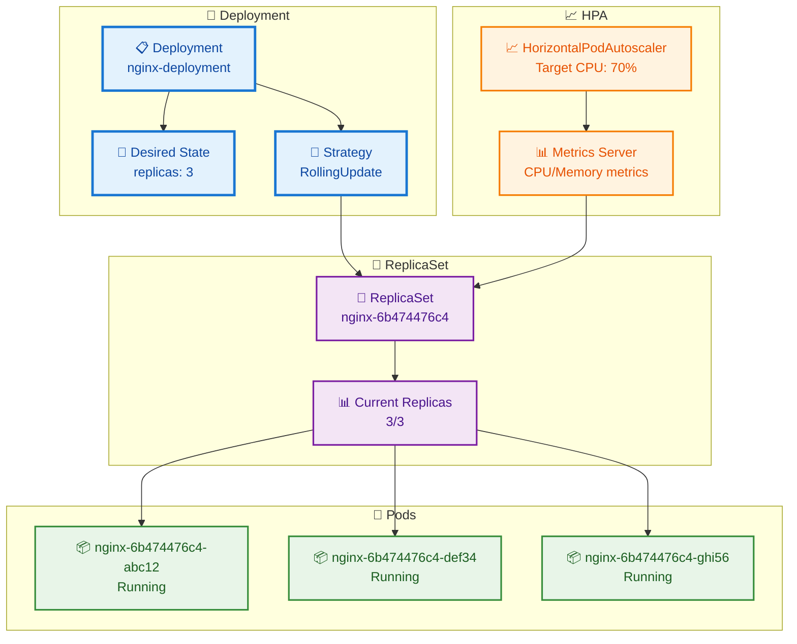

## Networking Model

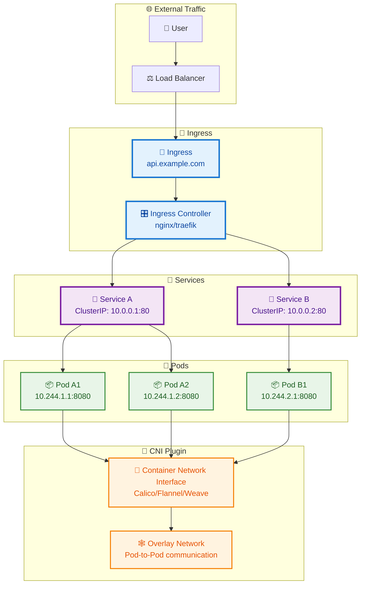

## Storage Architecture

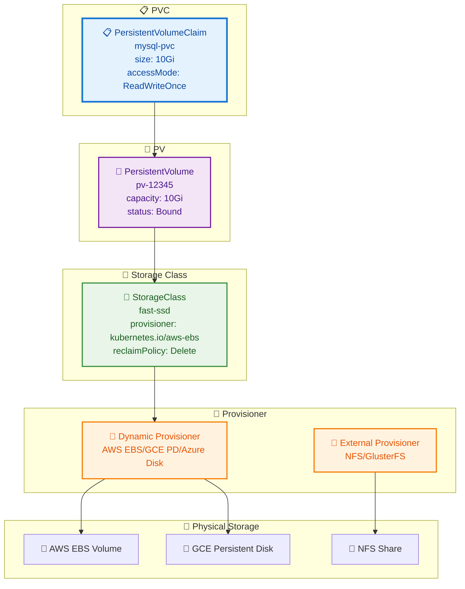

## RBAC Architecture

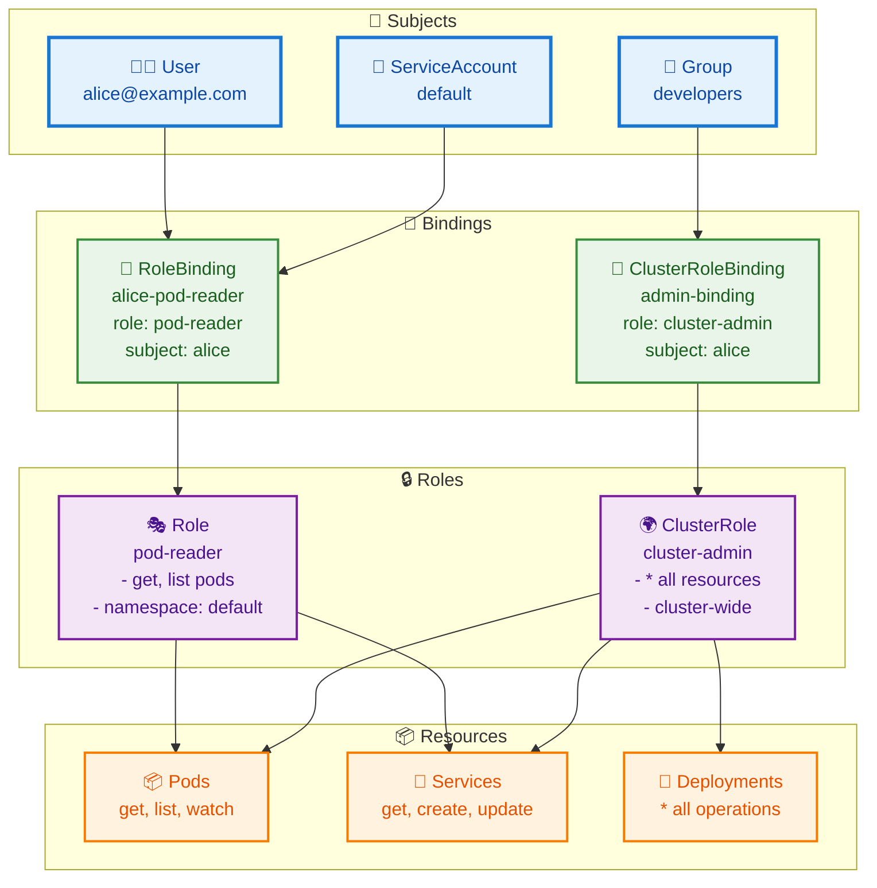

## Application Deployment Strategies

```mermaid
flowchart TD
    %% Define styles
    classDef strategyClass fill:#e3f2fd,stroke:#1976d2,stroke-width:3px,color:#0d47a1
    classDef deploymentClass fill:#f3e5f5,stroke:#7b1fa2,stroke-width:2px,color:#4a148c
    classDef trafficClass fill:#e8f5e8,stroke:#388e3c,stroke-width:2px,color:#1b5e20

    subgraph "🔄 Rolling Update"
        OLD_DEPLOY[🚀 v1 Deployment<br/>3 replicas]
        NEW_DEPLOY[🚀 v2 Deployment<br/>Gradual rollout]
        TRAFFIC[🚦 Traffic Split<br/>75% v1, 25% v2]
    end

    subgraph "🔵 Blue-Green"
        BLUE[🔵 Blue Environment<br/>v1 - stable]
        GREEN[🟢 Green Environment<br/>v2 - new]
        SWITCH[🔀 Traffic Switch<br/>Instant cutover]
    end

    subgraph "🐦 Canary"
        STABLE[🚀 Stable Release<br/>95% traffic]
        CANARY[🐦 Canary Release<br/>5% traffic]
        MONITOR[📊 Monitor Metrics<br/>Error rates, latency]
    end

    OLD_DEPLOY --> TRAFFIC
    TRAFFIC --> NEW_DEPLOY

    BLUE --> SWITCH
    SWITCH --> GREEN

    STABLE --> MONITOR
    MONITOR --> CANARY

    %% Apply styles
    class OLD_DEPLOY,NEW_DEPLOY,TRAFFIC strategyClass
    class BLUE,GREEN,SWITCH deploymentClass
    class STABLE,CANARY,MONITOR trafficClass
```

## Service Mesh Integration

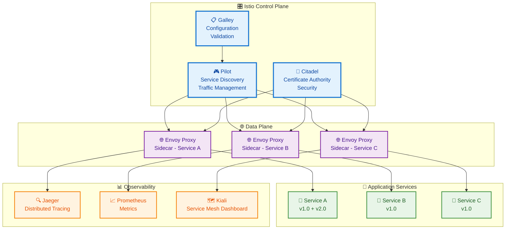

## Multi-Cluster Architecture

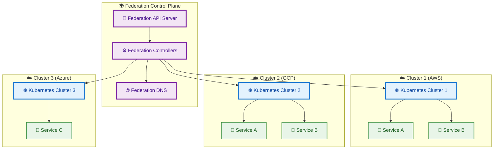

## CI/CD Pipeline with Kubernetes

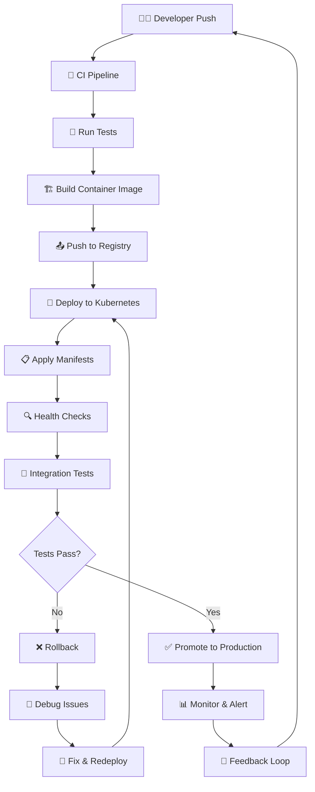

## Resource Management

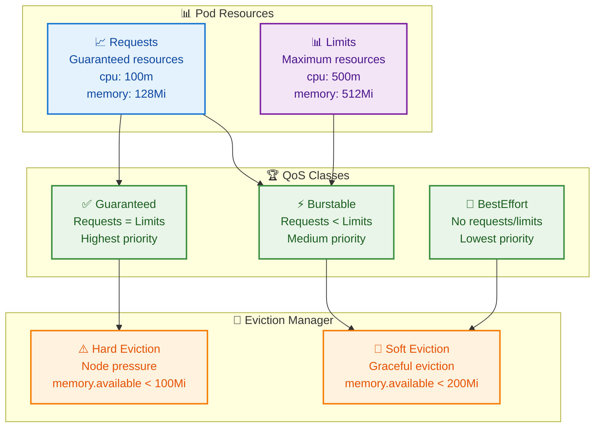

## Security Architecture

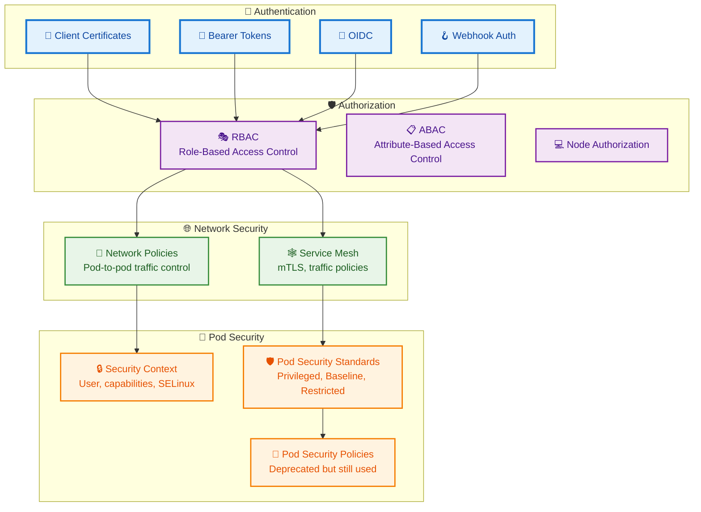

## Summary

Kubernetes' visual architecture reveals a sophisticated, layered system designed for scalability, reliability, and extensibility. The separation of control plane and data plane, combined with declarative configuration and extensive ecosystem integrations, makes Kubernetes the standard for modern application orchestration.

Key visual insights:
- **Hierarchical control**: API Server as central hub
- **Distributed storage**: etcd for cluster state
- **Pod-centric design**: Atomic deployment units
- **Service abstraction**: Stable networking endpoints
- **Extensible architecture**: CRDs and operators
- **Security layers**: Multi-level protection
- **Observability integration**: Comprehensive monitoring stack

Understanding these visual relationships is crucial for effective Kubernetes operations and troubleshooting.
