# Monitoring Visual Architecture and Diagrams

## Overview

This document provides visual representations of monitoring architectures, data flows, and observability patterns using Mermaid diagrams.

## Core Monitoring Architecture

### Three Pillars of Observability

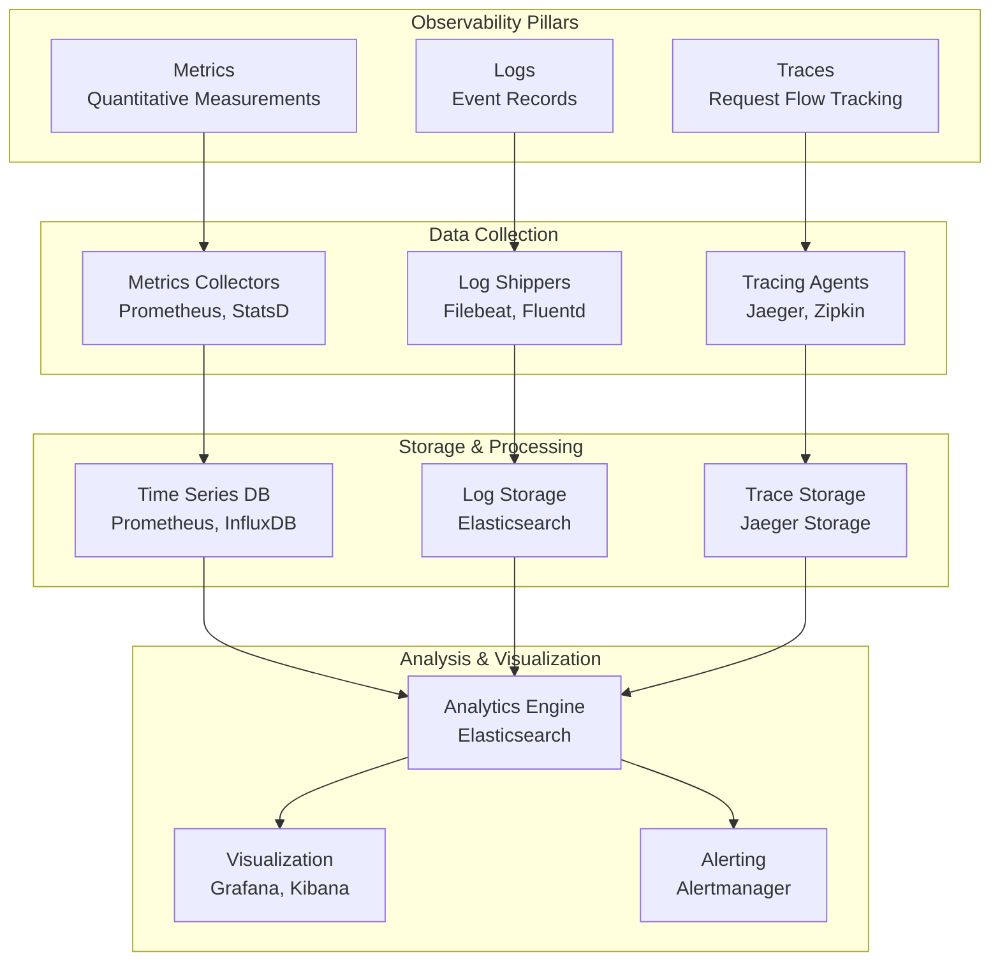

### Monitoring Data Flow

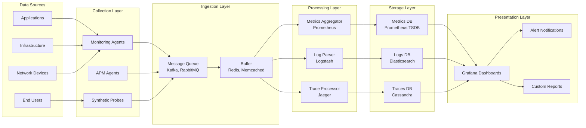

## Monitoring Patterns

### Push vs Pull Architecture

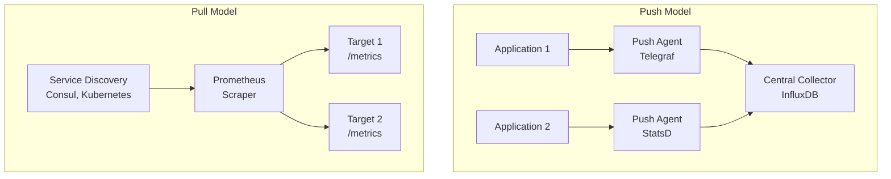

### Microservices Monitoring

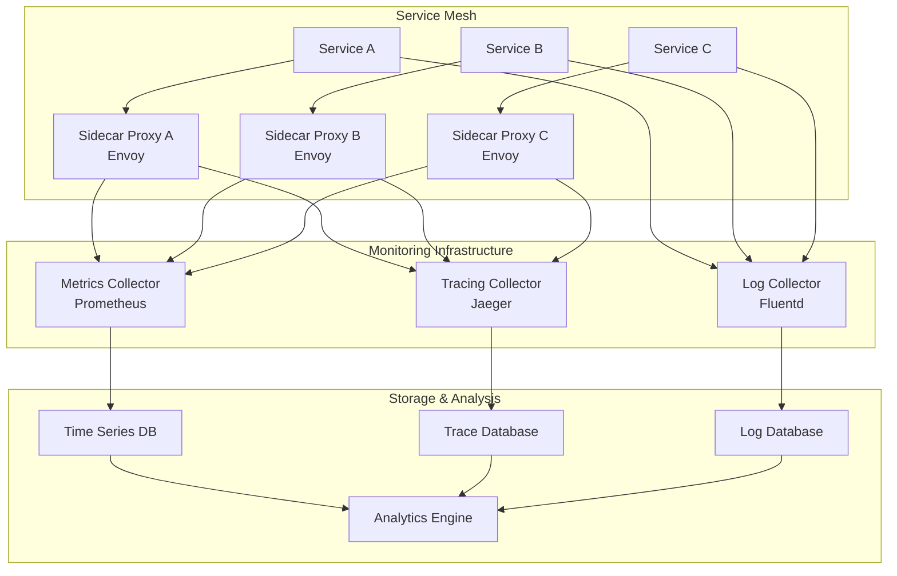

## Alerting Architecture

### Alerting Pipeline

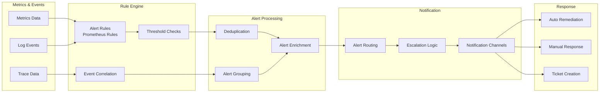

### Alert Lifecycle

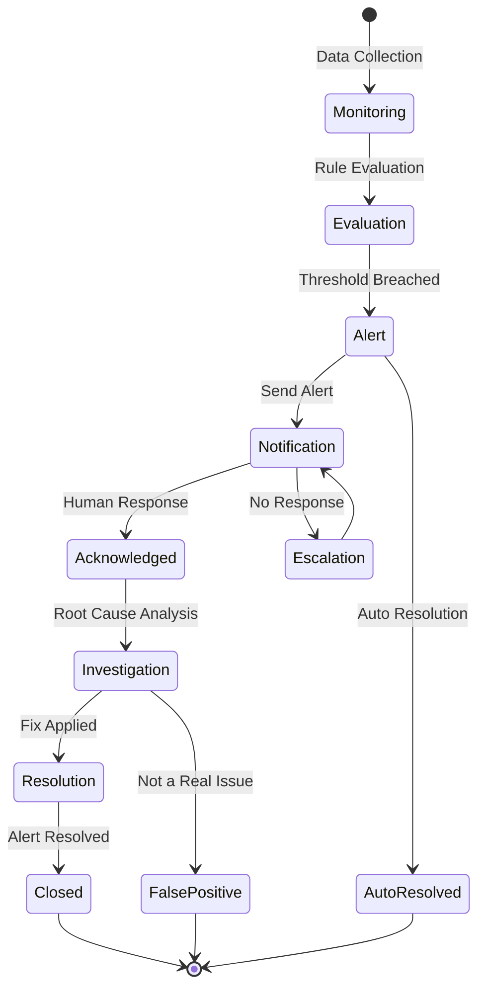

## Logging Architecture

### Centralized Logging

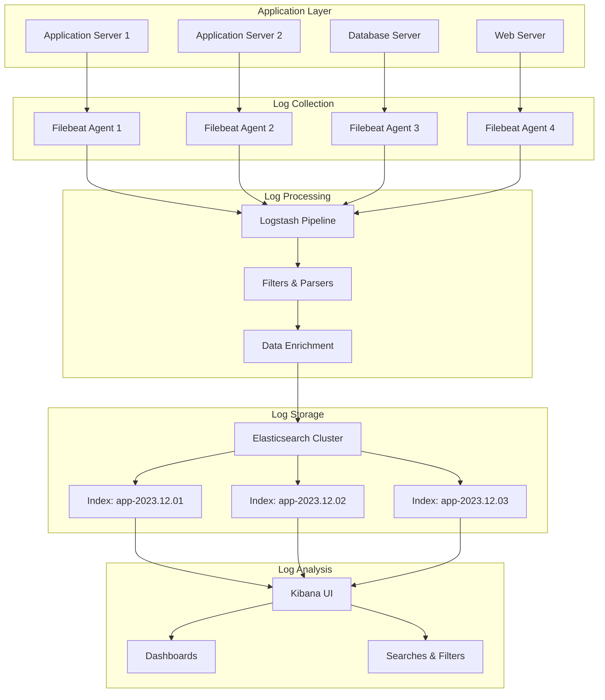

### Log Data Flow

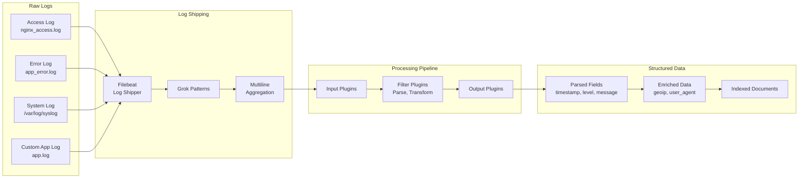

## Distributed Tracing

### Trace Data Flow

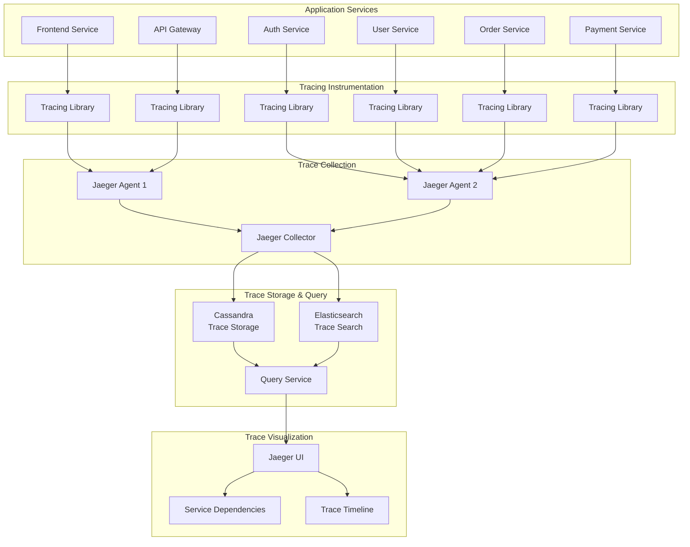

### Trace Span Hierarchy

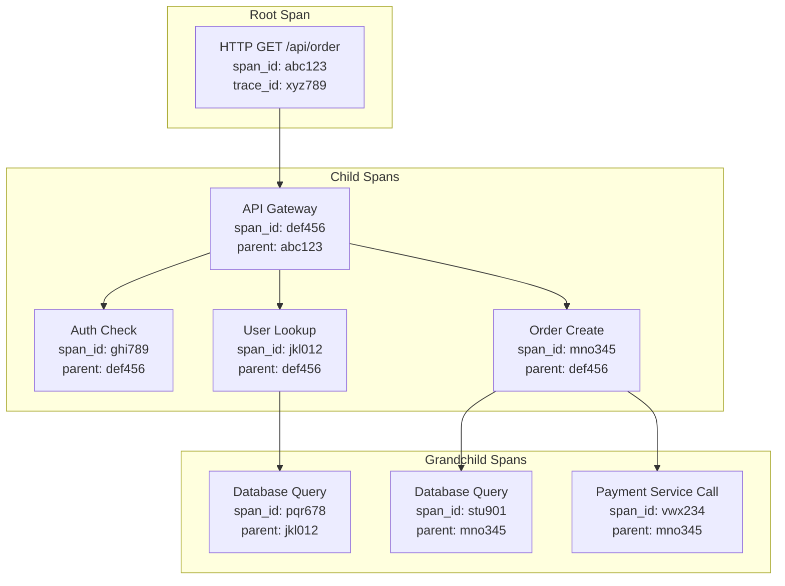

## Metrics Collection Patterns

### Prometheus Architecture

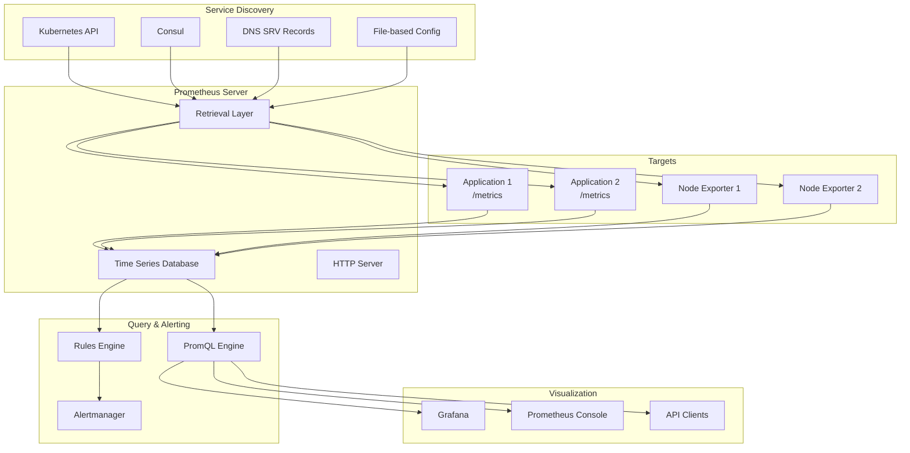

### Metrics Types Visualization

```mermaid
graph TD
    subgraph "Counter"
        C[Counter<br/>Monotonically Increasing]
        C1[Value: 0]
        C2[Value: 5<br/>+5 requests]
        C3[Value: 12<br/>+7 requests]
        C4[Value: 12<br/>No change]
    end

    subgraph "Gauge"
        G[Gauge<br/>Can Increase/Decrease]
        G1[Value: 75%]
        G2[Value: 85%<br/>+10%]
        G3[Value: 60%<br/>-25%]
        G4[Value: 90%<br/>+30%]
    end

    subgraph "Histogram"
        H[Histogram<br/>Value Distribution]
        H1[Observations: [1.2, 2.1, 0.8, 3.4]]
        H2[Buckets: 0-1s, 1-2s, 2-3s, 3s+]
        H3[Count: 4, Sum: 7.5]
    end

    subgraph "Summary"
        S[Summary<br/>Quantiles & Count]
        S1[Count: 100, Sum: 250.5]
        S2[0.5 quantile: 2.1s]
        S3[0.9 quantile: 4.5s]
        S4[0.99 quantile: 8.2s]
    end

    C1 --> C2 --> C3 --> C4
    G1 --> G2 --> G3 --> G4
    H1 --> H2 --> H3
    S1 --> S2 --> S3 --> S4
```

## Dashboard Design Patterns

### System Monitoring Dashboard

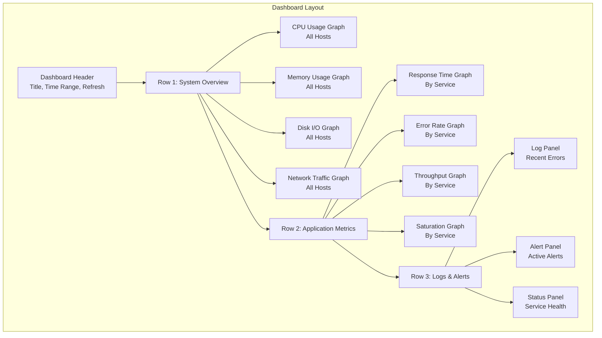

### Service Health Dashboard

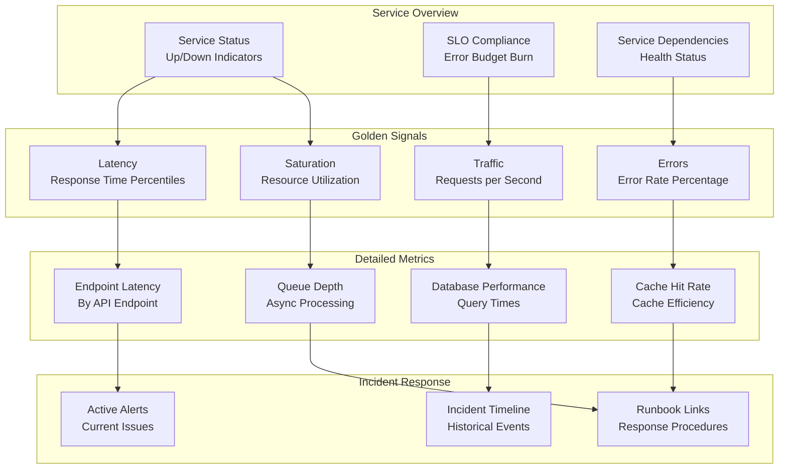

## Security Monitoring

### SIEM Architecture

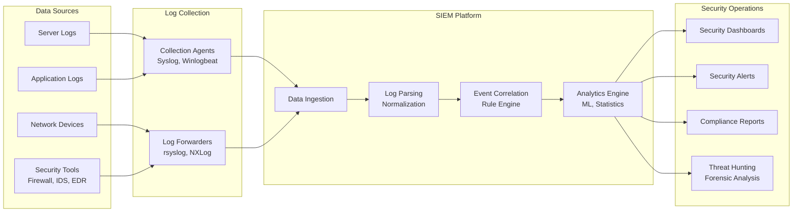

### Threat Detection Workflow

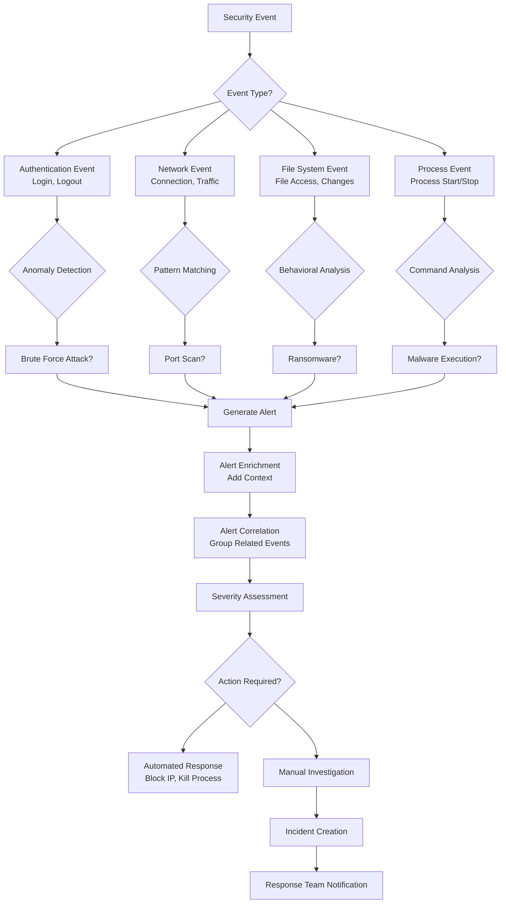

## Cloud Monitoring

### Multi-Cloud Monitoring

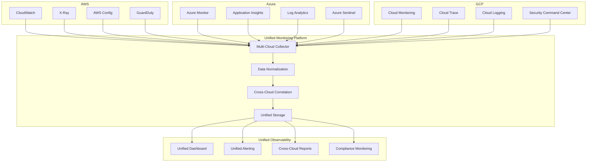

## Performance Optimization

### Monitoring Data Pipeline Optimization

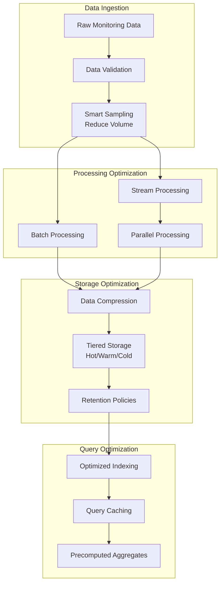

## Summary

These diagrams illustrate the key architectural patterns and data flows in monitoring systems:

1. **Observability Pillars**: Metrics, logs, and traces working together
2. **Data Collection Patterns**: Push vs pull models, centralized vs distributed
3. **Alerting Workflows**: From detection to resolution
4. **Logging Pipelines**: From raw logs to searchable insights
5. **Distributed Tracing**: Request flow visualization
6. **Metrics Systems**: Prometheus architecture and metric types
7. **Dashboard Design**: Effective visualization patterns
8. **Security Monitoring**: SIEM and threat detection
9. **Cloud Integration**: Multi-cloud monitoring
10. **Performance**: Optimization strategies

These visual representations help understand how monitoring components interact and how to design comprehensive observability solutions.
