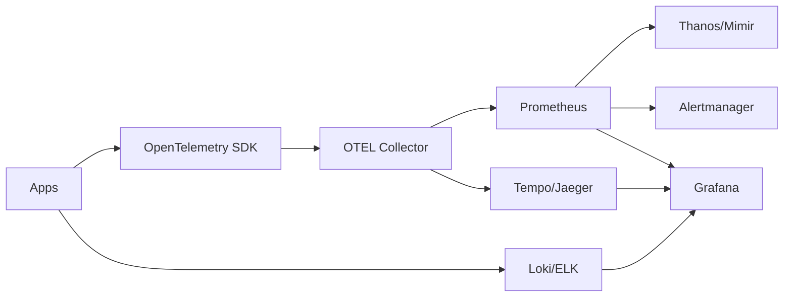

# Monitoring Guide – Basic → Architect

## Level 1 – Launch & Basics

### 1. Core Concepts
- White-box vs black-box; metrics vs logs vs traces
- SLI/SLO/Error Budget; alert fatigue vs meaningful signals
- Cardinality awareness: label explosion kills performance

### 2. Quick Start (Prometheus + Grafana)
```bash
# docker compose up -d prometheus grafana
# prometheus.yml scrape_configs: node_exporter, app
```

### 3. Instrumentation Basics
- Exporters: node_exporter, cAdvisor, blackbox
- App metrics: OpenTelemetry/Prometheus client libs
- Histograms for latency; counters for rates; gauges sparingly

## Level 2 – Production Patterns

### Metrics Stack
- Prometheus (scrape/pull), Alertmanager, long-term store (Thanos/Mimir/Cortex)
- Dashboards: Grafana with folders, permissions, templating

### Alerts
- Multi-window, multi-burn-rate alerts for SLOs
- Page only for user-impacting issues; route to on-call rotations
- Silence policies with ownership; runbooks linked from alerts

### Logs & Traces
- Logs: JSON structured, centralized (Loki/ELK/PLG)
- Traces: OpenTelemetry SDK/collector → Jaeger/Tempo
- Correlate logs/metrics/traces via trace_id

## Level 3 – Architect Playbook

### SLOs & Error Budgets
- Define per-service SLOs (availability/latency)
- Burn rate alerts: fast + slow burn to catch both spikes and leaks

### Reliability & Scale
- HA Prometheus (Thanos sidecar/receive)
- Recording rules for expensive queries
- Retention tiers: hot vs cold storage

### Security & Compliance
- TLS/auth on endpoints; RBAC in Grafana
- PII handling in logs; retention policies; audit trails

## Ops Cheat Sheet

| Task | Command/Config | Note |
| --- | --- | --- |
| Check targets | `prometheus/targets` UI | scrape health |
| Query | PromQL `rate(http_requests_total[5m])` | rates |
| Cardinality | `count by(__name__)({__name__=~".+"})` | watch |
| Alerts | Alertmanager silence + routes | noise control |
| Traces | Tempo/Jaeger UI with trace_id | correlate |

## Architecture Patterns



## Checklist Before Production
- [ ] SLOs defined; burn-rate alerts with runbooks
- [ ] Metrics: histograms for latency, RED/USE where applicable
- [ ] Logs structured JSON; PII scrubbed; central storage
- [ ] Tracing enabled; trace_id propagated; logs/metrics linked
- [ ] Prometheus retention + HA + recording rules; cardinality checked
- [ ] Grafana RBAC, dashboards templatized; alert routes sane

## Learning Path Links
- Track: `LearningTracks/DevOps-Full/track.md`
- Projects: `Projects/DevOps-Full/starter/06-monitoring-stack.md` and `Projects/Integrated/devops-full-capstone.md`
- Mastery: `Mastery/Monitoring/` (quiz, scenarios, flashcards)

