# Terraform Visual Architecture Guide

## Terraform Core Architecture

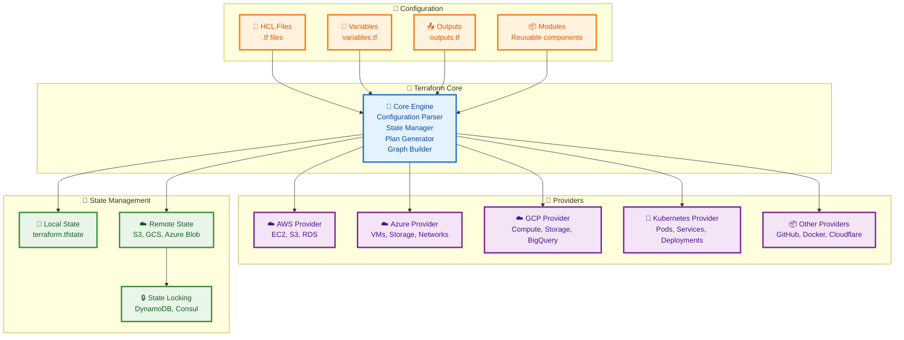

## Terraform Workflow

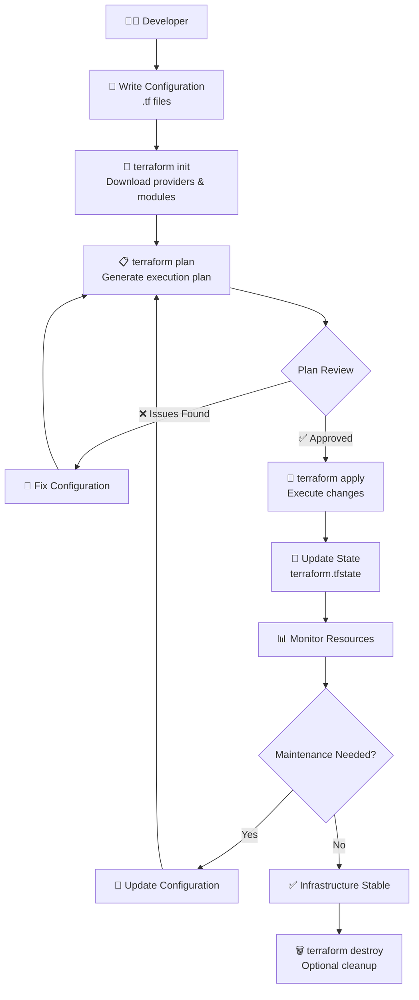

## Resource Dependency Graph

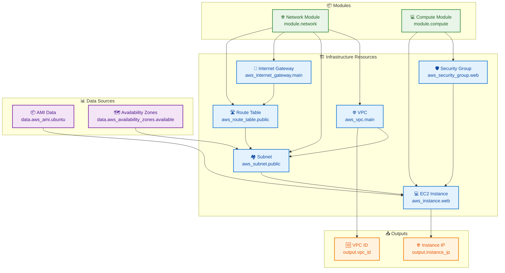

## State Management Architecture

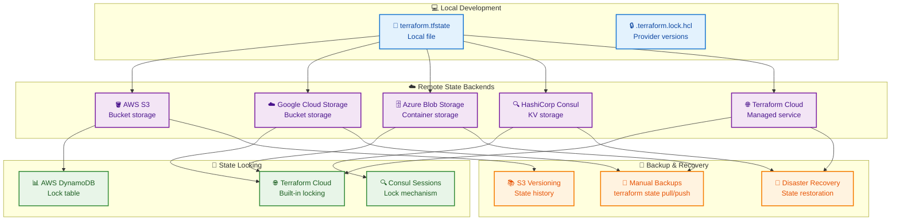

## Module Architecture

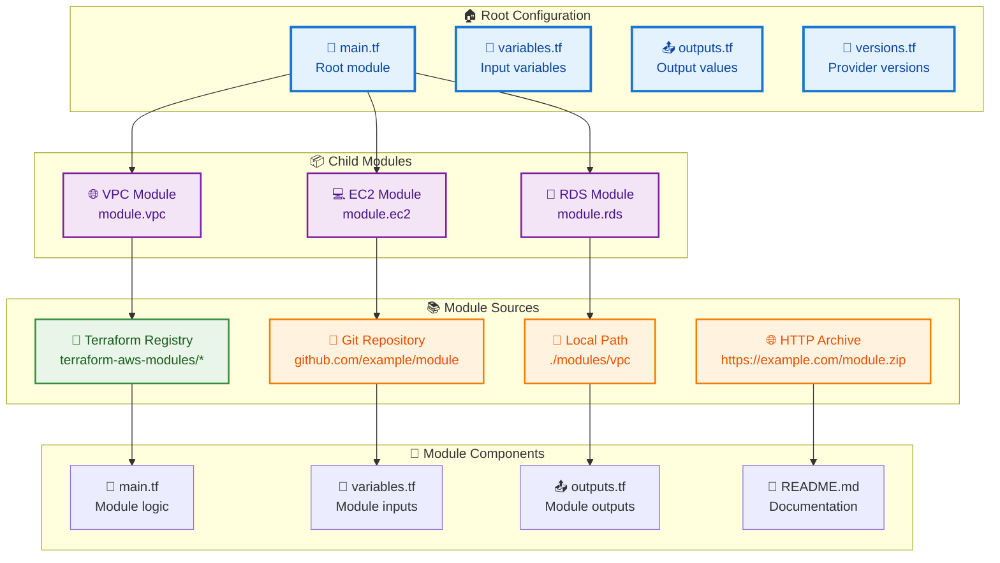

## Multi-Environment Setup

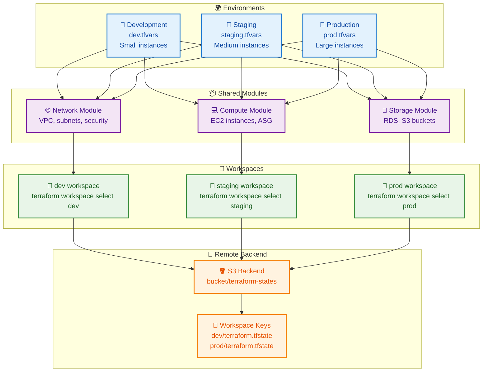

## CI/CD Integration

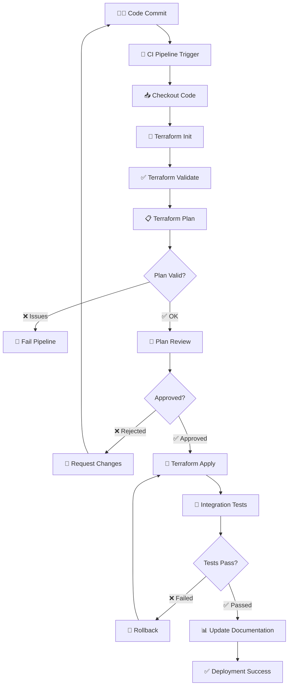

## Provider Ecosystem

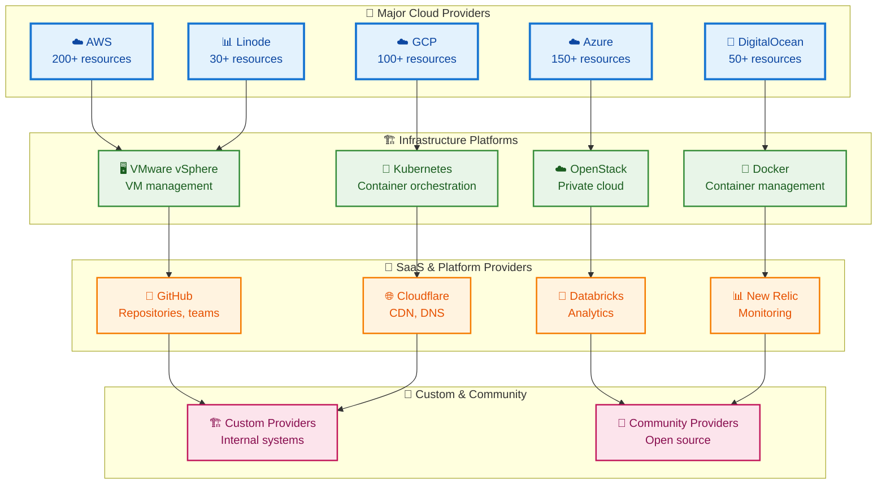

## Resource Lifecycle Management

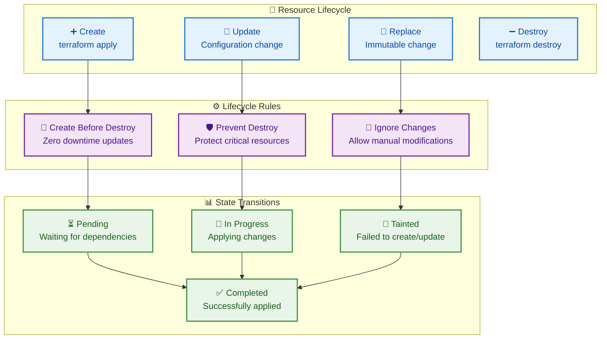

## Terraform Cloud Architecture

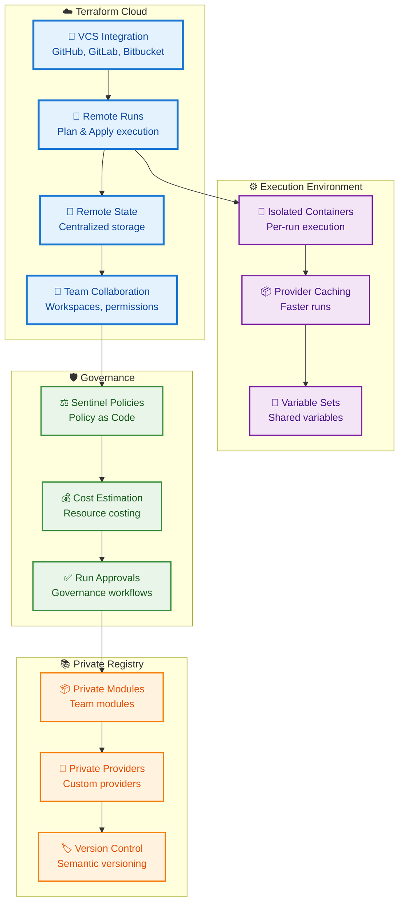

## Error Handling and Recovery

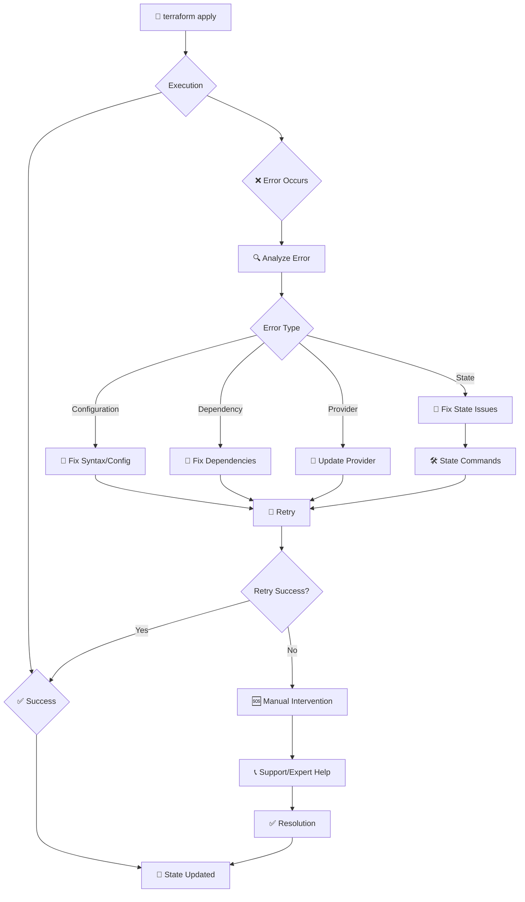

## Performance Optimization

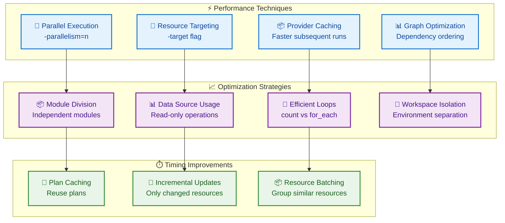

## Summary

Terraform's visual architecture reveals a sophisticated, modular system designed for infrastructure automation at scale. The separation of core engine, providers, and state management enables consistent, version-controlled infrastructure across diverse platforms.

Key visual insights:
- **Declarative configuration**: HCL files define desired state
- **Provider abstraction**: Unified interface to cloud APIs
- **State management**: Critical for tracking and concurrency
- **Modular design**: Reusable components and environments
- **Workflow automation**: Plan-apply cycle with safety checks
- **Ecosystem integration**: CI/CD, cloud platforms, and tools

Understanding these visual relationships is crucial for effective Terraform usage and infrastructure management.
