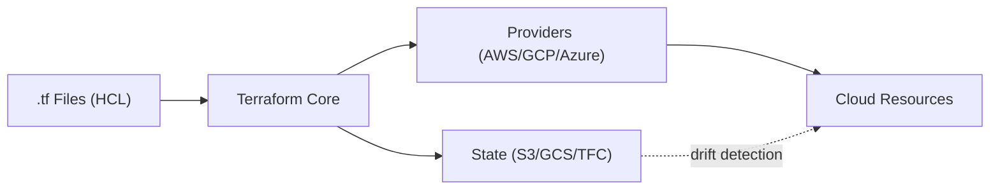

# Terraform — Cheatsheet

## Architecture (30-second mental model)

HCL declares desired state. Core builds a dependency graph, diffs against state, calls provider APIs to converge. State is the source of truth -- not the cloud.

## When to use vs alternatives

| Need | Use Terraform | Not Terraform |
|------|--------------|---------------|
| Multi-cloud or hybrid IaC | Terraform (provider ecosystem) | CloudFormation (AWS-only) |
| Imperative infra scripting | Pulumi (real language loops) | Terraform (declarative only) |
| AWS-native with no drift risk | CloudFormation (native integration) | Terraform (state sync lag) |
| Quick config management on VMs | Ansible (agentless, procedural) | Terraform (not a config mgmt tool) |
| Kubernetes-native resources | Helm/Kustomize (native templating) | Terraform (K8s provider is clunky) |

## 5 things you always forget

1. `for_each` keys must be known at plan time -- you cannot derive them from a resource that does not yet exist; use `count` or restructure.
2. `count` resources are identified by index -- removing an item from the middle of a list destroys and recreates all subsequent resources. Prefer `for_each` with stable string keys.
3. `prevent_destroy` is a lifecycle meta-argument, not a lock -- removing the block and running apply will still destroy the resource.
4. Provider aliases require `provider = aws.secondary` on every resource that uses them; forgetting this silently uses the default.
5. Sensitive outputs are masked in CLI but stored in **plaintext** in state -- anyone with state access sees all secrets. Use `sensitive = true` AND encrypt your state backend.

## Interview killer answer

> "We structured Terraform with a module-per-service pattern, remote S3 state with DynamoDB locking, and Sentinel policies in TFC to block non-compliant plans. The biggest lesson was moving from workspaces to directory-per-environment because workspace state isolation was too fragile when teams scaled -- a single `terraform workspace select` mistake could plan against production. We also pinned all provider versions after a minor AWS provider bump silently changed default encryption behavior on S3 buckets."
