# DevOps Guide

## Table of Contents
1. [Introduction](#introduction)
2. [History](#history)
3. [Relevant Metrics](#relevant-metrics)
4. [Relationship to Other Approaches](#relationship-to-other-approaches)
   - [Platform Engineering](#platform-engineering)
   - [Agile](#agile)
   - [ArchOps](#archops)
   - [CI/CD](#cicd)
   - [Database DevOps](#database-devops)
   - [Mobile DevOps](#mobile-devops)
   - [Site-Reliability Engineering](#site-reliability-engineering)
   - [Toyota Production System](#toyota-production-system)
   - [DevSecOps](#devsecops)
5. [Culture](#culture)
6. [GitOps](#gitops)
7. [Best Practices for Cloud Systems](#best-practices-for-cloud-systems)

## Introduction
DevOps integrates and automates software development and IT operations, shortening development time and improving the life cycle.

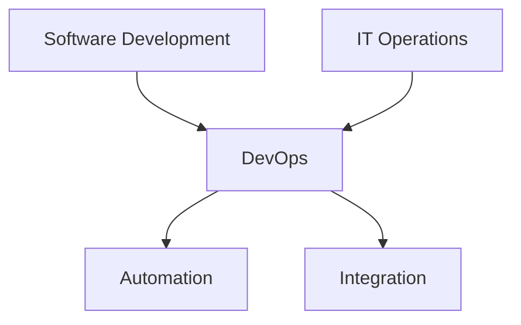

## History
Proposals began in late 80s and early 90s. DevOps Days in 2009, State of DevOps report in 2012, DORA metrics in 2016.

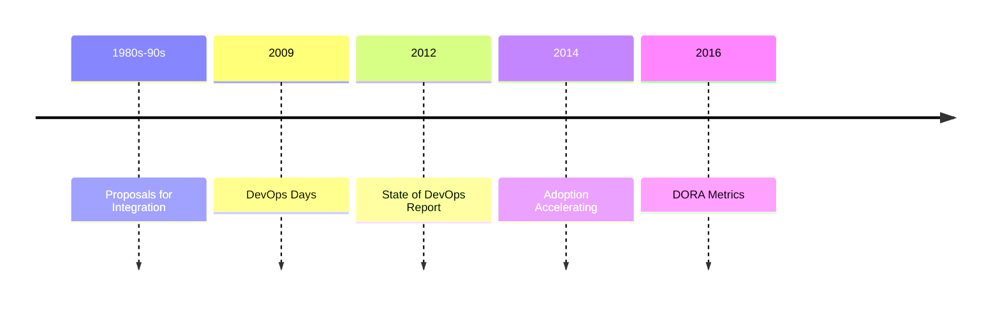

## Relevant Metrics
Deployment Frequency, Lead Time for Changes, Change Failure Rate, Failed Deployment Recovery Time.

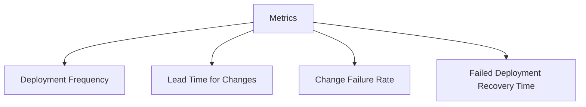

## Relationship to Other Approaches

### Platform Engineering
Builds internal developer platforms with CI/CD, infrastructure, observability, security.

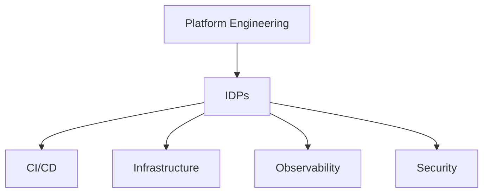

### Agile
Originated from Agile, focuses on deployment and operations.

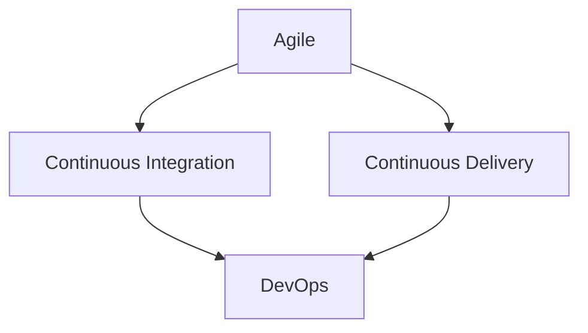

### ArchOps
Starts from software architecture artifacts for operation deployment.

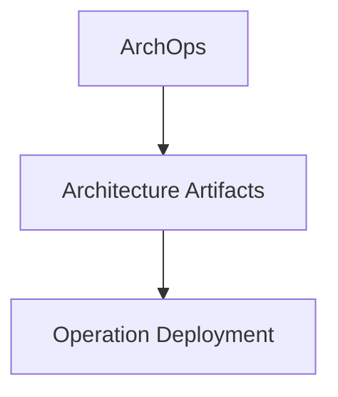

### CI/CD
Automation for build, test, deployment. Critical for DevOps success.

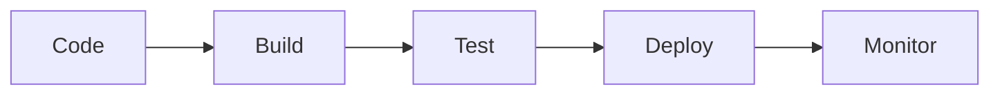

### Database DevOps
Applies DevOps to database development, using CI/CD for schema changes.

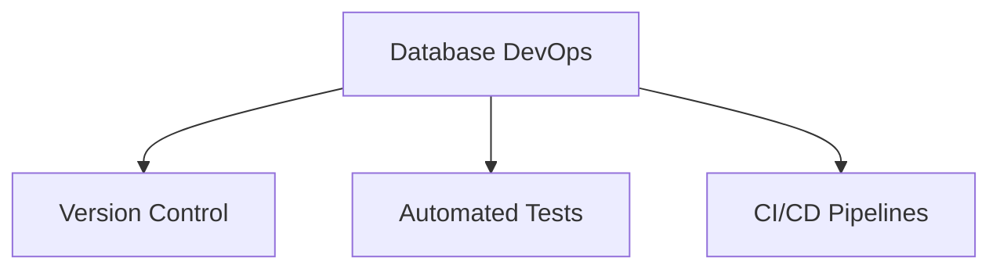

### Mobile DevOps
Applies DevOps to mobile app development, tailored for mobile challenges.

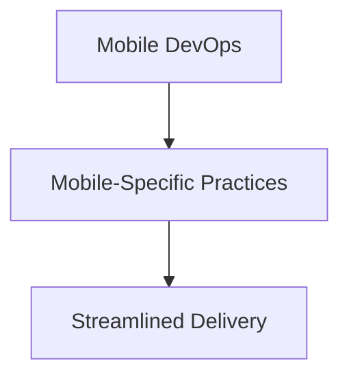

### Site-Reliability Engineering
Related to SRE, focuses on high-availability systems.

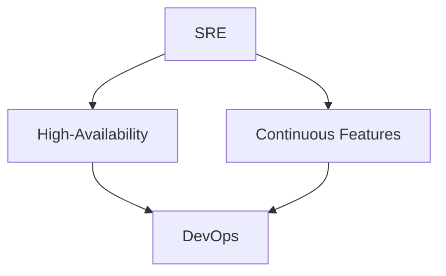

### Toyota Production System
Inspired by TPS, lean thinking, kaizen, continuous improvement.

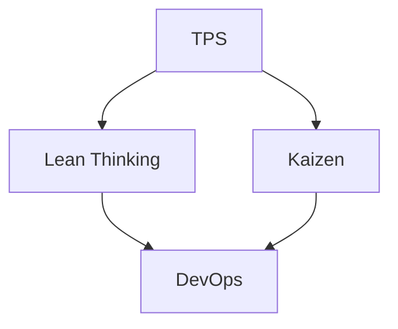

### DevSecOps
Integrates security practices, shifting security left.

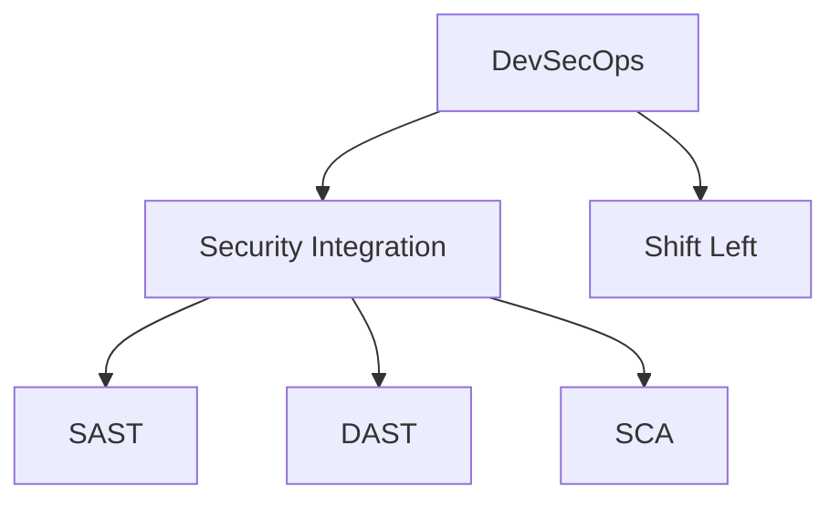

## Culture
Shared ownership, workflow automation, rapid feedback. Supports consistency, reliability, efficiency.

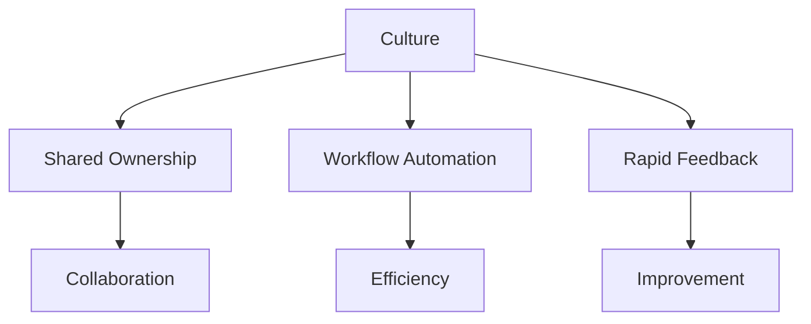

## GitOps
Deployment configuration version-controlled using Git. Changes managed via code review.

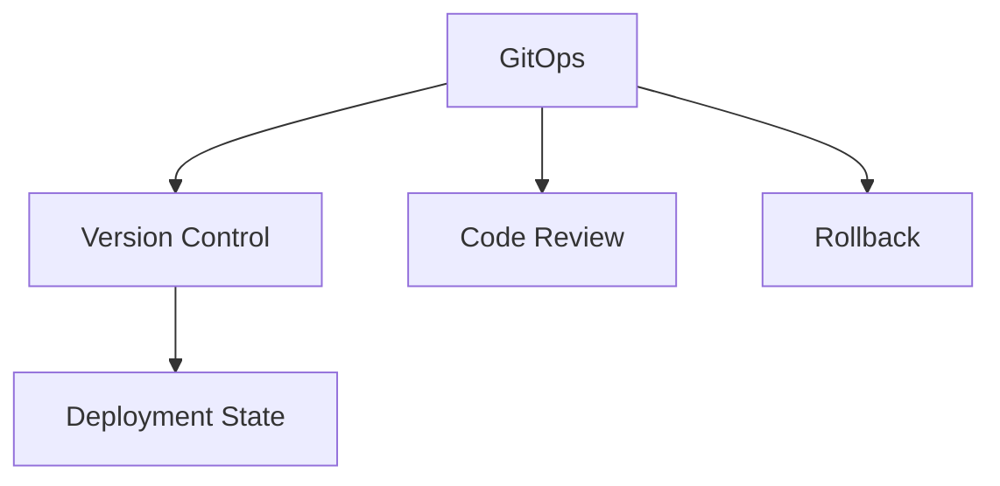

## Best Practices for Cloud Systems
Small teams use one repository and pipeline. Larger organizations separate by team or service. Principle of least privilege for permissions.

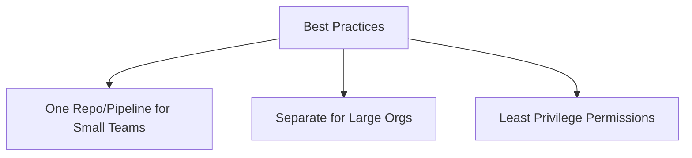
