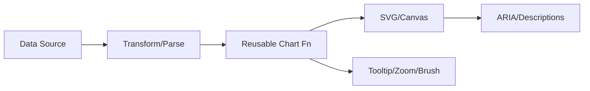

# D3.js Guide – Basic → Architect

## Level 1 – Launch & Basics

### 1. Quick Setup
```bash
npm install d3
```
```js
import * as d3 from 'd3';
```

### 2. Core Concepts
- Selections, data binding, enter/update/exit
- Scales (linear, band, time), axes, shapes
- SVG basics: rect, circle, path; coordinate system

### 3. First Chart (Bar)
```js
const svg = d3.select('svg');
const data = [3, 7, 5];
const x = d3.scaleBand().domain(data.map((_, i) => i)).range([0, 300]).padding(0.1);
const y = d3.scaleLinear().domain([0, d3.max(data)]).range([200, 0]);

svg.selectAll('rect')
  .data(data)
  .enter()
  .append('rect')
  .attr('x', (_, i) => x(i))
  .attr('y', d => y(d))
  .attr('width', x.bandwidth())
  .attr('height', d => 200 - y(d))
  .attr('fill', '#4f46e5');
```

## Level 2 – Production Patterns

### Layout & Responsiveness
- Use viewBox for responsive SVG
- Margins/padding with a reusable chart container

### Data Handling
- Parse/format data (d3.csv/json/timeParse)
- Scales and domains derived from data; avoid hardcoding

### Interactions
- Tooltips, hover states, zoom/pan (d3-zoom), brushing
- Transitions with duration/ease; keep performant

## Level 3 – Architect Playbook

### Architecture
- Reusable chart functions; props for data/settings
- Separate data prep from rendering; test data transforms
- Accessibility: titles, desc, ARIA roles, keyboard focus

### Performance
- Minimize DOM nodes; consider canvas for heavy plots
- Throttle mouse events; avoid expensive transitions
- Virtualization for large datasets

### Integration
- Embed in React/Vue via wrapper components
- Theming via CSS vars; export as images where needed

## Ops Cheat Sheet

| Task | Snippet | Note |
| --- | --- | --- |
| Scale | `d3.scaleLinear()` | numbers |
| Time | `d3.timeParse/format` | dates |
| Axis | `d3.axisBottom(scale)` | add axis |
| Zoom | `d3.zoom()` | pan/zoom |
| Tooltip | `selection.on('mousemove', ...)` | custom |

## Architecture Patterns



## Checklist Before Production
- [ ] Responsive SVG (viewBox), margins handled
- [ ] Data-driven domains; no magic numbers
- [ ] Accessible: titles/desc, roles, focus targets
- [ ] Performance: limited nodes, throttled events, canvas if needed
- [ ] Reusable chart API; tested data transforms

