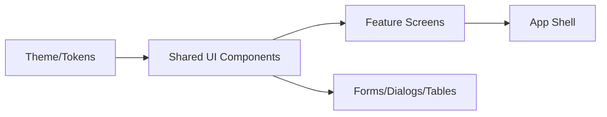

# Material-UI Guide – Basic → Architect

## Level 1 – Launch & Basics

### 1. Quick Setup
```bash
npm install @mui/material @emotion/react @emotion/styled @mui/icons-material
```
```tsx
import { Button } from '@mui/material';
```

### 2. Core Concepts
- Theme provider; palette/typography/spacing
- Components: Button, TextField, AppBar, Card, Grid/Box
- SX prop vs styled API

### 3. First Page
```tsx
import { ThemeProvider, createTheme, Button, Container } from '@mui/material';
const theme = createTheme({ palette: { primary: { main: '#4f46e5' } } });

export default function App() {
  return (
    <ThemeProvider theme={theme}>
      <Container>
        <Button variant="contained">Click</Button>
      </Container>
    </ThemeProvider>
  );
}
```

## Level 2 – Production Patterns

### Theming & Design System
- Central theme: palette, typography, spacing, shape, shadows
- Component overrides; variants; global styles
- Use design tokens; avoid ad-hoc inline styles

### Layout & Responsiveness
- Grid vs Box/Flex; breakpoints; hidden/visibility utilities
- Responsive typography; container widths

### Forms & UX
- TextField with validation; FormControl; helper text
- Dialogs, snackbars; focus management
- Accessibility: labels/aria, contrast, keyboard nav

## Level 3 – Architect Playbook

### Architecture
- Feature-driven structure; shared UI library; storybook
- Theming per brand/env; dynamic theme switching
- Reduce bundle: tree-shake, import paths, code splitting

### Performance
- Memoize heavy components; virtualization for lists/tables (MUI X)
- Avoid unnecessary re-renders; use styled/sx consistently

### Compliance & Quality
- Use ESLint a11y rules; color contrast checks
- Dark mode readiness; RTL support

## Ops Cheat Sheet

| Task | Snippet | Note |
| --- | --- | --- |
| Theme | `createTheme({...})` | base tokens |
| Override | `components: { MuiButton: { styleOverrides: {...} }}` | global |
| Variant | `variants: [{ props, style }]` | custom variants |
| Layout | `Grid/Box` | responsive |

## Architecture Patterns



## Checklist Before Production
- [ ] Central theme with tokens; component overrides defined
- [ ] A11y: labels, contrast, focus states, keyboard
- [ ] Tree-shaken imports; bundle size monitored
- [ ] Forms validated; dialogs/snackbars accessible
- [ ] Storybook or docs for shared components

