# React Visual Architecture Guide

## Component Hierarchy and Data Flow

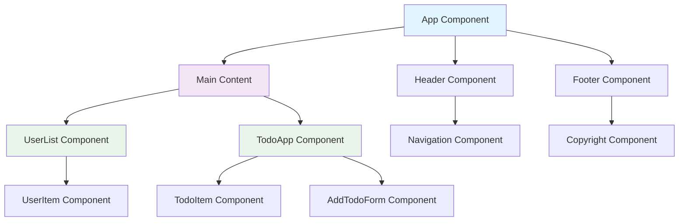

## React Component Lifecycle (Class Components)

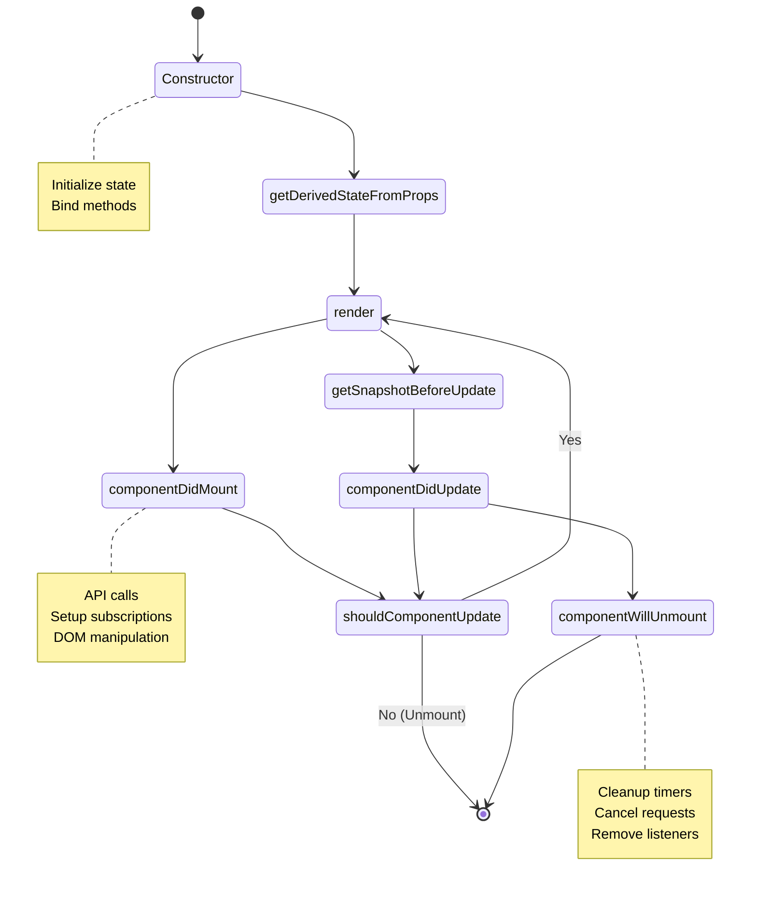

## Hooks Lifecycle (Function Components)

```mermaid
flowchart TD
    A[Component Mount] --> B[useState Initial Render]
    B --> C[useEffect with []]
    C --> D[Render Complete]

    D --> E[State Update]
    E --> F[Re-render]
    F --> G[useEffect with dependencies]
    G --> H[Render Complete]

    H --> I[Component Unmount]
    I --> J[useEffect Cleanup]

    style A fill:#e8f5e8
    style I fill:#ffebee
```

## State Management Patterns

### Local State Flow

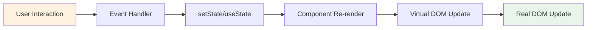

### Context API Data Flow

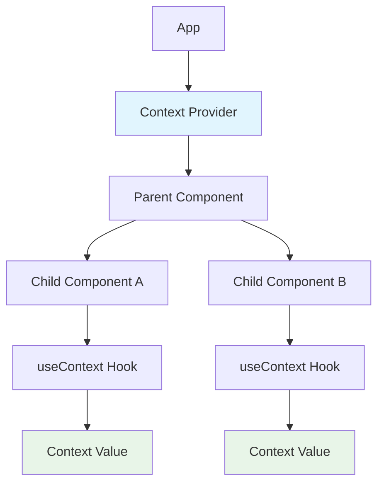

### Redux Data Flow

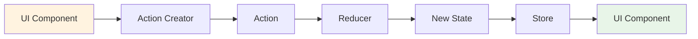

## Virtual DOM Reconciliation Process

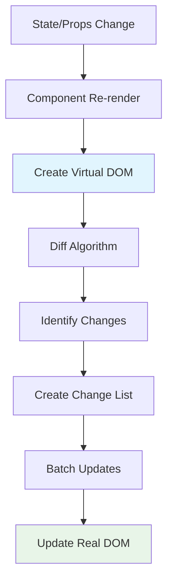

## Component Communication Patterns

### Parent to Child (Props)

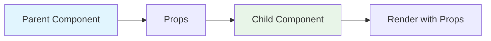

### Child to Parent (Callbacks)

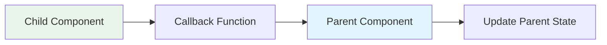

### Sibling Communication (Parent as Mediator)

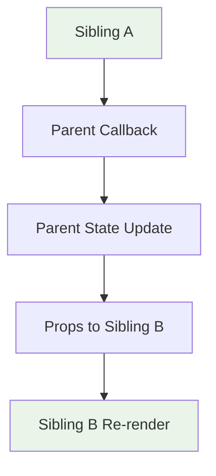

## React Router Navigation Flow

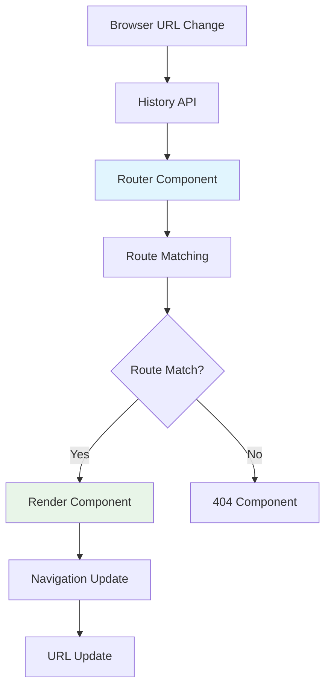

## Form Handling Architecture

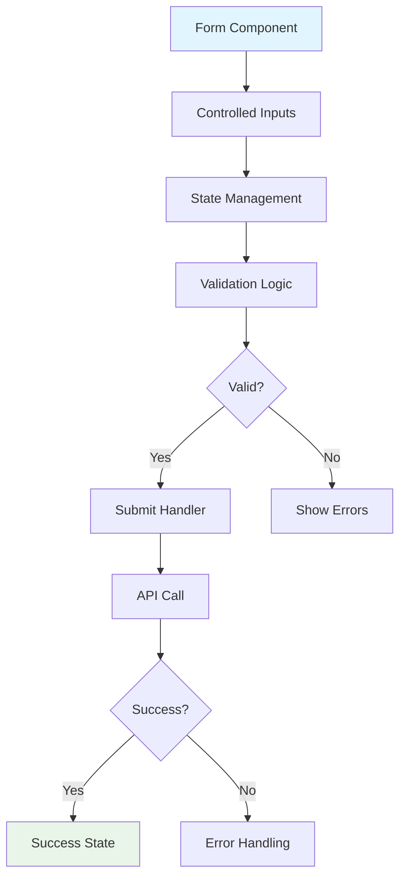

## Custom Hook Architecture

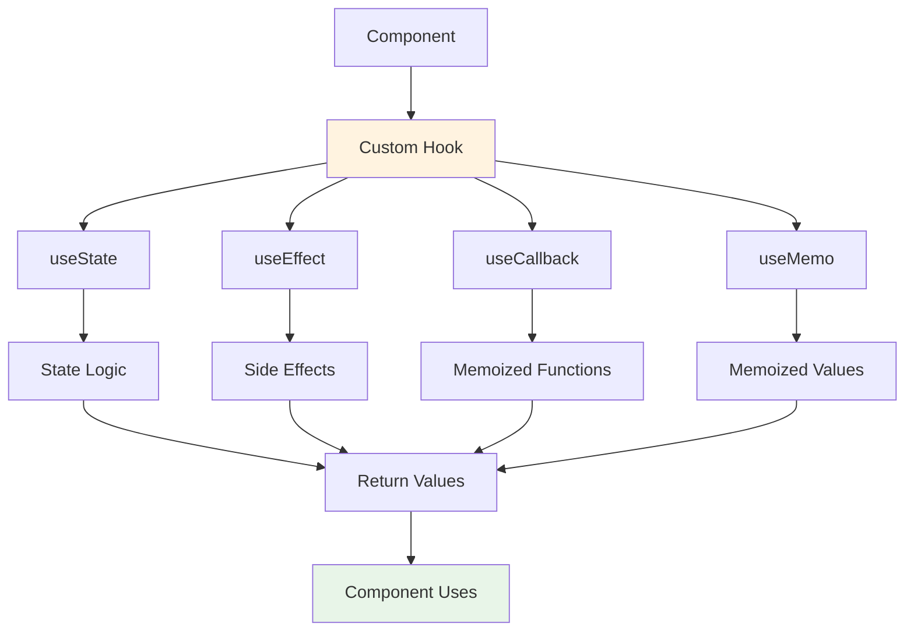

## Error Boundary Flow

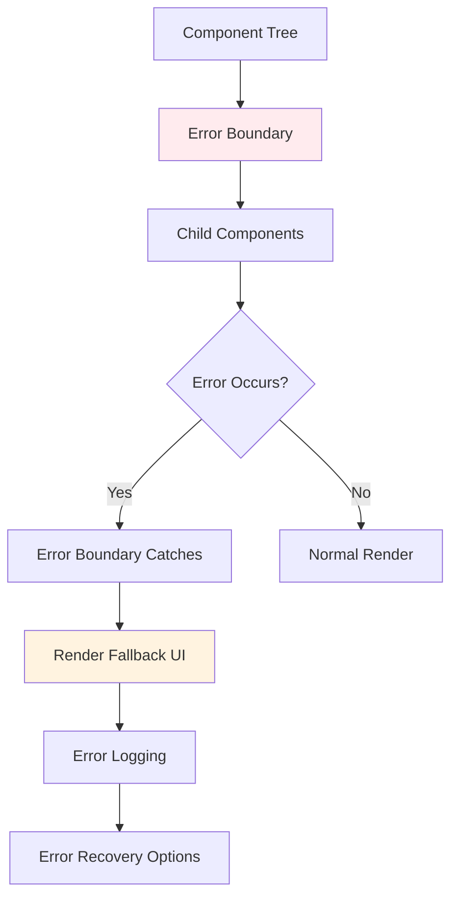

## Performance Optimization Patterns

### React.memo Usage

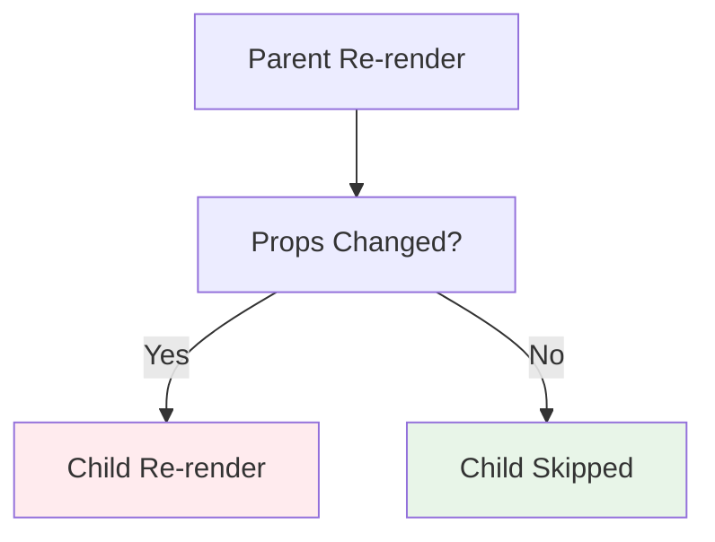

### useMemo and useCallback Flow

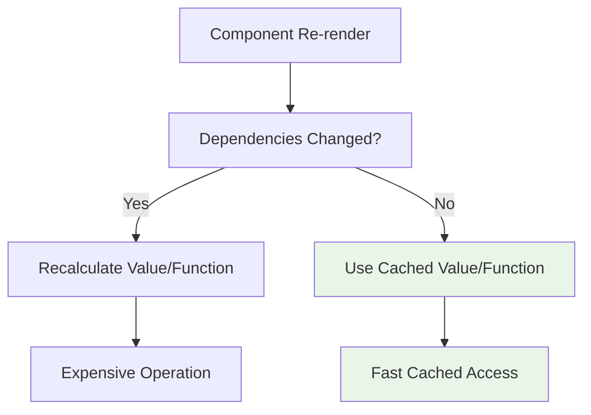

## Testing Strategy Architecture

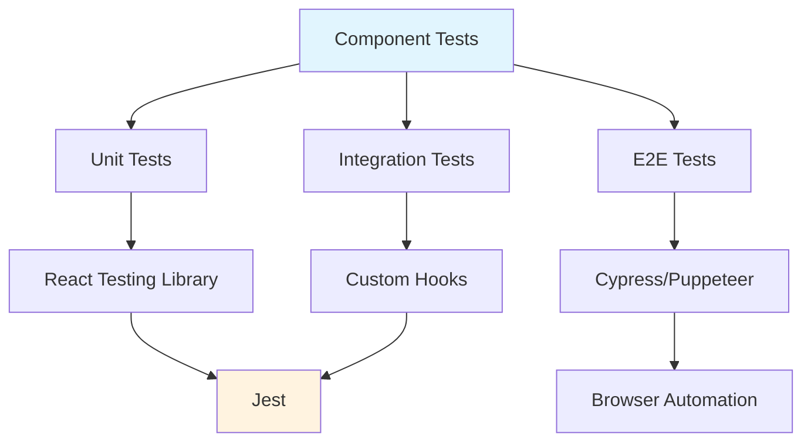

## API Integration Patterns

### Fetch with Loading States

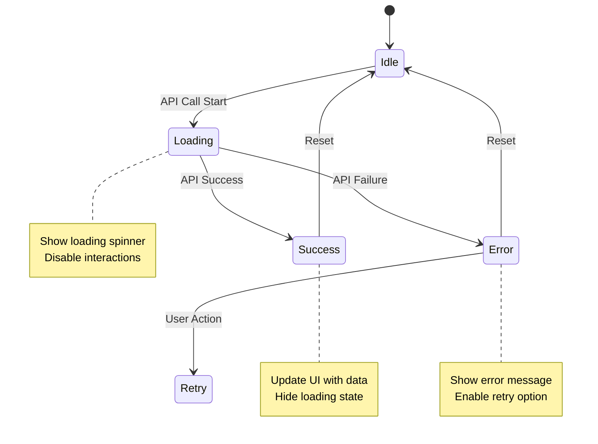

### Optimistic Updates

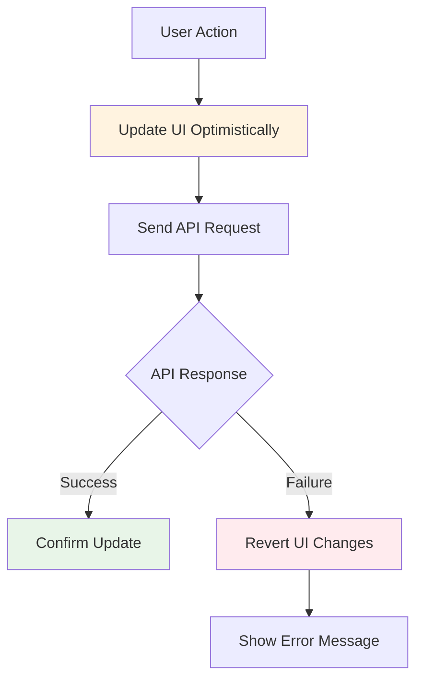

## Component Composition Patterns

### Higher-Order Components (HOC)

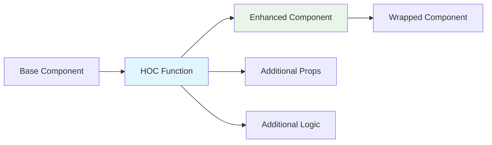

### Render Props Pattern

```mermaid
flowchart TD
    A[Parent Component] --> B[Render Prop Function]
    B --> C[Child Component]
    C --> D[Render Content]
    D --> E[Dynamic Rendering]

    style A fill:#e1f5fe
    style E fill:#e8f5e8
```

### Compound Components

```mermaid
flowchart TD
    A[Compound Component] --> B[Container Component]
    B --> C[Child Component A]
    B --> D[Child Component B]
    B --> E[Child Component C]

    C --> F[Shared Context]
    D --> F
    E --> F

    style B fill:#e1f5fe
    style F fill:#fff3e0
```

## State Management Comparison

```mermaid
graph TD
    A[State Management] --> B[Local State]
    A --> C[Context API]
    A --> D[Redux/Zustand]
    A --> E[Server State]

    B --> F[useState/useReducer]
    C --> G[useContext + useReducer]
    D --> H[Actions/Reducers/Store]
    E --> I[React Query/SWR]

    F --> J[Simple, Local]
    G --> K[App-wide, Simple]
    H --> L[Complex, Predictable]
    I --> M[Server Data, Caching]

    style J fill:#e8f5e8
    style K fill:#e8f5e8
    style L fill:#fff3e0
    style M fill:#e1f5fe
```

## React Ecosystem Architecture

```mermaid
graph TD
    A[React Core] --> B[React DOM]
    A --> C[React Native]

    B --> D[Web Apps]
    C --> E[Mobile Apps]

    A --> F[React Router]
    A --> G[State Management]
    A --> H[UI Libraries]

    F --> I[Client-side Routing]
    G --> J[Redux/Zustand]
    H --> K[Material-UI/Chakra]

    A --> L[Testing]
    A --> M[Build Tools]

    L --> N[Jest/RTL/Cypress]
    M --> O[Webpack/Vite]

    style A fill:#e1f5fe
    style D fill:#e8f5e8
    style E fill:#e8f5e8
```

## Performance Monitoring Flow

```mermaid
flowchart TD
    A[Component Render] --> B[React DevTools Profiler]
    B --> C[Performance Metrics]
    C --> D[Identify Bottlenecks]

    D --> E{Performance Issue?}
    E -->|Yes| F[Optimization Strategies]
    E -->|No| G[Continue Monitoring]

    F --> H[React.memo]
    F --> I[useMemo/useCallback]
    F --> J[Code Splitting]
    F --> K[Lazy Loading]

    H --> L[Reduced Re-renders]
    I --> L
    J --> M[Faster Initial Load]
    K --> M

    style B fill:#e1f5fe
    style L fill:#e8f5e8
    style M fill:#e8f5e8
```

## Deployment Pipeline

```mermaid
flowchart LR
    A[Development] --> B[Build Process]
    B --> C[Testing]
    C --> D[Code Quality]
    D --> E[Deployment]

    B --> F[Webpack/Vite]
    C --> G[Jest/Cypress]
    D --> H[ESLint/Prettier]
    E --> I[Netlify/Vercel]

    F --> J[Bundle Creation]
    G --> K[Test Results]
    H --> L[Code Standards]
    I --> M[Live Application]

    style A fill:#e8f5e8
    style M fill:#e8f5e8
```

This visual guide provides comprehensive diagrams showing React's architecture, data flow patterns, lifecycle management, performance optimization strategies, and ecosystem integration.
