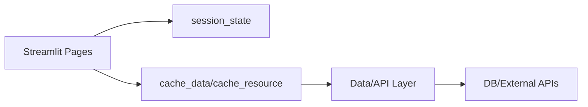

# Streamlit Guide – Basic → Architect

## Level 1 – Launch & Basics

### 1. Quick Setup
```bash
pip install streamlit
streamlit hello
```

### 2. First App
```python
import streamlit as st

st.title("Hello Streamlit")
name = st.text_input("Name")
if st.button("Greet"):
    st.write(f"Hello {name}")
```

### 3. Core Concepts
- Rerun on interaction; widget state via `st.session_state`
- Layout: columns, sidebar, tabs, containers
- Caching: `st.cache_data`, `st.cache_resource`

## Level 2 – Production Patterns

### Data & Performance
- Cache expensive I/O; set TTL and key funcs
- Use pandas for data prep; charts via `st.line_chart`, altair/plotly

### UI/UX
- Theming in config; custom CSS for minor tweaks
- Forms (`st.form`) to reduce reruns; file upload handling

### Deployment
- Streamlit Community Cloud or containerize; behind auth/reverse proxy
- Env vars for secrets; `st.secrets` for managed secrets

## Level 3 – Architect Playbook

### Architecture
- Separate data/service layer from UI; modules for utils
- Multi-page apps with `pages/` directory
- Feature flags; configuration per env

### Observability & Security
- Logging; basic metrics (timings) around heavy ops
- AuthN/Z via reverse proxy or app logic; secure cookies/session
- Input sanitization; limit uploads; size/time guards

### Integrations
- Connect to DBs (postgres, bq, redis); external APIs with retries
- Embed custom components if needed (streamlit-components)

## Ops Cheat Sheet

| Task | Command | Note |
| --- | --- | --- |
| Run | `streamlit run app.py` | local |
| Cache clear | `streamlit cache clear` | dev |
| Config | `.streamlit/config.toml` | theme/ports |
| Secrets | `.streamlit/secrets.toml` | creds |

## Architecture Patterns



## Checklist Before Production
- [ ] Use cache_data/resource for expensive ops
- [ ] Secrets via st.secrets/env; no hardcoded creds
- [ ] Forms for grouped submits; avoid unnecessary reruns
- [ ] Auth/proxy in front; TLS terminated
- [ ] Logging/metrics around slow calls; limits on uploads

