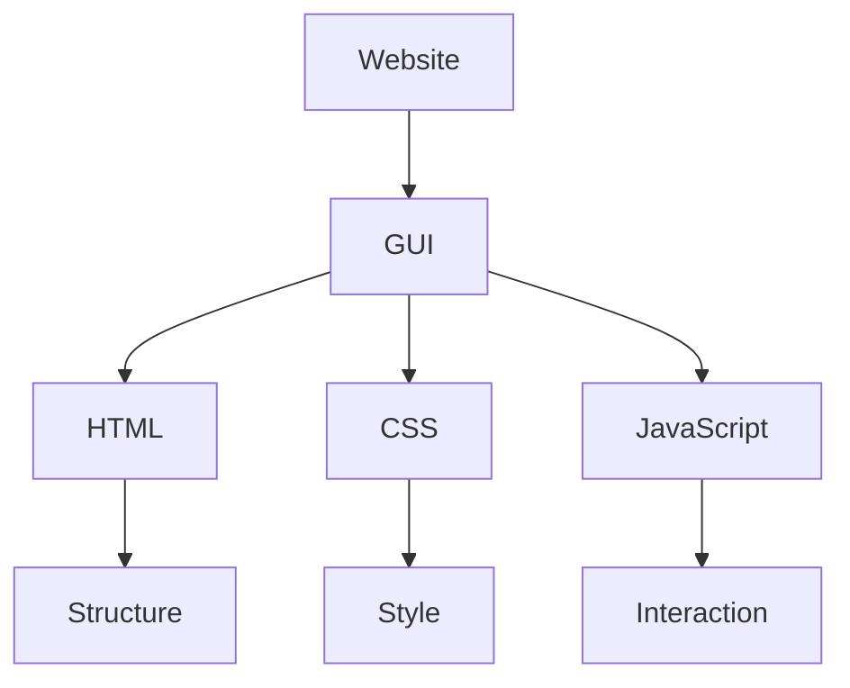
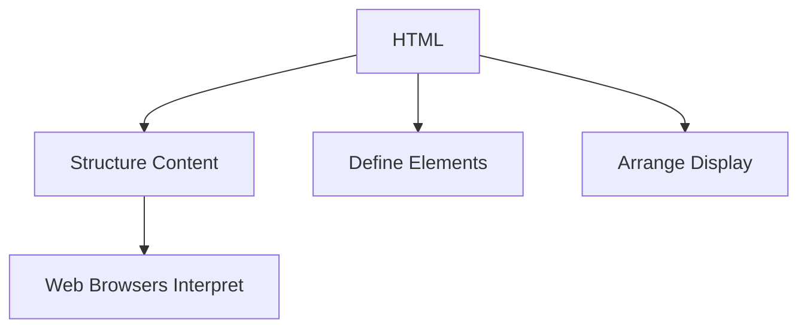
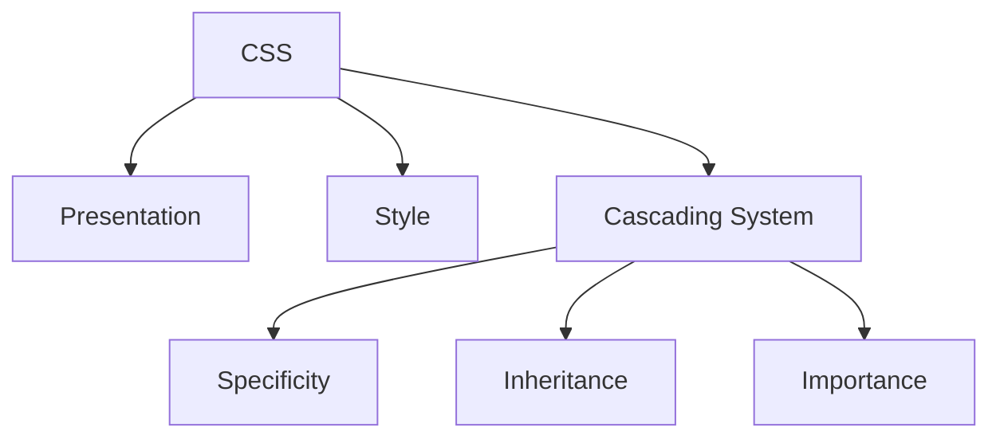
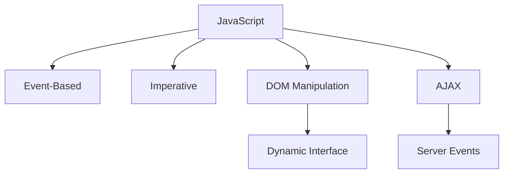
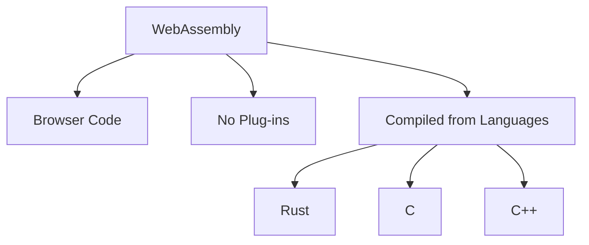
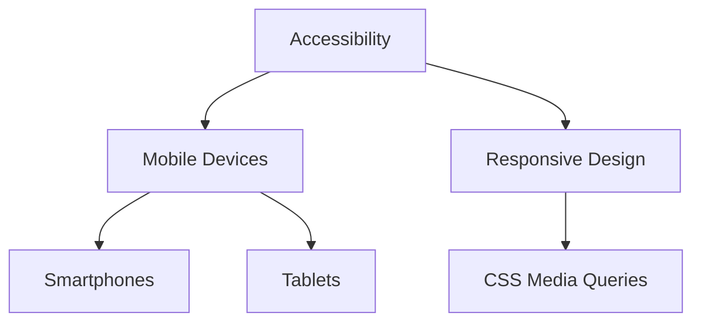
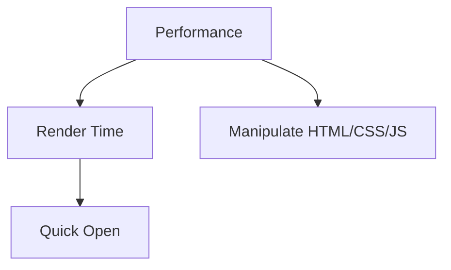
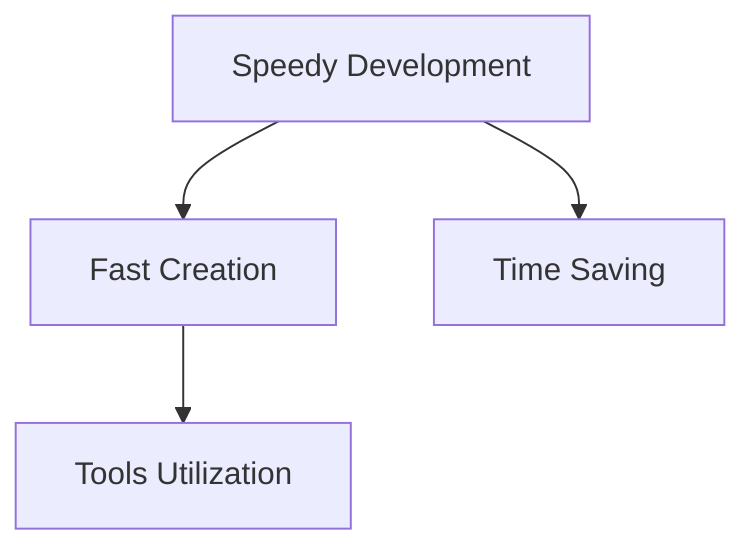

# Frontend Guide

## Table of Contents
1. [Introduction](#introduction)
2. [Tools Used for Front-End Development](#tools-used-for-front-end-development)
   - [HyperText Markup Language](#hypertext-markup-language)
   - [Cascading Style Sheets](#cascading-style-sheets)
   - [JavaScript](#javascript)
   - [WebAssembly](#webassembly)
3. [Goals for Development](#goals-for-development)
   - [Accessibility](#accessibility)
   - [Performance](#performance)
   - [Speedy Development](#speedy-development)

## Introduction
Front-end web development creates the graphical user interface of websites using HTML, CSS, and JavaScript for user interaction.

## Tools Used for Front-End Development

### HyperText Markup Language
HTML structures web content, defines elements and arrangement. Latest is HTML5.

### Cascading Style Sheets
CSS controls presentation and style, uses cascading for conflicts. Applied externally, internally, or inline.

### JavaScript
Event-based language for dynamic interfaces, manipulates DOM, uses AJAX for content retrieval.

### WebAssembly
Alternative to JavaScript for running code in browsers, compiled from languages like Rust, C, C++.

## Goals for Development

### Accessibility
Ensure site works on all devices, using responsive web design with CSS media queries.

### Performance
Concerned with render time, manipulate HTML, CSS, JS for quick loading.

### Speedy Development
Enables fast development and saves time using available tools.

