# AutoML Visuals

## End-to-End AutoML Flow
```mermaid
flowchart LR
  Data[Training Data (GCS/BQ)] --> Prep[Label/Prep]
  Prep --> Train[AutoML Train]
  Train --> Eval[Evaluate Metrics]
  Eval --> Registry[Model Registry]
  Registry --> Deploy[Deploy Endpoint / Batch]
  Deploy --> Monitor[Monitor (Drift/Cost)]
  Monitor --> Retrain[Retrain Pipeline]
  Eval --> Thresholds[Threshold Tuning]
```

## Data Paths by Product
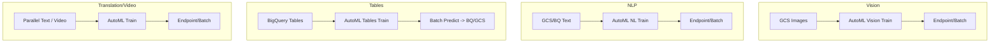

## Governance & Monitoring
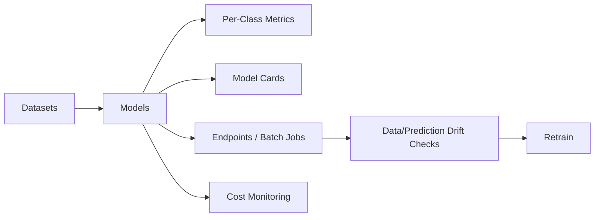
# AutoML Visual Guide

## AutoML Suite Architecture Overview

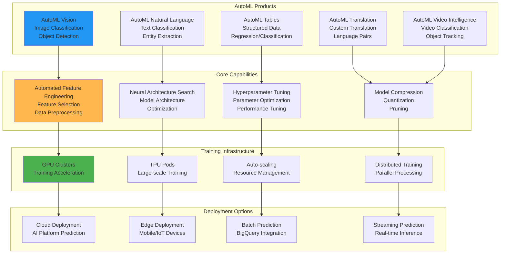

## AutoML Vision Workflow

```mermaid
graph LR
    subgraph "Data Preparation"
        UPLOAD[Upload Images<br/>Cloud Storage]
        LABEL[Data Labeling<br/>AutoML UI / API]
        VALIDATE[Data Validation<br/>Quality Checks]
        SPLIT[Train/Validation/Test Split<br/>80/10/10]
    end

    subgraph "Model Training"
        FEATURE_EXTRACT[Feature Extraction<br/>Pre-trained Networks]
        TRANSFER_LEARN[Transfer Learning<br/>Fine-tuning]
        ARCH_SEARCH[Architecture Search<br/>Neural Networks]
        HYPER_OPT[Hyperparameter<br/>Optimization]
    end

    subgraph "Model Evaluation"
        ACCURACY[Accuracy Metrics<br/>Precision/Recall]
        CONFUSION_MATRIX[Confusion Matrix<br/>Error Analysis]
        FEATURE_IMP[Feature Importance<br/>SHAP Values]
        MODEL_VAL[Model Validation<br/>Cross-validation]
    end

    subgraph "Model Deployment"
        EXPORT[Export Model<br/>TensorFlow/SavedModel]
        DEPLOY[Deploy to AI Platform<br/>Online Prediction]
        EDGE_EXPORT[Export for Edge<br/>TensorFlow Lite]
        MONITOR[Monitor Performance<br/>Drift Detection]
    end

    UPLOAD --> LABEL
    LABEL --> VALIDATE
    VALIDATE --> SPLIT

    SPLIT --> FEATURE_EXTRACT
    FEATURE_EXTRACT --> TRANSFER_LEARN
    TRANSFER_LEARN --> ARCH_SEARCH
    ARCH_SEARCH --> HYPER_OPT

    HYPER_OPT --> ACCURACY
    ACCURACY --> CONFUSION_MATRIX
    CONFUSION_MATRIX --> FEATURE_IMP
    FEATURE_IMP --> MODEL_VAL

    MODEL_VAL --> EXPORT
    EXPORT --> DEPLOY
    EXPORT --> EDGE_EXPORT
    DEPLOY --> MONITOR
    EDGE_EXPORT --> MONITOR

    style UPLOAD fill:#2196f3
    style TRANSFER_LEARN fill:#ffb74d
    style ACCURACY fill:#4caf50
```

## AutoML Natural Language Processing Pipeline

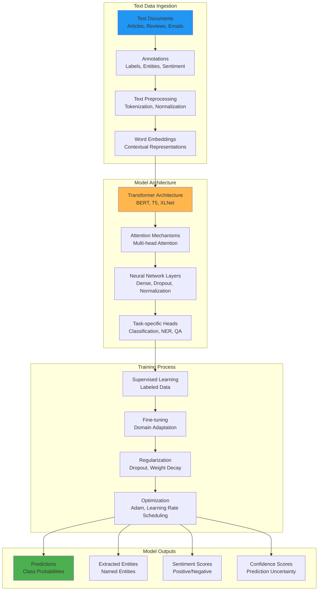

## AutoML Tables Data Processing

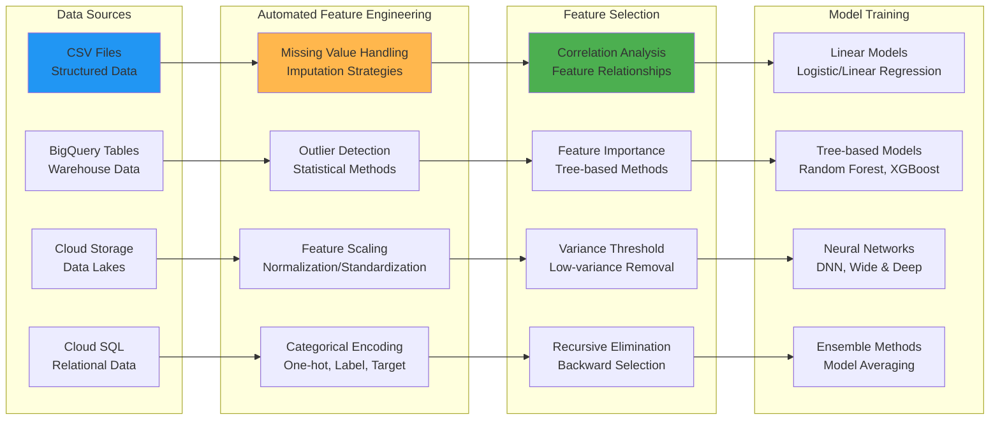

## Model Interpretability and Explainability

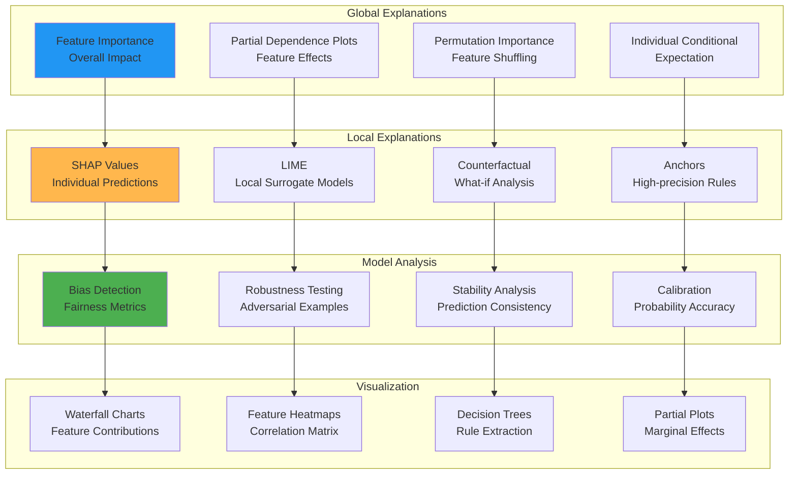

## Deployment Architecture

```mermaid
graph TB
    subgraph "Cloud Deployment"
        AIP[AIP Prediction<br/>Online Serving]
        ENDPOINTS[Endpoints<br/>REST API]
        AUTOSCALE[Auto-scaling<br/>Traffic-based]
        MONITORING[Performance Monitoring<br/>Latency, Throughput]
    end

    subgraph "Edge Deployment"
        TFLITE[TensorFlow Lite<br/>Mobile Deployment]
        COREML[Core ML<br/>iOS Deployment]
        EDGE_TPU[Edge TPU<br/>Coral Devices]
        ONNX[ONNX Runtime<br/>Cross-platform]
    end

    subgraph "Batch Processing"
        BQ_ML[BigQuery ML<br/>SQL Predictions]
        DATAFLOW[Dataflow<br/>Stream Processing]
        COMPOSER[Cloud Composer<br/>Workflow Orchestration]
        FUNCTIONS[Cloud Functions<br/>Event-driven]
    end

    subgraph "Hybrid Deployment"
        GLOBAL[Global Load Balancing<br/>Multi-region]
        CDN[Cloud CDN<br/>Content Delivery]
        CACHE[Memorystore<br/>Prediction Caching]
        CIRCUIT_BREAKER[Circuit Breaker<br/>Fault Tolerance]
    end

    AIP --> ENDPOINTS
    ENDPOINTS --> AUTOSCALE
    AUTOSCALE --> MONITORING

    TFLITE --> EDGE_TPU
    COREML --> ONNX

    BQ_ML --> DATAFLOW
    DATAFLOW --> COMPOSER
    COMPOSER --> FUNCTIONS

    GLOBAL --> CDN
    CDN --> CACHE
    CACHE --> CIRCUIT_BREAKER

    style AIP fill:#2196f3
    style TFLITE fill:#ffb74d
    style BQ_ML fill:#4caf50
```

## Cost Optimization Strategies

```mermaid
graph TD
    A[AutoML Cost Optimization] --> B[Data Optimization]
    A --> C[Training Optimization]
    A --> D[Model Optimization]
    A --> E[Serving Optimization]

    B --> B1[Data Sampling<br/>Reduce training data size]
    B --> B2[Feature Selection<br/>Remove irrelevant features]
    B --> B3[Data Quality<br/>Clean data to reduce iterations]
    B --> B4[Incremental Training<br/>Resume from checkpoints]

    C --> C1[Early Stopping<br/>Stop when performance plateaus]
    C --> C2[Hyperparameter Bounds<br/>Constrain search space]
    C --> C3[Model Architecture<br/>Start with simpler models]
    C --> C4[Parallel Training<br/>Use distributed training]

    D --> D1[Model Compression<br/>Reduce model size]
    D --> D2[Quantization<br/>Lower precision weights]
    D --> D3[Pruning<br/>Remove unnecessary parameters]
    D --> D4[Knowledge Distillation<br/>Transfer to smaller models]

    E --> E1[Batch Predictions<br/>Process multiple requests]
    E --> E2[Request Batching<br/>Group prediction requests]
    E --> E3[Caching<br/>Cache frequent predictions]
    E --> E4[Auto-scaling<br/>Scale based on demand]
```

## MLOps Integration

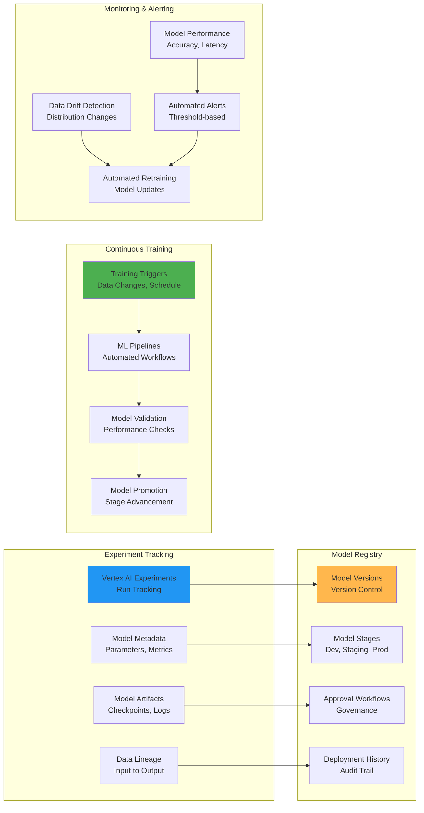

## Security and Compliance

```mermaid
graph TB
    subgraph "Data Protection"
        ENCRYPTION[Data Encryption<br/>At Rest & In Transit]
        ACCESS_CONTROL[IAM Access Control<br/>Fine-grained Permissions]
        VPC_SC[VPC Service Controls<br/>Data Exfiltration Prevention]
        CMEK[Customer-Managed<br/>Encryption Keys]
    end

    subgraph "Model Protection"
        MODEL_ENCRYPTION[Model Encryption<br/>Secure Storage]
        PREDICTION_AUDIT[Prediction Auditing<br/>Usage Tracking]
        VERSION_CONTROL[Model Versioning<br/>Rollback Capability]
        INTEGRITY_CHECKS[Model Integrity<br/>Tampering Detection]
    end

    subgraph "Compliance"
        AUDIT_LOGS[Audit Logging<br/>Comprehensive Tracking]
        REGULATORY[Regulatory Compliance<br/>HIPAA, PCI-DSS]
        DATA_RESIDENCY[Data Residency<br/>Geographic Controls]
        RETENTION_POLICIES[Data Retention<br/>Compliance Requirements]
    end

    subgraph "Risk Management"
        BIAS_DETECTION[Bias Detection<br/>Fairness Analysis]
        ADVERSARIAL_TESTING[Adversarial Testing<br/>Robustness Checks]
        EXPLAINABILITY[Model Explainability<br/>Decision Transparency]
        INCIDENT_RESPONSE[Incident Response<br/>Breach Handling]
    end

    ENCRYPTION --> MODEL_ENCRYPTION
    ACCESS_CONTROL --> PREDICTION_AUDIT
    VPC_SC --> VERSION_CONTROL
    CMEK --> INTEGRITY_CHECKS

    AUDIT_LOGS --> BIAS_DETECTION
    REGULATORY --> ADVERSARIAL_TESTING
    DATA_RESIDENCY --> EXPLAINABILITY
    RETENTION_POLICIES --> INCIDENT_RESPONSE

    style ENCRYPTION fill:#2196f3
    style MODEL_ENCRYPTION fill:#ffb74d
    style AUDIT_LOGS fill:#4caf50
    style ACCESS_CONTROL fill:#2196f3
    style VPC_SC fill:#ffb74d
    style CMEK fill:#4caf50
    style PREDICTION_AUDIT fill:#2196f3
    style VERSION_CONTROL fill:#ffb74d
    style INTEGRITY_CHECKS fill:#4caf50
    style REGULATORY fill:#2196f3
    style DATA_RESIDENCY fill:#ffb74d
    style RETENTION_POLICIES fill:#4caf50
    style BIAS_DETECTION fill:#2196f3
    style ADVERSARIAL_TESTING fill:#ffb74d
    style EXPLAINABILITY fill:#4caf50
    style INCIDENT_RESPONSE fill:#2196f3
```

## Performance Benchmarking

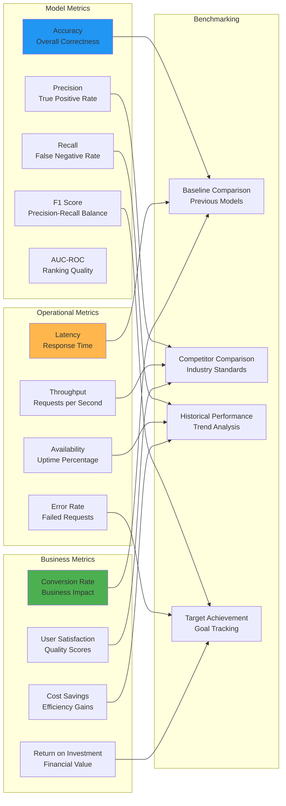

## AutoML vs Custom ML Comparison

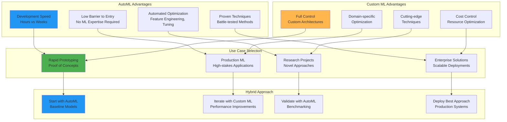

This visual guide illustrates the comprehensive capabilities of Google Cloud AutoML, showing how it automates complex ML workflows while providing enterprise-grade features for model development, deployment, and monitoring. The diagrams demonstrate the end-to-end process from data preparation through production deployment, highlighting AutoML's role in democratizing machine learning across organizations.
