# BigQuery Visual Architecture and Diagrams

## Overview

This document provides visual representations of BigQuery's architecture, data flows, and integration patterns using Mermaid diagrams.

## Core Architecture

### BigQuery Service Architecture

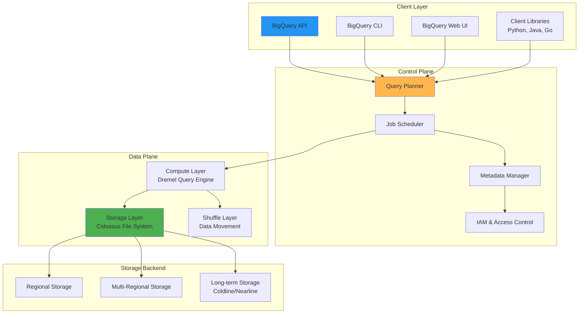

### Data Ingestion Architecture

```mermaid
graph TD
    subgraph "Data Sources"
        GCS[Cloud Storage]
        PubSub[Pub/Sub]
        Dataflow[Dataflow]
        TransferService[Data Transfer Service]
        Apps[Applications]
        IoT[IoT Devices]
    end

    subgraph "Ingestion Methods"
        BatchLoad[Batch Loading<br/>LOAD DATA]
        StreamingInsert[Streaming Inserts<br/>insertAll()]
        TransferJobs[Transfer Jobs<br/>Scheduled Imports]
        ExternalTables[External Tables<br/>Federated Queries]
    end

    subgraph "BigQuery Processing"
        IngestionService[Ingestion Service]
        StreamingBuffer[Streaming Buffer<br/>Temporary Storage]
        StorageManager[Storage Manager]
    end

    subgraph "BigQuery Tables"
        NativeTables[Native Tables<br/>Managed Storage]
        PartitionedTables[Partitioned Tables<br/>Time-based/Range]
        ClusteredTables[Clustered Tables<br/>Sorted Storage]
    end

    GCS --> BatchLoad
    PubSub --> StreamingInsert
    Dataflow --> StreamingInsert
    TransferService --> TransferJobs
    Apps --> StreamingInsert
    IoT --> StreamingInsert
    GCS --> ExternalTables

    BatchLoad --> IngestionService
    StreamingInsert --> IngestionService
    TransferJobs --> IngestionService
    ExternalTables --> IngestionService

    IngestionService --> StreamingBuffer
    StreamingBuffer --> StorageManager
    IngestionService --> StorageManager

    StorageManager --> NativeTables
    StorageManager --> PartitionedTables
    StorageManager --> ClusteredTables

    style GCS fill:#2196f3
    style IngestionService fill:#ffb74d
    style NativeTables fill:#4caf50
```

## Data Organization

### Dataset and Table Hierarchy

```mermaid
graph TD
    subgraph "Project"
        Project[BigQuery Project<br/>billing & quotas]
    end

    subgraph "Datasets"
        Dataset1[Dataset 1<br/>us-central1<br/>Labels: env=prod]
        Dataset2[Dataset 2<br/>eu-west1<br/>Labels: env=dev]
        Dataset3[Dataset 3<br/>asia-east1<br/>Labels: env=test]
    end

    subgraph "Tables in Dataset 1"
        Table1[users<br/>Native Table<br/>1.2 TB]
        Table2[orders<br/>Partitioned by date<br/>500 GB]
        Table3[products<br/>Clustered by category<br/>100 GB]
        Table4[sales_summary<br/>External Table<br/>Cloud Storage]
    end

    subgraph "Table Details"
        Schema[Schema<br/>Columns & Types]
        Partitioning[Partitioning<br/>Strategy]
        Clustering[Clustering<br/>Columns]
        Metadata[Metadata<br/>Created, Modified]
    end

    Project --> Dataset1
    Project --> Dataset2
    Project --> Dataset3

    Dataset1 --> Table1
    Dataset1 --> Table2
    Dataset1 --> Table3
    Dataset1 --> Table4

    Table1 --> Schema
    Table2 --> Partitioning
    Table3 --> Clustering
    Table4 --> Metadata

    style Project fill:#2196f3
    style Dataset1 fill:#ffb74d
    style Table1 fill:#4caf50
```

### Partitioning and Clustering

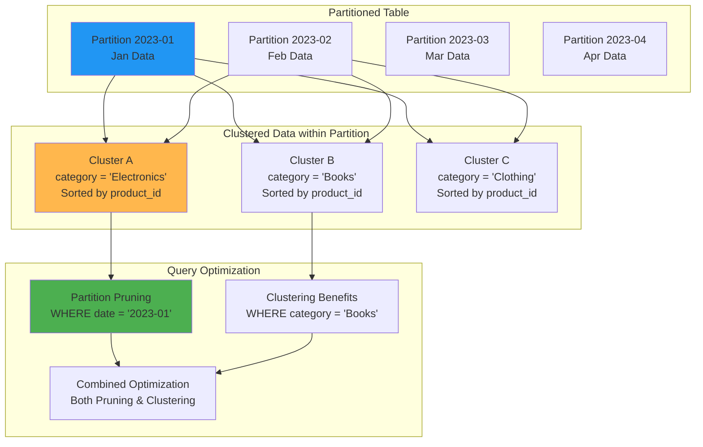

## Query Execution Flow

### BigQuery Query Processing

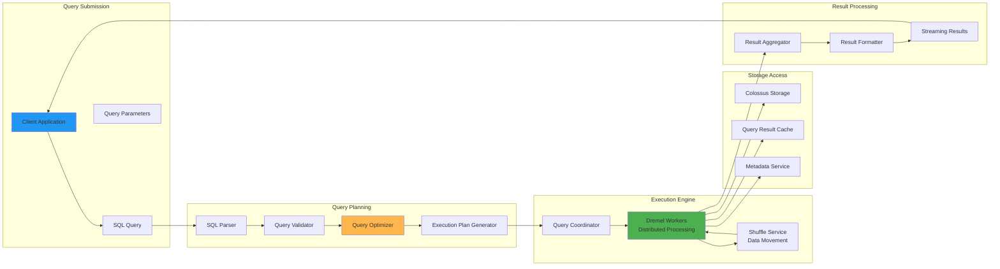

### Distributed Query Execution

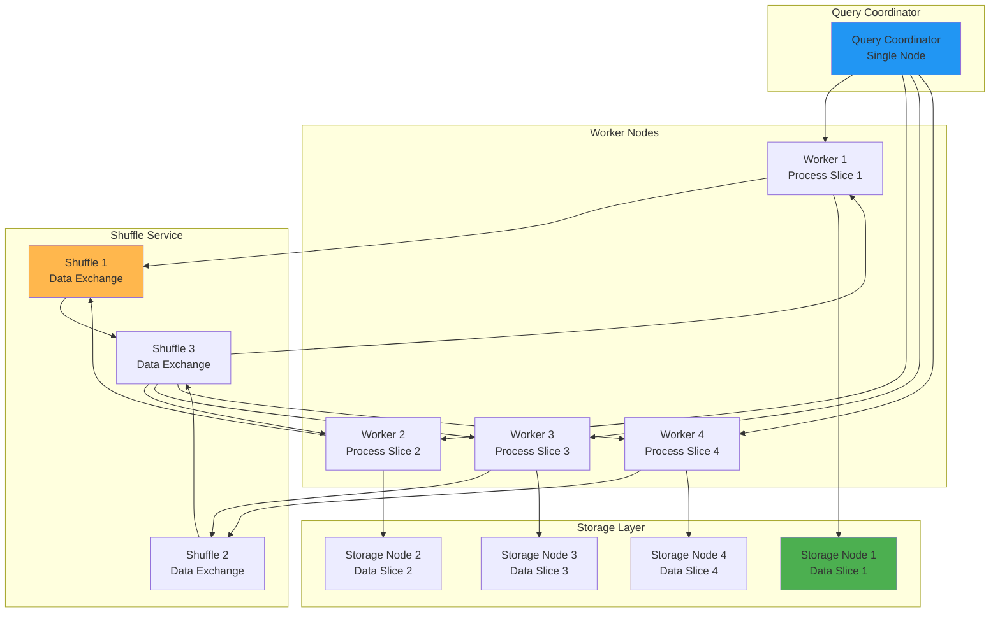

## Integration Patterns

### BigQuery with Google Cloud Ecosystem

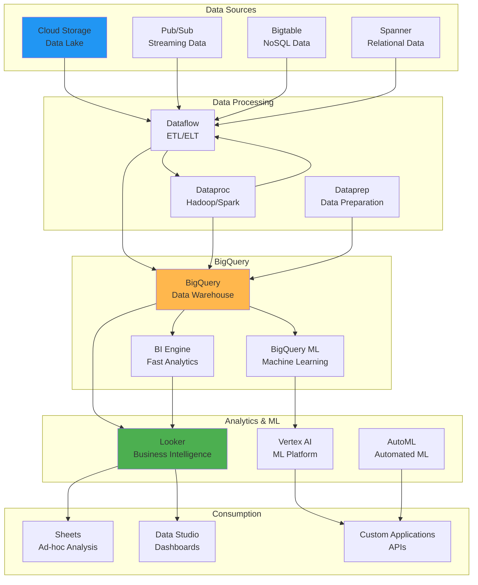

### Real-time Analytics Pipeline

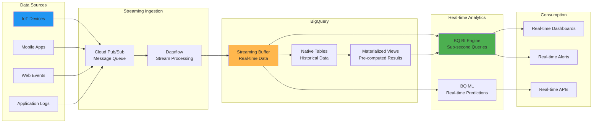

## Security Architecture

### BigQuery Security Model

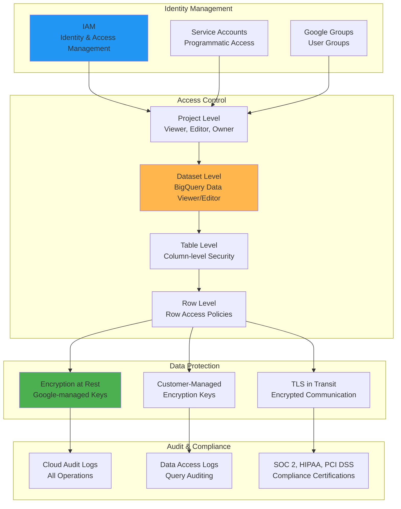

### Data Encryption Flow

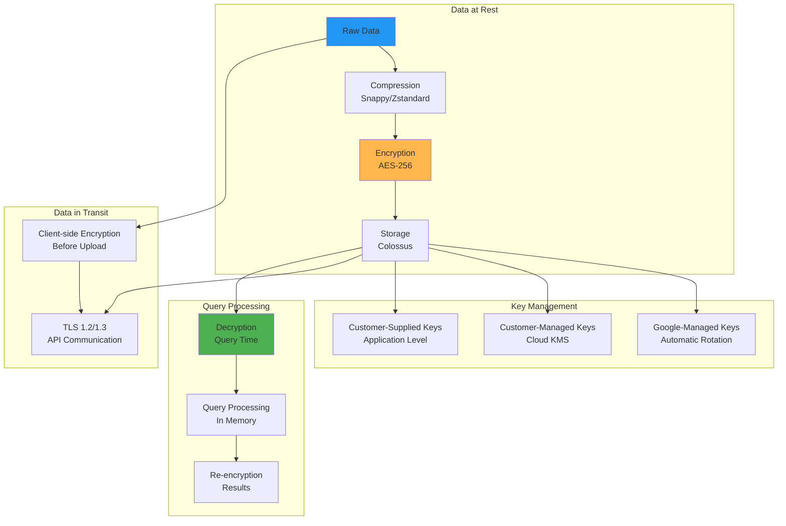

## Performance Optimization

### Query Performance Patterns

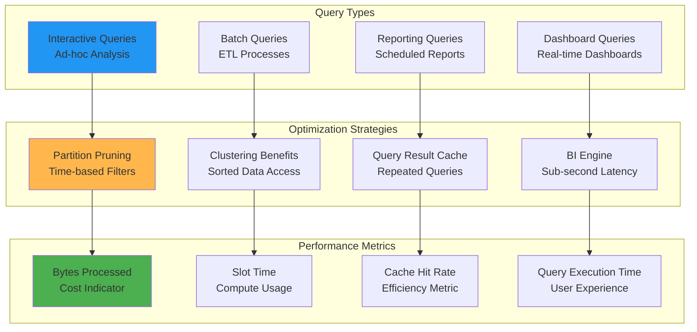

### Cost Optimization Architecture

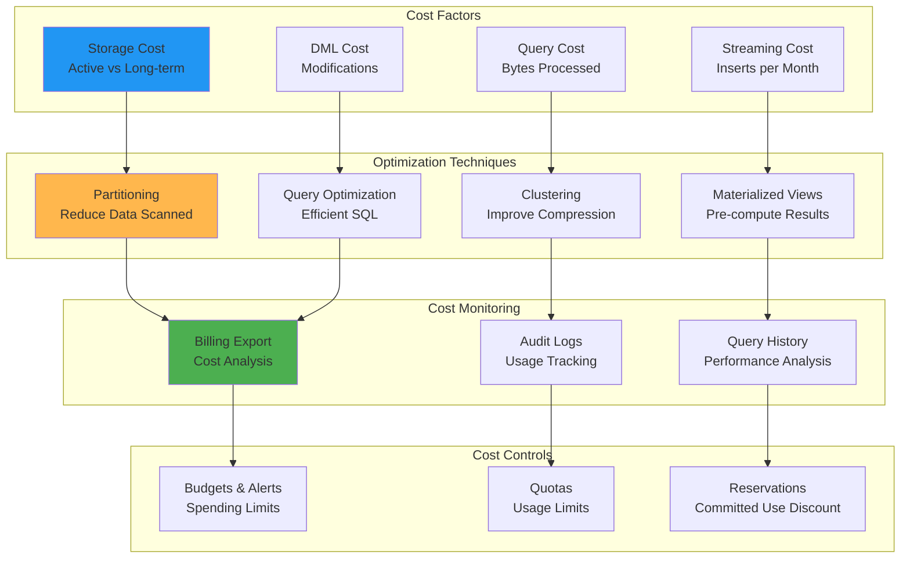

## Machine Learning Integration

### BigQuery ML Workflow

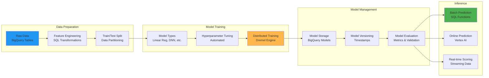

### ML Model Lifecycle

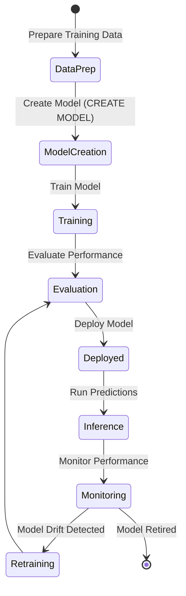

## Multi-Cloud and Hybrid Architectures

### BigQuery Omni Architecture

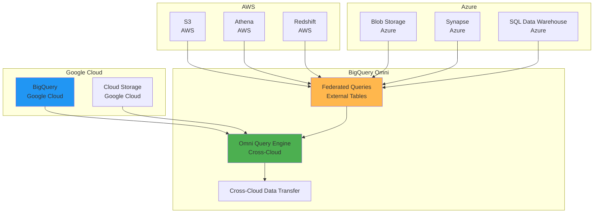

## Summary

These diagrams illustrate the key architectural patterns and data flows in BigQuery:

1. **Service Architecture**: Separation of storage and compute, distributed processing
2. **Data Ingestion**: Multiple methods for batch and streaming data
3. **Data Organization**: Hierarchical structure with partitioning and clustering
4. **Query Execution**: Distributed processing with Dremel engine
5. **Integration Patterns**: Deep integration with Google Cloud ecosystem
6. **Security Model**: Multi-layered security with encryption and access control
7. **Performance Optimization**: Partitioning, clustering, and caching strategies
8. **ML Integration**: End-to-end ML workflow within BigQuery
9. **Multi-Cloud**: Cross-cloud analytics with BigQuery Omni

These visual representations help understand how BigQuery components interact and how to design efficient data warehouse architectures.
