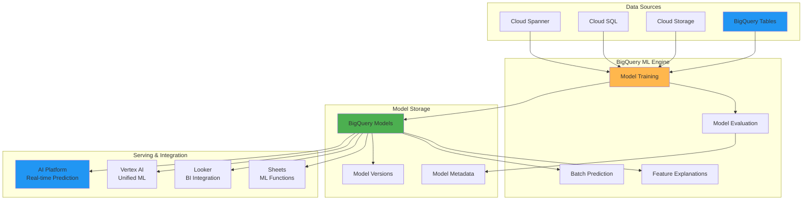
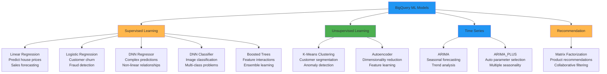
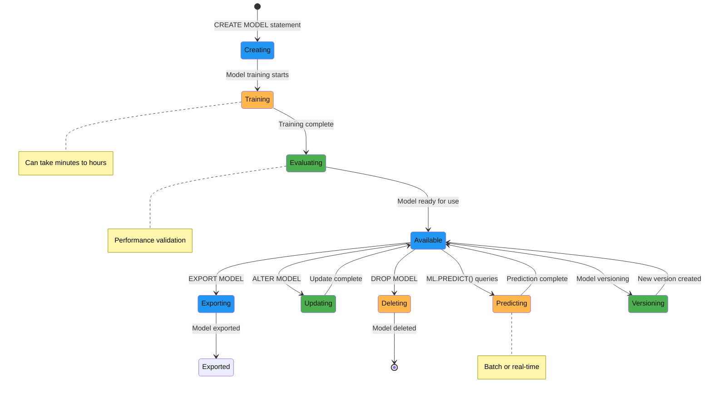
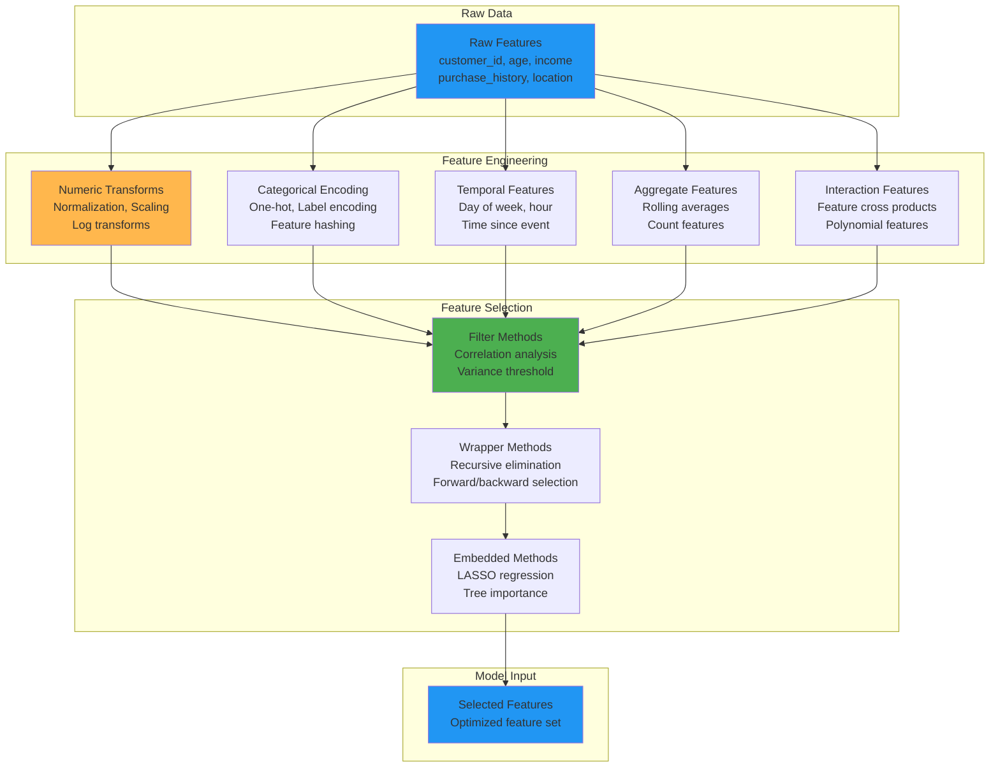
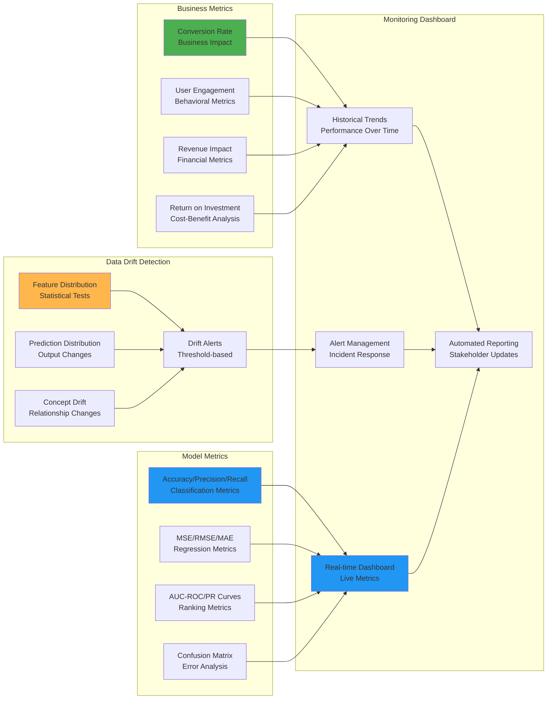
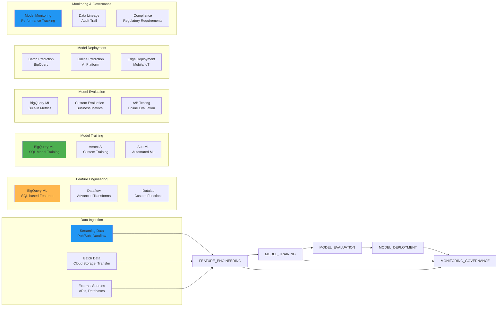

# BigQuery ML Visual Guide

## BigQuery ML Architecture Overview



## ML Model Types and Use Cases



## Model Training Workflow

```mermaid
graph LR
    subgraph "Data Preparation"
        INGEST[Data Ingestion<br/>BigQuery Tables]
        CLEAN[Data Cleaning<br/>SQL Queries]
        FEATURE[Feature Engineering<br/>SQL Transforms]
        SPLIT[Train/Validation/Test Split<br/>SQL Sampling]
    end

    subgraph "Model Training"
        CREATE[CREATE MODEL<br/>SQL Statement]
        OPTIONS[Model Options<br/>Type, Parameters]
        TRAIN_EXEC[Training Execution<br/>Distributed Processing]
        VALIDATE[Cross-Validation<br/>K-Fold Validation]
    end

    subgraph "Model Evaluation"
        METRICS[Performance Metrics<br/>Accuracy, AUC, RMSE]
        CONFUSION[Confusion Matrix<br/>Classification Analysis]
        FEATURE_IMP[Feature Importance<br/>SHAP Values]
        VALIDATION[Validation Results<br/>Overfitting Check]
    end

    INGEST --> CLEAN
    CLEAN --> FEATURE
    FEATURE --> SPLIT

    SPLIT --> CREATE
    CREATE --> OPTIONS
    OPTIONS --> TRAIN_EXEC
    TRAIN_EXEC --> VALIDATE

    VALIDATE --> METRICS
    METRICS --> CONFUSION
    CONFUSION --> FEATURE_IMP
    FEATURE_IMP --> VALIDATION

    style INGEST fill:#2196f3
    style CREATE fill:#ffb74d
    style METRICS fill:#4caf50
```



## Model Lifecycle Management



## Feature Engineering Patterns



## Prediction and Serving Architecture

```mermaid
graph TB
    subgraph "Batch Prediction"
        BATCH_DATA[Batch Data<br/>BigQuery Tables]
        ML_PREDICT[ML.PREDICT()<br/>SQL Function]
        BATCH_RESULTS[Prediction Results<br/>BigQuery Table]
        EXPORT[Export Results<br/>CSV, JSON]
    end

    subgraph "Real-time Prediction"
        REST_API[REST API Request<br/>JSON Payload]
        AIP_ENDPOINT[AI Platform<br/>Prediction Endpoint]
        MODEL_SERVING[Model Serving<br/>Auto-scaling]
        PREDICTION_RESPONSE[Prediction Response<br/>JSON Result]
    end

    subgraph "Model Explainability"
        EXPLAIN_PREDICT[ML.EXPLAIN_PREDICT()<br/>Feature Importance]
        SHAP_VALUES[SHAP Values<br/>Feature Contributions]
        FEATURE_PLOTS[Feature Plots<br/>Waterfall Charts]
    end

    BATCH_DATA --> ML_PREDICT
    ML_PREDICT --> BATCH_RESULTS
    BATCH_RESULTS --> EXPORT

    REST_API --> AIP_ENDPOINT
    AIP_ENDPOINT --> MODEL_SERVING
    MODEL_SERVING --> PREDICTION_RESPONSE

    MODEL_SERVING --> EXPLAIN_PREDICT
    EXPLAIN_PREDICT --> SHAP_VALUES
    SHAP_VALUES --> FEATURE_PLOTS

    style BATCH_DATA fill:#2196f3
    style ML_PREDICT fill:#ffb74d
    style REST_API fill:#4caf50
    style EXPLAIN_PREDICT fill:#2196f3
```

## Time Series Forecasting

```mermaid
graph LR
    subgraph "Time Series Data"
        HISTORICAL[Historical Data<br/>Timestamp, Value<br/>Multiple Series]
        SEASONAL[Seasonal Patterns<br/>Daily, Weekly, Monthly]
        TREND[Trend Components<br/>Linear, Exponential]
        NOISE[Noise & Anomalies<br/>Random Variations]
    end

    subgraph "ARIMA Modeling"
        AUTO_ARIMA[Auto ARIMA<br/>Parameter Selection]
        SEASONAL_ARIMA[Seasonal ARIMA<br/>(p,d,q)(P,D,Q)m]
        MODEL_FIT[Model Fitting<br/>Maximum Likelihood]
        RESIDUALS[Residual Analysis<br/>White Noise Check]
    end

    subgraph "Forecasting"
        POINT_FORECAST[Point Forecasts<br/>Expected Values]
        CONFIDENCE_INTERVALS[Confidence Intervals<br/>Prediction Uncertainty]
        FORECAST_HORIZON[Forecast Horizon<br/>Future Time Points]
    end

    subgraph "Evaluation"
        ACCURACY_METRICS[Accuracy Metrics<br/>MAE, RMSE, MAPE]
        FORECAST_ERRORS[Forecast Errors<br/>Residual Analysis]
        MODEL_SELECTION[Model Selection<br/>Best Fit Criteria]
    end

    HISTORICAL --> AUTO_ARIMA
    SEASONAL --> SEASONAL_ARIMA
    TREND --> MODEL_FIT
    NOISE --> RESIDUALS

    AUTO_ARIMA --> MODEL_FIT
    SEASONAL_ARIMA --> MODEL_FIT
    MODEL_FIT --> RESIDUALS

    MODEL_FIT --> POINT_FORECAST
    RESIDUALS --> CONFIDENCE_INTERVALS
    POINT_FORECAST --> FORECAST_HORIZON

    FORECAST_HORIZON --> ACCURACY_METRICS
    CONFIDENCE_INTERVALS --> FORECAST_ERRORS
    FORECAST_ERRORS --> MODEL_SELECTION

    style HISTORICAL fill:#2196f3
    style AUTO_ARIMA fill:#ffb74d
    style POINT_FORECAST fill:#4caf50
    style ACCURACY_METRICS fill:#2196f3
```

## Recommendation System Architecture

```mermaid
graph TD
    subgraph "User-Item Interactions"
        USER_MATRIX[User Matrix<br/>User Latent Factors]
        ITEM_MATRIX[Item Matrix<br/>Item Latent Factors]
        RATING_MATRIX[Rating Matrix<br/>Sparse User-Item Matrix]
    end

    subgraph "Matrix Factorization"
        TRAINING[Training Process<br/>Alternating Least Squares]
        LATENT_FACTORS[Latent Factors<br/>k-dimensional vectors]
        REGULARIZATION[Regularization<br/>L2 Regularization]
        LOSS_FUNCTION[Loss Function<br/>RMSE Optimization]
    end

    subgraph "Recommendation Generation"
        USER_SIMILARITY[User Similarity<br/>Cosine Similarity]
        ITEM_SIMILARITY[Item Similarity<br/>Collaborative Filtering]
        PREDICTED_RATINGS[Predicted Ratings<br/>Dot Product]
        TOP_N[Top-N Recommendations<br/>Ranking & Filtering]
    end

    subgraph "Evaluation & Serving"
        PRECISION_RECALL[Precision@K, Recall@K<br/>Ranking Metrics]
        NDCG[NDCG<br/>Normalized Discounted<br/>Cumulative Gain]
        A_B_TESTING[A/B Testing<br/>Online Evaluation]
        REAL_TIME_SERVING[Real-time Serving<br/>Low Latency Recommendations]
    end

    USER_MATRIX --> TRAINING
    ITEM_MATRIX --> TRAINING
    RATING_MATRIX --> TRAINING

    TRAINING --> LATENT_FACTORS
    LATENT_FACTORS --> REGULARIZATION
    REGULARIZATION --> LOSS_FUNCTION

    LOSS_FUNCTION --> USER_SIMILARITY
    LOSS_FUNCTION --> ITEM_SIMILARITY
    USER_SIMILARITY --> PREDICTED_RATINGS
    ITEM_SIMILARITY --> PREDICTED_RATINGS
    PREDICTED_RATINGS --> TOP_N

    TOP_N --> PRECISION_RECALL
    PRECISION_RECALL --> NDCG
    NDCG --> A_B_TESTING
    A_B_TESTING --> REAL_TIME_SERVING

    style USER_MATRIX fill:#2196f3
    style TRAINING fill:#ffb74d
    style USER_SIMILARITY fill:#4caf50
    style PRECISION_RECALL fill:#2196f3
```

## Model Performance Monitoring



## Cost Optimization Strategies

```mermaid
graph TD
    A[BigQuery ML Cost Optimization] --> B[Query Optimization]
    A --> C[Storage Optimization]
    A --> D[Model Optimization]
    A --> E[Pricing Strategy]

    B --> B1[Partitioning<br/>Time-based partitions]
    B --> B2[Clustering<br/>Column-based clustering]
    B --> B3[Materialized Views<br/>Pre-computed results]
    B --> B4[BI Engine<br/>In-memory acceleration]

    C --> C1[Data Lifecycle<br/>Automatic data deletion]
    C --> C2[Compression<br/>Storage optimization]
    C --> C3[Column Storage<br/>Efficient data layout]

    D --> D1[Feature Selection<br/>Reduce input features]
    D --> D2[Model Type Selection<br/>Choose simpler models]
    D --> D3[Hyperparameter Tuning<br/>Optimize training]
    D --> D4[Early Stopping<br/>Prevent overfitting]

    E --> E1[Flat-rate Pricing<br/>For heavy users]
    E --> E2[On-demand Pricing<br/>For occasional use]
    E --> E3[Slot Reservation<br/>Guaranteed capacity]
    E --> E4[Cost Monitoring<br/>Budget alerts]

    style A fill:#2196f3
    style B fill:#ffb74d
    style C fill:#4caf50
    style D fill:#2196f3
    style E fill:#ffb74d
```



## Integration with ML Pipeline



## Security and Compliance

```mermaid
graph TB
    subgraph "Data Security"
        ENCRYPTION[Encryption at Rest<br/>Customer-Managed Keys]
        ACCESS_CONTROL[IAM Access Control<br/>Fine-grained Permissions]
        AUDIT_LOGGING[Audit Logging<br/>Comprehensive Tracking]
        DATA_LOSS_PREVENTION[DLP Integration<br/>Sensitive Data Protection]
    end

    subgraph "Model Security"
        MODEL_ENCRYPTION[Model Encryption<br/>Secure Storage]
        PREDICTION_LOGGING[Prediction Logging<br/>Usage Tracking]
        VERSION_CONTROL[Version Control<br/>Model Governance]
        COMPLIANCE_CHECKS[Compliance Checks<br/>Regulatory Requirements]
    end

    subgraph "Network Security"
        VPC_SERVICE_CONTROLS[VPC Service Controls<br/>Data Exfiltration Prevention]
        PRIVATE_CONNECTIVITY[Private Google Access<br/>Secure Connectivity]
        FIREWALL_RULES[Firewall Rules<br/>Network Isolation]
    end

    subgraph "Operational Security"
        MONITORING_ALERTS[Monitoring & Alerts<br/>Security Events]
        INCIDENT_RESPONSE[Incident Response<br/>Breach Handling]
        BACKUP_RECOVERY[Backup & Recovery<br/>Disaster Recovery]
        COMPLIANCE_REPORTING[Compliance Reporting<br/>Audit Reports]
    end

    ENCRYPTION --> MONITORING_ALERTS
    ACCESS_CONTROL --> MONITORING_ALERTS
    AUDIT_LOGGING --> MONITORING_ALERTS
    DATA_LOSS_PREVENTION --> MONITORING_ALERTS

    MODEL_ENCRYPTION --> INCIDENT_RESPONSE
    PREDICTION_LOGGING --> INCIDENT_RESPONSE
    VERSION_CONTROL --> INCIDENT_RESPONSE
    COMPLIANCE_CHECKS --> INCIDENT_RESPONSE

    VPC_SERVICE_CONTROLS --> BACKUP_RECOVERY
    PRIVATE_CONNECTIVITY --> BACKUP_RECOVERY
    FIREWALL_RULES --> BACKUP_RECOVERY

    MONITORING_ALERTS --> COMPLIANCE_REPORTING
    INCIDENT_RESPONSE --> COMPLIANCE_REPORTING
    BACKUP_RECOVERY --> COMPLIANCE_REPORTING

    style ENCRYPTION fill:#2196f3
    style MODEL_ENCRYPTION fill:#ffb74d
    style VPC_SERVICE_CONTROLS fill:#4caf50
    style MONITORING_ALERTS fill:#2196f3
```



This visual guide illustrates the comprehensive capabilities of BigQuery ML, showing how it integrates with the broader Google Cloud ecosystem to provide a complete machine learning platform accessible through SQL. The diagrams demonstrate the workflow from data preparation through model deployment and monitoring, highlighting the power of SQL-based machine learning.
