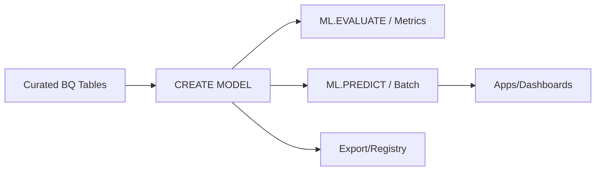

# BigQuery ML Guide – Basic → Architect

## Level 1 – Launch & Basics

### 1. Quick Model
```sql
CREATE OR REPLACE MODEL `demo.linreg`
OPTIONS(model_type='linear_reg') AS
SELECT feature1, feature2, label FROM `dataset.table`;

SELECT * FROM ML.EVALUATE(MODEL `demo.linreg`);
SELECT * FROM ML.PREDICT(MODEL `demo.linreg`, (SELECT * FROM `dataset.table`));
```

### 2. Core Concepts
- In-database ML: training/inference inside BigQuery
- Supported models: linear/logistic regression, k-means, matrix factorization, time series (ARIMA+), boosted trees, deep neural nets (limited), AutoML integration
- Feature preprocessing options (auto/transform)

### 3. Data Prep
- Use partitioned/clustered tables; handle data leakage; standardize splits

## Level 2 – Production Patterns

### Model Lifecycle
- Train/eval with ML.EVALUATE; hold-out/validation sets
- Hyperparameter tuning via ML.TRIALS for boosted trees/AutoML models
- Feature columns selected explicitly; avoid SELECT *

### Performance & Cost
- Train on filtered/curated data; sample for prototyping
- Use scheduled queries for retraining; table expiration management
- Monitor slot usage and job costs; prefer partition pruning

### Integration
- Export/import models; remote models; inference via SQL or batch
- Feature Store integration for consistent features (Vertex FS)

## Level 3 – Architect Playbook

### Governance
- Model registry via dataset + naming; version with suffixes
- Document metrics and data used; lineage and change logs
- Access control: dataset IAM; Authorized Views

### Reliability & Ops
- Scheduled retraining with checks; alerts on job failures
- Validate data drift; compare metrics vs previous version
- Canary predictions before full rollout

### Security
- CMEK on datasets; row/column security; audit logs

## Ops Cheat Sheet

| Task | SQL | Note |
| --- | --- | --- |
| Train | `CREATE MODEL ... AS SELECT ...` | in-DB |
| Evaluate | `ML.EVALUATE(MODEL ...)` | metrics |
| Predict | `ML.PREDICT(MODEL ..., SELECT ...)` | inference |
| Explain | `ML.EXPLAIN_PREDICT` / `ML.GLOBAL_EXPLAIN` | feature impact |
| Tune | `ML.TRIALS` with OPTIONS | hyperparams |

## Architecture Patterns



## Checklist Before Production
- [ ] Clean, partitioned data; leakage checked; features intentional
- [ ] Evaluation documented; thresholds/metrics tracked per version
- [ ] Scheduled retrain with monitoring; drift checks
- [ ] Access control on datasets/models; CMEK if needed
- [ ] Cost monitored; slot usage acceptable; pruning applied

## Learning Path Links
- Track: `LearningTracks/MLOps-GCP/track.md`
- Projects: `Projects/GCP-MLOps/starter/02-bqml-baseline.md` and `Projects/Integrated/mlops-gcp-capstone.md`
- Mastery: `Mastery/GCP-BigQueryML/` (quiz, scenarios, flashcards)

