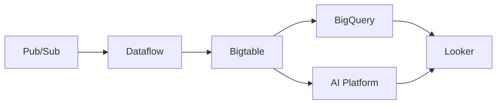

# Cloud Bigtable - Interview Questions & Answers

## Beginner Level Questions

### 1. What is Cloud Bigtable and when would you use it?

**Answer:**
Cloud Bigtable is Google's fully managed, scalable NoSQL database service designed for large analytical and operational workloads. It's built on the same technology that powers Google Search, Analytics, and Gmail.

**Key Use Cases:**
- **Time-series data**: IoT sensor data, financial market data
- **High-throughput applications**: Ad tech, user analytics
- **Large-scale analytics**: Genomics data, machine learning datasets
- **Operational workloads**: User behavior tracking, recommendation systems

**Why Bigtable over other databases:**
- Handles petabytes of data with millions of operations per second
- Sub-millisecond latency for both reads and writes
- Automatic scaling and high availability
- Strong consistency guarantees

### 2. Explain the basic data model of Bigtable.

**Answer:**
Bigtable uses a wide-column data model with four main components:

**Table Structure:**
```
Table
├── Row Key (unique identifier, like primary key)
├── Column Family 1
│   ├── Column Qualifier 1
│   │   ├── Cell (value + timestamp)
│   │   └── Cell (value + timestamp)
│   └── Column Qualifier 2
│       └── Cell (value + timestamp)
└── Column Family 2
    └── ...
```

**Key Characteristics:**
- **Sparse**: Columns can be different for each row
- **Multi-versioned**: Multiple timestamped values per cell
- **Sorted**: Rows are lexicographically sorted by row key
- **Distributed**: Data automatically partitioned across tablets

### 3. How does Bigtable differ from traditional relational databases?

**Answer:**

| Aspect | Bigtable | Relational Databases |
|--------|----------|---------------------|
| **Data Model** | Wide-column, sparse | Fixed schema, normalized |
| **Scaling** | Horizontal, automatic | Vertical, manual |
| **Consistency** | Strong consistency | ACID transactions |
| **Query Language** | No SQL, key-based access | SQL |
| **Schema Flexibility** | Dynamic columns | Fixed schema |
| **Performance** | Optimized for high throughput | Optimized for complex queries |

**Bigtable Advantages:**
- Scales to petabytes without performance degradation
- Handles millions of operations per second
- No fixed schema constraints
- Lower operational overhead

### 4. What are column families in Bigtable?

**Answer:**
Column families are groups of related columns that share configuration and are stored together physically.

**Key Characteristics:**
- **Grouping**: Related columns grouped for performance
- **Configuration**: Shared settings for compression, GC policy
- **Access Patterns**: Designed around how data is accessed
- **Performance**: Affects read/write efficiency

**Best Practices:**
- Limit to 2-3 column families per table
- Group columns accessed together
- Use descriptive names (e.g., "metrics", "metadata")
- Configure appropriate garbage collection policies

## Intermediate Level Questions

### 5. How does Bigtable achieve high performance and scalability?

**Answer:**

**Architecture Components:**
- **Tablets**: 64MB-1GB contiguous row ranges
- **Tablet Servers**: Handle read/write operations
- **Master Server**: Coordinates tablet assignments
- **SSTable Storage**: Immutable, sorted data files

**Performance Features:**
- **Horizontal Scaling**: Add nodes dynamically
- **Load Balancing**: Automatic data redistribution
- **Caching**: Block cache and Bloom filters
- **Compression**: Data compression for storage efficiency

**Scalability Mechanisms:**
- **Tablet Splitting**: Automatic range partitioning
- **Replication**: Cross-zone data replication
- **Load-based Migration**: Move tablets between servers

### 6. Explain the read and write paths in Bigtable.

**Answer:**

**Write Path:**
1. **Client** sends write request to Bigtable frontend
2. **Frontend** routes to appropriate tablet server
3. **Tablet Server** writes to MemTable (in-memory buffer)
4. **WAL** (Write-Ahead Log) ensures durability
5. **Ack** sent to client immediately
6. **Async**: MemTable flushed to SSTable when full

**Read Path:**
1. **Client** sends read request
2. **Frontend** routes to tablet server
3. **Tablet Server** checks MemTable first
4. **Block Cache** checked for cached data
5. **SSTable** files read from disk if needed
6. **Bloom Filters** help skip unnecessary reads
7. **Data** merged and returned to client

**Performance Optimizations:**
- **Compaction**: Merges SSTable files
- **Caching**: Reduces disk I/O
- **Bloom Filters**: Minimize unnecessary reads

### 7. How do you design row keys for optimal performance?

**Answer:**

**Key Principles:**
- **Distribution**: Avoid hotspots by spreading load
- **Access Patterns**: Design for common query patterns
- **Scalability**: Support future growth

**Good Row Key Designs:**
```javascript
// Time-series data
"device001#2023-01-15-10:30:00"  // Device + reverse timestamp

// User data with hash
"hash123#user456#profile"  // Hash + user + data type

// Multi-tenant
"tenantA#user123#session001"  // Tenant isolation
```

**Common Anti-patterns:**
```javascript
// Hotspot: Sequential timestamps
"2023-01-15-10:30:00"  // All writes go to one tablet

// Hotspot: Sequential IDs
"user001", "user002", "user003"  // Lexicographic ordering

// Too wide: Unbounded ranges
"all_users#data"  // Single tablet bottleneck
```

### 8. What is compaction in Bigtable and why is it important?

**Answer:**

**Compaction Process:**
- **Minor Compaction**: Merges small SSTable files
- **Major Compaction**: Merges all SSTable files for a tablet
- **Size-tiered**: Based on file sizes
- **Leveled**: Hierarchical organization

**Benefits:**
- **Performance**: Reduces read amplification
- **Storage**: Reclaims space from deleted data
- **Efficiency**: Optimizes data layout

**Types of Compaction:**
- **Minor**: Frequent, small merges
- **Major**: Periodic, comprehensive merge
- **Manual**: Triggered by administrators

**Impact on Performance:**
- **During compaction**: Temporary I/O increase
- **After compaction**: Better read performance
- **Storage savings**: Reduced disk usage

## Advanced Level Questions

### 9. How would you handle a hotspotting issue in Bigtable?

**Answer:**

**Identify Hotspots:**
- Monitor tablet server CPU utilization
- Check for uneven load distribution
- Analyze row key patterns

**Solutions:**

**Row Key Redesign:**
```javascript
// Before: Hotspot
"user001#data", "user002#data", "user003#data"

// After: Distributed
"hash1#user001#data", "hash2#user002#data", "hash3#user003#data"
```

**Hashing Strategies:**
- **MD5/SHA256**: Cryptographic hashing
- **Modulo**: Simple distribution
- **Consistent Hashing**: Minimal redistribution

**Operational Solutions:**
- **Tablet Splitting**: Force split hot tablets
- **Node Scaling**: Add more tablet servers
- **Load Balancing**: Manual tablet migration

**Prevention:**
- **Design Review**: Row key design in planning phase
- **Monitoring**: Set up alerts for hotspots
- **Testing**: Load test with production data patterns

### 10. Explain Bigtable's replication and consistency model.

**Answer:**

**Replication Architecture:**
- **Synchronous replication** within region
- **Cross-zone replication** for availability
- **Multi-region** for disaster recovery
- **Quorum-based consensus** for consistency

**Consistency Guarantees:**
- **Strong Consistency**: All replicas have same data
- **Timeline Consistency**: Causal relationships preserved
- **Eventual Consistency**: Temporary inconsistencies allowed

**Replication Process:**
1. **Write** to primary replica
2. **Synchronous replication** to other zones
3. **Quorum acknowledgment** before commit
4. **Async replication** to other regions (optional)

**Failure Handling:**
- **Automatic failover** to healthy replicas
- **Quorum maintenance** during outages
- **Data durability** through replication

### 11. How do you optimize Bigtable for time-series workloads?

**Answer:**

**Schema Design:**
```javascript
// Row Key: device#reverse_timestamp
"device001#2023-12-31-23:59:59"

// Column Families
"metrics"  // sensor readings
"metadata"  // device info
"alerts"   // threshold violations
```

**Optimization Strategies:**
- **Reverse Timestamps**: Avoid hotspotting on recent data
- **Time-based Partitioning**: Natural data distribution
- **Column Family Separation**: Group related metrics
- **TTL Policies**: Automatic data expiration

**Query Patterns:**
- **Range Scans**: Efficient time-based queries
- **Prefix Scans**: Device-specific data retrieval
- **Batch Operations**: Multiple device queries

**Performance Tuning:**
- **Block Cache**: Cache frequently accessed data
- **Bloom Filters**: Optimize read performance
- **Compression**: Reduce storage and I/O

### 12. What are the backup and disaster recovery options for Bigtable?

**Answer:**

**Backup Options:**
- **Scheduled Backups**: Automated snapshots
- **Manual Snapshots**: On-demand backups
- **Cross-region Replication**: Continuous replication
- **Export to GCS**: Data archival

**Recovery Scenarios:**
- **Point-in-time Recovery**: Restore to specific timestamp
- **Table-level Restore**: Restore individual tables
- **Cluster-level Recovery**: Full cluster restoration

**Implementation:**
```bash
# Create backup
cbt create-backup my-table my-backup \
  --cluster=my-cluster \
  --retention-period=7d

# Restore from backup
cbt restore-table my-table \
  --backup=my-backup \
  --async
```

**Best Practices:**
- **Regular Testing**: Validate backup integrity
- **Retention Policies**: Balance cost and requirements
- **Multi-region Setup**: Disaster recovery readiness

### 13. How does Bigtable integrate with other GCP services?

**Answer:**

**Analytics Integration:**
- **BigQuery**: Federated queries without data movement
- **Dataflow**: Real-time stream processing
- **Dataproc**: Batch processing with Spark/Hadoop

**AI/ML Integration:**
- **AI Platform**: Feature store for ML models
- **AutoML**: Automated model training
- **Vertex AI**: End-to-end ML pipelines

**Data Pipeline:**


**Integration Patterns:**
- **Change Data Capture**: Stream changes to other systems
- **Federated Analytics**: Query Bigtable from BigQuery
- **Feature Serving**: Real-time feature retrieval for ML

### 14. How do you monitor and troubleshoot Bigtable performance?

**Answer:**

**Key Metrics to Monitor:**
- **Latency**: Read/write operation times
- **Throughput**: Operations per second
- **CPU Utilization**: Tablet server load
- **Disk I/O**: Storage performance
- **Tablet Splits**: Cluster growth indicators

**Monitoring Tools:**
- **Cloud Monitoring**: Built-in dashboards and alerts
- **Custom Metrics**: Application-specific monitoring
- **Cloud Logging**: Audit logs and error tracking

**Common Issues and Solutions:**

**High Latency:**
- Check tablet server CPU utilization
- Monitor disk I/O saturation
- Review row key distribution

**Hotspotting:**
- Analyze row key patterns
- Implement key hashing
- Consider tablet splitting

**Storage Issues:**
- Monitor disk space usage
- Configure appropriate TTL policies
- Implement data lifecycle management

### 15. Design a Bigtable schema for an IoT analytics platform.

**Answer:**

**Requirements Analysis:**
- **Data Volume**: Millions of sensors, continuous readings
- **Query Patterns**: Time-based analytics, device-specific queries
- **Performance**: Real-time dashboards, historical analysis
- **Retention**: 30-day hot data, 1-year cold data

**Schema Design:**

**Row Key Design:**
```
device_id#reverse_timestamp#reading_type
sensor001#2023-12-31-23:59:59#temperature
sensor001#2023-12-31-23:59:59#humidity
```

**Column Families:**
```javascript
// Metrics: sensor readings
columnFamily: "metrics"
gcRule: {maxVersions: 1}
compression: SNAPPY

// Metadata: device information
columnFamily: "metadata"
gcRule: {maxAge: 365 days}
compression: GZIP

// Alerts: threshold violations
columnFamily: "alerts"
gcRule: {maxAge: 90 days}
compression: NONE
```

**Access Patterns:**
- **Real-time Dashboard**: Range scan on recent data
- **Device History**: Prefix scan on device_id
- **Analytics**: BigQuery federation for complex queries

**Performance Optimizations:**
- **Block Cache**: Enable for hot data
- **Bloom Filters**: Optimize point queries
- **TTL**: Automatic data expiration

### 16. Explain Bigtable's security model and best practices.

**Answer:**

**Security Layers:**

**Identity and Access Management:**
- **IAM Roles**: Bigtable Reader, User, Admin
- **Service Accounts**: Application authentication
- **Fine-grained Access**: Column family level permissions

**Data Protection:**
- **Encryption at Rest**: AES-256 encryption
- **Encryption in Transit**: TLS 1.2+ required
- **Customer-Managed Keys**: CMEK support

**Network Security:**
- **VPC Service Controls**: Network perimeter security
- **Private Google Access**: Private connectivity
- **IP Whitelisting**: Restrict access by IP

**Best Practices:**
- **Principle of Least Privilege**: Minimal required permissions
- **Service Accounts**: Use dedicated service accounts
- **Audit Logging**: Enable Cloud Audit Logs
- **Regular Rotation**: Rotate encryption keys

### 17. How do you migrate data from HBase to Bigtable?

**Answer:**

**Migration Strategies:**

**Direct Migration (Small Datasets):**
1. **Export** HBase data to HDFS
2. **Use Dataflow** to read and transform
3. **Import** directly to Bigtable

**Bulk Loading (Large Datasets):**
1. **Export** to GCS in SSTable format
2. **Use cbt import** command
3. **Validate** data integrity

**Migration Steps:**
```bash
# Export from HBase
hbase org.apache.hadoop.hbase.mapreduce.Export \
  mytable /path/to/export

# Import to Bigtable
cbt import mytable \
  gs://bucket/path/to/data \
  --project=my-project \
  --instance=my-instance
```

**Considerations:**
- **Schema Translation**: Map HBase schema to Bigtable
- **Row Key Compatibility**: Ensure proper distribution
- **Performance Testing**: Validate performance after migration
- **Downtime Planning**: Minimize application impact

### 18. What are the cost optimization strategies for Bigtable?

**Answer:**

**Compute Costs:**
- **Right-sizing**: Match node count to workload
- **Auto-scaling**: Scale during peak hours
- **Development Instances**: Use single-node for testing

**Storage Costs:**
- **Storage Type**: SSD for hot data, HDD for cold
- **Compression**: Reduce storage footprint
- **TTL Policies**: Automatic data deletion

**Network Costs:**
- **Regional Deployment**: Minimize cross-region traffic
- **Caching**: Reduce data transfer
- **Batch Operations**: Optimize network usage

**Optimization Techniques:**
```javascript
// Efficient batch operations
const batch = table.batch();
rows.forEach(row => {
  batch.put(row.key, row.data);
});
await batch.commit();
```

**Monitoring and Alerts:**
- Set up cost budgets and alerts
- Monitor usage patterns
- Regular cost optimization reviews

### 19. How does Bigtable handle schema evolution?

**Answer:**

**Schema-less Nature:**
- **Dynamic Columns**: Add columns without schema changes
- **Sparse Storage**: Missing columns don't consume space
- **Versioned Data**: Multiple versions per cell

**Evolution Patterns:**

**Adding Columns:**
```javascript
// New column appears automatically
row.setCell('metrics', 'new_sensor', 'value');
```

**Changing Column Families:**
- **Create New Family**: Migrate data gradually
- **Update Application**: Point to new family
- **Cleanup**: Remove old family after migration

**Version Management:**
- **Timestamp-based**: Automatic version control
- **GC Policies**: Configure retention rules
- **Application Logic**: Handle version selection

**Best Practices:**
- **Backward Compatibility**: Support old and new schemas
- **Gradual Migration**: Roll out schema changes incrementally
- **Testing**: Validate with all schema versions

### 20. Explain Bigtable's role in machine learning pipelines.

**Answer:**

**Feature Store Use Cases:**
- **Training Data**: Store historical features
- **Real-time Features**: Low-latency feature serving
- **Feature History**: Versioned feature values

**ML Pipeline Integration:**

**Training Phase:**


**Serving Phase:**


**Performance Requirements:**
- **Low Latency**: <10ms feature retrieval
- **High Throughput**: Thousands of predictions/second
- **Consistency**: Fresh feature values

**Optimization Strategies:**
- **Row Key Design**: Optimize for feature lookup patterns
- **Caching**: Application-level feature caching
- **Replication**: Global feature serving

### 21. How do you handle large-scale data loading into Bigtable?

**Answer:**

**Bulk Loading Methods:**

**Dataflow Template:**
```java
BigtableIO.write()
  .withBigtableOptions(options)
  .to(tableId)
  .expand(input);
```

**cbt Import Command:**
```bash
cbt import mytable \
  gs://bucket/data*.sst \
  --project=my-project \
  --instance=my-instance
```

**Custom Loading:**
- **Parallel Writers**: Multiple clients writing simultaneously
- **Batch Operations**: Group mutations for efficiency
- **Rate Limiting**: Control write throughput

**Performance Optimization:**
- **Pre-split Tablets**: Avoid hotspotting during load
- **Disable Compaction**: During initial load
- **Monitor Progress**: Track loading metrics

**Error Handling:**
- **Retry Logic**: Handle transient failures
- **Idempotent Operations**: Safe retry on failures
- **Data Validation**: Verify loaded data integrity

### 22. What are the limitations and trade-offs of using Bigtable?

**Answer:**

**Functional Limitations:**
- **No SQL**: Key-based access only
- **No Joins**: Cannot join tables
- **No Secondary Indexes**: Only row key based queries
- **Limited Transactions**: Single-row atomicity

**Operational Trade-offs:**
- **Complexity**: Requires careful schema design
- **Cost**: Expensive for small workloads
- **Learning Curve**: Different from relational databases

**Performance Considerations:**
- **Hotspotting Risk**: Poor row key design causes issues
- **Compaction Impact**: Temporary performance degradation
- **Cold Start**: Initial query latency

**When NOT to use Bigtable:**
- **Complex Queries**: Use BigQuery or Cloud SQL
- **Small Datasets**: Use Firestore or Cloud SQL
- **ACID Transactions**: Use Spanner
- **Graph Data**: Use Neo4j or similar

### 23. How do you implement change data capture with Bigtable?

**Answer:**

**CDC Implementation:**

**Dataflow Pipeline:**
```java
BigtableIO.readChangeStream()
  .withBigtableOptions(options)
  .withStartTime(startTime)
  .apply("Process Changes", ParDo.of(new ChangeProcessor()))
  .apply(BigQueryIO.write()
    .to(tableSpec)
    .withSchema(schema));
```

**Change Stream Features:**
- **Real-time**: Near real-time change capture
- **Ordered**: Changes delivered in commit order
- **Durable**: Guaranteed delivery
- **Filtered**: Subscribe to specific tables

**Use Cases:**
- **Data Warehousing**: Sync to BigQuery
- **Search Indexing**: Update Elasticsearch
- **Cache Invalidation**: Update Redis caches
- **Analytics**: Real-time dashboards

**Best Practices:**
- **Checkpointing**: Track processing progress
- **Error Handling**: Handle processing failures
- **Scaling**: Auto-scale Dataflow workers
- **Monitoring**: Track lag and throughput

These questions cover the essential concepts, architectural decisions, performance optimizations, and real-world applications of Cloud Bigtable. Understanding these areas will help you design, implement, and maintain high-performance Bigtable solutions.
