# Cloud Bigtable - Visual Architecture

## System Architecture

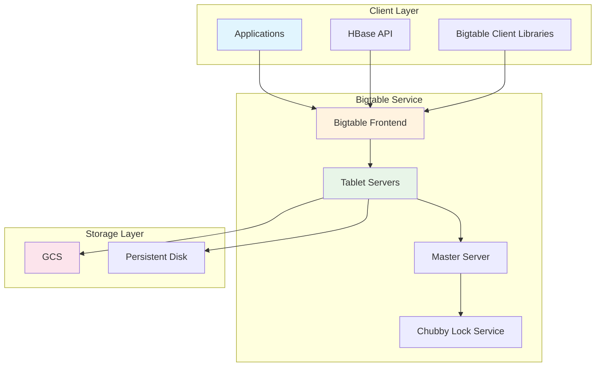

## Data Model Structure

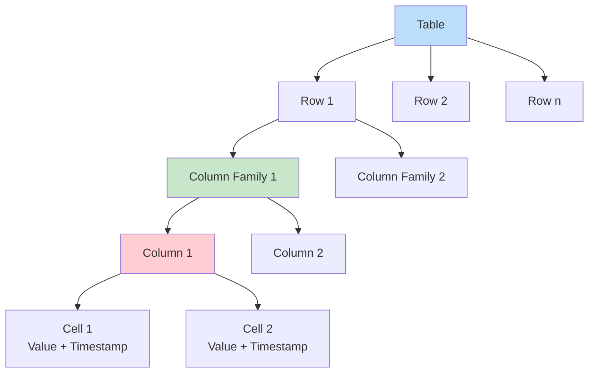

## Tablet Architecture

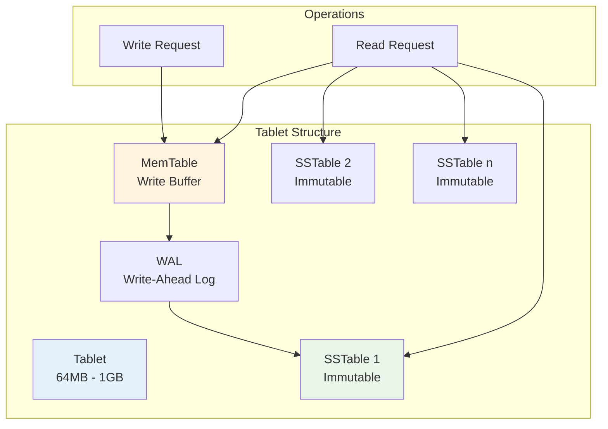

## Cluster Architecture

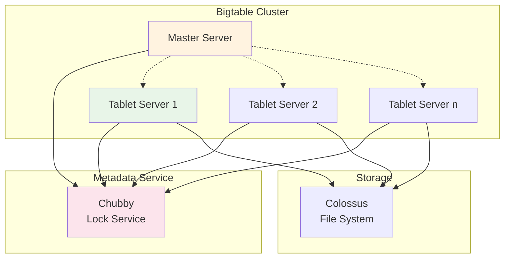

## Replication Architecture

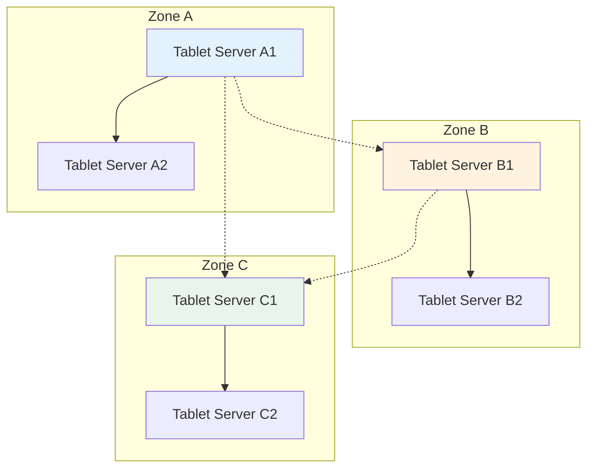

## Read Path

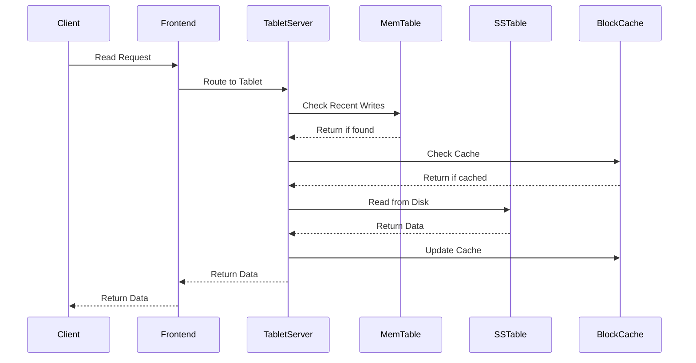

## Write Path

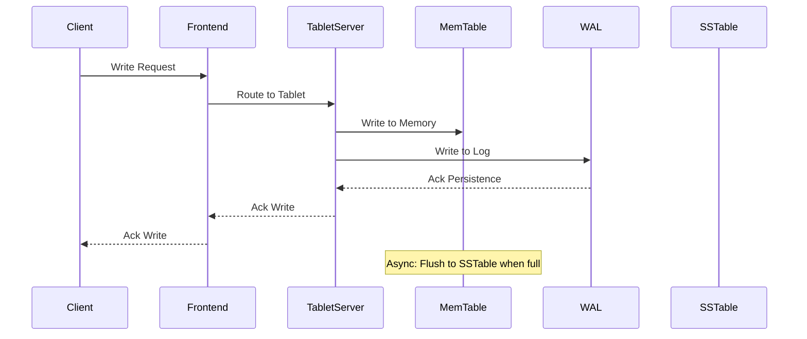

## Compaction Process

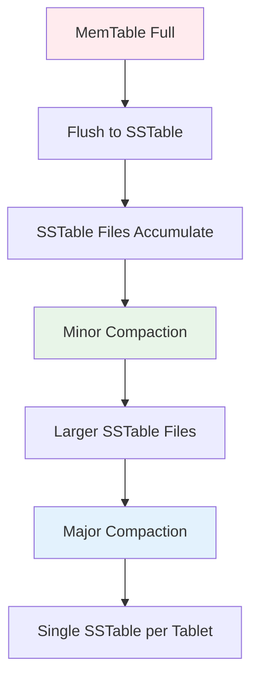

## Row Key Distribution

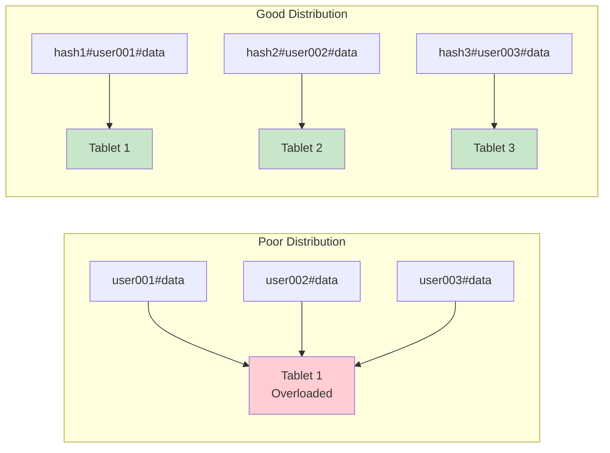

## IoT Data Pipeline

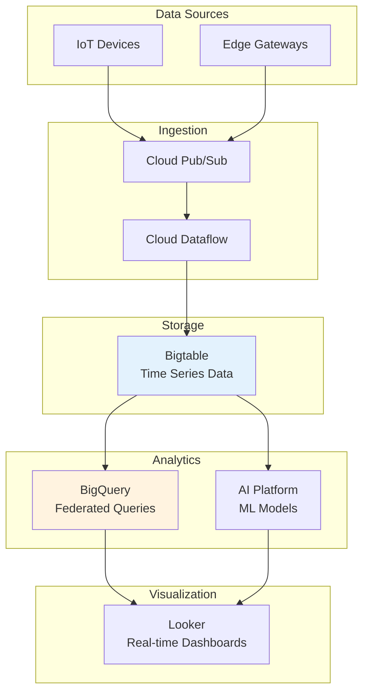

## Analytics Workflow

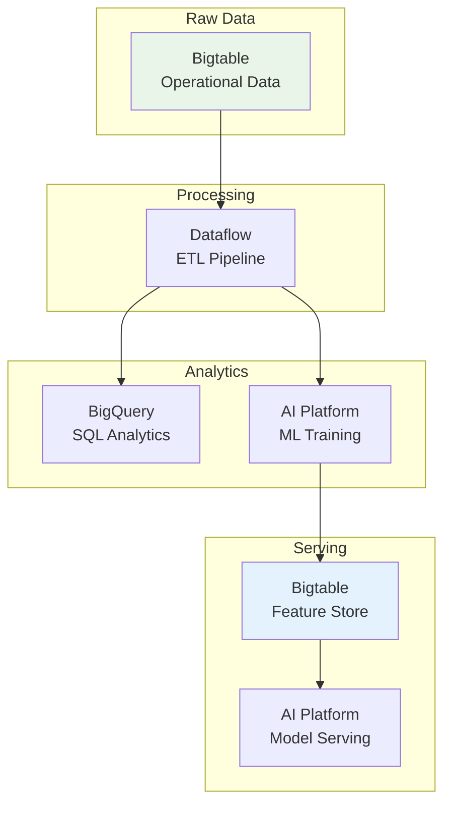

## Performance Monitoring

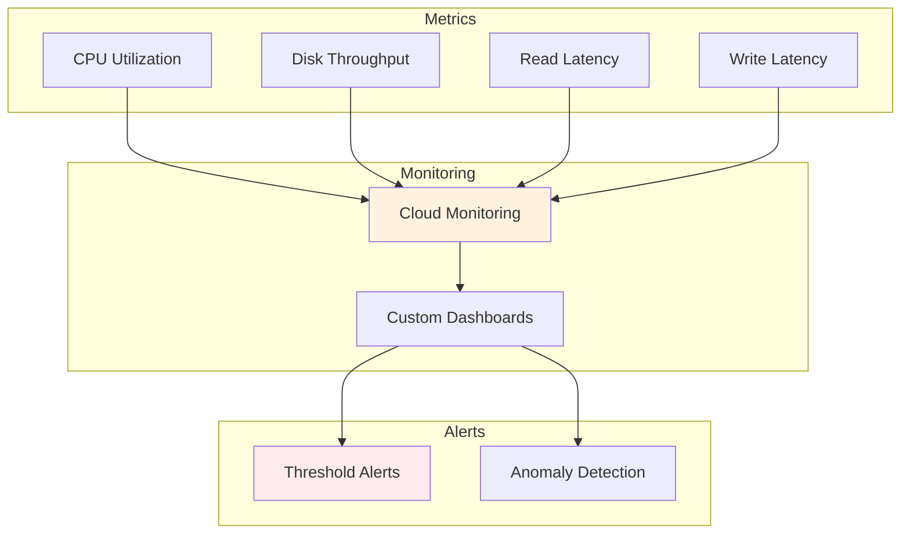

## Security Architecture

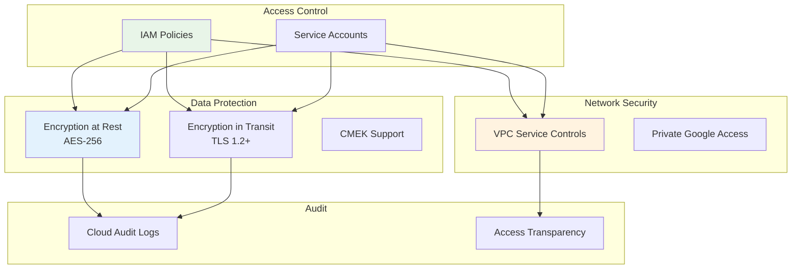

## Backup and Recovery

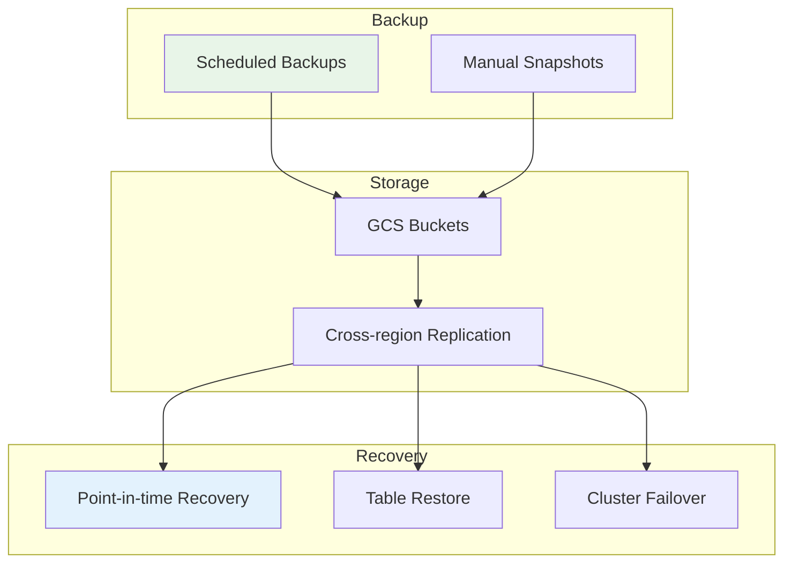

## Cost Optimization

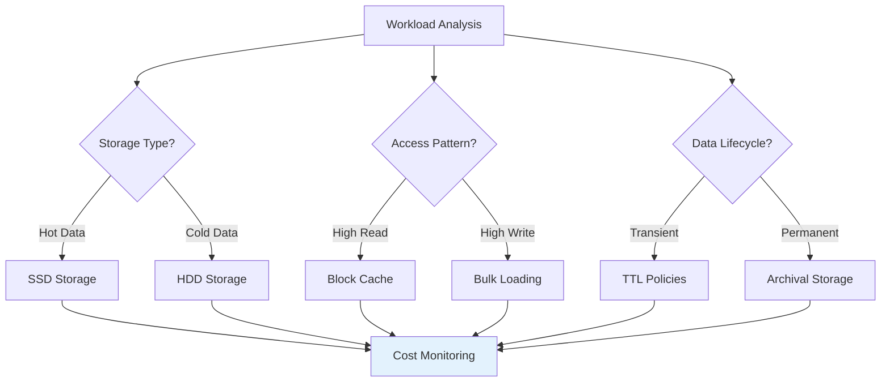

## Integration Patterns

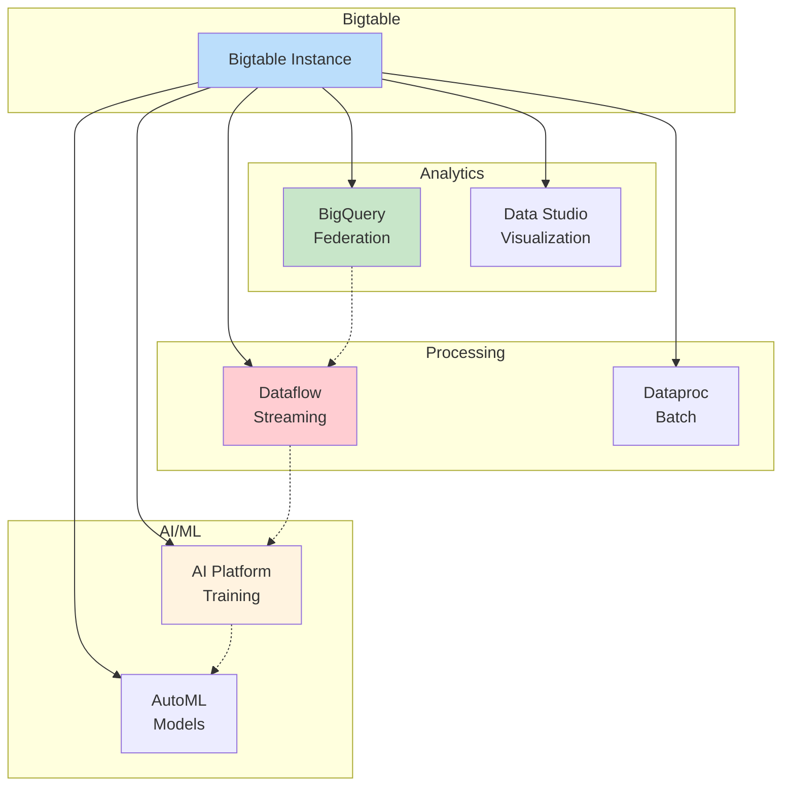

## Migration Strategies

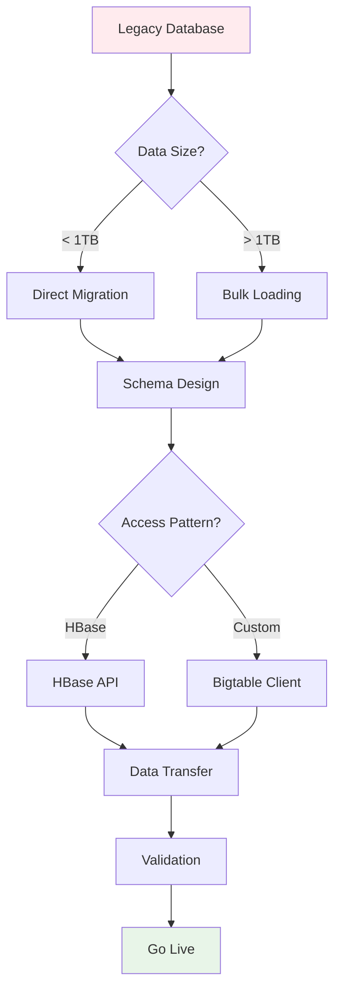

These diagrams illustrate the key architectural components, data flows, and integration patterns that make Cloud Bigtable a powerful choice for large-scale, high-performance applications. The distributed architecture, combined with automatic scaling and strong consistency guarantees, enables Bigtable to handle the demanding requirements of Google's most critical services.
