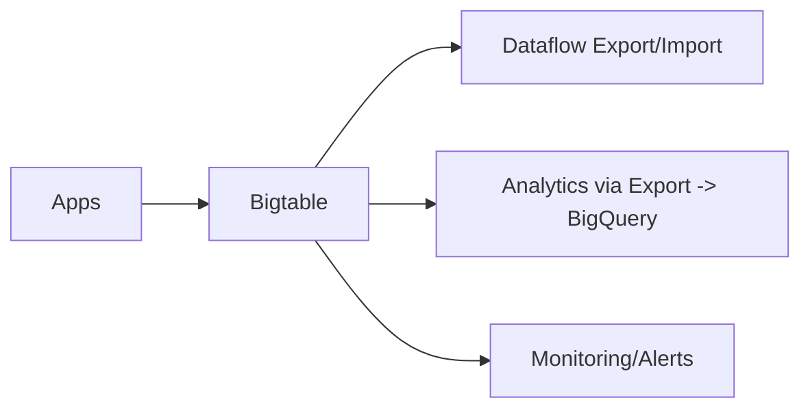

# Bigtable Guide – Basic → Architect

## Level 1 – Launch & Basics

### 1. Quick Instance
```bash
gcloud config set project <PROJECT_ID>
gcloud bigtable instances create demo --cluster=demo-c1 --cluster-zone=us-central1-b --display-name="demo" --instance-type=DEVELOPMENT
```

### 2. Core Concepts
- Sparse, wide-column NoSQL; row key design critical
- Tables, column families; SSTables; immutable files
- Single-row transactions only; eventual consistency across clusters

### 3. Basic Ops
```bash
cbt -instance=demo createtable users
cbt -instance=demo set users user1 info:name="alice"
cbt -instance=demo read users
```

## Level 2 – Production Patterns

### Schema & Keys
- Design row keys for distribution: avoid hotspots; salting/prefixes
- Locality for common access patterns; consider reverse timestamps for recency
- Minimal column families; TTL for cold data

### Performance & Cost
- Size nodes for throughput; monitor latency/read/write ops
- GC rules on column families; compression impact
- Avoid heavy scans; design for targeted key ranges

### Security & Access
- IAM on instance; CMEK optional; VPC-SC for data exfil protection
- Client retries/backoff; idempotent writes

## Level 3 – Architect Playbook

### Reliability & Scale
- Multi-cluster routing for HA across regions; test failover
- Backups; export/import via Dataflow to GCS/BigQuery
- HBase-compatible API; BEAM connectors

### Governance
- Labels for cost; quota/alerting on throughput and storage
- Audit logs; key design reviews; runbooks for hotspots

### Integrations
- Dataflow for ETL; HBase clients; Spark connectors
- Serve low-latency lookups; avoid complex analytics (use BQ)

## Ops Cheat Sheet

| Task | Command | Note |
| --- | --- | --- |
| Create table | `cbt createtable ...` | tables |
| Set cell | `cbt set table row cf:col=value` | write |
| Read | `cbt read table` | scan |
| List | `cbt ls` | tables |
| Backups | `cbt listbackups` | DR |

## Architecture Patterns



## Checklist Before Production
- [ ] Row key design reviewed; hotspots mitigated; CFs minimal
- [ ] Nodes sized; alerts on latency/throughput; GC rules set
- [ ] HA via multi-cluster if needed; failover tested
- [ ] IAM least privilege; VPC-SC/CMEK as required
- [ ] Backup/export plan; Dataflow pipelines validated

