# Cloud Functions Visual Architecture and Diagrams

## Overview

This document provides visual representations of Cloud Functions architecture, event-driven patterns, and integration flows using Mermaid diagrams.

## Core Architecture

### Cloud Functions Service Architecture

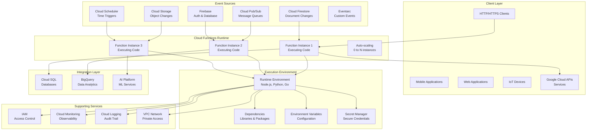

### Function Execution Lifecycle

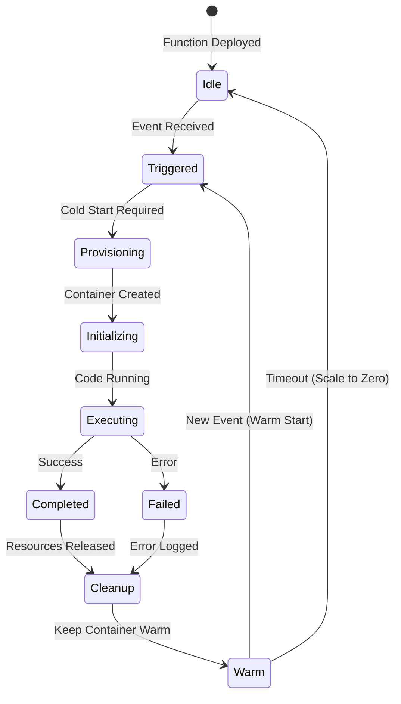

## Event-Driven Patterns

### HTTP Function Architecture

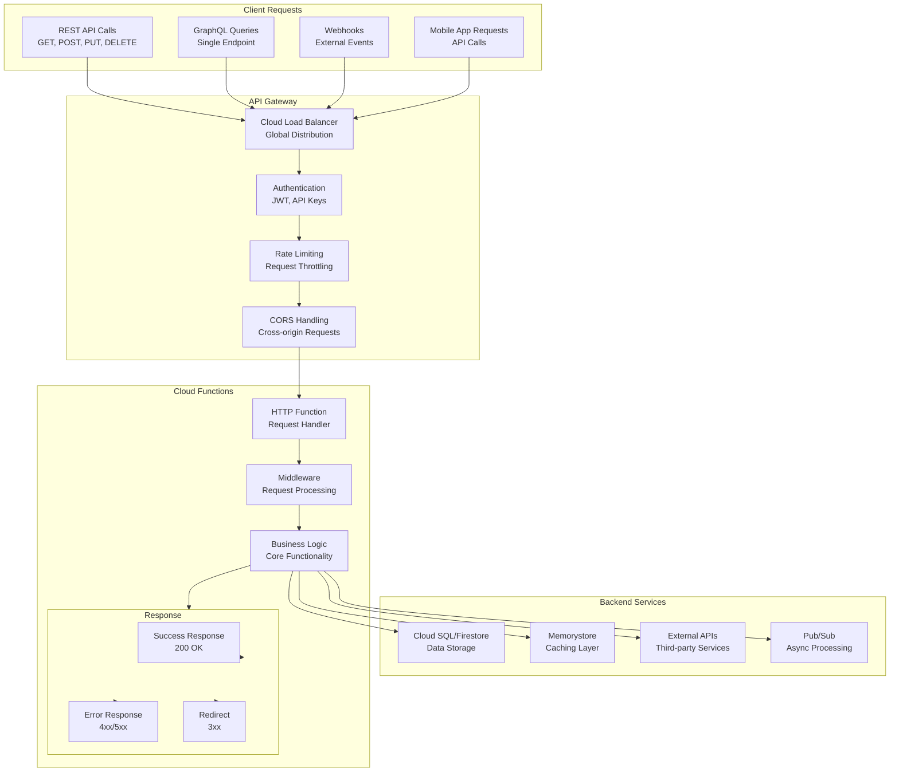

### Event Processing Architecture

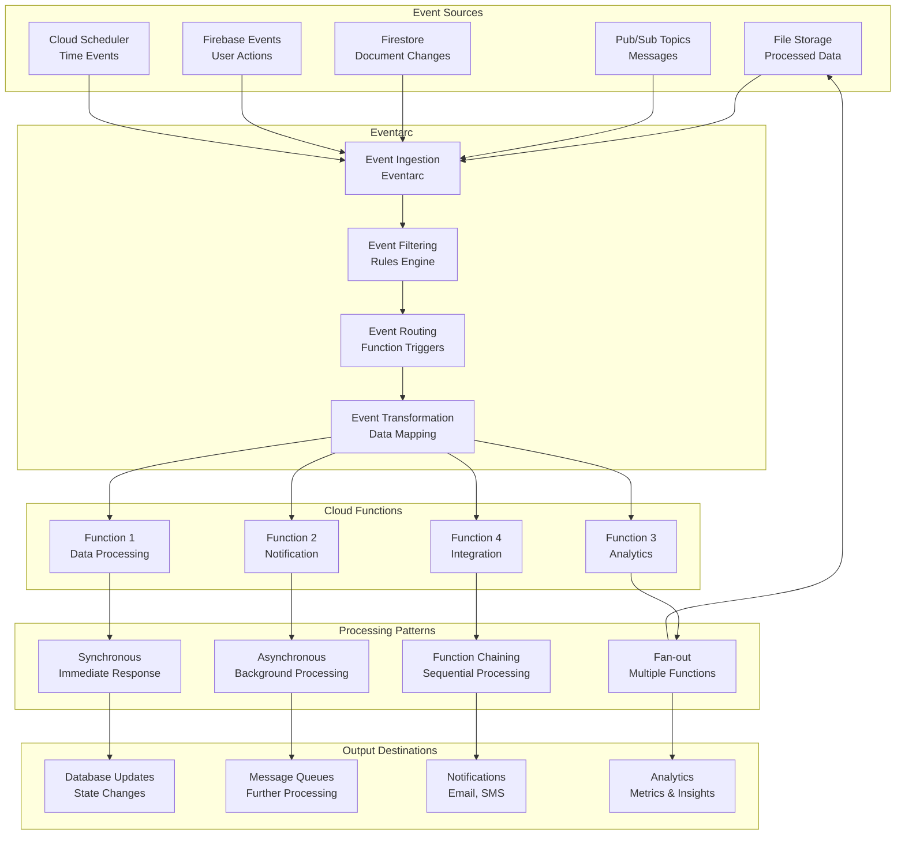

## Function Composition Patterns

### Function Chaining Architecture

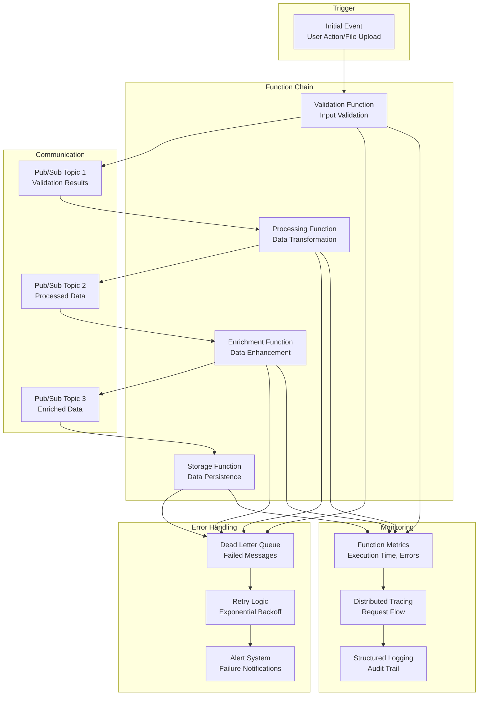

### Fan-out Pattern Architecture

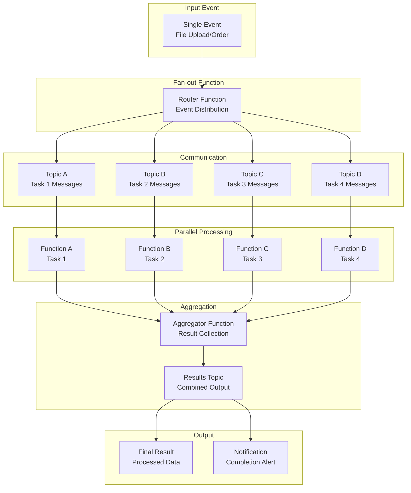

## Integration Patterns

### Cloud Functions with Cloud Storage

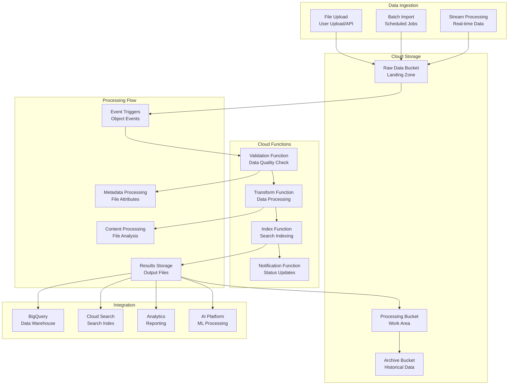

### Database Integration Architecture

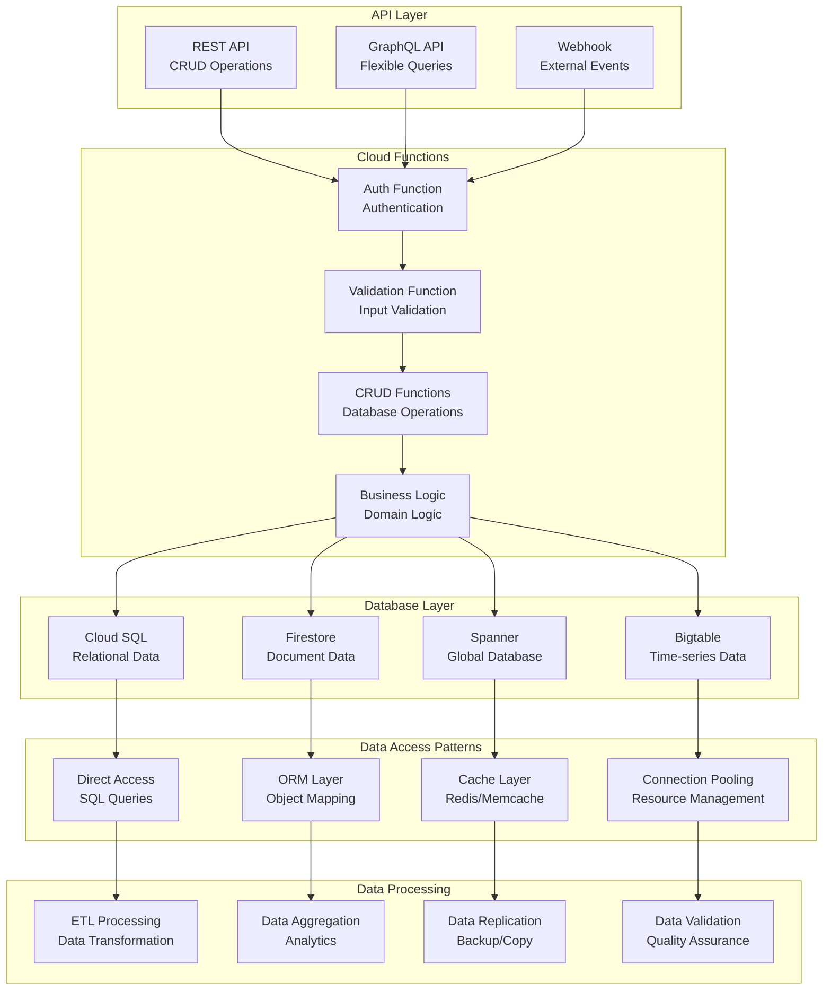

## Performance Optimization

### Cold Start Optimization Architecture

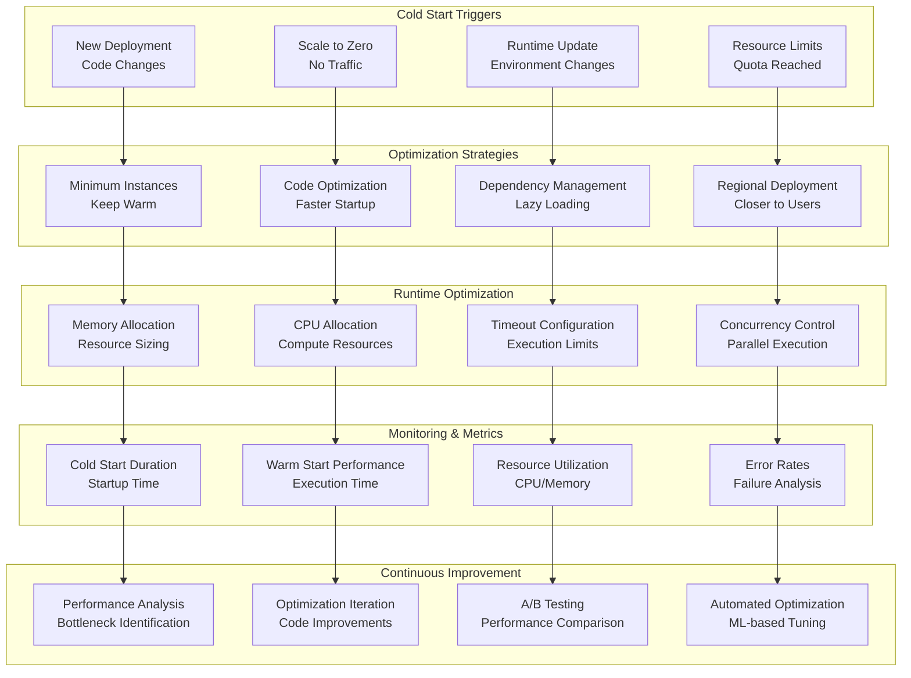

### Cost Optimization Architecture

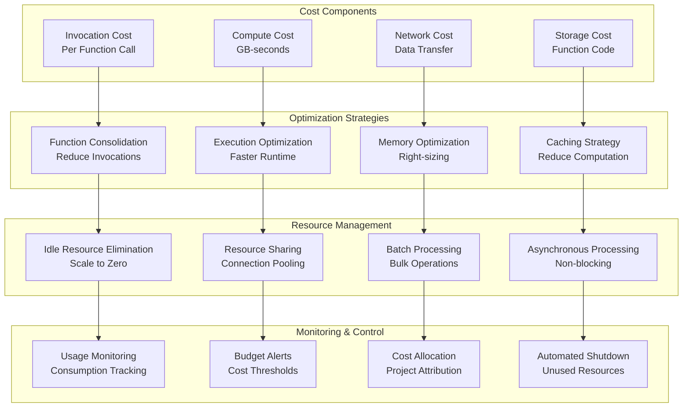

## Security Architecture

### Authentication and Authorization

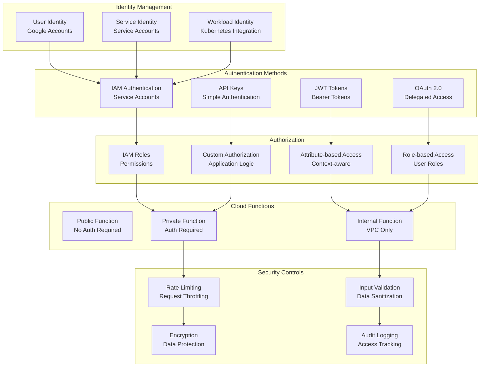

### Data Protection Architecture

```mermaid
graph TD
    subgraph "Data at Rest"
        Encryption[Server-side Encryption<br/>AES-256]
        CMEK[Customer-Managed Keys<br/>Cloud KMS]
        BucketEncryption[Storage Encryption<br/>Object Level]
    end

    subgraph "Data in Transit"
        TLS[TLS 1.3<br/>HTTPS Encryption]
        mTLS[Mutual TLS<br/>Client Authentication]
        VPN[VPN Tunnels<br/>Private Networks]
    end

    subgraph "Data Processing"
        InputValidation[Input Validation<br/>Data Sanitization]
        OutputEncoding[Output Encoding<br/>Safe Responses]
        ErrorHandling[Error Handling<br/>Information Leakage]
    end

    subgraph "Secret Management"
        SecretManager[Secret Manager<br/>Runtime Secrets]
        EnvironmentVars[Environment Variables<br/>Configuration]
        KeyManagement[Key Management<br/>Encryption Keys]
    end

    subgraph "Compliance"
        AuditLogs[Audit Logs<br/>Access Tracking]
        DataClassification[Data Classification<br/>Sensitivity Levels]
        RetentionPolicies[Retention Policies<br/>Data Lifecycle]
        AccessControls[Access Controls<br/>Least Privilege]
    end

    Encryption --> CMEK
    CMEK --> BucketEncryption

    TLS --> mTLS
    mTLS --> VPN

    InputValidation --> OutputEncoding
    OutputEncoding --> ErrorHandling

    SecretManager --> EnvironmentVars
    EnvironmentVars --> KeyManagement

    AuditLogs --> DataClassification
    DataClassification --> RetentionPolicies
    RetentionPolicies --> AccessControls
```

## Monitoring and Observability

### Cloud Functions Monitoring Dashboard

```mermaid
graph TD
    subgraph "Execution Metrics"
        InvocationCount[Invocation Count<br/>Function Calls]
        ExecutionTime[Execution Time<br/>Duration]
        ErrorRate[Error Rate<br/>Failure Percentage]
        ColdStartRate[Cold Start Rate<br/>Startup Frequency]
    end

    subgraph "Performance Metrics"
        CPUUtilization[CPU Utilization<br/>Compute Usage]
        MemoryUtilization[Memory Utilization<br/>RAM Usage]
        NetworkTraffic[Network Traffic<br/>Data Transfer]
        QueueDepth[Queue Depth<br/>Pending Requests]
    end

    subgraph "Business Metrics"
        Throughput[Throughput<br/>Requests/Second]
        Latency[Latency<br/>Response Time]
        Availability[Availability<br/>Uptime Percentage]
        UserSatisfaction[User Satisfaction<br/>Quality Scores]
    end

    subgraph "Resource Metrics"
        ActiveInstances[Active Instances<br/>Running Functions]
        ResourceQuota[Resource Quota<br/>Usage vs Limits]
        CostMetrics[Cost Metrics<br/>Billing Data]
        ScalingEvents[Scaling Events<br/>Auto-scaling]
    end

    subgraph "Alerting & Response"
        ThresholdAlerts[Threshold Alerts<br/>Metric-based]
        AnomalyAlerts[Anomaly Detection<br/>Statistical]
        PredictiveAlerts[Predictive Alerts<br/>Trend Analysis]
        IncidentResponse[Incident Response<br/>Automated Actions]
    end

    InvocationCount --> ThresholdAlerts
    ExecutionTime --> AnomalyAlerts
    ErrorRate --> PredictiveAlerts
    ColdStartRate --> IncidentResponse

    CPUUtilization --> ThresholdAlerts
    MemoryUtilization --> AnomalyAlerts
    NetworkTraffic --> PredictiveAlerts
    QueueDepth --> IncidentResponse

    Throughput --> ThresholdAlerts
    Latency --> AnomalyAlerts
    Availability --> PredictiveAlerts
    UserSatisfaction --> IncidentResponse

    ActiveInstances --> ThresholdAlerts
    ResourceQuota --> AnomalyAlerts
    CostMetrics --> PredictiveAlerts
    ScalingEvents --> IncidentResponse
```

## Summary

These diagrams illustrate the key architectural patterns in Cloud Functions:

1. **Service Architecture**: Event-driven serverless functions with automatic scaling
2. **Execution Lifecycle**: Cold start and warm instance management
3. **Event Patterns**: HTTP and event-driven function triggers
4. **Function Composition**: Chaining and fan-out patterns
5. **Integration**: Deep integration with Google Cloud services
6. **Performance**: Cold start and cost optimization strategies
7. **Security**: Authentication, authorization, and data protection
8. **Monitoring**: Comprehensive observability and alerting

These visual representations help understand how Cloud Functions components interact and how to design scalable, secure serverless applications.
