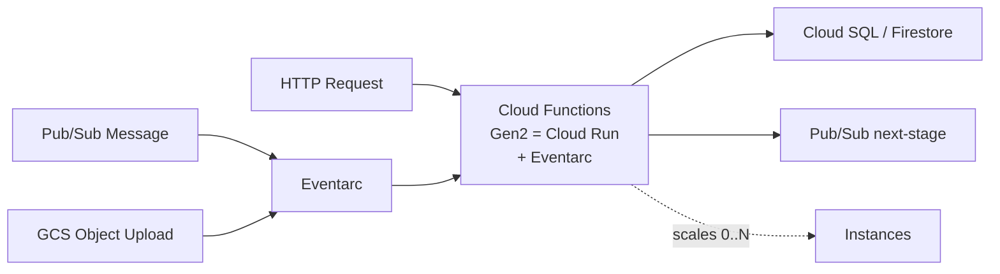

# GCP Cloud Functions — Cheatsheet

## Architecture (30-second mental model)

## When to use vs alternatives

| Need | Use Cloud Functions | Not Cloud Functions |
|------|---------------------|---------------------|
| Single-purpose event glue (<60 min) | Yes -- zero infra, auto-scale to zero | Cloud Run if you need containers or websockets |
| Lightweight HTTP API / webhook | Yes -- fast deploy, built-in auth | Cloud Run or GKE for multi-route services |
| Long-running batch (>60 min) | No -- hard timeout limit | Cloud Run Jobs or Dataflow |
| High-concurrency stateful service | No -- ephemeral, cold starts matter | GKE or Cloud Run with min-instances |
| ML model serving | No -- cold start latency unacceptable | Vertex AI Endpoints or Cloud Run GPU |

## 5 things you always forget

1. **Gen2 IS Cloud Run under the hood** -- Gen2 functions are deployed as Cloud Run services with Eventarc triggers. This means you get concurrency-per-instance (default 1, set higher to amortize cold starts) and Cloud Run quotas apply.
2. **Global-scope code runs once per cold start, not per request** -- Initialize DB connection pools and heavy clients outside the handler function. They persist across warm invocations, but you must handle reconnection since the instance can idle for hours.
3. **Gen2 functions share Cloud Run quotas** -- deploying 50 functions eats 50 of your 1000 Cloud Run service limit per project. Hitting this limit causes deploy failures with a confusing error that doesn't mention Cloud Functions.
4. **Pub/Sub-triggered retries are infinite by default** -- If your function throws, the message retries forever. Always set `--retry` deliberately AND configure a dead-letter topic on the subscription, or a crashing function burns invocation quota.
5. **`--allow-unauthenticated` is an IAM binding, not a code flag** -- Removing it later requires an explicit `gcloud functions remove-iam-policy-binding`. Simply redeploying without the flag does not revoke public access.

## Interview killer answer

> "We use Gen2 Cloud Functions as event-driven glue: GCS upload triggers validation, publishes to Pub/Sub, fans out to enrichment and BigQuery loading. The hardest lesson was idempotency -- Pub/Sub delivers at-least-once, so every function writes with a dedup key derived from the message ID. We also set concurrency to 10 to amortize cold starts, and every Pub/Sub trigger has a dead-letter topic with alerting. When a bad schema crashed our enrichment function, the DLT caught 12K messages instead of retrying them into oblivion."
