# Cloud Run Visual Architecture and Diagrams

## Overview

This document provides visual representations of Cloud Run architecture, scaling patterns, and integration flows using Mermaid diagrams.

## Core Architecture

### Cloud Run Service Architecture

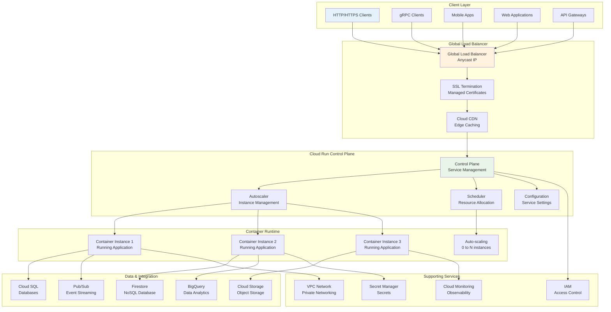

### Request Flow Architecture

```mermaid
sequenceDiagram
    participant Client
    participant GLB as Global Load Balancer
    participant ControlPlane as Cloud Run Control Plane
    participant Autoscaler
    participant Container as Container Instance
    participant Backend as Backend Services

    Client->>GLB: HTTP Request
    GLB->>ControlPlane: Route Request
    ControlPlane->>Autoscaler: Check Capacity
    Autoscaler->>Autoscaler: Scale Instances if needed
    Autoscaler->>Container: Forward Request
    Container->>Container: Process Request
    Container->>Backend: Call Backend Services
    Backend->>Container: Return Response
    Container->>GLB: Send Response
    GLB->>Client: HTTP Response

    style Client fill:#e3f2fd
    style GLB fill:#fff3e0
    style ControlPlane fill:#e8f5e8
    style Autoscaler fill:#e3f2fd
    style Container fill:#fff3e0
    style Backend fill:#e8f5e8
```

## Scaling Patterns

### Autoscaling Architecture

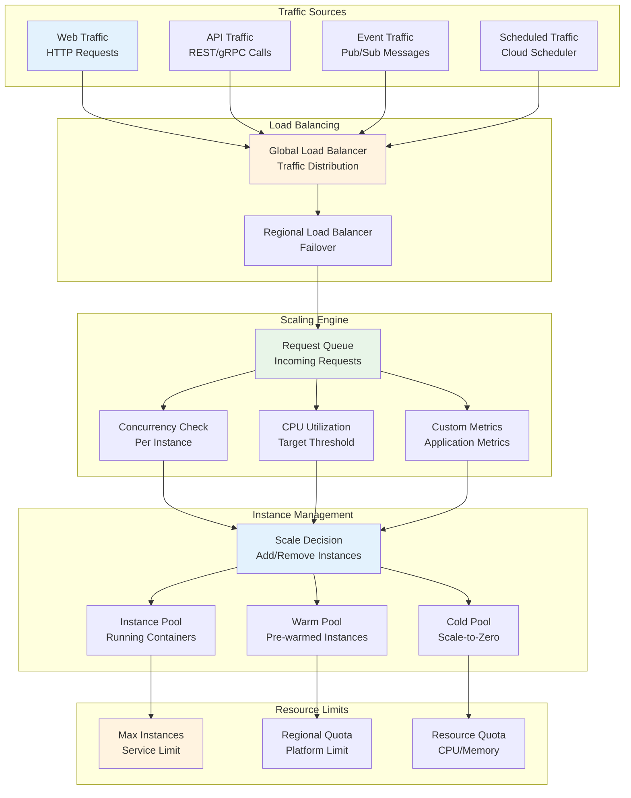

### Scale-to-Zero Flow

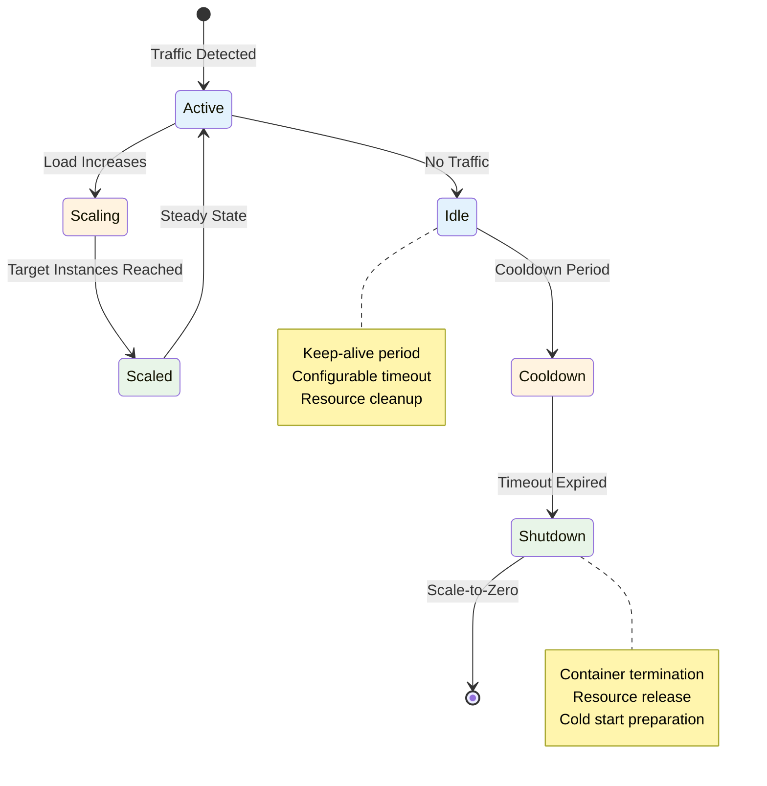

## Deployment Patterns

### Rolling Deployment Architecture

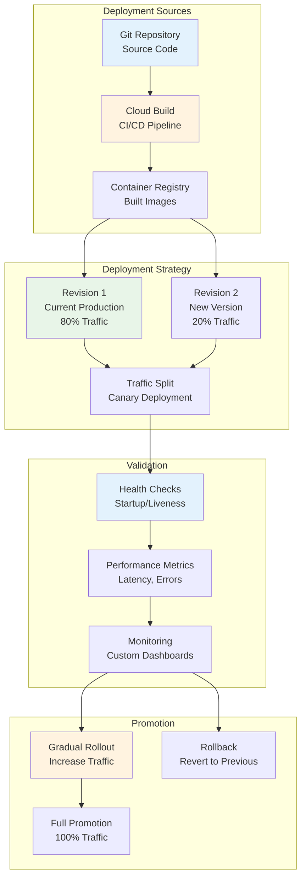

### Blue-Green Deployment

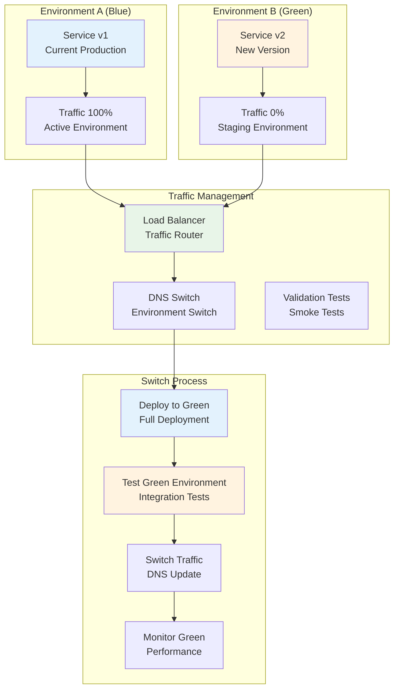

## Integration Patterns

### Event-Driven Architecture

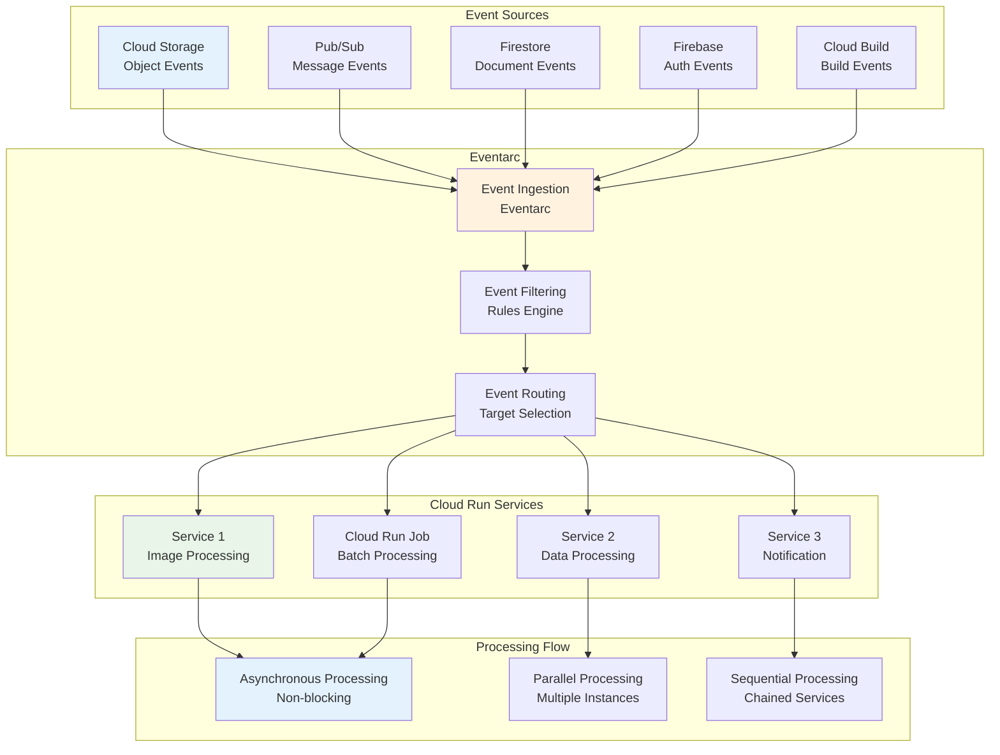

### Service Mesh Integration

```mermaid
graph TD
    subgraph "Service Mesh"
        Istio[Istio Service Mesh<br/>Traffic Management]
        Envoy[Envoy Proxy<br/>Sidecar Pattern]
        ControlPlane[Istio Control Plane<br/>Configuration]
    end

    subgraph "Cloud Run Services"
        Frontend[Frontend Service<br/>Web Interface]
        API[API Gateway Service<br/>Request Routing]
        Backend[Backend Service<br/>Business Logic]
        Worker[Worker Service<br/>Background Tasks]
    end

    subgraph "Traffic Policies"
        Routing[Traffic Routing<br/>Canary, Blue-Green]
        LoadBalancing[Load Balancing<br/>Round Robin, Least Loaded]
        CircuitBreaker[Circuit Breaker<br/>Fault Tolerance]
        Retry[Retry Logic<br/>Transient Failures]
    end

    subgraph "Security Policies"
        Authentication[Authentication<br/>JWT, API Keys]
        Authorization[Authorization<br/>RBAC, Policies]
        Encryption[Encryption<br/>mTLS, TLS]
        RateLimiting[Rate Limiting<br/>Request Throttling]
    end

    subgraph "Observability"
        Tracing[Distributed Tracing<br/>Request Flow]
        Metrics[Service Metrics<br/>Performance]
        Logging[Structured Logging<br/>Request Logs]
    end

    Istio --> Envoy
    Envoy --> ControlPlane

    Frontend --> Istio
    API --> Istio
    Backend --> Istio
    Worker --> Istio

    Istio --> Routing
    Istio --> LoadBalancing
    Istio --> CircuitBreaker
    Istio --> Retry

    Istio --> Authentication
    Istio --> Authorization
    Istio --> Encryption
    Istio --> RateLimiting

    Istio --> Tracing
    Istio --> Metrics
    Istio --> Logging

    style Istio fill:#e3f2fd
    style Frontend fill:#fff3e0
    style Routing fill:#e8f5e8
    style Authentication fill:#e3f2fd
    style Tracing fill:#fff3e0
```

## Networking Architecture

### VPC Integration

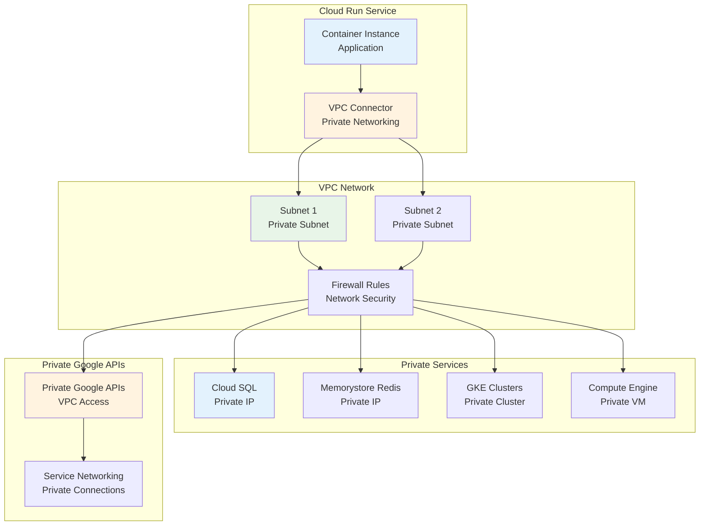

### Multi-Region Deployment

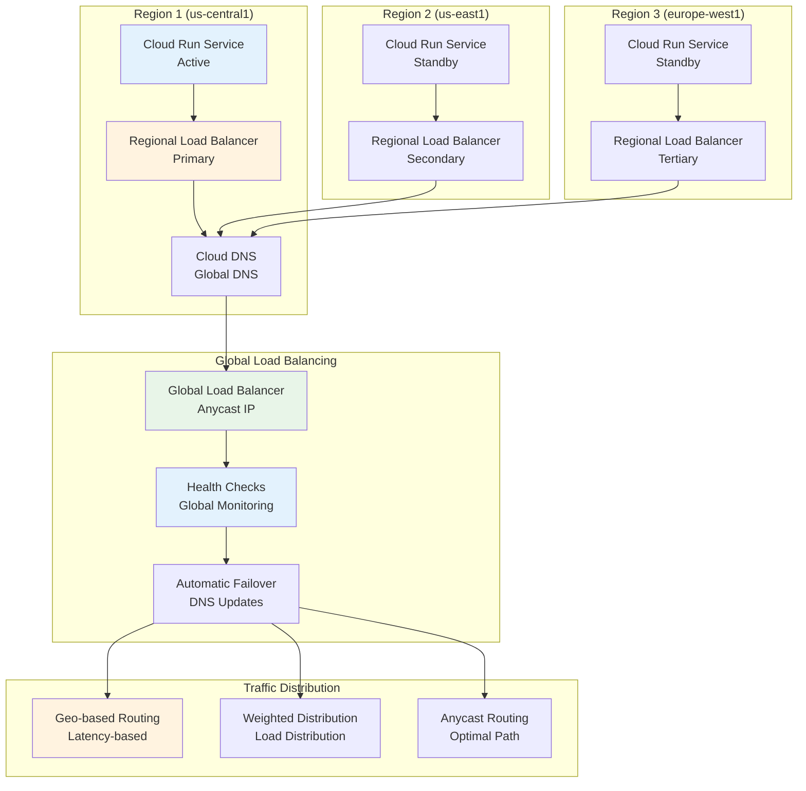

## Security Architecture

### Identity and Access Management

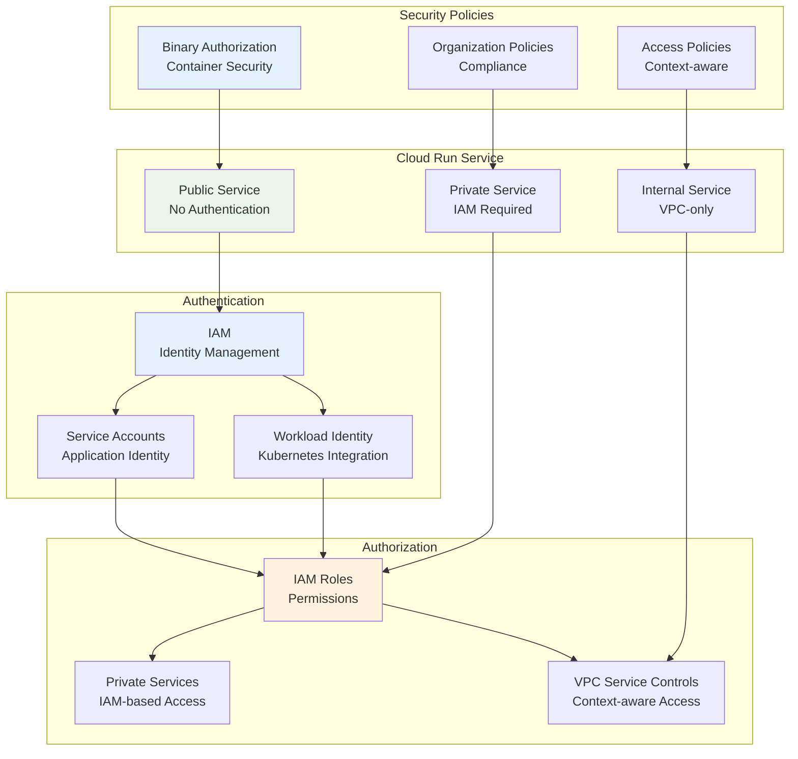

### Data Protection

```mermaid
graph TD
    subgraph "Data in Transit"
        TLS[TLS 1.3<br/>HTTPS Encryption]
        mTLS[Mutual TLS<br/>Client Authentication]
        VPN[VPN Tunnels<br/>Private Networks]
    end

    subgraph "Data at Rest"
        CMEK[Customer-Managed Keys<br/>Cloud KMS]
        CSEK[Customer-Supplied Keys<br/>Application Keys]
        StorageEncryption[Storage Encryption<br/>Persistent Data]
    end

    subgraph "Secret Management"
        SecretManager[Secret Manager<br/>Runtime Secrets]
        EnvironmentVars[Environment Variables<br/>Configuration]
        ConfigMaps[Config Maps<br/>Application Config]
    end

    subgraph "Compliance"
        AuditLogs[Audit Logs<br/>Access Tracking]
        DataLossPrevention[DLP<br/>Sensitive Data]
        EncryptionCompliance[Encryption Compliance<br/>Regulatory]
    end

    TLS --> mTLS
    mTLS --> VPN

    CMEK --> CSEK
    CSEK --> StorageEncryption

    SecretManager --> EnvironmentVars
    EnvironmentVars --> ConfigMaps

    AuditLogs --> DataLossPrevention
    DataLossPrevention --> EncryptionCompliance

    style TLS fill:#e3f2fd
    style CMEK fill:#fff3e0
    style SecretManager fill:#e8f5e8
    style AuditLogs fill:#e3f2fd
```

## Performance Optimization

### Cold Start Optimization

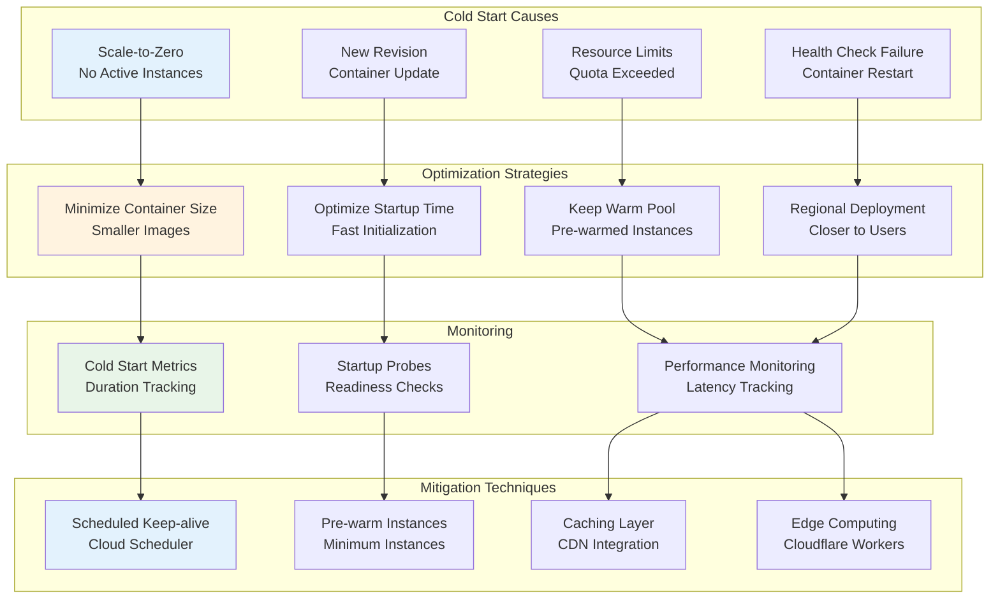

### Resource Optimization

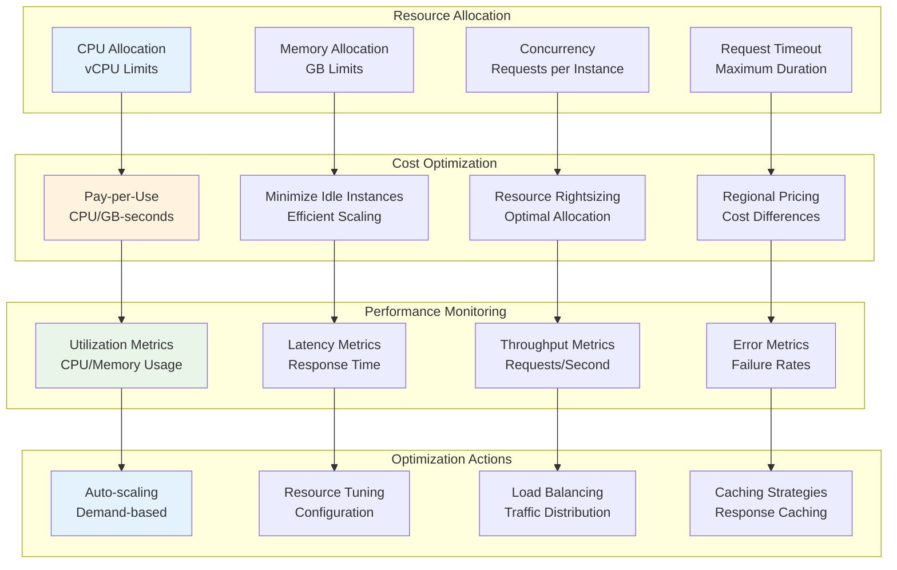

## Monitoring and Observability

### Cloud Run Monitoring Dashboard

```mermaid
graph TD
    subgraph "System Metrics"
        RequestCount[Request Count<br/>Total Requests]
        RequestLatency[Request Latency<br/>P50, P95, P99]
        InstanceCount[Instance Count<br/>Active Instances]
        CPUUtilization[CPU Utilization<br/>Core Usage]
        MemoryUtilization[Memory Utilization<br/>GB Usage]
    end

    subgraph "Application Metrics"
        ErrorRate[Error Rate<br/>5xx Responses]
        StatusCodes[Status Codes<br/>2xx, 4xx, 5xx]
        CustomMetrics[Custom Metrics<br/>Business Metrics]
        HealthChecks[Health Check Status<br/>Startup/Liveness]
    end

    subgraph "Infrastructure Metrics"
        ColdStarts[Cold Start Count<br/>Scale-from-Zero]
        StartupTime[Startup Time<br/>Container Init]
        NetworkTraffic[Network Traffic<br/>Ingress/Egress]
        DiskUsage[Disk Usage<br/>Ephemeral Storage]
    end

    subgraph "Alerting"
        ThresholdAlerts[Threshold Alerts<br/>Metric-based]
        AnomalyAlerts[Anomaly Detection<br/>Statistical]
        SLOAlerts[SLO Alerts<br/>Service Level]
        IncidentAlerts[Incident Alerts<br/>System Issues]
    end

    RequestCount --> ThresholdAlerts
    RequestLatency --> AnomalyAlerts
    InstanceCount --> ThresholdAlerts
    CPUUtilization --> SLOAlerts
    MemoryUtilization --> IncidentAlerts

    ErrorRate --> ThresholdAlerts
    StatusCodes --> AnomalyAlerts
    CustomMetrics --> SLOAlerts
    HealthChecks --> IncidentAlerts

    ColdStarts --> ThresholdAlerts
    StartupTime --> AnomalyAlerts
    NetworkTraffic --> SLOAlerts
    DiskUsage --> IncidentAlerts

    style RequestCount fill:#e3f2fd
    style ErrorRate fill:#fff3e0
    style ColdStarts fill:#e8f5e8
    style ThresholdAlerts fill:#e3f2fd
```

## Summary

These diagrams illustrate the key architectural patterns in Cloud Run:

1. **Service Architecture**: Global load balancing with containerized applications
2. **Scaling Patterns**: Autoscaling from zero to thousands of instances
3. **Deployment Strategies**: Rolling, blue-green, and canary deployments
4. **Event-Driven**: Integration with Google Cloud event sources
5. **Service Mesh**: Advanced traffic management and security
6. **Networking**: VPC integration and multi-region deployment
7. **Security**: Identity, authorization, and data protection
8. **Performance**: Cold start optimization and resource management
9. **Monitoring**: Comprehensive observability and alerting

These visual representations help understand how Cloud Run components interact and how to design scalable, secure serverless applications.
