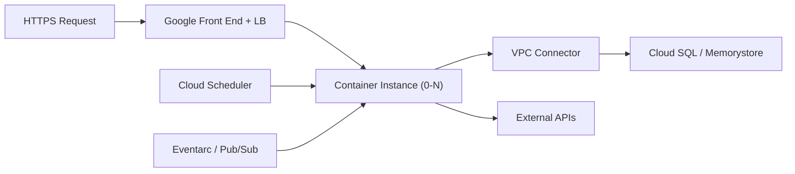

# GCP Cloud Run — Cheatsheet

## Architecture (30-second mental model)

Requests hit Google's global LB, which routes to autoscaled container instances. Instances scale to zero when idle. VPC connector gives private network access. Eventarc and Scheduler drive non-HTTP workloads.

## When to use vs alternatives

| Need | Use Cloud Run | Not Cloud Run |
|------|--------------|---------------|
| Stateless HTTP APIs/microservices | Cloud Run (container + autoscale) | GKE (overkill for simple services) |
| Long-running background processing | Cloud Run Jobs (run-to-completion) | Cloud Functions (15-min timeout) |
| Full Kubernetes control & sidecars | GKE (full K8s API) | Cloud Run (limited K8s surface) |
| Sub-100ms cold start required | Cloud Functions (lighter runtime) | Cloud Run (heavier container boot) |
| Persistent connections / WebSockets | GCE or GKE (long-lived instances) | Cloud Run (request timeout cap) |

## 5 things you always forget

1. Concurrency default is 80 -- if your app is single-threaded (e.g., Python sync), set it to 1 or you will get silent request queueing and timeouts.
2. CPU is throttled to near-zero between requests unless you set `--cpu-throttling=false` (always-on CPU); background threads will stall otherwise.
3. `--min-instances=1` prevents cold starts but you pay for idle time -- use it for latency-sensitive services, not batch jobs.
4. Cloud Run listens on the `PORT` env var (default 8080), not a hardcoded port -- frameworks that bind to 3000 or 5000 will fail silently on deploy.
5. Container filesystem is in-memory tmpfs counted against your memory limit -- writing large temp files can OOM your instance without any disk error.

## Interview killer answer

> "We migrated 12 microservices from GKE to Cloud Run and cut infrastructure costs by 60% because most services had bursty traffic that scaled to zero overnight. The critical tuning was setting concurrency to match our async framework's worker count and using min-instances=1 only for the API gateway to avoid cold-start latency on user-facing requests. For database connections we used Cloud SQL Auth Proxy as a sidecar with connection pooling, which eliminated the connection storm problem we had when instances scaled up rapidly during traffic spikes."
