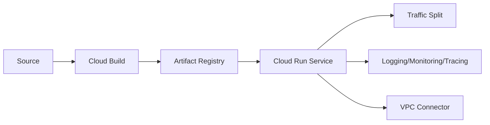

# Cloud Run Guide – Basic → Architect

## Level 1 – Launch & Basics

### 1. Quick Deploy
```bash
gcloud config set project <PROJECT_ID>
gcloud services enable run.googleapis.com
gcloud run deploy demo --image=gcr.io/cloudrun/hello --region=us-central1 --allow-unauthenticated
```

### 2. Core Concepts
- Fully managed container runtime; request-based autoscaling
- Revisions, traffic splitting, min/max instances
- Concurrency per instance; cold starts

### 3. First App
```Dockerfile
FROM gcr.io/distroless/nodejs20
WORKDIR /app
COPY . .
CMD ["server.js"]
```
```bash
gcloud run deploy myapp --source . --region=us-central1
```

## Level 2 – Production Patterns

### Performance & Cost
- Set sensible concurrency (often 10-80) and min instances to reduce cold starts
- CPU allocation during idle if background work needed
- Limit memory/cpu; watch OOMs; request/response timeouts

### Networking & Security
- Private services via VPC connector; egress control
- IAM for invocation; disable unauthenticated if private
- Custom domain + managed TLS; Cloud Armor for edge filtering

### CI/CD
- Build via Cloud Build/Artifacts; deploy via Cloud Deploy or GH Actions
- Use service accounts per service; least privilege

## Level 3 – Architect Playbook

### Reliability & SLOs
- Health checks via app endpoints; readiness signals via 200s
- Autoscaling controls: min/max instances; request timeout
- Rollouts with traffic split; rollback via previous revision

### Observability
- Cloud Logging/Monitoring/Tracing; request logs auto-enabled
- Structured logs with trace_id; alerts on latency/error rates

### Multi-Env & Governance
- Separate projects or services per env; labels for ownership
- Org policies for allowed regions, domain restrictions

## Ops Cheat Sheet

| Task | Command | Note |
| --- | --- | --- |
| Deploy | `gcloud run deploy svc --source .` | build+deploy |
| Traffic split | `gcloud run services update-traffic svc --to-revisions` | canary |
| List revs | `gcloud run revisions list` | history |
| Logs | Cloud Logging | request/app logs |

## Architecture Patterns



## Checklist Before Production
- [ ] Concurrency and min/max instances tuned; timeouts set
- [ ] IAM restricted; custom domain/TLS; Cloud Armor if public
- [ ] VPC connector for private egress; egress rules defined
- [ ] Observability: logs/metrics/traces/alerts on latency+errors
- [ ] CI/CD pipeline with approvals; rollbacks via revisions

## Learning Path Links
- Track: `LearningTracks/Backend-GCP/track.md`
- Projects: `Projects/GCP-Backend/starter/02-cloud-run-service.md` and `Projects/Integrated/backend-gcp-capstone.md`
- Mastery: `Mastery/GCP-CloudRun/` (quiz, scenarios, flashcards)

