# Cloud Storage Visual Architecture and Diagrams

## Overview

This document provides visual representations of Google Cloud Storage architecture, data flows, and integration patterns using Mermaid diagrams.

## Core Architecture

### Cloud Storage Service Architecture

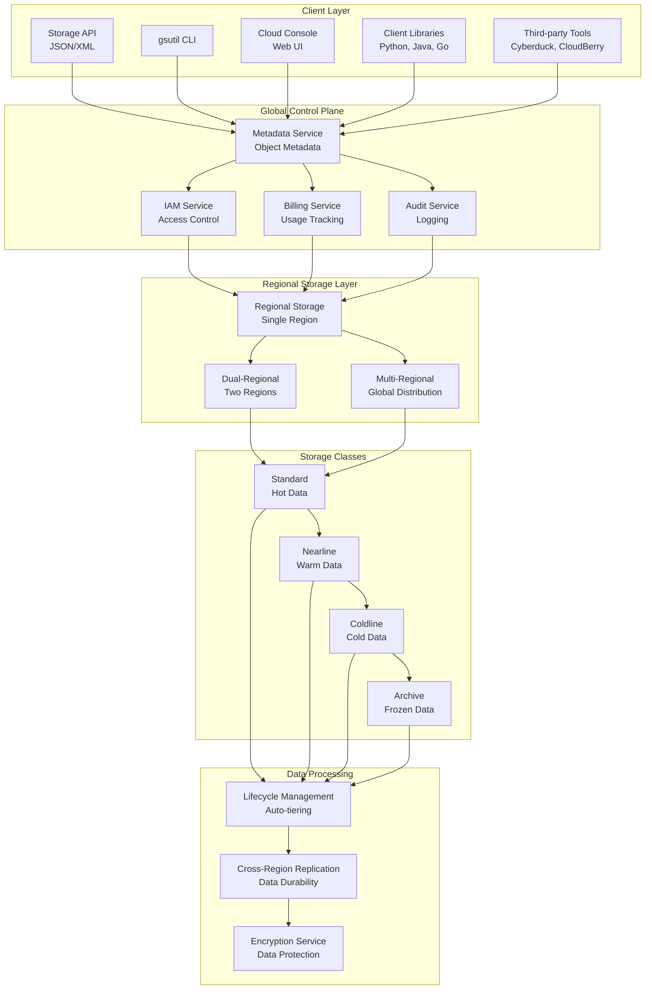

### Storage Class Selection Flow

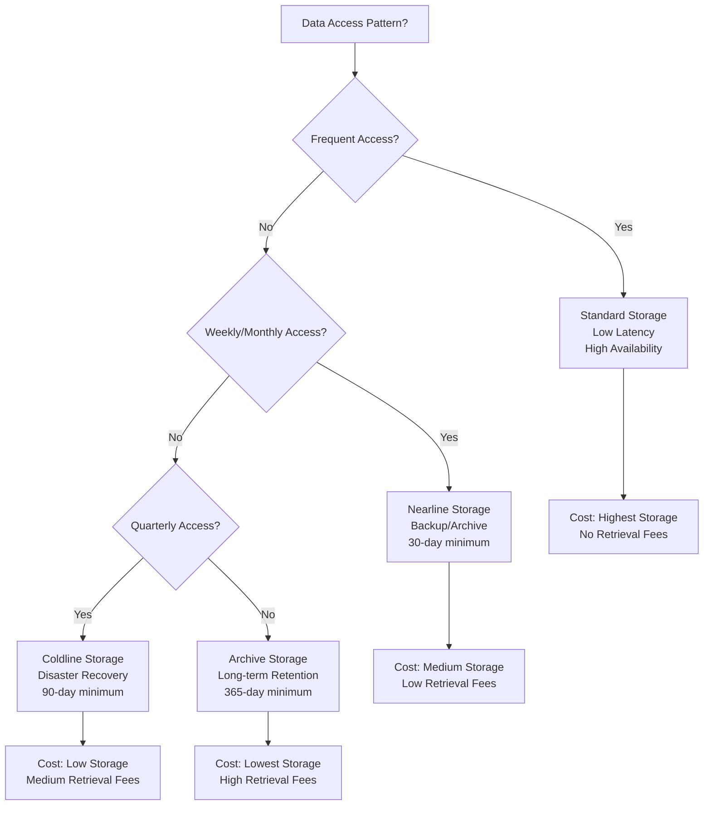

## Data Ingestion and Transfer

### Data Transfer Architecture

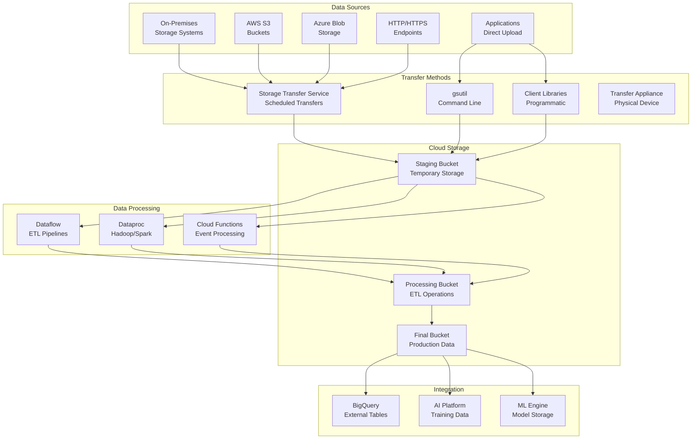

### Streaming Upload Architecture

```mermaid
graph LR
    subgraph "Client Application"
        App[Application]
        Resumable[Resumable Upload<br/>Client Library]
        Multipart[Multipart Upload<br/>Parallel Chunks]
    end

    subgraph "Cloud Storage"
        Upload[Upload Service<br/>Receive Chunks]
        Compose[Compose Service<br/>Assemble Object]
        Finalize[Finalize Object<br/>Make Available]
    end

    subgraph "Metadata"
        Metadata[Object Metadata<br/>Size, Hash, etc.]
        Generation[Generation Number<br/>Version Control]
        StorageClass[Storage Class<br/>Performance Tier]
    end

    subgraph "Replication"
        Primary[Primary Region<br/>Immediate Access]
        Replica[Replica Regions<br/>Background Sync]
    end

    App --> Resumable
    Resumable --> Multipart

    Multipart --> Upload
    Upload --> Compose
    Compose --> Finalize

    Finalize --> Metadata
    Metadata --> Generation
    Generation --> StorageClass

    StorageClass --> Primary
    Primary --> Replica
```

## Security Architecture

### Access Control Model

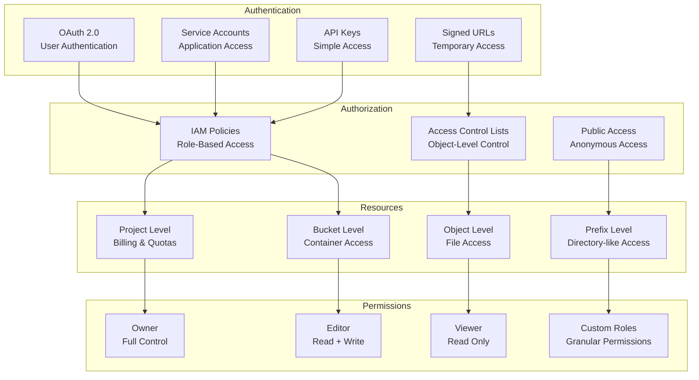

### Encryption Architecture

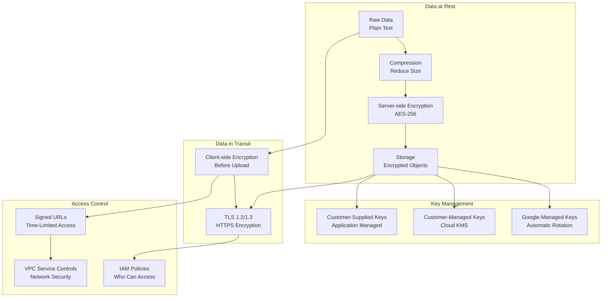

## Lifecycle Management

### Lifecycle Rules Engine

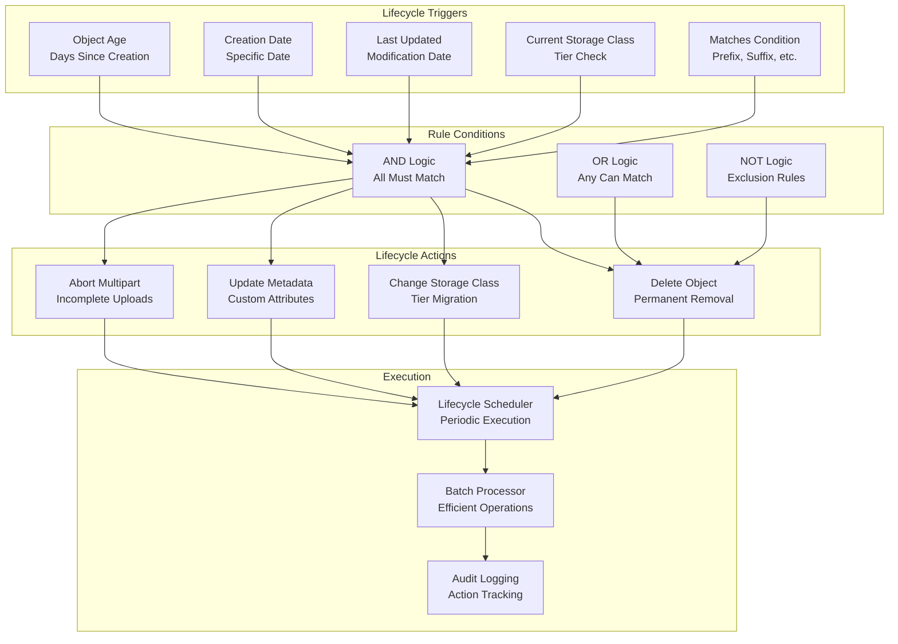

### Storage Class Migration Flow

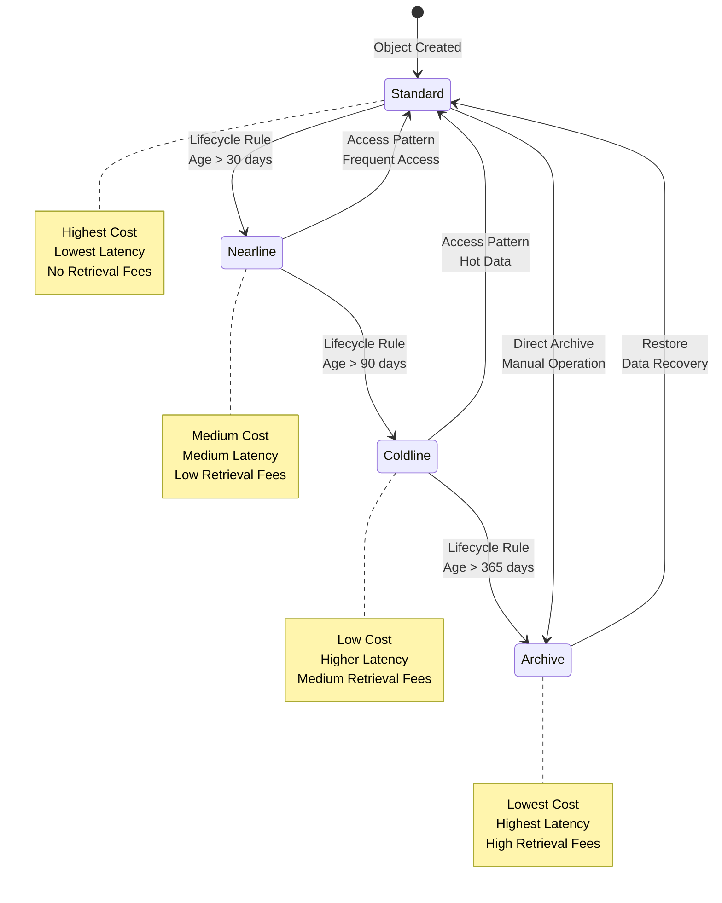

## Integration Patterns

### Cloud Storage with BigQuery

```mermaid
graph LR
    subgraph "Data Lake"
        Raw[Raw Data<br/>Cloud Storage]
        Processed[Processed Data<br/>Cloud Storage]
        External[External Tables<br/>BigQuery Reference]
    end

    subgraph "BigQuery"
        BQ[BQ Engine<br/>Query Processing]
        Cache[Query Cache<br/>Result Caching]
        Materialized[Materialized Views<br/>Pre-computed]
    end

    subgraph "Analytics"
        Dashboard[Dashboards<br/>Looker/Data Studio]
        Reports[Reports<br/>Scheduled]
        ML[ML Models<br/>BQ ML]
    end

    subgraph "Export"
        Export[Export Results<br/>Back to Storage]
        Sharing[Shared Datasets<br/>Authorized Access]
    end

    Raw --> External
    Processed --> External
    External --> BQ

    BQ --> Cache
    BQ --> Materialized

    Cache --> Dashboard
    Materialized --> Dashboard
    Cache --> Reports
    Materialized --> Reports
    BQ --> ML

    BQ --> Export
    Export --> Sharing
```

### CDN Integration Architecture

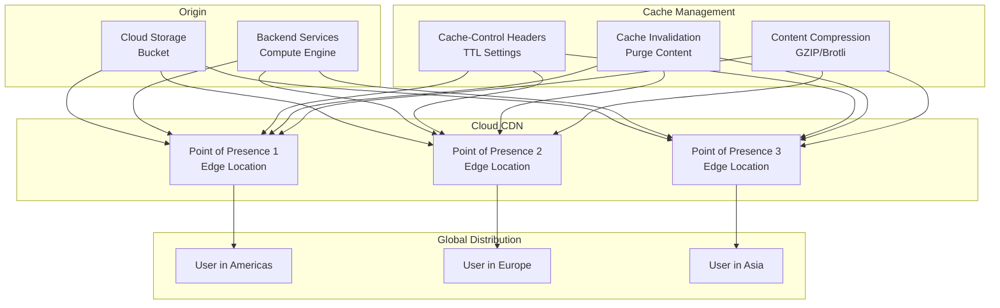

## Performance Optimization

### Request Routing Architecture

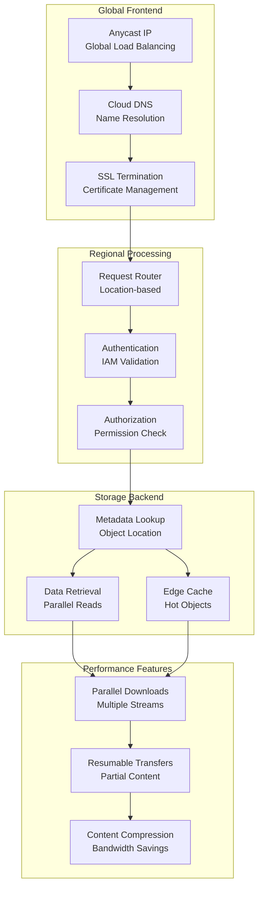

### Cost Optimization Architecture

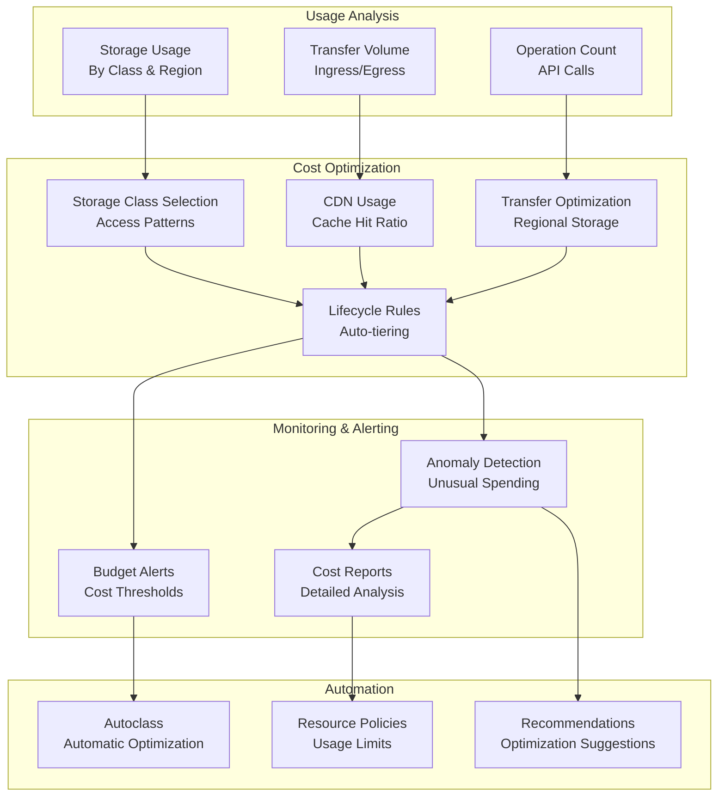

## Multi-Cloud and Hybrid Architectures

### Hybrid Cloud Storage

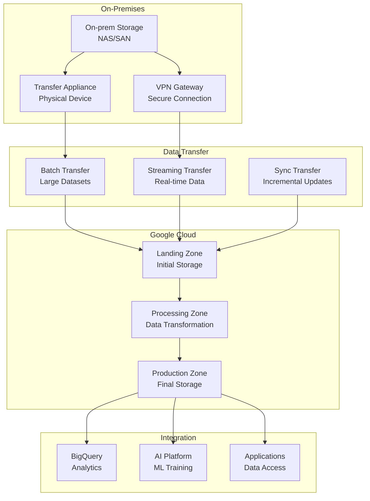

### Cross-Cloud Data Transfer

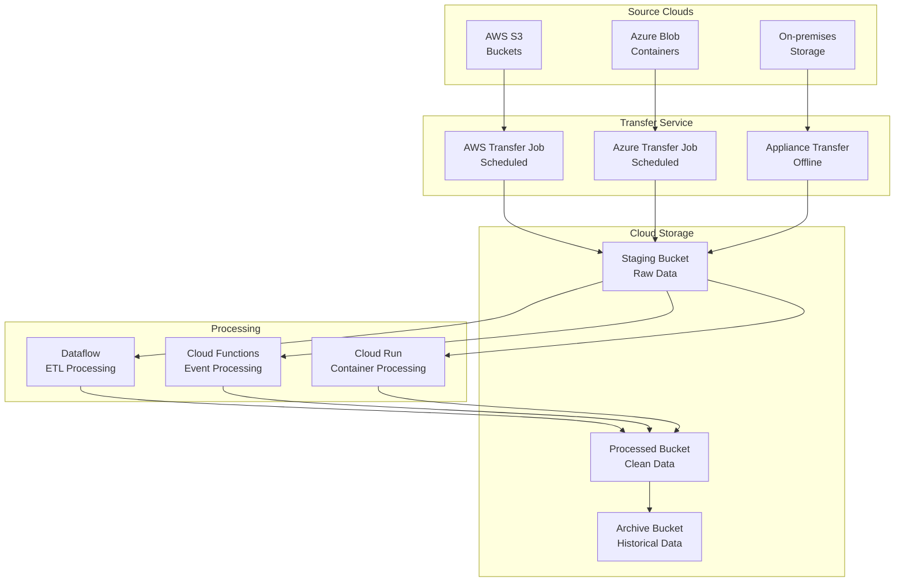

## Monitoring and Observability

### Storage Monitoring Dashboard

```mermaid
graph TD
    subgraph "Usage Metrics"
        Storage[Storage Usage<br/>By Class & Bucket]
        Bandwidth[Bandwidth Usage<br/>Ingress/Egress]
        Operations[Operations Count<br/>API Calls]
    end

    subgraph "Performance Metrics"
        Latency[Request Latency<br/>P50, P95, P99]
        Throughput[Throughput<br/>Requests/Second]
        ErrorRate[Error Rate<br/>4xx/5xx Responses]
    end

    subgraph "Security Metrics"
        Access[Access Patterns<br/>Authorized/Denied]
        Encryption[Encryption Status<br/>Encrypted Objects]
        Audit[Audit Events<br/>Security Events]
    end

    subgraph "Cost Metrics"
        StorageCost[Storage Costs<br/>By Class]
        TransferCost[Transfer Costs<br/>By Region]
        OperationCost[Operation Costs<br/>By Type]
    end

    subgraph "Alerting"
        Threshold[Threshold Alerts<br/>Usage Limits]
        Anomaly[Anomaly Detection<br/>Unusual Patterns]
        Budget[Budget Alerts<br/>Cost Thresholds]
    end

    Storage --> Threshold
    Bandwidth --> Anomaly
    Operations --> Threshold
    Latency --> Anomaly
    Throughput --> Threshold
    ErrorRate --> Anomaly
    Access --> Threshold
    StorageCost --> Budget
    TransferCost --> Budget
    OperationCost --> Budget
```

## Summary

These diagrams illustrate the key architectural patterns and data flows in Cloud Storage:

1. **Service Architecture**: Global control plane with regional storage
2. **Storage Classes**: Cost-performance trade-offs for different access patterns
3. **Data Transfer**: Multiple methods for ingesting data from various sources
4. **Security Model**: Multi-layered security with encryption and access control
5. **Lifecycle Management**: Automated data tiering and retention
6. **Integration Patterns**: Deep integration with Google Cloud analytics services
7. **Performance Optimization**: Request routing and caching strategies
8. **Cost Optimization**: Usage analysis and automated optimization
9. **Multi-Cloud**: Cross-cloud data transfer and hybrid architectures
10. **Monitoring**: Comprehensive observability and alerting

These visual representations help understand how Cloud Storage components interact and how to design efficient data storage architectures.
