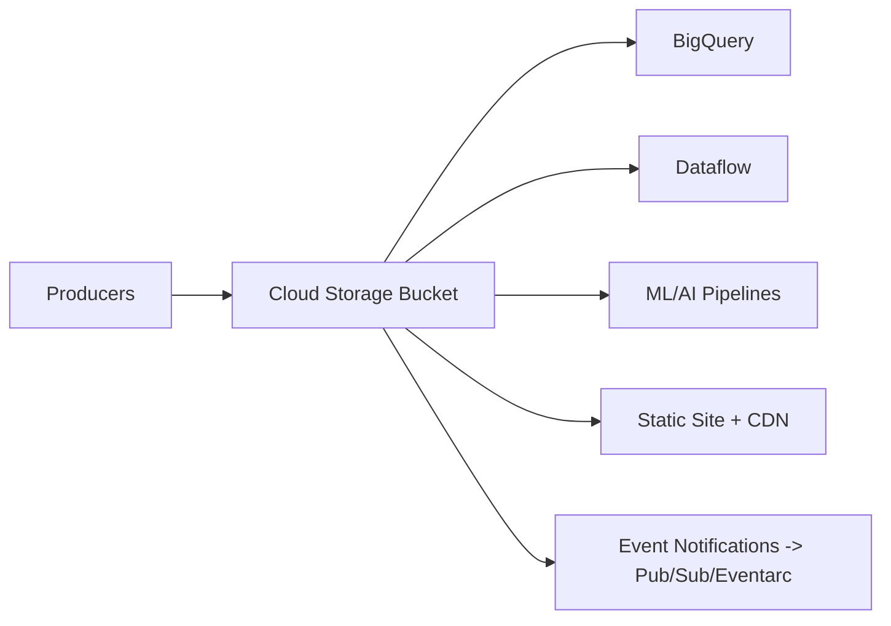

# Cloud Storage Guide – Basic → Architect

## Level 1 – Launch & Basics

### 1. Quick Setup
```bash
gsutil mb -l us-central1 gs://my-bucket
gsutil cp file.txt gs://my-bucket/
gsutil ls gs://my-bucket/
```

### 2. Core Concepts
- Buckets (location, class, uniform ACL vs fine-grained)
- Objects, generations, preconditions
- Storage classes: Standard, Nearline, Coldline, Archive

### 3. Basic Ops
```bash
gsutil cp -r data/ gs://my-bucket/data/
gsutil ls -L gs://my-bucket/data/*
```

## Level 2 – Production Patterns

### Security & Access
- Uniform bucket-level access; IAM over ACLs
- Signed URLs; VPC-SC for egress protection
- CMEK for sensitive data; object versioning and retention policies

### Performance & Cost
- Choose storage class per workload; lifecycle rules for tiering
- Composite uploads for large files; parallel uploads
- Avoid hot objects thrashing; use regional buckets for latency

### Data Integrity & Governance
- Object versioning; retention policy/holds
- Inventory and ACL/IAM audit; org policies to enforce encryption

## Level 3 – Architect Playbook

### Integration Patterns
- Data ingestion/serving for BQ/Dataflow/AI workloads
- Static site hosting; CDN fronting via Cloud CDN
- Event-driven via Pub/Sub notifications/Eventarc

### Reliability & DR
- Cross-region buckets (dual-region) for resilience
- Backup/restore strategy via versioning/snapshots
- Consistency: read-after-write for new objects/metadata

### Operations
- Monitor egress/calls; alerts on 4xx/5xx spikes
- IAM least privilege; service accounts per app

## Ops Cheat Sheet

| Task | Command | Note |
| --- | --- | --- |
| Make bucket | `gsutil mb -l REGION gs://bucket` | create |
| Copy | `gsutil -m cp -r src gs://bucket/` | parallel |
| Set lifecycle | `gsutil lifecycle set rule.json gs://bucket` | tiering |
| Signed URL | `gsutil signurl key.json gs://bucket/obj` | temp access |
| Versioning | `gsutil versioning set on gs://bucket` | enables versions |

## Architecture Patterns



## Checklist Before Production
- [ ] Uniform bucket-level access; IAM least privilege; CMEK if needed
- [ ] Lifecycle rules for tiering; storage class chosen per workload
- [ ] Versioning/retention as required; holds for compliance
- [ ] Signed URLs or CDN where appropriate; VPC-SC for sensitive data
- [ ] Monitoring/alerts on errors/egress; org policies enforced

## Learning Path Links
- Track: `LearningTracks/Data-Engineer-GCP/track.md`
- Projects: `Projects/GCP-DataEngineer/starter/01-gcs-to-bq.md` and `Projects/Integrated/data-engineer-gcp-capstone.md`
- Mastery: `Mastery/GCP-CloudStorage/` (quiz, scenarios, flashcards)

