# Cloud Build - Visual Architecture

## Build Pipeline Architecture

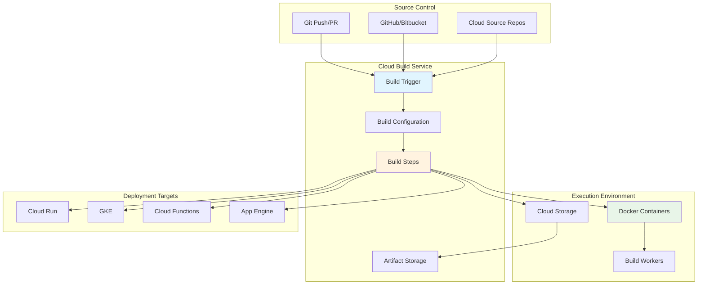

## Build Execution Flow

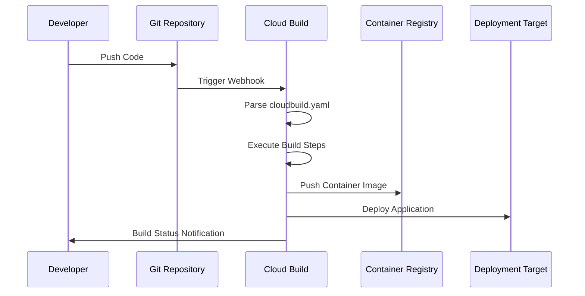

## Trigger System

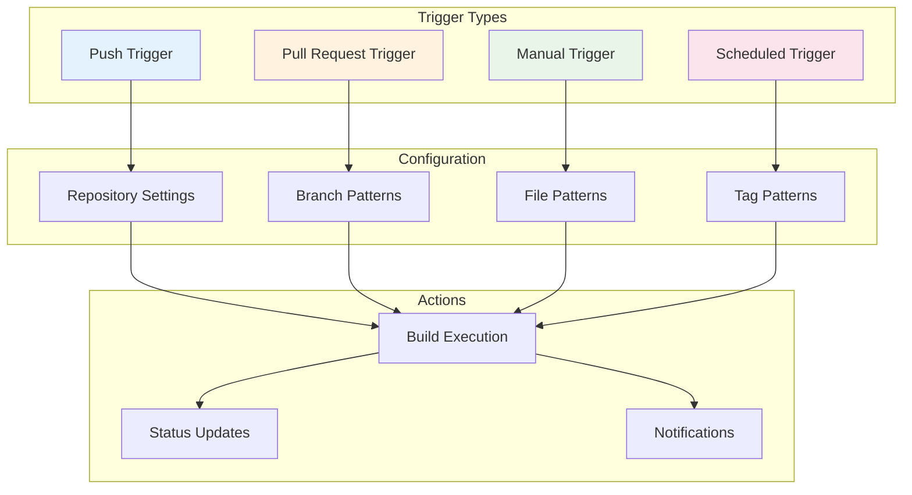

## Build Steps Execution

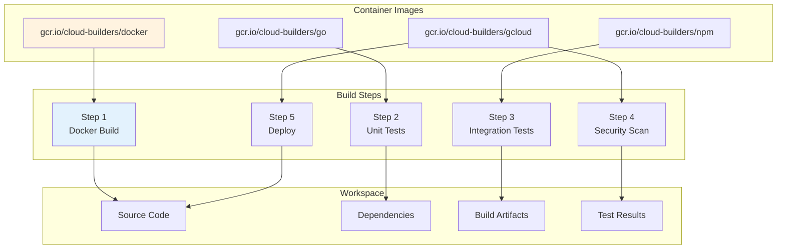

## Multi-Environment Deployment

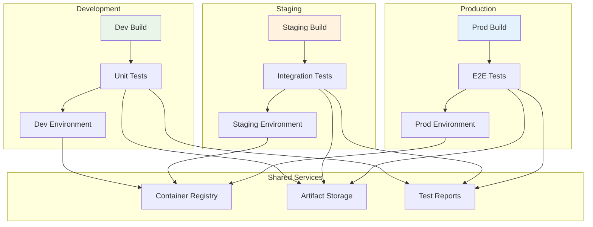

## CI/CD Pipeline Flow

```mermaid
graph LR
    subgraph "Commit Stage"
        A[Code Commit]
        B[Lint & Format]
        C[Unit Tests]
    end

    subgraph "Build Stage"
        D[Build Artifact]
        E[Security Scan]
        F[Container Image]
    end

    subgraph "Test Stage"
        G[Integration Tests]
        H[Performance Tests]
        I[Acceptance Tests]
    end

    subgraph "Deploy Stage"
        J[Dev Deploy]
        K[Staging Deploy]
        L[Prod Deploy]
    end

    A --> B
    B --> C
    C --> D
    D --> E
    E --> F
    F --> G
    G --> H
    H --> I
    I --> J
    J --> K
    K --> L

    style A fill:#ffebee
    style D fill:#e3f2fd
    style G fill:#fff3e0
    style J fill:#e8f5e8
```

## Parallel Build Execution

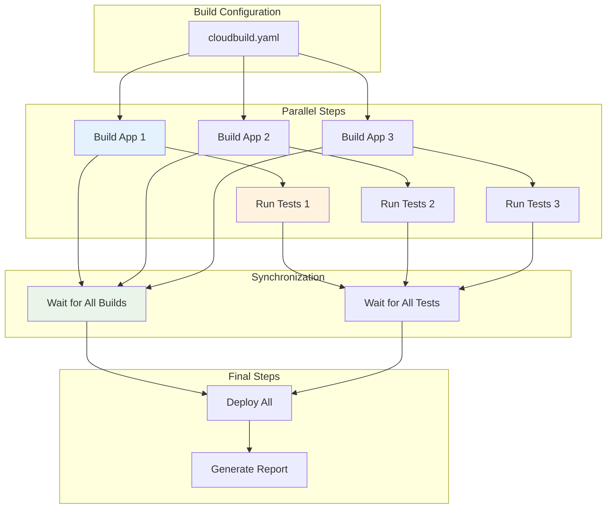

## GitOps Workflow

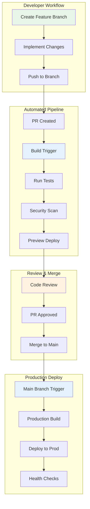

## Security Integration

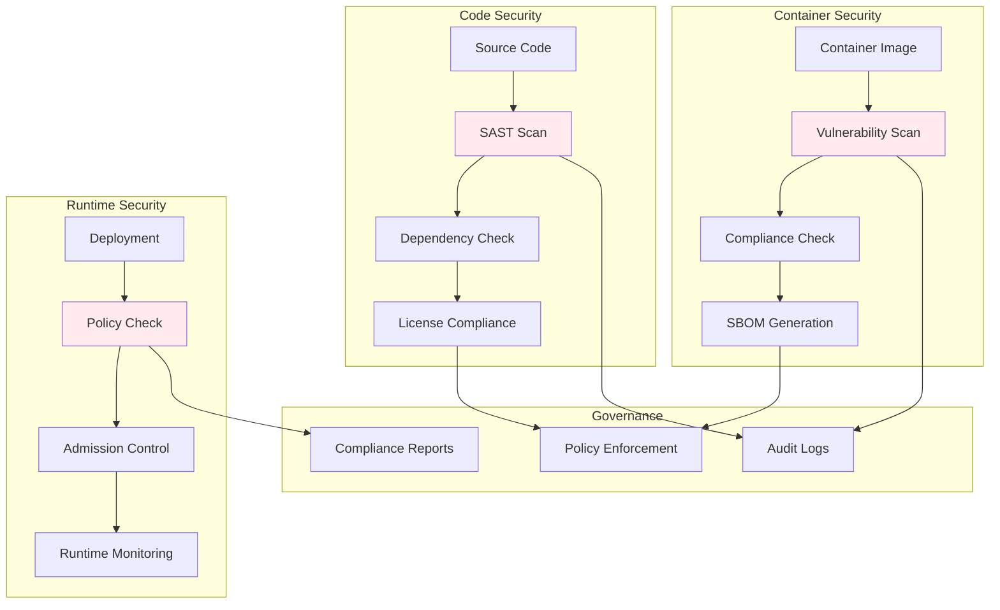

## Build Caching Strategy

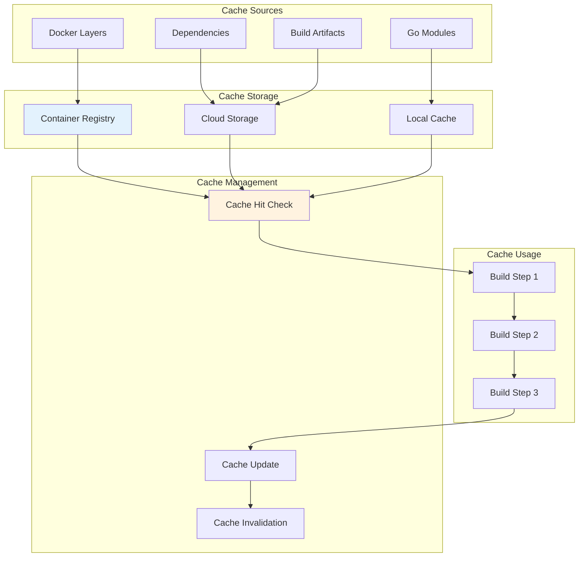

## Monitoring and Observability

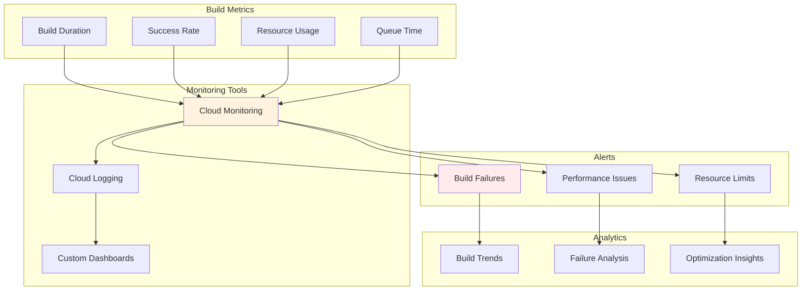

## Integration Patterns

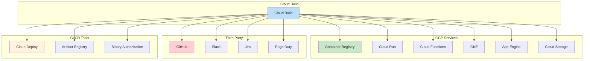

## Cost Optimization

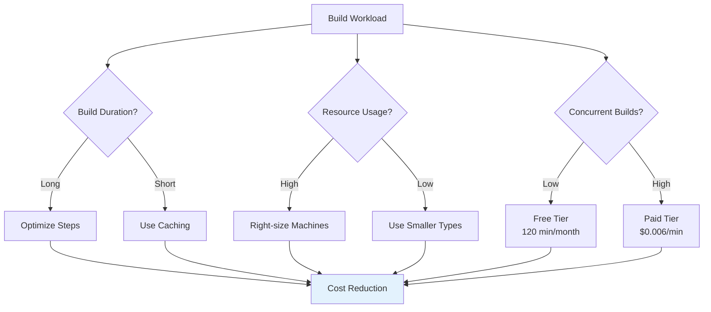

## Deployment Strategies

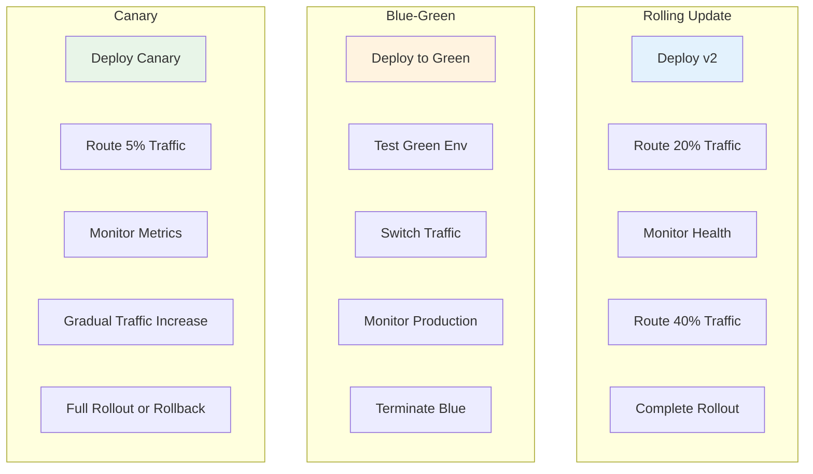

## Build Environment

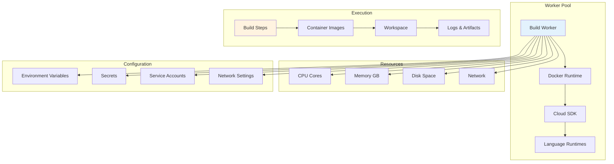

## Error Handling and Recovery

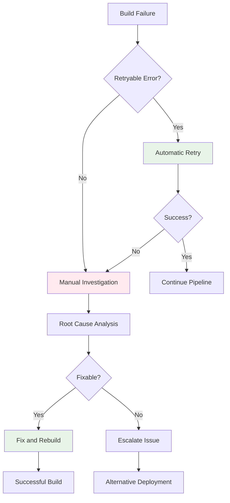

## Compliance Workflow

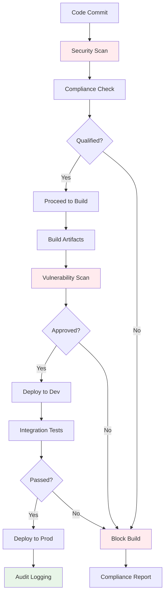

These diagrams illustrate the comprehensive architecture and workflows of Cloud Build, showing how it integrates with various GCP services and third-party tools to create robust CI/CD pipelines. The visual representations help understand the flow of builds from source code to production deployment, including security, monitoring, and optimization aspects.