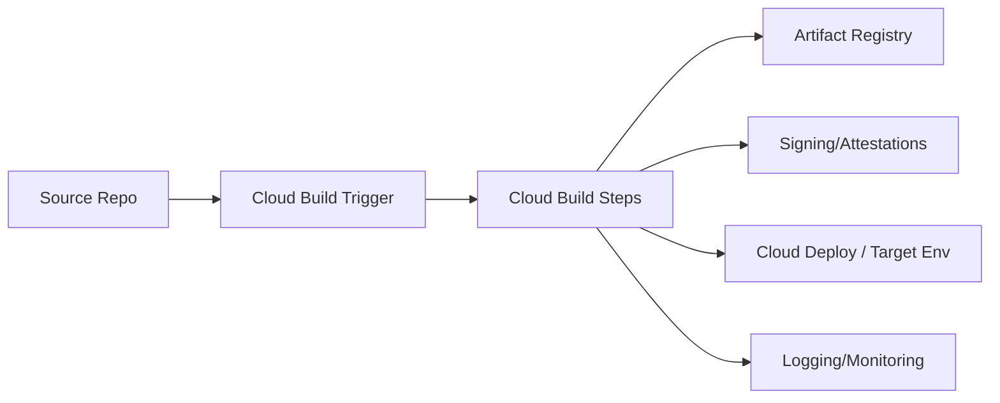

# Cloud Build Guide – Basic → Architect

## Level 1 – Launch & Basics

### 1. Quick Build
```bash
gcloud builds submit --tag gcr.io/$PROJECT_ID/hello .
```

### 2. Core Concepts
- Triggers (repo events), steps, substitutions
- Cloud Build service account; logs/artifacts; build history
- Builders: docker, gcloud, community images

### 3. Simple cloudbuild.yaml
```yaml
steps:
  - name: 'gcr.io/cloud-builders/docker'
    args: ['build', '-t', 'gcr.io/$PROJECT_ID/app', '.']
  - name: 'gcr.io/cloud-builders/docker'
    args: ['push', 'gcr.io/$PROJECT_ID/app']
images:
  - 'gcr.io/$PROJECT_ID/app'
```

## Level 2 – Production Patterns

### CI/CD Pipelines
- Separate build/test/deploy steps; use substitutions
- Cache with kaniko or docker layer caching where possible
- Use Artifact Registry; pin base images; SBOM generation

### Security & Supply Chain
- Least-privilege Cloud Build SA; Workload Identity Federation for external repos
- Sigstore/cosign signing; attestations; vulnerability scanning
- Policy checks before deploy (Binary Authz, OPA/Conftest)

### Integration
- Triggers for GitHub/GitLab/Cloud Source; branch/tag filters
- Notifications (Pub/Sub/Slack); store logs in Cloud Logging

## Level 3 – Architect Playbook

### Governance
- Org policies restricting builders and regions
- Approved base images; private pools if needed
- Budget alerts; build timeouts; parallelism controls

### Performance & Cost
- Regional builds near registries; reuse caches
- Split long builds into parallel steps; artifacts stored efficiently

### Deployment Patterns
- Cloud Deploy for progressive delivery; Anthos/GKE/Run/Functions targets
- Terraform/infrastructure apply steps with guardrails

## Ops Cheat Sheet

| Task | Command | Note |
| --- | --- | --- |
| Run build | `gcloud builds submit` | ad-hoc |
| Triggers | `gcloud beta builds triggers list` | CI |
| Logs | Cloud Logging / UI | review |
| Approvals | `gcloud builds describe` with approvals | gated |

## Architecture Patterns



## Checklist Before Production
- [ ] Least-privilege SA; Workload Identity for external repos
- [ ] Image signing/SBOM; vulnerability scans; policy gates
- [ ] Caching strategy; regional builds; artifact registry usage
- [ ] Triggers with branch/tag filters; approvals where needed
- [ ] Logs/alerts wired; budgets/timeouts set

## Learning Path Links
- Track: `LearningTracks/Backend-GCP/track.md`
- Projects: `Projects/GCP-Backend/starter/01-cloud-build-ci.md` and `Projects/Integrated/backend-gcp-capstone.md`
- Mastery: `Mastery/GCP-CloudBuild/` (quiz, scenarios, flashcards)

