# Cloud Logging - Visual Architecture

## Log Collection & Ingestion Flow

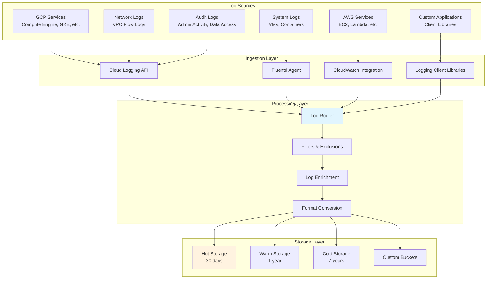

## Log Router & Sink Architecture

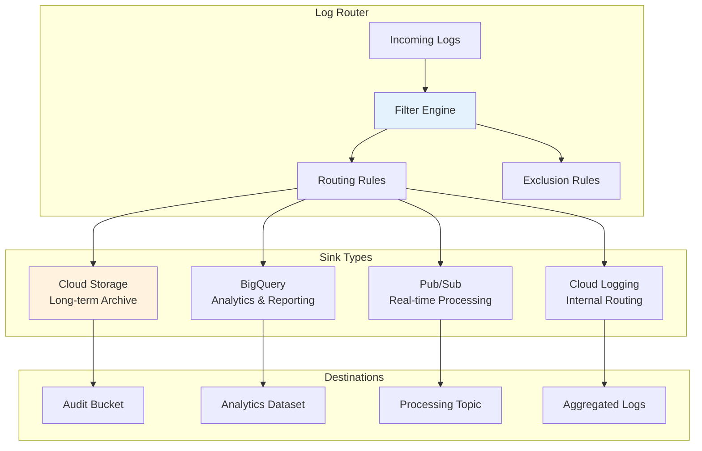

## Log Analysis Workflow

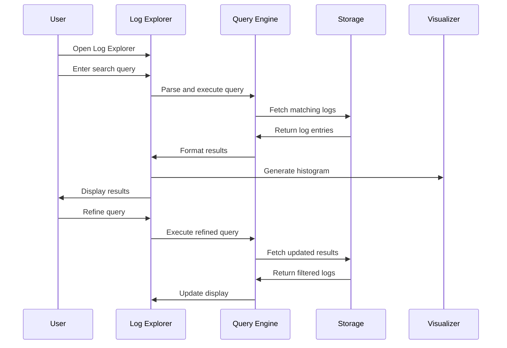

## Log-Based Metrics Pipeline

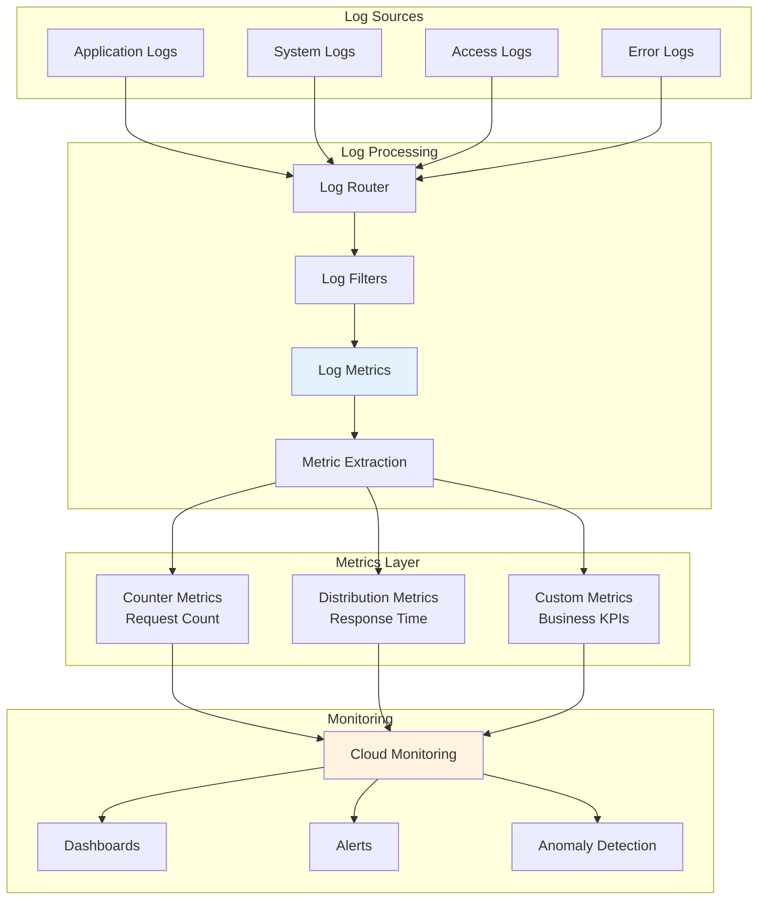

## Multi-Cloud Log Integration

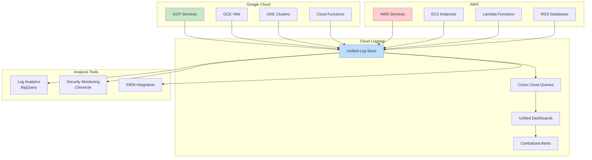

## Audit Log Flow

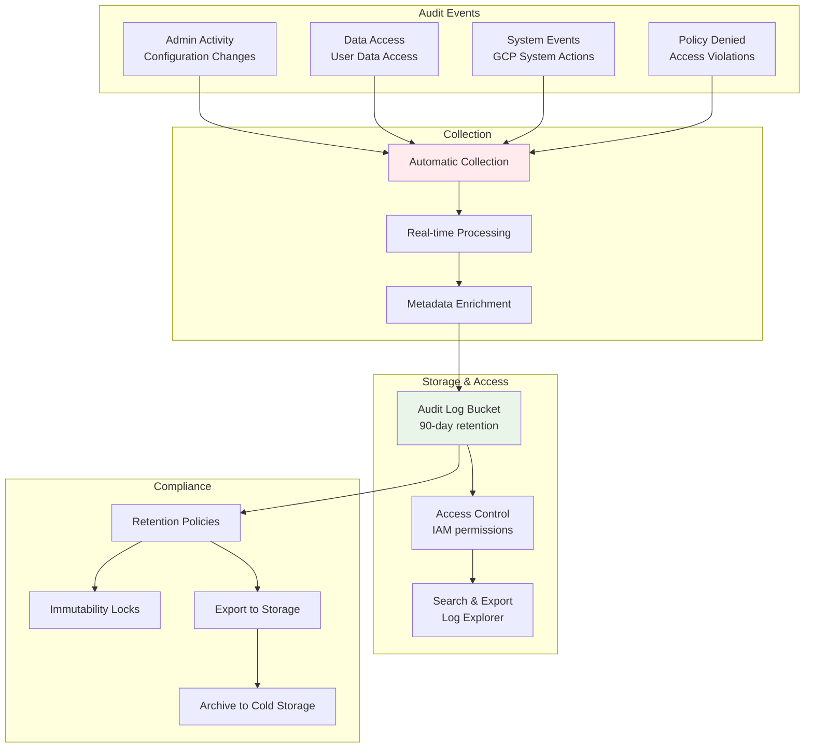

## Log Export Patterns

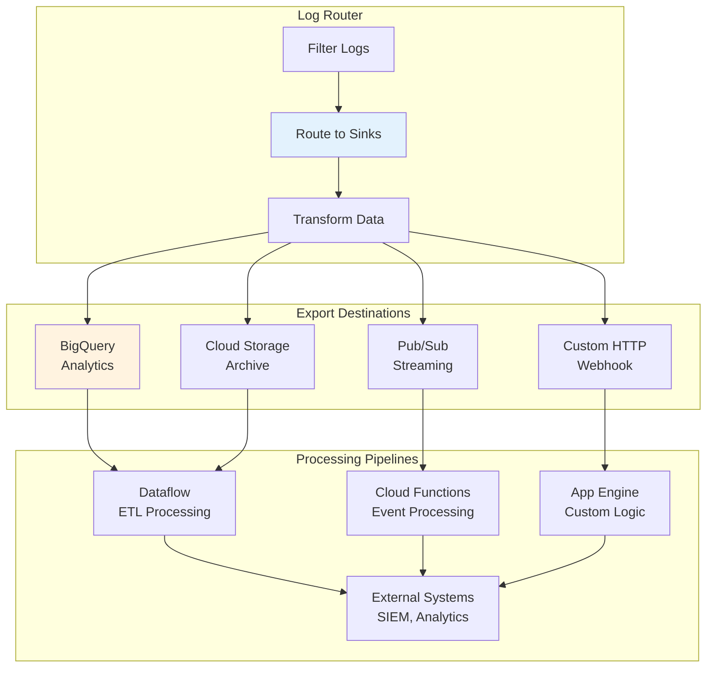

## Log Analytics Architecture

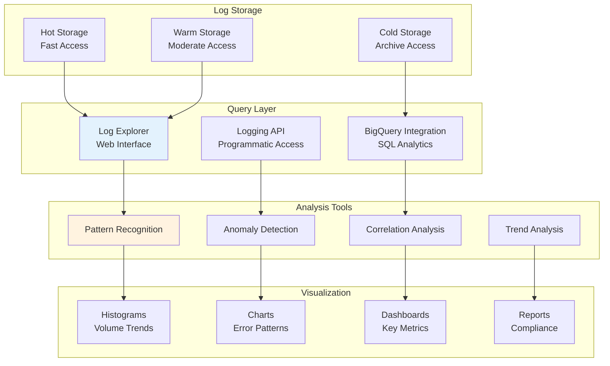

## Security Monitoring with Logs

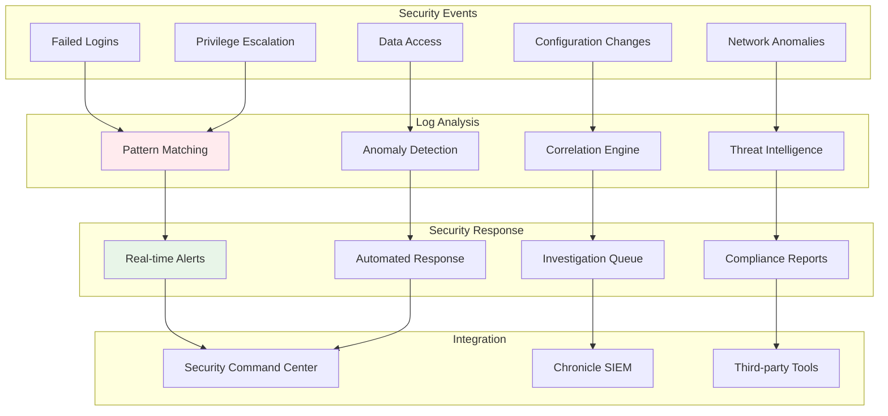

## Cost Optimization Flow

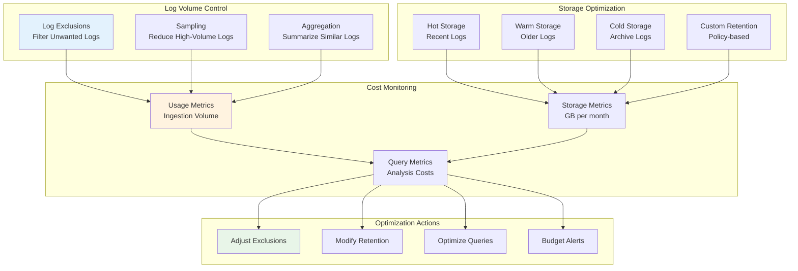

## Real-time Log Processing

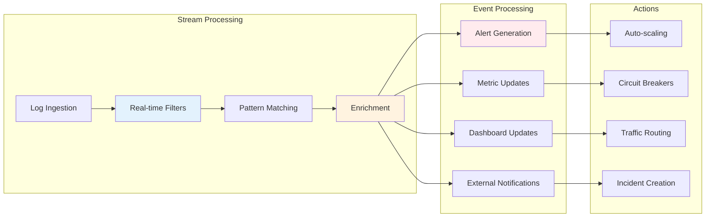

## Compliance & Audit Architecture

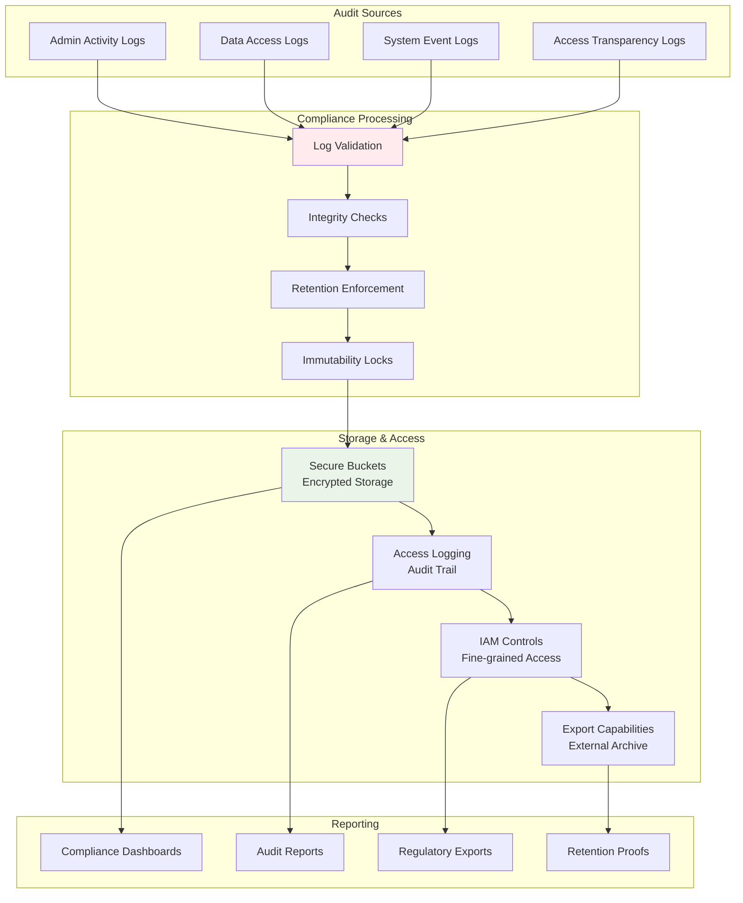

## Log Correlation with Monitoring

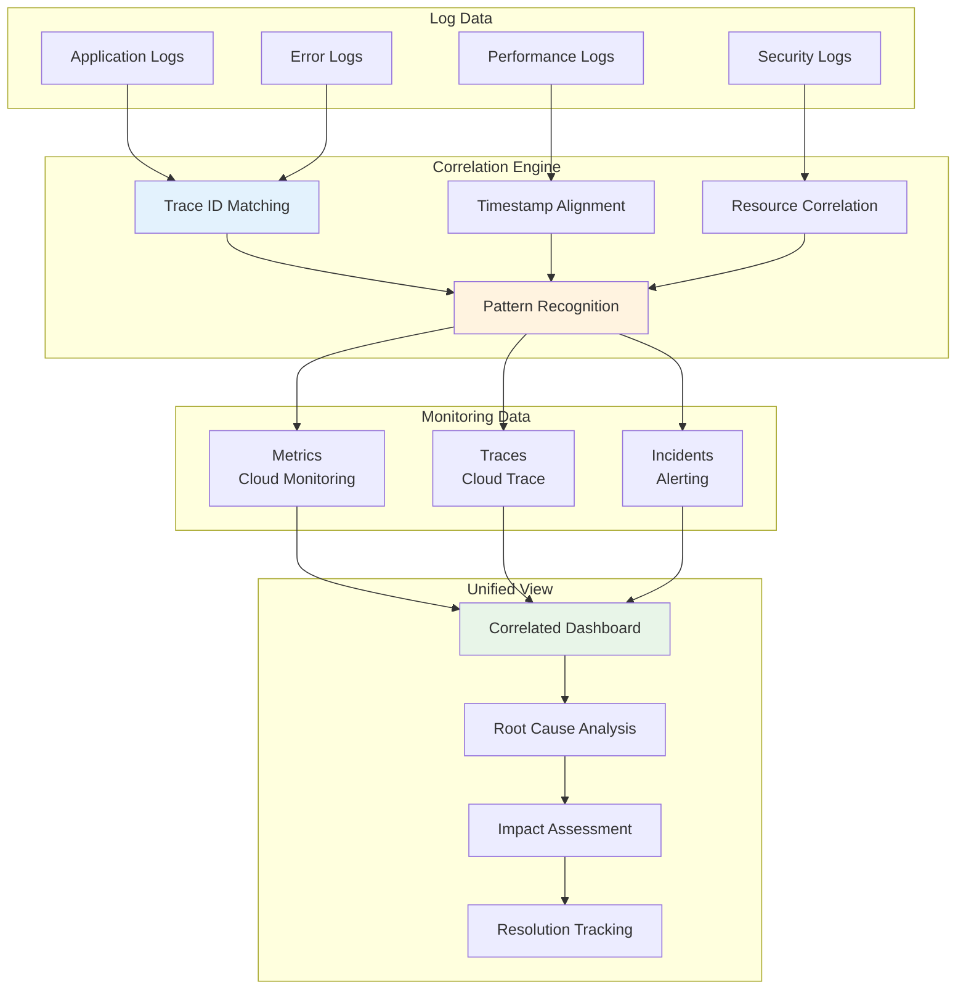

These diagrams illustrate the comprehensive logging architecture of Cloud Logging, showing how logs flow from various sources through processing, storage, and analysis layers. The visual representations help understand log routing patterns, integration capabilities, and the relationship between logging and other observability tools.
