# Cloud Monitoring - Visual Architecture

## Monitoring Data Flow Architecture

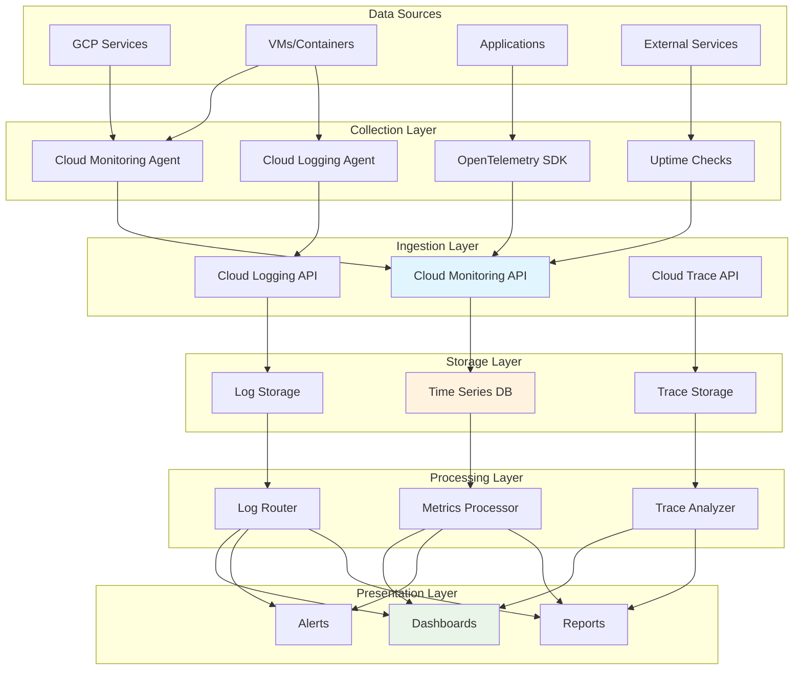

## Alerting Workflow

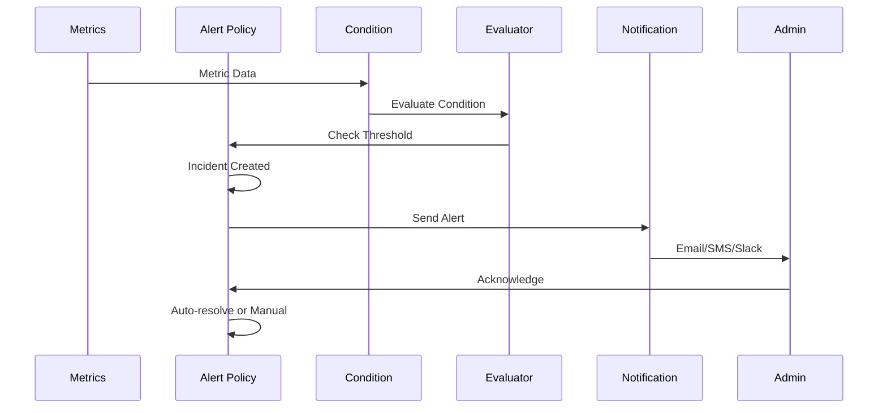

## Dashboard Layout Examples

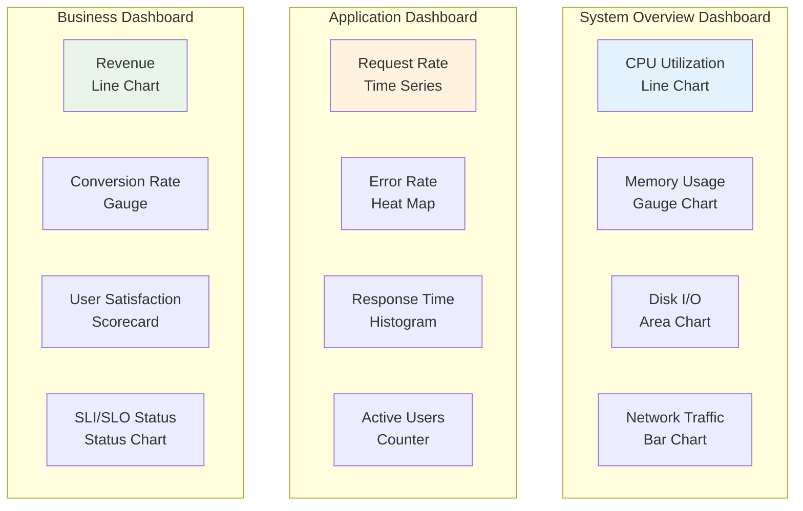

## SLO and SLI Monitoring

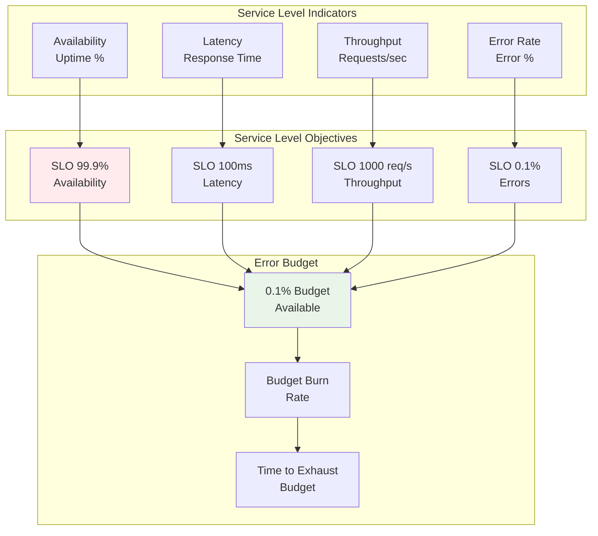

## Metrics Collection Architecture

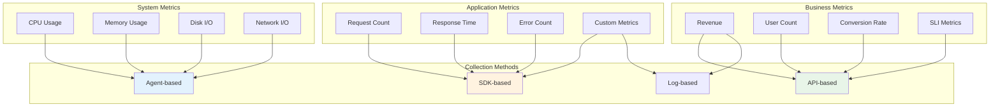

## Alert Escalation Flow

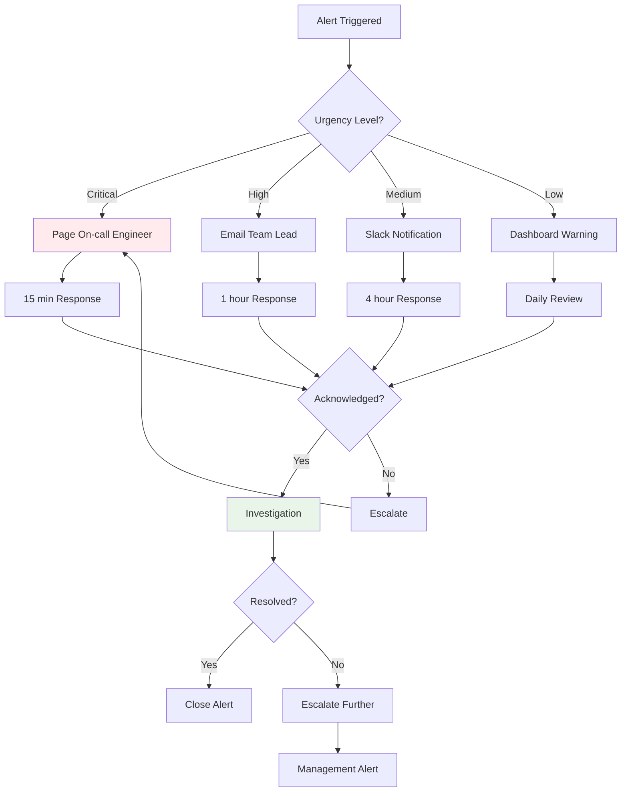

## Integration Patterns

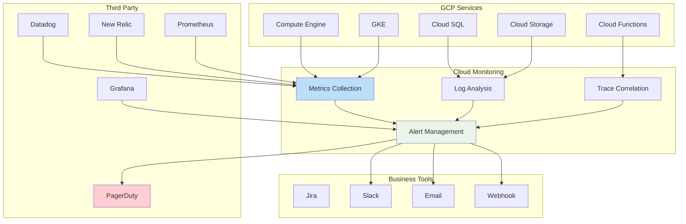

## Uptime Monitoring Architecture

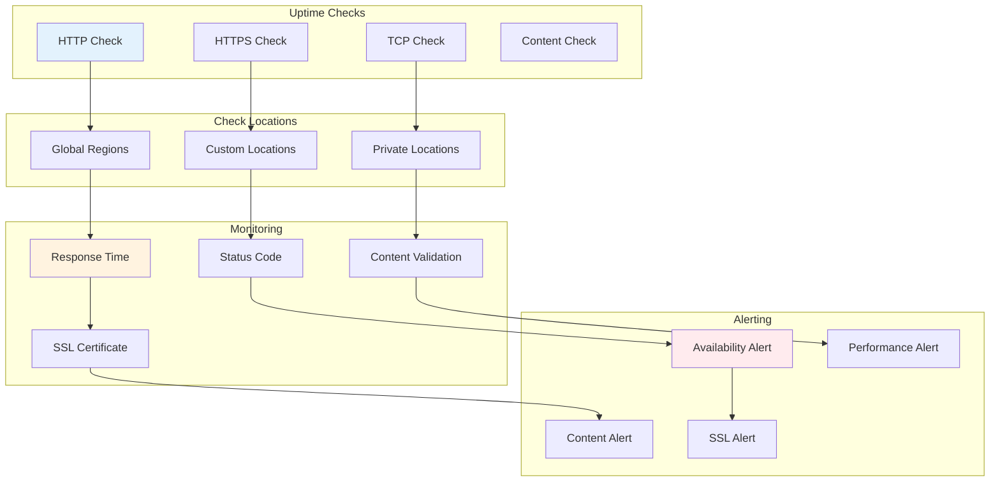

## Log-Based Monitoring

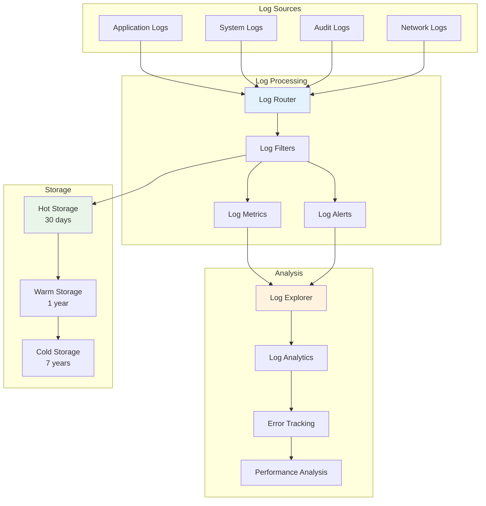

## Custom Metrics Pipeline

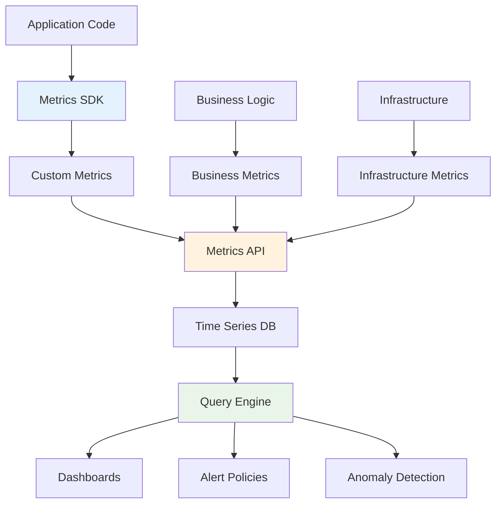

## Incident Response Workflow

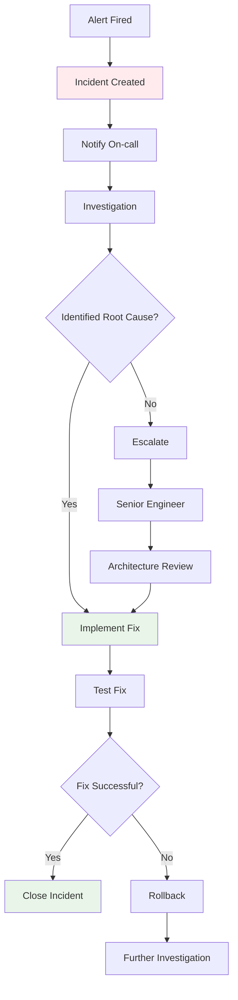

## Multi-Cloud Monitoring

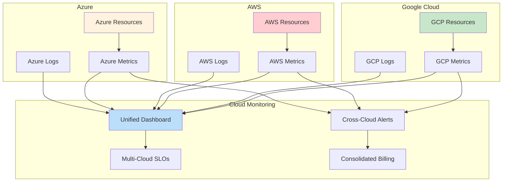

## Cost Monitoring Dashboard

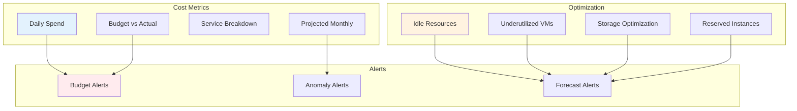

## Service Mesh Monitoring

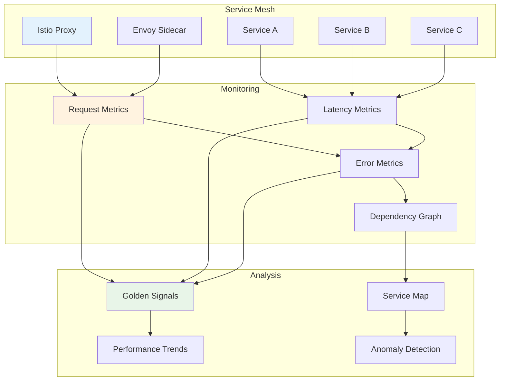

## Compliance Monitoring

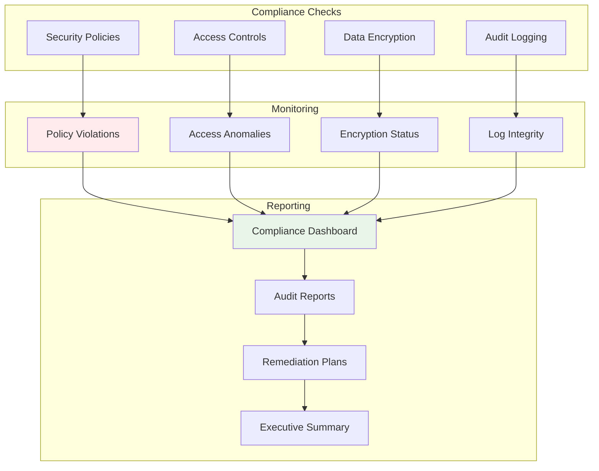

## Real-Time Monitoring

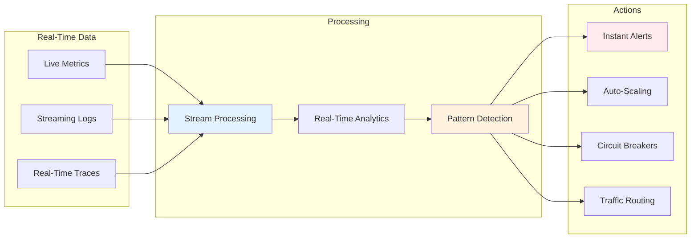

These diagrams illustrate the comprehensive monitoring architecture of Cloud Monitoring, showing how it collects, processes, and presents observability data from various sources. The visual representations help understand the flow of monitoring data, alerting workflows, dashboard layouts, and integration patterns that make Cloud Monitoring a powerful observability platform.
