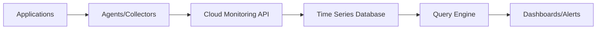

# Cloud Monitoring - What You Need to Know

## Overview

Cloud Monitoring is Google's unified observability platform that provides comprehensive monitoring, alerting, and dashboarding capabilities for Google Cloud Platform resources and applications. It collects metrics, logs, and traces from your infrastructure and applications, enabling you to understand system performance, troubleshoot issues, and maintain reliability.

## Core Architecture

### Monitoring Data Types

**Metrics**
- **System Metrics**: CPU, memory, disk, network utilization
- **Application Metrics**: Custom business metrics and KPIs
- **Service Metrics**: GCP service performance and health
- **Uptime Checks**: External service availability monitoring

**Logs**
- **Platform Logs**: GCP service logs (Cloud Logging integration)
- **Application Logs**: Custom application logging
- **Audit Logs**: Security and access monitoring
- **Network Logs**: VPC flow logs and firewall logs

**Traces**
- **Distributed Tracing**: Request flow across services
- **Latency Analysis**: Performance bottleneck identification
- **Error Tracking**: Exception and error monitoring
- **Service Dependencies**: Microservice interaction mapping

### Data Collection Architecture

**Agents and Collectors**
- **Cloud Monitoring Agent**: System and application metrics
- **Logging Agent**: Log collection and forwarding
- **OpenTelemetry**: Standardized observability data collection
- **Custom Collectors**: Third-party integration

**Data Pipeline**


**Data Retention**
- **Metrics**: 6 weeks for 1-minute resolution, 2 years for daily resolution
- **Logs**: Configurable retention (30 days to 10 years)
- **Traces**: 30 days retention

## Key Features

### Metrics and Monitoring

**Built-in Metrics**
- **GCP Service Metrics**: Automatic collection from Compute Engine, GKE, Cloud SQL, etc.
- **System Metrics**: CPU, memory, disk, network for VMs and containers
- **Application Metrics**: Custom metrics via client libraries
- **Uptime Metrics**: Synthetic monitoring for external services

**Custom Metrics**
```python
# Python client library
from google.cloud import monitoring_v3

client = monitoring_v3.MetricServiceClient()
project_name = client.project_path('my-project')

series = monitoring_v3.TimeSeries()
series.metric.type = 'custom.googleapis.com/my_metric'
series.resource.type = 'gce_instance'

# Create metric descriptor
descriptor = monitoring_v3.MetricDescriptor()
descriptor.type = 'custom.googleapis.com/my_metric'
descriptor.metric_kind = monitoring_v3.MetricDescriptor.MetricKind.GAUGE
descriptor.value_type = monitoring_v3.MetricDescriptor.ValueType.DOUBLE

client.create_metric_descriptor(project_name, descriptor)
```

### Alerting System

**Alert Policies**
- **Metric-based Alerts**: Threshold violations on metrics
- **Log-based Alerts**: Pattern matching in logs
- **Uptime Alerts**: Service availability issues
- **Budget Alerts**: Cost threshold notifications

**Alert Configuration**
```yaml
# Alert policy example
displayName: High CPU Usage
conditions:
- displayName: CPU > 80%
  conditionThreshold:
    filter: metric.type="compute.googleapis.com/instance/cpu/utilization"
    comparison: COMPARISON_GT
    thresholdValue: 0.8
    duration: 300s
notificationChannels:
- type: email
  labels:
    email_address: admin@example.com
```

**Notification Channels**
- **Email**: Direct email notifications
- **SMS**: Text message alerts
- **PagerDuty**: Incident management integration
- **Slack**: Team communication integration
- **Webhook**: Custom integration endpoints

### Dashboarding and Visualization

**Built-in Dashboards**
- **GCP Service Dashboards**: Pre-built for each GCP service
- **Infrastructure Dashboards**: VM, container, and network monitoring
- **Application Dashboards**: Custom application metrics
- **Uptime Dashboards**: Service availability monitoring

**Custom Dashboards**
```json
{
  "displayName": "My Application Dashboard",
  "gridLayout": {
    "widgets": [
      {
        "title": "CPU Utilization",
        "xyChart": {
          "dataSets": [
            {
              "timeSeriesQuery": {
                "timeSeriesFilter": {
                  "filter": "metric.type=\"compute.googleapis.com/instance/cpu/utilization\"",
                  "resource.type": "gce_instance"
                }
              }
            }
          ]
        }
      }
    ]
  }
}
```

## Integration Capabilities

### Cloud Logging Integration

**Unified Observability**
- **Metrics from Logs**: Extract metrics from log data
- **Log-based Metrics**: Count occurrences, extract values
- **Correlated Analysis**: View logs and metrics together
- **Log Alerts**: Alert on log patterns

**Log Metrics Creation**
```bash
# Create log-based metric
gcloud logging metrics create my_metric \
  --description="My log-based metric" \
  --filter="resource.type=gce_instance AND jsonPayload.level=ERROR" \
  --metric-kind=DELTA \
  --value-extractor="1"
```

### Cloud Trace Integration

**Distributed Tracing**
- **Request Tracing**: End-to-end request flow
- **Latency Analysis**: Identify performance bottlenecks
- **Error Correlation**: Link errors to specific requests
- **Service Dependencies**: Map microservice interactions

**Trace Integration**
```python
# Python trace instrumentation
from opentelemetry import trace
from opentelemetry.sdk.trace import TracerProvider
from opentelemetry.sdk.trace.export import CloudTraceSpanExporter

trace.set_tracer_provider(TracerProvider())
trace.get_tracer_provider().add_span_processor(
    CloudTraceSpanExporter(project_id='my-project')
)

tracer = trace.get_tracer(__name__)
with tracer.start_as_current_span("my_operation"):
    # Your code here
    pass
```

### Service Monitoring

**Service Level Objectives (SLOs)**
- **Availability SLOs**: Uptime percentage targets
- **Latency SLOs**: Response time objectives
- **Error Rate SLOs**: Acceptable error percentages
- **Custom SLOs**: Business-specific objectives

**SLO Configuration**
```yaml
# SLO definition
serviceLevelObjective:
  displayName: API Availability
  goal: 0.99  # 99% availability
  rollingPeriod: 2592000s  # 30 days
  serviceLevelIndicator:
    basicSli:
      availability:
        enabled: true
```

### Application Performance Monitoring

**APM Features**
- **Real User Monitoring**: Client-side performance
- **Synthetic Monitoring**: Automated user journey testing
- **Error Tracking**: Application error aggregation
- **Performance Insights**: Automated performance recommendations

**Custom Instrumentation**
```javascript
// JavaScript client monitoring
import { initializeApp } from 'firebase/app';
import { getPerformance } from 'firebase/performance';

const app = initializeApp(config);
const perf = getPerformance(app);

// Automatic performance monitoring
// Custom traces
const trace = perf.trace('custom_operation');
trace.start();
trace.stop();
```

## Advanced Features

### Anomaly Detection

**Intelligent Alerting**
- **Machine Learning**: Automatic anomaly detection
- **Baseline Learning**: Learn normal behavior patterns
- **Dynamic Thresholds**: Adjust thresholds based on trends
- **False Positive Reduction**: Reduce alert noise

**Anomaly Detection Setup**
```yaml
forecasting:
  forecastingModel: LINEAR_REGRESSION
  seasonality: DAILY
  sensitivity: LOW
  minSensitivity: 0.8
  maxSensitivity: 0.95
```

### Synthetic Monitoring

**Uptime Checks**
- **HTTP/HTTPS Checks**: Web endpoint monitoring
- **TCP Checks**: Port availability monitoring
- **Content Validation**: Response content verification
- **Global Distribution**: Checks from multiple regions

**Synthetic Monitor Configuration**
```yaml
# Uptime check configuration
displayName: My API Uptime Check
httpCheck:
  path: /health
  port: 443
  useSsl: true
  validateSsl: true
monitoredResource:
  type: uptime_url
  labels:
    host: api.example.com
```

### Error Reporting

**Error Aggregation**
- **Automatic Detection**: Group similar errors
- **Stack Trace Analysis**: Root cause identification
- **Trend Analysis**: Error pattern recognition
- **Impact Assessment**: Affected user quantification

**Error Reporting Integration**
```python
# Python error reporting
from google.cloud import error_reporting

client = error_reporting.Client()
try:
    # Your code that might fail
    pass
except Exception as e:
    client.report_exception()
```

### Custom Metrics and Logs

**Custom Metrics Pipeline**
```python
# Create custom metric
from google.api import metric_pb2 as ga_metric
from google.cloud import monitoring_v3

client = monitoring_v3.MetricServiceClient()

metric_descriptor = ga_metric.MetricDescriptor()
metric_descriptor.type = "custom.googleapis.com/my_metric"
metric_descriptor.metric_kind = ga_metric.MetricDescriptor.MetricKind.GAUGE
metric_descriptor.value_type = ga_metric.MetricDescriptor.ValueType.DOUBLE
metric_descriptor.description = "My custom metric"

client.create_metric_descriptor(
    name=client.project_path('my-project'),
    metric_descriptor=metric_descriptor
)
```

**Custom Logs**
```python
# Structured logging
import logging
import google.cloud.logging

client = google.cloud.logging.Client()
client.setup_logging()

logging.info("User login", extra={
    'json_fields': {
        'user_id': '12345',
        'action': 'login',
        'ip_address': '192.168.1.1'
    }
})
```

## Security and Compliance

### Data Privacy and Security

**Data Encryption**
- **In Transit**: TLS encryption for all data transmission
- **At Rest**: Google-managed encryption keys
- **Customer-Managed Keys**: CMEK support for sensitive data

**Access Control**
- **IAM Integration**: Fine-grained access permissions
- **Resource Hierarchy**: Project, folder, organization levels
- **Service Accounts**: Automated monitoring access

### Compliance and Audit

**Audit Logging**
- **Data Access Audit**: Track monitoring data access
- **Admin Activity**: Configuration change tracking
- **System Events**: Platform event logging

**Compliance Features**
- **SOX Compliance**: Financial audit requirements
- **HIPAA Compliance**: Healthcare data protection
- **PCI DSS**: Payment card industry standards
- **GDPR**: Data protection and privacy

## Cost Optimization

### Pricing Model

**Monitoring Costs**
- **Metrics Ingestion**: $0.258 per million samples
- **Metrics Storage**: Included in ingestion cost
- **Logs Ingestion**: $0.50 per GB
- **Logs Storage**: $0.01 per GB per month

**Uptime Checks**
- **HTTP Checks**: $1.00 per check per month
- **TCP Checks**: $2.00 per check per month

### Cost Optimization Strategies

**Metrics Optimization**
- **Sampling**: Reduce high-frequency metrics
- **Aggregation**: Use coarser granularity for historical data
- **Filtering**: Only collect necessary metrics

**Logs Optimization**
- **Log Routing**: Route logs to appropriate storage classes
- **Exclusion Filters**: Exclude unnecessary log entries
- **Storage Classes**: Use cheaper storage for old logs

**Alert Optimization**
- **Alert Policies**: Reduce false positive alerts
- **Notification Channels**: Use cost-effective channels
- **Alert Grouping**: Batch related alerts

## Integration with Development Workflow

### CI/CD Integration

**Build Monitoring**
```yaml
# Cloud Build integration
steps:
- name: 'gcr.io/cloud-builders/gcloud'
  args: ['monitoring', 'metrics', 'list', '--filter', 'metric.type=build.googleapis.com/builds/status']

# Deploy monitoring
- name: 'gcr.io/cloud-builders/gcloud'
  args: ['monitoring', 'dashboards', 'create', '--config', 'dashboard.json']
```

### Infrastructure as Code

**Terraform Integration**
```hcl
resource "google_monitoring_dashboard" "dashboard" {
  dashboard_json = file("${path.module}/dashboard.json")
}

resource "google_monitoring_alert_policy" "alert_policy" {
  display_name = "High CPU Usage"
  conditions {
    display_name = "CPU > 80%"
    condition_threshold {
      filter          = "metric.type=\"compute.googleapis.com/instance/cpu/utilization\""
      comparison      = "COMPARISON_GT"
      threshold_value = 0.8
      duration        = "300s"
    }
  }
}
```

### Application Integration

**Microservices Monitoring**
- **Service Mesh**: Istio integration for service monitoring
- **API Gateway**: Cloud Endpoints monitoring
- **Load Balancer**: Traffic and performance monitoring
- **Database**: Query performance and connection monitoring

**Multi-Cloud Monitoring**
- **AWS Integration**: Monitor AWS resources alongside GCP
- **Azure Integration**: Cross-cloud observability
- **On-Premises**: Hybrid cloud monitoring
- **Custom Integrations**: Third-party tool integration

## Best Practices

### Monitoring Strategy

**Four Golden Signals**
- **Latency**: Time for request processing
- **Traffic**: Demand on your system
- **Errors**: Rate of failed requests
- **Saturation**: Resource utilization levels

**USE Method**
- **Utilization**: Percentage of time resource is busy
- **Saturation**: Degree of queued work
- **Errors**: Count of error events

### Alert Design

**Alert Best Practices**
- **Actionable Alerts**: Only alert on issues requiring action
- **Escalation Paths**: Define clear escalation procedures
- **Alert Fatigue**: Minimize false positive alerts
- **On-Call Rotation**: Fair distribution of alert responsibility

**Alert Policy Guidelines**
```yaml
# Good alert policy
- Clear description of the problem
- Specific threshold with justification
- Appropriate duration to avoid flapping
- Multiple notification channels
- Escalation procedures
- Runbook references
```

### Dashboard Design

**Effective Dashboards**
- **Business Context**: Show business impact metrics
- **System Health**: Infrastructure and application health
- **Performance Trends**: Historical performance data
- **Incident Response**: Key metrics for troubleshooting

**Dashboard Organization**
- **Overview Dashboard**: High-level system status
- **Service Dashboards**: Per-service detailed metrics
- **Infrastructure Dashboards**: Resource utilization
- **Business Dashboards**: KPI and business metrics

### Data Collection Strategy

**Metrics Collection**
- **Right Metrics**: Collect only necessary metrics
- **Appropriate Granularity**: Balance detail with cost
- **Custom Metrics**: Business-specific monitoring
- **Service Level Indicators**: Measure against SLOs

**Logs Collection**
- **Structured Logging**: Consistent log format
- **Log Levels**: Appropriate verbosity levels
- **PII Handling**: Protect sensitive data
- **Retention Policies**: Balance cost and compliance

Cloud Monitoring provides the foundation for observability in Google Cloud, enabling teams to maintain reliable, performant, and secure applications through comprehensive monitoring, alerting, and analysis capabilities.
