# Cloud SQL Visual Guide

## Cloud SQL Architecture Overview

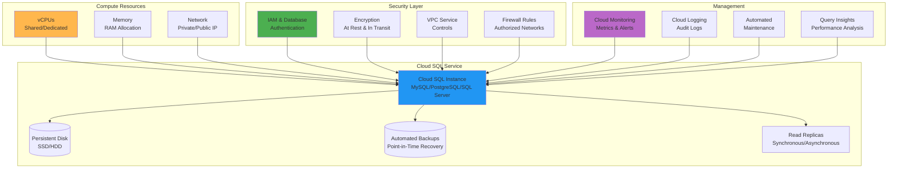

## Database Engine Support

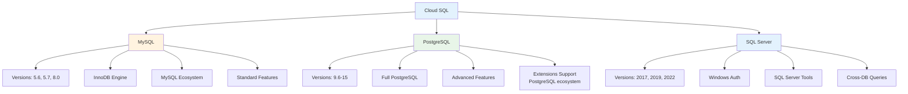

## High Availability and Replication

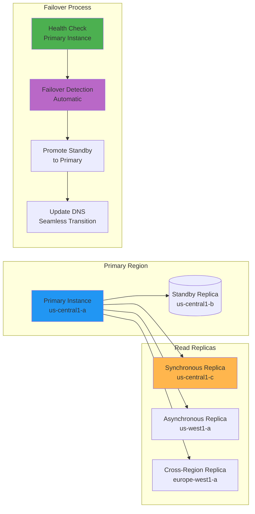

## Connectivity Options

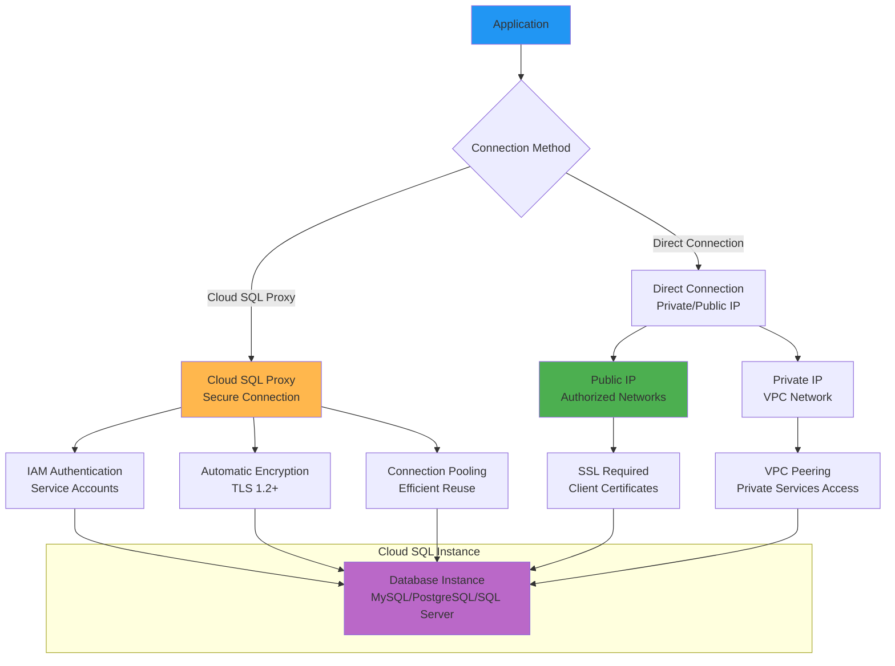

## Storage and Backup Architecture

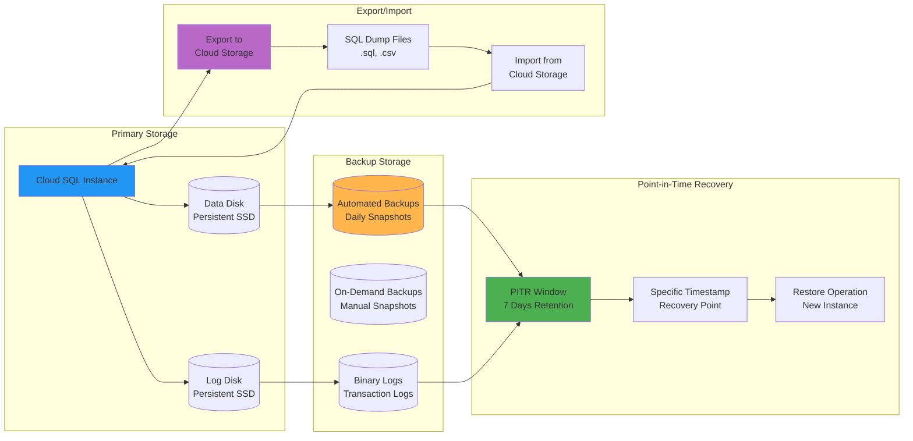

## Performance Monitoring Dashboard

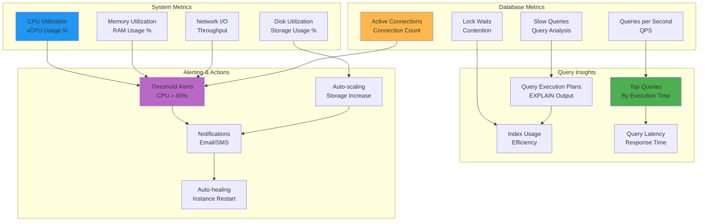

## Security Architecture

```mermaid
graph TB
    subgraph "Network Security"
        VPC_NETWORK[VPC Network<br/>Private Connectivity]
        PRIVATE_IP[Private IP Address<br/>No Public Exposure]
        FIREWALL[Firewall Rules<br/>Authorized Networks]
        SERVICE_CONTROLS[VPC Service Controls<br/>Data Exfiltration Prevention]
    end

    subgraph "Access Control"
        IAM_ROLES[IAM Roles<br/>cloudsql.client, cloudsql.editor]
        DATABASE_USERS[Database Users<br/>Application Users]
        SERVICE_ACCOUNTS[Service Accounts<br/>Application Identity]
        LEAST_PRIVILEGE[Least Privilege<br/>Principle]
    end

    subgraph "Data Protection"
        ENCRYPTION_AT_REST[Encryption at Rest<br/>AES-256]
        ENCRYPTION_IN_TRANSIT[Encryption in Transit<br/>TLS 1.2+]
        CMEK[Customer-Managed<br/>Encryption Keys]
        BACKUP_ENCRYPTION[Backup Encryption<br/>Automatic]
    end

    subgraph "Compliance & Audit"
        AUDIT_LOGS[Audit Logs<br/>Cloud Logging]
        COMPLIANCE[Compliance<br/>SOC 2, PCI DSS, HIPAA]
        DATA_RETENTION[Data Retention<br/>Policies]
        ACCESS_REVIEWS[Access Reviews<br/>Regular Audits]
    end

    VPC_NETWORK --> PRIVATE_IP
    PRIVATE_IP --> FIREWALL
    FIREWALL --> SERVICE_CONTROLS

    IAM_ROLES --> SERVICE_ACCOUNTS
    SERVICE_ACCOUNTS --> DATABASE_USERS
    DATABASE_USERS --> LEAST_PRIVILEGE

    ENCRYPTION_AT_REST --> CMEK
    ENCRYPTION_IN_TRANSIT --> BACKUP_ENCRYPTION

    AUDIT_LOGS --> COMPLIANCE
    COMPLIANCE --> DATA_RETENTION
    DATA_RETENTION --> ACCESS_REVIEWS

    style VPC_NETWORK fill:#2196f3
    style IAM_ROLES fill:#ffb74d
    style ENCRYPTION_AT_REST fill:#4caf50
    style AUDIT_LOGS fill:#ba68c8
```

## Migration Workflow

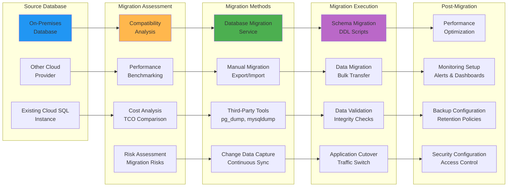

## Cost Optimization Strategies

```mermaid
graph TD
    A[Cloud SQL Cost Optimization] --> B[Instance Sizing]
    A --> C[Storage Management]
    A --> D[Backup Optimization]
    A --> E[Connection Management]

    B --> B1[Right-size vCPUs<br/>Based on workload]
    B --> B2[Memory optimization<br/>Working set size]
    B --> B3[Committed use discounts<br/>1-3 year commitments]
    B --> B4[Per-second billing<br/>Pay for actual usage]

    C --> C1[Storage type selection<br/>SSD vs HDD]
    C --> C2[Automatic storage increase<br/>Monitor usage]
    C --> C3[Data archiving<br/>Cold data to Cloud Storage]
    C --> C4[Table partitioning<br/>Manage large tables]

    D --> D1[Backup retention<br/>Configure appropriate periods]
    D --> D2[On-demand backups<br/>Delete unnecessary backups]
    D --> D3[Cross-region backup costs<br/>Evaluate necessity]
    D --> D4[Backup compression<br/>Reduce storage costs]

    E --> E1[Connection pooling<br/>Reduce connection overhead]
    E --> E2[Query optimization<br/>Improve efficiency]
    E --> E3[Read replicas<br/>Offload read traffic]
    E --> E4[Application caching<br/>Reduce database load]

    style A fill:#2196f3
    style B fill:#ffb74d
    style C fill:#4caf50
    style D fill:#ba68c8
    style E fill:#2196f3
```

## Multi-Region Deployment

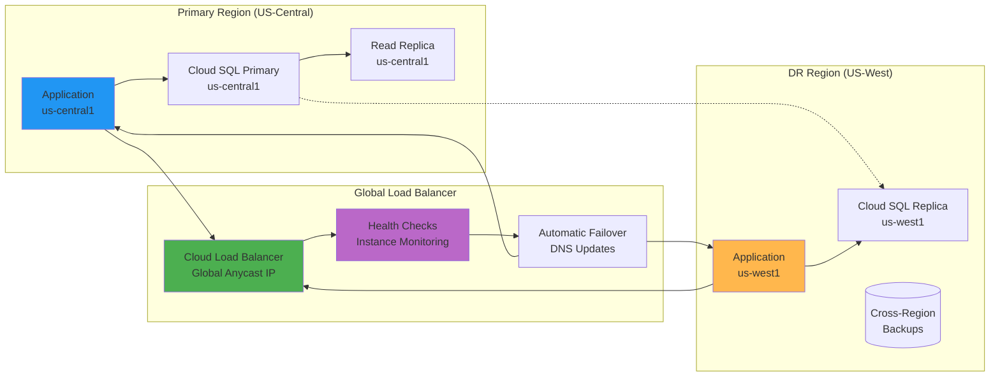

## Query Performance Analysis

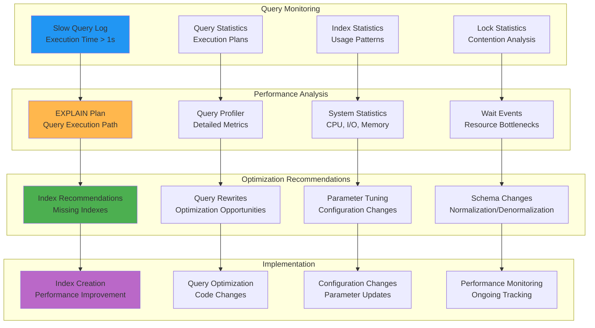

## Integration with GCP Ecosystem

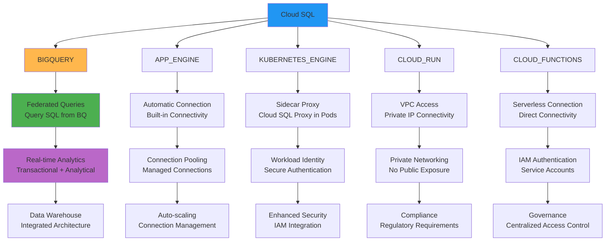

## Troubleshooting Decision Tree

```mermaid
graph TD
    START[Database Issue] --> CONNECTION_ISSUE{Connection<br/>Problem?}
    START --> PERFORMANCE_ISSUE{Performance<br/>Problem?}
    START --> STORAGE_ISSUE{Storage<br/>Problem?}
    START --> BACKUP_ISSUE{Backup<br/>Problem?}

    CONNECTION_ISSUE -->|Yes| NETWORK_CHECK[Check Network<br/>Configuration]
    CONNECTION_ISSUE -->|No| AUTH_CHECK[Check Authentication<br/>IAM/Database Users]

    NETWORK_CHECK --> VPC_CONFIG[Verify VPC<br/>Peering/Firewall]
    NETWORK_CHECK --> PROXY_CONFIG[Check Cloud SQL<br/>Proxy Setup]
    NETWORK_CHECK --> SSL_CONFIG[Verify SSL/TLS<br/>Configuration]

    AUTH_CHECK --> IAM_PERMS[Check IAM<br/>Permissions]
    AUTH_CHECK --> DB_USERS[Verify Database<br/>User Credentials]
    AUTH_CHECK --> SERVICE_ACCT[Validate Service<br/>Account]

    PERFORMANCE_ISSUE -->|Yes| QUERY_ANALYSIS[Analyze Slow<br/>Queries]
    PERFORMANCE_ISSUE -->|No| RESOURCE_CHECK[Check Resource<br/>Utilization]

    QUERY_ANALYSIS --> EXPLAIN_PLAN[Review EXPLAIN<br/>Plans]
    QUERY_ANALYSIS --> INDEX_CHECK[Check Index<br/>Usage]
    QUERY_ANALYSIS --> QUERY_REWRITE[Optimize Query<br/>Structure]

    RESOURCE_CHECK --> CPU_MONITOR[Monitor CPU<br/>Usage]
    RESOURCE_CHECK --> MEMORY_MONITOR[Monitor Memory<br/>Usage]
    RESOURCE_CHECK --> DISK_IO[Check Disk I/O<br/>Performance]

    STORAGE_ISSUE -->|Yes| DISK_SPACE[Check Available<br/>Disk Space]
    STORAGE_ISSUE -->|No| AUTO_INCREASE[Verify Auto<br/>Storage Increase]

    DISK_SPACE --> CLEANUP[Clean Up<br/>Unnecessary Data]
    DISK_SPACE --> SCALE_UP[Scale Up<br/>Storage Capacity]
    AUTO_INCREASE --> ENABLE_AUTO[Enable Auto<br/>Storage Increase]

    BACKUP_ISSUE -->|Yes| BACKUP_CONFIG[Check Backup<br/>Configuration]
    BACKUP_ISSUE -->|No| RESTORE_TEST[Test Restore<br/>Process]

    BACKUP_CONFIG --> SCHEDULE_CHECK[Verify Backup<br/>Schedule]
    BACKUP_CONFIG --> RETENTION_CHECK[Check Retention<br/>Policies]
    RESTORE_TEST --> PITR_CHECK[Validate PITR<br/>Functionality]

    VPC_CONFIG --> RESOLVE_CONNECTION[Connection Resolved]
    PROXY_CONFIG --> RESOLVE_CONNECTION
    SSL_CONFIG --> RESOLVE_CONNECTION
    IAM_PERMS --> RESOLVE_CONNECTION
    DB_USERS --> RESOLVE_CONNECTION
    SERVICE_ACCT --> RESOLVE_CONNECTION

    EXPLAIN_PLAN --> OPTIMIZE_QUERY[Query Optimized]
    INDEX_CHECK --> OPTIMIZE_QUERY
    QUERY_REWRITE --> OPTIMIZE_QUERY
    CPU_MONITOR --> SCALE_INSTANCE[Scale Instance]
    MEMORY_MONITOR --> SCALE_INSTANCE
    DISK_IO --> SCALE_INSTANCE

    CLEANUP --> STORAGE_RESOLVED[Storage Resolved]
    SCALE_UP --> STORAGE_RESOLVED
    ENABLE_AUTO --> STORAGE_RESOLVED

    SCHEDULE_CHECK --> BACKUP_RESOLVED[Backup Resolved]
    RETENTION_CHECK --> BACKUP_RESOLVED
    PITR_CHECK --> BACKUP_RESOLVED

    style START fill:#2196f3
    style CONNECTION_ISSUE fill:#ffb74d
    style NETWORK_CHECK fill:#4caf50
    style QUERY_ANALYSIS fill:#ba68c8
    style DISK_SPACE fill:#2196f3
    style BACKUP_CONFIG fill:#ffb74d
```

This visual guide illustrates the comprehensive architecture and capabilities of Cloud SQL, showing how it integrates with the broader Google Cloud ecosystem while providing enterprise-grade database management for relational workloads.
