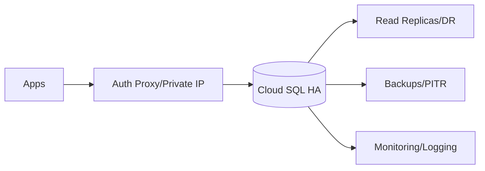

# Cloud SQL Guide – Basic → Architect

## Level 1 – Launch & Basics

### 1. Quick Instance
```bash
gcloud sql instances create demo \
  --database-version=POSTGRES_15 \
  --tier=db-custom-1-3840 \
  --region=us-central1
gcloud sql users set-password postgres --instance=demo --password=changeme
```

### 2. Core Concepts
- Instance (single-zone/regional HA), database, users, connections
- Connection methods: public IP + SSL, private IP, Cloud SQL Auth Proxy/IAM DB auth
- Backups, maintenance windows, failover

### 3. Basic Connect
```bash
cloud-sql-proxy --port 5432 demo &
psql "host=127.0.0.1 port=5432 user=postgres dbname=postgres"
```

## Level 2 – Production Patterns

### Availability & Backups
- Use HA (regional) for prod; read replicas for read scale
- Automated backups, PITR; test restores
- Maintenance window pinned; alerts on failover/lag

### Security
- Prefer private IP + Auth Proxy/IAM auth; avoid direct public IP
- Least-privilege DB roles; strong passwords/rotation; SSL/TLS enforced
- CMEK where required; audit logging on

### Performance & Operations
- Right-size tier; monitor CPU/mem/IO connections
- Connection pooling (pgbouncer/pgpool or Cloud SQL Auth Proxy pooling)
- Storage autoscaling; temp file space awareness

## Level 3 – Architect Playbook

### Reliability & DR
- HA + replicas; failover runbooks; promotion tested
- Cross-region replicas for DR; backup/restore drills

### Cost & Governance
- Stop non-prod at night; size appropriately; storage auto-grow with alerts
- IAM for instance management; org policies on public IPs

### Migration
- DMS for cutovers; pg_dump/pg_restore; minimal downtime patterns

## Ops Cheat Sheet

| Task | Command | Note |
| --- | --- | --- |
| List | `gcloud sql instances list` | inventory |
| Connect | `cloud-sql-proxy ...` | secure |
| Backups | `gcloud sql backups list --instance demo` | review |
| Restore | `gcloud sql backups restore ...` | test |
| Failover | `gcloud sql instances failover demo` | HA test |

## Architecture Patterns



## Checklist Before Production
- [ ] Regional HA; backups + PITR; restore tested
- [ ] Private IP + Auth Proxy/IAM; public IP avoided/locked down
- [ ] Connection pooling in place; resource sizing validated
- [ ] CMEK if required; audit logs; alerts on failover/lag/storage
- [ ] Maintenance window set; org policies enforced

## Learning Path Links
- Track: `LearningTracks/Backend-GCP/track.md`
- Projects: `Projects/GCP-Backend/starter/03-cloud-sql-connect.md` and `Projects/Integrated/backend-gcp-capstone.md`
- Mastery: `Mastery/GCP-CloudSQL/` (quiz, scenarios, flashcards)

