# Compute Engine Visual Guide

## Architecture Overview

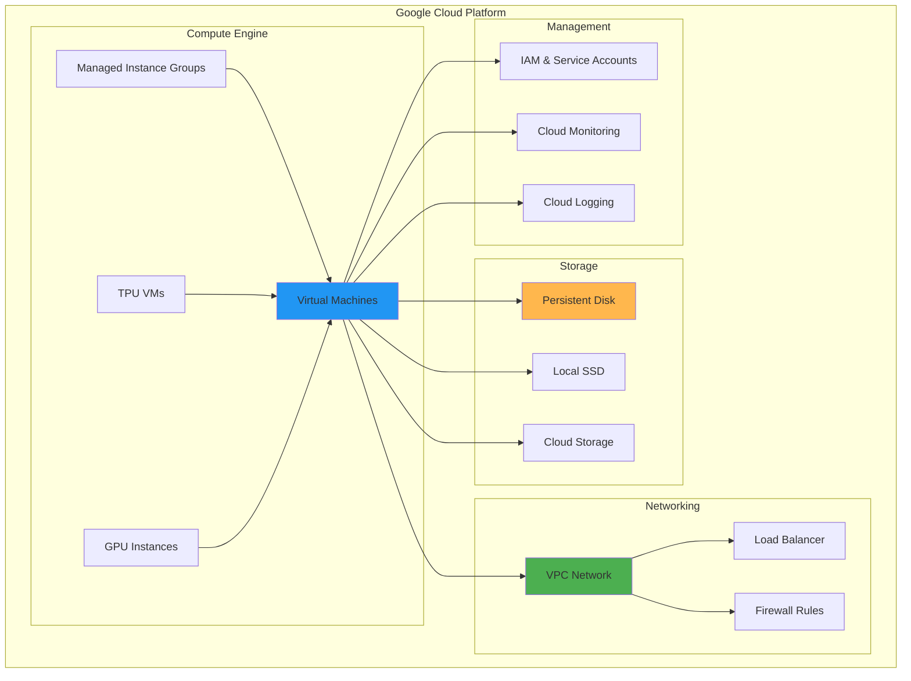

## Instance Types and Machine Families

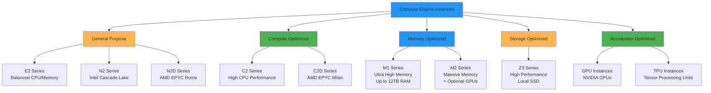

## Instance Lifecycle

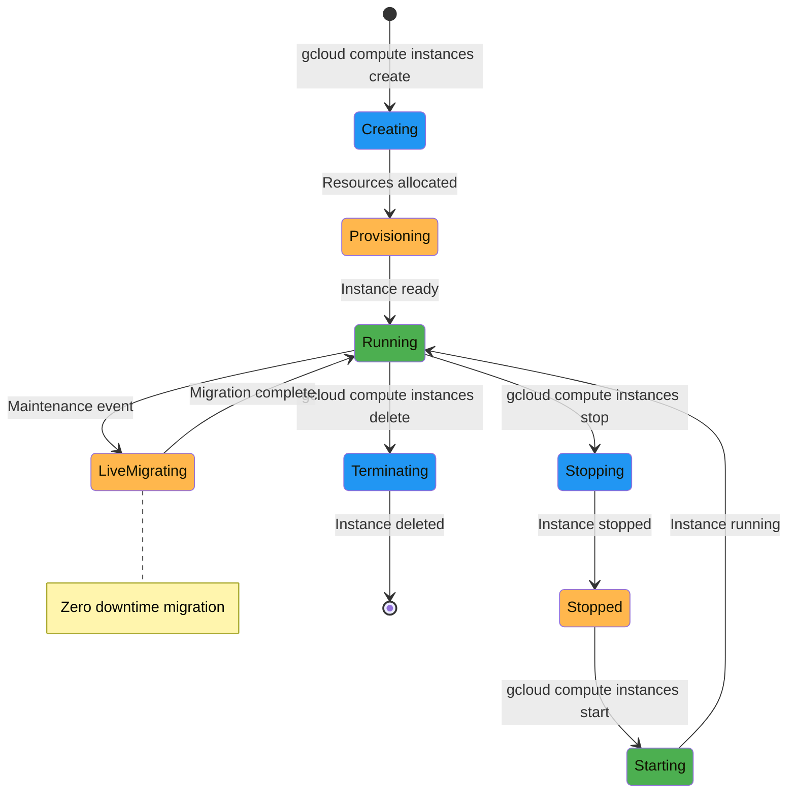

## Managed Instance Groups (MIGs)

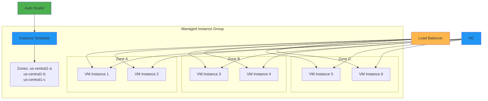

## Auto Scaling Architecture

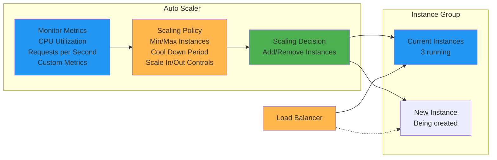

## Storage Architecture

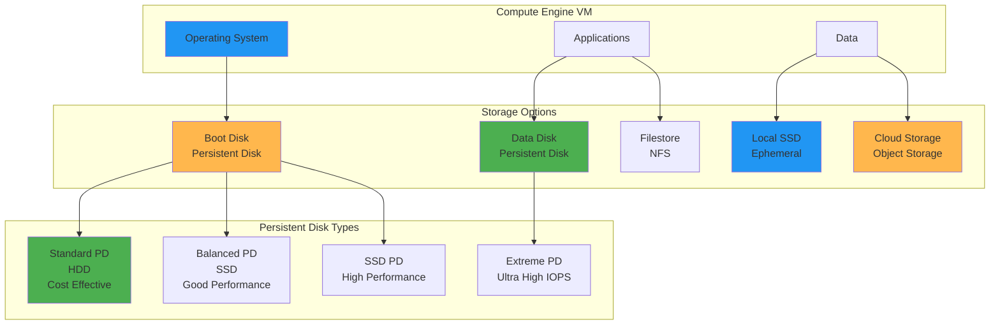

## Networking Architecture

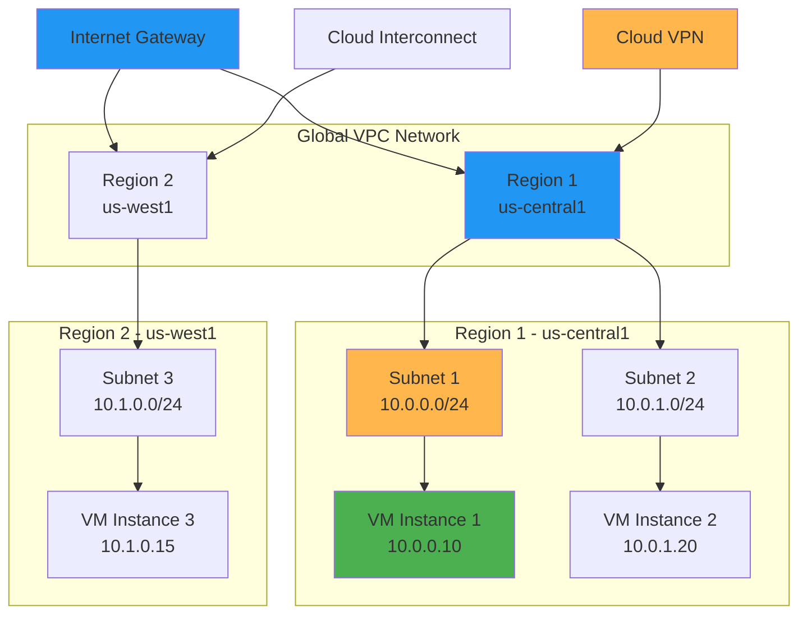

## Load Balancing Architecture

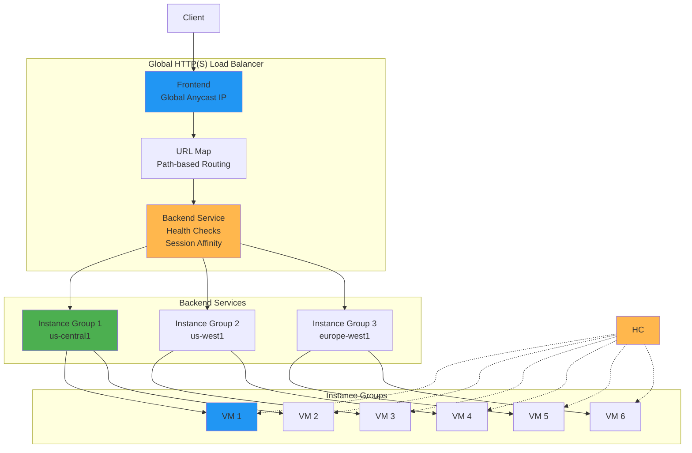

## Security Architecture

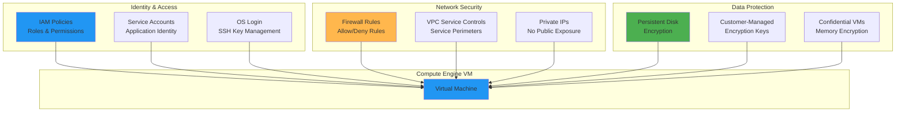

## Cost Optimization Patterns

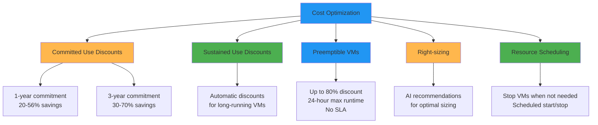

## Migration Patterns

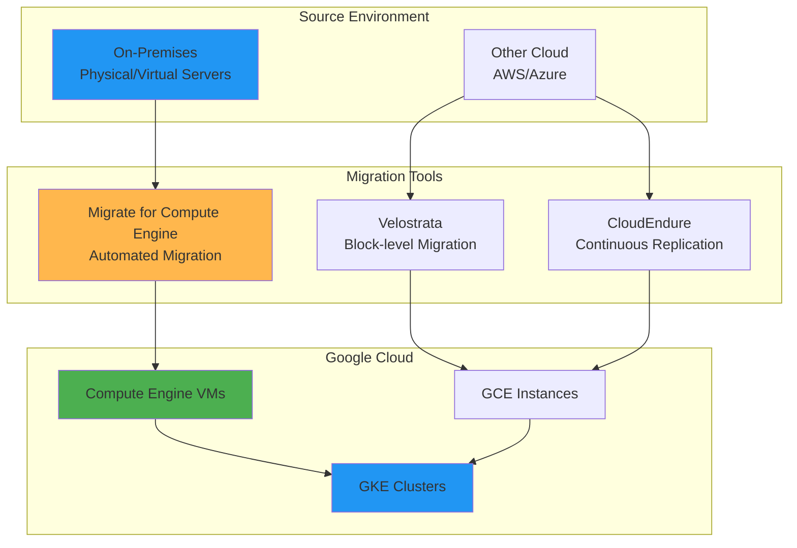

## High Availability Architecture

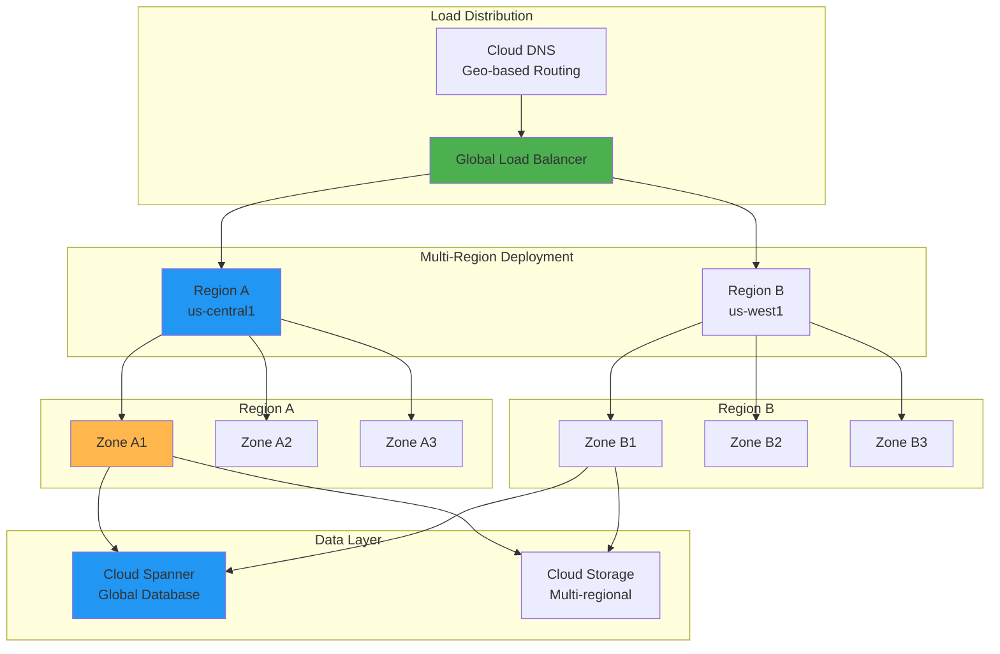

## Performance Monitoring

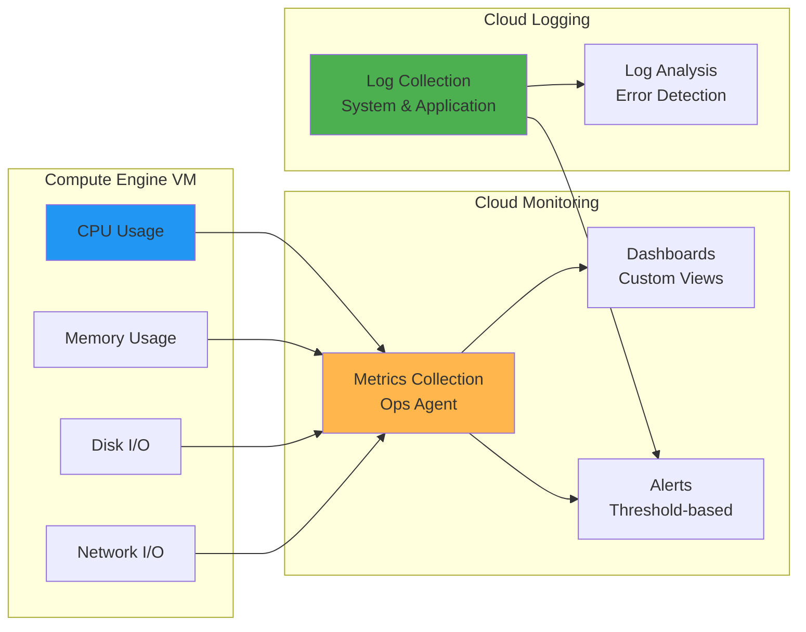

## CI/CD Integration

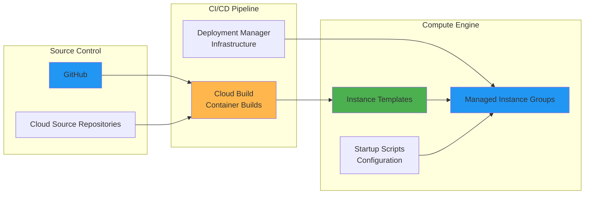

## Machine Learning Workloads

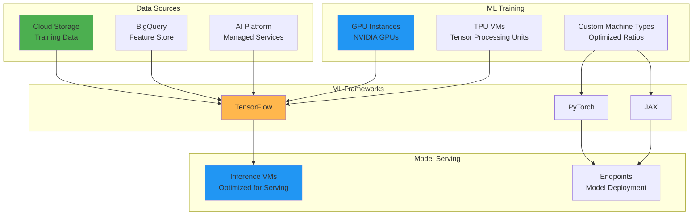

## Disaster Recovery

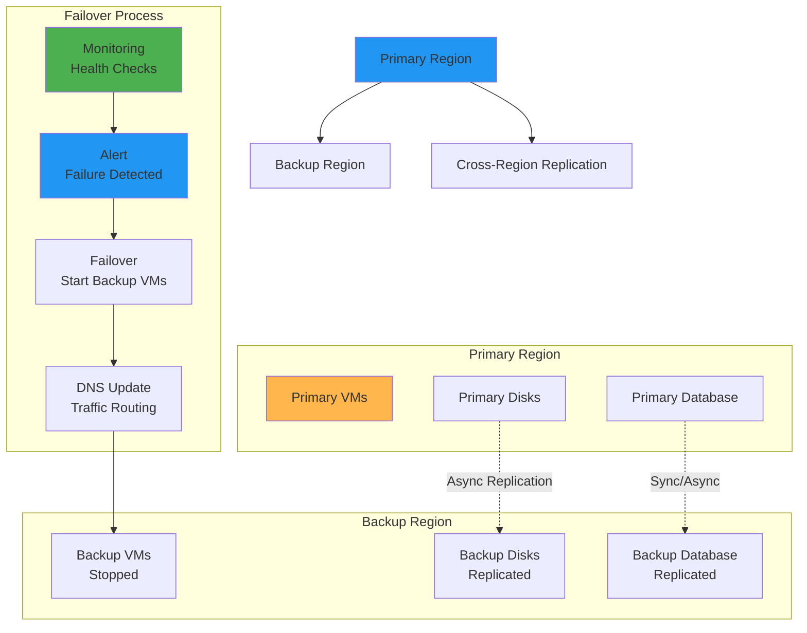

This visual guide provides a comprehensive overview of Compute Engine's architecture, components, and integration patterns. The diagrams show how different components work together to provide scalable, secure, and cost-effective compute resources in Google Cloud.
