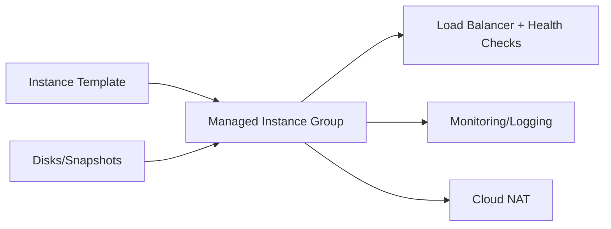

# Compute Engine Guide – Basic → Architect

## Level 1 – Launch & Basics

### 1. Quick VM
```bash
gcloud config set project <PROJECT_ID>
gcloud compute instances create demo --zone=us-central1-a --machine-type=e2-small --image-family=debian-11 --image-project=debian-cloud
gcloud compute ssh demo --zone=us-central1-a
```

### 2. Core Concepts
- Machine types: e2/n2/n2d/c2/c3/t2a; spot/preemptible
- Disks: pd-standard/pd-ssd/pd-extreme; snapshots; autoscaling groups (MIG)
- Networking: VPC, subnet, firewall rules, service accounts

### 3. Basic Ops
```bash
gcloud compute instances stop demo
gcloud compute snapshots create snap1 --source-disk demo --zone us-central1-a
```

## Level 2 – Production Patterns

### Instance Management
- Use Instance Templates + Managed Instance Groups (MIG) for scale/HA
- Autoscaling with CPU/custom metrics; health checks
- Use service accounts with least privilege; avoid default SA

### Storage & Backup
- Right-size disks; pd-ssd/pd-extreme for perf; snapshots scheduled
- Use startup scripts/metadata; OS patching strategy

### Networking & Security
- VPC firewall least privilege; private IP; Cloud NAT for egress
- Shielded VMs, OS Login/2FA; disable project-wide SSH keys
- OS Config/patch management; VM Manager

## Level 3 – Architect Playbook

### Reliability & DR
- Zonal vs regional MIG; distribution across zones
- Rolling updates; surge/unavailable settings
- Backup/restore runbooks; snapshots/IMAGES in place

### Observability & Cost
- Cloud Monitoring/Logging agents; metrics/alerts on CPU/mem/disk
- Rightsize recommendations; scheduler to stop dev VMs off-hours
- Labels for cost/owner/env

### Compliance
- CMEK for disks; VPC-SC where needed; audit logs

## Ops Cheat Sheet

| Task | Command | Note |
| --- | --- | --- |
| Create MIG | `gcloud compute instance-groups managed create ...` | HA |
| Rolling update | `gcloud compute instance-groups managed rolling-action start-update ...` | deploy |
| Snapshot | `gcloud compute disks snapshot ...` | backup |
| Labels | `gcloud compute instances update demo --update-labels env=dev` | tag |

## Architecture Patterns



## Checklist Before Production
- [ ] Use MIG with multi-zone; health checks + autoscaling tuned
- [ ] Shielded VMs; OS Login; no project-wide SSH keys
- [ ] Least-privilege service accounts; firewall least privilege; NAT for egress
- [ ] Disk choice fits workload; snapshots scheduled; backup/restore tested
- [ ] Monitoring/logging agents; alerts on health/perf; labels for cost/owner

